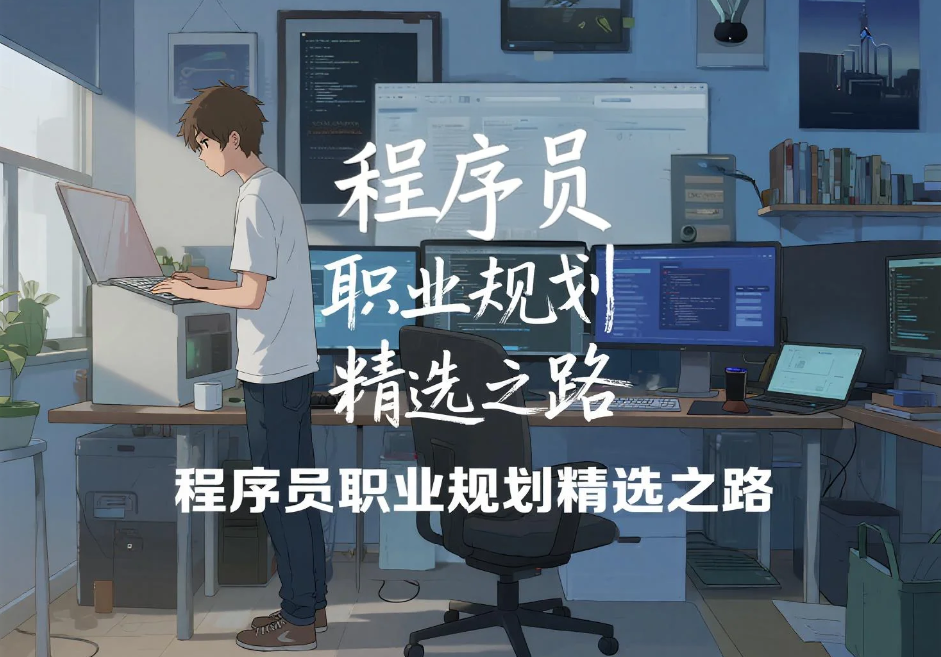

<h1 align="center">🚀 程序员职业规划精选之路：Career_planning_path </h1>

  🌟 告别迷茫，开启高薪职业生涯！

  这里汇聚了 <b>1000+</b> 个顶级程序员的求职攻略和学习路线视频，涵盖校招、社招、科班、非科班等多种背景，助你找到最适合自己的发展方向。

  💡 内容持续更新，为你提供最前沿的行业洞察和实战经验！

  

---

### 🔥项目亮点

- 全面覆盖：从C++、Java到嵌入式、AI，涵盖20+热门技术方向

- 真实案例：1000+ 应届生/程序员亲身经历分享，解决你的职业困惑

- 持续更新：每周新增高质量职业规划内容

- 精准分类：按技术栈/学历背景/求职阶段快速找到你需要的内容

---
### 目录速览

| 技术栈 / 领域 | 求职背景 / 学校 | 其他 |
| :--- | :--- | :--- |
| * [C/C++](#1) | * [26届](#26届) | * [C9](#c9) |
| * [java](#2) | * [27届](#27届) | * [双非](#18) |
| * [嵌入式](#3) | * [AI](#11) | * [芯片](#19) |
| * [存储](#4) | * [校招](#12) | * [golang](#20) |
| * [智驾](#5) | * [华为od](#13) | * [qt](#21) |
| * [音视频](#6) | * [杭电](#14) | * [dpdk](#22) |
| * [游戏](#7) | * [北邮](#15) | * [内核](#23) |
| * [FPGA](#8) | * [西电](#16) | * [秋招](#10) |
| * [CV](#9) | * [哈工大](#17) | * [大厂](#大厂) |
| * [Python](#24) | * [QS200内](#qs200内) | * [一线城市](#一线城市) |
| * [科班出身](#25) | * [非科班转码](#26) | * [程序员社招](#27) |

---

<h3 id="1">C/C++</h3> 

##### [1.1.1 双非本西电通信工程研一无人机地面站方向，想转行C++，哪个岗位最适合进大厂？](https://www.bilibili.com/video/BV177Noe4EJi/?spm_id_from=333.1387.upload.video_card.click)

##### [1.1.2 2本通信gap两年半，报培训班C++QT，进华为OD失败接下来如何规划职业方向？](https://www.bilibili.com/video/BV1vHNoeXEvT/?spm_id_from=333.1387.upload.video_card.click&vd_source=8982fc434289b5c9c5260a18e119f107)

##### [1.1.3 TOP211大三准备保研，选导师是否要和就业方向一致？如何学习才能达到大厂实习要求？](https://www.bilibili.com/video/BV1x6Noe6EDV/?spm_id_from=333.1387.upload.video_card.click&vd_source=8982fc434289b5c9c5260a18e119f107)

##### [1.1.4 为什么说 Linux 操作系统要比 Windows 稳定呢？](https://www.bilibili.com/video/BV1MqNoeCEFn/?spm_id_from=333.1387.upload.video_card.click&vd_source=8982fc434289b5c9c5260a18e119f107)

##### [1.1.5 移民到美国读大学，接触过C++和Python，如何选择未来职业方向并进入适合的细化领域？](https://www.bilibili.com/video/BV1dpNVeAEpd/?spm_id_from=333.1387.upload.video_card.click&vd_source=8982fc434289b5c9c5260a18e119f107)

##### [1.1.6 30岁硕士Linux C开发背景，未来想去澳洲就业，研究方向选AI、SDN漏洞还是Linux内核？](https://www.bilibili.com/video/BV19xNVecEvu/?spm_id_from=333.1387.upload.video_card.click&vd_source=8982fc434289b5c9c5260a18e119f107)

##### [1.1.7 24岁大二熟悉C++、Python和ROS2，是该考研还是直接就业？](https://www.bilibili.com/video/BV1BfNVezEv2/?spm_id_from=333.1387.upload.video_card.click&vd_source=8982fc434289b5c9c5260a18e119f107)

##### [1.1.8 学c++有哪些中间件是必须学习呢？](https://www.bilibili.com/video/BV1YPNGe4Eo8/?spm_id_from=333.1387.upload.video_card.click&vd_source=8982fc434289b5c9c5260a18e119f107)

##### [1.1.9 Linux驱动未来发展如何？感觉都是移植？](https://www.bilibili.com/video/BV1XNNGedEh8/?spm_id_from=333.1387.upload.video_card.click&vd_source=8982fc434289b5c9c5260a18e119f107)

##### [1.2.0 末9人工智能本科考研结束准备找工作，C++ 和 Python 都会，如何选择职业方向？](https://www.bilibili.com/video/BV1KxNNeFEZM/?spm_id_from=333.1387.upload.video_card.click&vd_source=8982fc434289b5c9c5260a18e119f107)

##### [1.2.1 双非硕做QNX平台开发，想转Linux驱动开发，去芯片原厂机会大吗？](https://www.bilibili.com/video/BV1dTNNe3ETY/?spm_id_from=333.1387.upload.video_card.click&vd_source=8982fc434289b5c9c5260a18e119f107)

##### [1.2.2 24届西南某邮硕士，卫星导航公司C++开发 vs 国企高校涉密工作，怎么选？](https://www.bilibili.com/video/BV1QoNteKEqL/?spm_id_from=333.1387.upload.video_card.click)

##### [1.2.3 普通本科物联网工程学过C、C++、数据库等，就业适合哪些方向需要哪些技能？](https://www.bilibili.com/video/BV1cBNteJEi6/?spm_id_from=333.1387.upload.video_card.click&vd_source=8982fc434289b5c9c5260a18e119f107)

##### [1.2.4 211本大三计科学生，学嵌入式和Linux应用开发，如何继续提升Linux C技能并规划学习路线？](https://www.bilibili.com/video/BV1KQNJeBE6c/?spm_id_from=333.1387.upload.video_card.click&vd_source=8982fc434289b5c9c5260a18e119f107)

##### [1.2.5 哈工大信息管理与信息系统本科，有C++和Python基础，如何选择就业方向？](https://www.bilibili.com/video/BV1TgwYeAE5R/?spm_id_from=333.1387.upload.video_card.click&vd_source=8982fc434289b5c9c5260a18e119f107)

##### [1.2.6 中九非科班20年毕业，华为 OD 做 Java 后端想转 C++，能找到深度学习挂钩的岗工作吗？](https://www.bilibili.com/video/BV1aEPyeVEFX/?spm_id_from=333.1387.upload.video_card.click&vd_source=8982fc434289b5c9c5260a18e119f107)

##### [1.2.7 民办本科大二软工，学了C++、数据结构，有日语N2想进日企，选 C++ 还是 Java？](https://www.bilibili.com/video/BV1PLwYefExR/?spm_id_from=333.1387.upload.video_card.click&vd_source=8982fc434289b5c9c5260a18e119f107)

##### [1.2.8 双非一本网络工程大四ACM省奖无项目C++方向，如何在春招前规划实习与未来就业方向？](https://www.bilibili.com/video/BV19Zwae3EKP/?spm_id_from=333.1387.upload.video_card.click&vd_source=8982fc434289b5c9c5260a18e119f107)

##### [1.2.9 据说go和C#的开发者都说自己比较节省内存你们认为呢？](https://www.bilibili.com/video/BV1qSwae2EFX/?spm_id_from=333.1387.upload.video_card.click&vd_source=8982fc434289b5c9c5260a18e119f107)

##### [1.3.0 本硕双非机械研一，因项目涉及 Linux 和 C/C++，趁此转码深入学C/C++可行吗？](https://www.bilibili.com/video/BV14bwaecEqp/?spm_id_from=333.1387.upload.video_card.click&vd_source=8982fc434289b5c9c5260a18e119f107)

##### [1.3.1 双非本211硕测绘转码计算机，是选择c++Qt还是Java](https://www.bilibili.com/video/BV1ukwheYE3K/?spm_id_from=333.1387.upload.video_card.click&vd_source=8982fc434289b5c9c5260a18e119f107)

##### [1.3.2 拿过ACM银牌想进中大厂，转Java还是继续做c++呢？](https://www.bilibili.com/video/BV1SzwheeEC6/?spm_id_from=333.1387.upload.video_card.click&vd_source=8982fc434289b5c9c5260a18e119f107)

##### [1.3.3 普通人走Linuxc/c++能达到什么样的薪资？](https://www.bilibili.com/video/BV1NPwbeDEi6/?spm_id_from=333.1387.upload.video_card.click&vd_source=8982fc434289b5c9c5260a18e119f107)

##### [1.3.4 双非计科本硕研二，因互联网太卷选C++但方向众多迷茫，双非硕哪个方向好入行发展？](https://www.bilibili.com/video/BV1VkwAefEYf/?spm_id_from=333.1387.upload.video_card.click&vd_source=8982fc434289b5c9c5260a18e119f107)

##### [1.3.5 为什么计算机专业的学生要学习使用 Linux 系统呢？](https://www.bilibili.com/video/BV1L6wAecEpH/?spm_id_from=333.1387.upload.video_card.click&vd_source=8982fc434289b5c9c5260a18e119f107)

##### [1.3.6 双非计科本硕研二，因互联网太卷选C++但方向众多迷茫，双非硕哪个方向好入行发展？](https://www.bilibili.com/video/BV1VkwAefEYf/?spm_id_from=333.1387.upload.video_card.click&vd_source=8982fc434289b5c9c5260a18e119f107)

##### [1.3.7 末流985本科科班考研失利错过秋招，用C++写过游戏脚本，春招有机会进大厂吗？](https://www.bilibili.com/video/BV1kPwPeCEvV/?spm_id_from=333.1387.upload.video_card.click&vd_source=8982fc434289b5c9c5260a18e119f107)

##### [1.3.8 已获香港科技大学硕士offer，打算在港就业，选定C++方向，从学业到就业要怎样进行规划？](https://www.bilibili.com/video/BV1TiwLeHECx/?spm_id_from=333.1387.upload.video_card.click&vd_source=8982fc434289b5c9c5260a18e119f107)

##### [1.3.9 本科一本大三在中厂实习C++，下学期是继续实习为秋招蓄力，还是备考考研？](https://www.bilibili.com/video/BV1gGwjeoEmN/?spm_id_from=333.1387.upload.video_card.click&vd_source=8982fc434289b5c9c5260a18e119f107)

##### [1.4.0 民办本科智能在校感觉没学到东西，大四打算巩固 C++，有哪些合适方向和路线推荐？](https://www.bilibili.com/video/BV1nKwVePECV/?spm_id_from=333.1387.upload.video_card.click&vd_source=8982fc434289b5c9c5260a18e119f107)

##### [1.4.1 之前学过一段 C++ 但对开发项目仍感陌生，想知道达到企业招聘要求的学习路线及水平？](https://www.bilibili.com/video/BV14ic8e9EmD/?spm_id_from=333.1387.upload.video_card.click&vd_source=8982fc434289b5c9c5260a18e119f107)

##### [1.4.2 211数学专业大三想转码C++方向，目前在学算法，没系统学习计算机专业课，要先定方向吗？](https://www.bilibili.com/video/BV1szc8eQEp2/?spm_id_from=333.1387.upload.video_card.click&vd_source=8982fc434289b5c9c5260a18e119f107)

##### [1.4.3 大一末流211想本科就业，学了C++相关内容想做项目，重点学习哪些方面能进企业？](https://www.bilibili.com/video/BV1YecweHEsS/?spm_id_from=333.1387.upload.video_card.click&vd_source=8982fc434289b5c9c5260a18e119f107)

##### [1.4.4 土木本硕研二计划赴英再读计算机硕，3年沉淀C方向能否弥补背景缺陷，归国就业有无竞争力？](https://www.bilibili.com/video/BV1nYcHe9EwS/?spm_id_from=333.1387.upload.video_card.click&vd_source=8982fc434289b5c9c5260a18e119f107)

##### [1.4.5 有没有学习起来比较快相对简单的方向？学习路线是怎样的？](https://www.bilibili.com/video/BV1girYYXEXC/?spm_id_from=333.1387.upload.video_card.click&vd_source=8982fc434289b5c9c5260a18e119f107)

##### [1.4.6 北邮通信研一C++路线如何走？是先学习相关知识，还是先做产品边做边学？](https://www.bilibili.com/video/BV13mr8YmEsH/?spm_id_from=333.1387.upload.video_card.click&vd_source=8982fc434289b5c9c5260a18e119f107)

##### [1.4.7 985硕非科班26届秋招转码，选择哪个方向更适合秋招冲大厂？](https://www.bilibili.com/video/BV1tor8YrEhy/?spm_id_from=333.1387.upload.video_card.click&vd_source=8982fc434289b5c9c5260a18e119f107)

##### [1.4.8 双非本科二战研考不理想，0实习0项目，凭竞赛经历找C++工作咋入手？](https://www.bilibili.com/video/BV18yrUYaEaW/?spm_id_from=333.1387.upload.video_card.click&vd_source=8982fc434289b5c9c5260a18e119f107)

##### [1.4.9 双二本计算机科班，C++学了几年却听说想进互联网就别选C++，这是真的吗？](https://www.bilibili.com/video/BV1Ajr5Y9EV8/?spm_id_from=333.1387.upload.video_card.click&vd_source=8982fc434289b5c9c5260a18e119f107)

##### [1.5.0 985本通过刷面试题找到开发工作，但C/C++技能不扎实，该如何提升技术能力确保顺利转正？](https://www.bilibili.com/video/BV1EHrWY3EQk/?spm_id_from=333.1387.upload.video_card.click&vd_source=8982fc434289b5c9c5260a18e119f107)

##### [1.5.1 C++程序员入门需要多久?怎么样才能学好呢？](https://www.bilibili.com/video/BV1Ch6UYEEG9/?spm_id_from=333.1387.upload.video_card.click&vd_source=8982fc434289b5c9c5260a18e119f107)

##### [1.5.2 双非邮电本硕通信研二，同门都在买项目卷Java，我坚持走Linux c/c++方向还能上岸吗？](https://www.bilibili.com/video/BV11T6SYXE3g/?spm_id_from=333.1387.upload.video_card.click&vd_source=8982fc434289b5c9c5260a18e119f107)

##### [1.5.3 如何正确通过c++primer学习c++？](https://www.bilibili.com/video/BV1kt62YrEE3/?spm_id_from=333.1387.upload.video_card.click&vd_source=8982fc434289b5c9c5260a18e119f107)

##### [1.5.4 大家的C++学习路线是怎么走的？学习的关键是哪些？](https://www.bilibili.com/video/BV1vzChYfEnQ/?spm_id_from=333.1387.upload.video_card.click&vd_source=8982fc434289b5c9c5260a18e119f107)

##### [1.5.5 211科班研二走LinuxC/C++开发，目标秋招中大厂岗位，求高效学习路线推荐！](https://www.bilibili.com/video/BV1JGCaYTEiQ/?spm_id_from=333.1387.upload.video_card.click&vd_source=8982fc434289b5c9c5260a18e119f107)

##### [1.5.6 二本机械电子大四，stm32+QT项目，想找 Linux 工作该往哪些岗位投递简历？](https://www.bilibili.com/video/BV1nM63YBE7w/?spm_id_from=333.1387.upload.video_card.click&vd_source=8982fc434289b5c9c5260a18e119f107)

##### [1.5.7 末9研一实验室方向偏学术，选择C++还是Java更合适？C++领域多如何选择方向？](https://www.bilibili.com/video/BV118CqYFEk7/?spm_id_from=333.1387.upload.video_card.click&vd_source=8982fc434289b5c9c5260a18e119f107)

##### [1.5.8 26届毕业生，如何在C++开发或HPC方向找到合适的实习岗位？](https://www.bilibili.com/video/BV1qrCYYKETP/?spm_id_from=333.1387.upload.video_card.click&vd_source=8982fc434289b5c9c5260a18e119f107)

##### [1.5.9 C++ 最详细的学习路线是什么？每个阶段学什么？](https://www.bilibili.com/video/BV13ZC5YkEwS/?spm_id_from=333.1387.upload.video_card.click&vd_source=8982fc434289b5c9c5260a18e119f107)

##### [1.6.0 大厂管培正编转C/C++开发合适吗？辞职后如何找到合适的方向？](https://www.bilibili.com/video/BV1T2k8YGEpd/?spm_id_from=333.1387.upload.video_card.click&vd_source=8982fc434289b5c9c5260a18e119f107)

##### [1.6.1 双非研一，计划研一下就找实习C++方向如何选择合适的项目和方向？](https://www.bilibili.com/video/BV154ktY7E2d/?spm_id_from=333.1387.upload.video_card.click&vd_source=8982fc434289b5c9c5260a18e119f107)

##### [1.6.2 二本大二未来想走Linux C/C++方向，C/C++已经学完接下来该从哪里开始？](https://www.bilibili.com/video/BV1d2k7YXEKs/?spm_id_from=333.1387.upload.video_card.click&vd_source=8982fc434289b5c9c5260a18e119f107)

##### [1.6.3 土木转码C/C++如何规划学习路径减少非科班带来的劣势呢？](https://www.bilibili.com/video/BV1LXqaYEExa/?spm_id_from=333.1387.upload.video_card.click&vd_source=8982fc434289b5c9c5260a18e119f107)

##### [1.6.4 末流211研二转C++开发还来得及吗？如何规划暑期实习与项目？](https://www.bilibili.com/video/BV1S6qkYKE4f/?spm_id_from=333.1387.upload.video_card.click&vd_source=8982fc434289b5c9c5260a18e119f107)

##### [1.6.5 985研一光梳专业转码学过 C++，选哪个方向更好一点？](https://www.bilibili.com/video/BV1ifqPYzEf2/?spm_id_from=333.1387.upload.video_card.click&vd_source=8982fc434289b5c9c5260a18e119f107)

##### [1.6.6 控制研二自学，如何有效学习Linux C/C++？纯自学对找工作影响大吗？](https://www.bilibili.com/video/BV1huqjYaEZV/?spm_id_from=333.1387.upload.video_card.click&vd_source=8982fc434289b5c9c5260a18e119f107)

##### [1.6.7 猎头公司视角下的C++小风口，真的适合应届生吗？](https://www.bilibili.com/video/BV1BgqVYPE8y/?spm_id_from=333.1387.upload.video_card.click&vd_source=8982fc434289b5c9c5260a18e119f107)

##### [1.6.8 双非本211硕信号处理专业：学C++还是转Java？如何选择适合的岗位方向？](https://www.bilibili.com/video/BV1zMqVYvEGU/?spm_id_from=333.1387.upload.video_card.click&vd_source=8982fc434289b5c9c5260a18e119f107)

##### [1.6.9 非科班自学C++，想做一些有技术壁垒的方向，如何规划职业路径？](https://www.bilibili.com/video/BV1pZimYKEEt/?spm_id_from=333.1387.upload.video_card.click&vd_source=8982fc434289b5c9c5260a18e119f107)

##### [1.7.0 211通信工程如何在研一抓住时间，系统性学习C++并明确未来工作方向](https://www.bilibili.com/video/BV1SQzSYfELT/?spm_id_from=333.1387.upload.video_card.click&vd_source=8982fc434289b5c9c5260a18e119f107)

##### [1.7.1 C++程序员入职半年，每天调库搬砖，未来技术方向该如何规划？](https://www.bilibili.com/video/BV15rzSYiEJE/?spm_id_from=333.1387.upload.video_card.click&vd_source=8982fc434289b5c9c5260a18e119f107)

##### [1.7.2 非科班转码C++，如何规划未来求职路线，掌握哪些技术才能找到好工作？](https://www.bilibili.com/video/BV1McznYGExK/?spm_id_from=333.1387.upload.video_card.click&vd_source=8982fc434289b5c9c5260a18e119f107)

##### [1.7.3 哈工大控制研二，想走无人机控制算法方向，该如何学习C++并准备面试？](https://www.bilibili.com/video/BV1N2znY6EUg/?spm_id_from=333.1387.upload.video_card.click&vd_source=8982fc434289b5c9c5260a18e119f107)

##### [1.7.4 双非硕士秋招失利等待补录，春招该选C++实习还是转战Java？](https://www.bilibili.com/video/BV18QBRYuEAz/?spm_id_from=333.1387.upload.video_card.click&vd_source=8982fc434289b5c9c5260a18e119f107)

##### [1.7.5 南京双一流研一深度学习+芯片时序分析，适合走Linux C++还是Java开发？](https://www.bilibili.com/video/BV1PozVYSE2u/?spm_id_from=333.1387.upload.video_card.click&vd_source=8982fc434289b5c9c5260a18e119f107)

##### [1.7.6 目前研一自学C++，如何找到适合的C++项目？](https://www.bilibili.com/video/BV1ZwSMY7ECX/?spm_id_from=333.1387.upload.video_card.click&vd_source=8982fc434289b5c9c5260a18e119f107)

##### [1.7.7 985大三软件工程半年时间如何备战C++后端实习？什么是必须要掌握的？](https://www.bilibili.com/video/BV1isSTYCEFy/?spm_id_from=333.1387.upload.video_card.click&vd_source=8982fc434289b5c9c5260a18e119f107)

##### [1.7.8 985控制工程研一想做C++开发，如何选择一个有技能壁垒且不易被替代的方向？](https://www.bilibili.com/video/BV1ZFSMYUEoK/?spm_id_from=333.1387.upload.video_card.click&vd_source=8982fc434289b5c9c5260a18e119f107)

##### [1.7.9 C++只会一点其他的408还没学，明年秋招走C++开发还有机会吗？](https://www.bilibili.com/video/BV1ydUxY3ENZ/?spm_id_from=333.1387.upload.video_card.click&vd_source=8982fc434289b5c9c5260a18e119f107)

##### [1.8.0 低学历程序员做C++开发真的没有出路吗？](https://www.bilibili.com/video/BV1VSUpYUEfZ/?spm_id_from=333.1387.upload.video_card.click&vd_source=8982fc434289b5c9c5260a18e119f107)

##### [1.8.1 C++面临退场危机，开发者还有必要学习吗？](https://www.bilibili.com/video/BV1KsUeYvE8S/?spm_id_from=333.1387.upload.video_card.click&vd_source=8982fc434289b5c9c5260a18e119f107)

##### [1.8.2 双非本211硕，被调剂到很难就业的方向，自学linux c/c++找工作可行吗？](https://www.bilibili.com/video/BV1iyUeYDEkS/?spm_id_from=333.1387.upload.video_card.click&vd_source=8982fc434289b5c9c5260a18e119f107)

##### [1.8.3 机械专业转Linux C++开发，如何快速搭建学习框架？](https://www.bilibili.com/video/BV1a8mfY5E8x/?spm_id_from=333.1387.upload.video_card.click&vd_source=8982fc434289b5c9c5260a18e119f107)

##### [1.8.4 C语言开发者如何规划职业路径？自我提升要抓住哪些关键技能？](https://www.bilibili.com/video/BV1hLmDYQESB/?spm_id_from=333.1387.upload.video_card.click&vd_source=8982fc434289b5c9c5260a18e119f107)

##### [1.8.5 机械专业想转C++开发，简历中该写哪些项目经验才能加分？](https://www.bilibili.com/video/BV1CdU5YrEEH/?spm_id_from=333.1387.upload.video_card.click&vd_source=8982fc434289b5c9c5260a18e119f107)

##### [1.8.6 选择了海光C语言开发，跳槽机会多吗？未来职业发展如何？](https://www.bilibili.com/video/BV1tuUjYQE1s/?spm_id_from=333.1387.upload.video_card.click&vd_source=8982fc434289b5c9c5260a18e119f107)

##### [1.8.7 本硕双二：研二实习工作之余学习c++，为明年秋招做准备这个方案可行吗？](https://www.bilibili.com/video/BV14DD6YZEpf/?spm_id_from=333.1387.upload.video_card.click&vd_source=8982fc434289b5c9c5260a18e119f107)

##### [1.8.8 为什么C++岗位大多要求熟悉Linux操作系统？](https://www.bilibili.com/video/BV1tSD6YbEQq/?spm_id_from=333.1387.upload.video_card.click&vd_source=8982fc434289b5c9c5260a18e119f107)

##### [1.8.9 腾讯C++实习，但以后想找Java，要跑路吗?](https://www.bilibili.com/video/BV1VEDrYzE4a/?spm_id_from=333.1387.upload.video_card.click&vd_source=8982fc434289b5c9c5260a18e119f107)

##### [1.9.0 双非本9硕就业方向：推荐算法与软开岗位哪个更适合？现在C++岗位是不是很少？](https://www.bilibili.com/video/BV14hDzYXENa/?spm_id_from=333.1387.upload.video_card.click&vd_source=8982fc434289b5c9c5260a18e119f107)

##### [1.9.1 末流211通信工程有医疗实习一年，如何寻找C++方向的产品化项目来提升简历？](https://www.bilibili.com/video/BV1cjDVYMEFj/?spm_id_from=333.1387.upload.video_card.click&vd_source=8982fc434289b5c9c5260a18e119f107)

##### [1.9.2 211软工硕：Java开发的上限低C++开发hc少，如何在两者中做出选择？](https://www.bilibili.com/video/BV1QeDVYREE9/?spm_id_from=333.1387.upload.video_card.click&vd_source=8982fc434289b5c9c5260a18e119f107)

##### [1.9.3 双非秋招0 offer，真该放弃C++吗？是转行做测试还是考公？](https://www.bilibili.com/video/BV1qUDNYVECL/?spm_id_from=333.1387.upload.video_card.click&vd_source=8982fc434289b5c9c5260a18e119f107)

##### [1.9.4 普通一本大四生，投递C++岗位简历回复少？为什么你的简历拿不到面试机会！](https://www.bilibili.com/video/BV15fD8YkEEx/?spm_id_from=333.1387.upload.video_card.click&vd_source=8982fc434289b5c9c5260a18e119f107)

##### [1.9.5 985信息工程大二方向选择迷茫：C++、嵌入式、工控？未来职业发展方向深度解析](https://www.bilibili.com/video/BV18RSBYWEjM/?spm_id_from=333.1387.upload.video_card.click&vd_source=8982fc434289b5c9c5260a18e119f107)

##### [1.9.6 在职自学想进鹅厂学习路线迷茫，后台开发方向要不要深入C++算法？职业发展规划详解！](https://www.bilibili.com/video/BV1yWSBYyEqV/?spm_id_from=333.1387.upload.video_card.click&vd_source=8982fc434289b5c9c5260a18e119f107)

##### [1.9.7 C++变得越来越难用！是进步还是退步？开发者的真实感受！](https://www.bilibili.com/video/BV1RYSRYkEme/?spm_id_from=333.1387.upload.video_card.click&vd_source=8982fc434289b5c9c5260a18e119f107)

##### [1.9.8 双非硕的纠结：是自学嵌入式走偏硬件还是说深入学习Linuxc/c++走软开呢？](https://www.bilibili.com/video/BV1AQSEYRETp/?spm_id_from=333.1387.upload.video_card.click&vd_source=8982fc434289b5c9c5260a18e119f107)

##### [1.9.9 211本硕电子研二自学C++计划明年上半年找到大厂实习，C++学习怎么规划才最有效？](https://www.bilibili.com/video/BV17USgYREWB/?spm_id_from=333.1387.upload.video_card.click&vd_source=8982fc434289b5c9c5260a18e119f107)

##### [1.10.0 大学生的编程焦虑：唐尚珺的C语言选择引发热议！](https://www.bilibili.com/video/BV1SzS8YaEq6/?spm_id_from=333.1387.upload.video_card.click&vd_source=8982fc434289b5c9c5260a18e119f107)

##### [1.10.1 武理本南理硕研一：算法卷不动走向开发岗？自学Linux C++如何规划开发技能树？](https://www.bilibili.com/video/BV18YStYZEbv/?spm_id_from=333.1387.upload.video_card.click&vd_source=8982fc434289b5c9c5260a18e119f107)

##### [1.10.2 学习C++：看视频详解还是直接看文档？如何找到最佳学习方式？](https://www.bilibili.com/video/BV16j15YtEwb/?spm_id_from=333.1387.upload.video_card.click&vd_source=8982fc434289b5c9c5260a18e119f107)

##### [1.10.3 工科类211本硕研一军工背景+深度强化学习，走嵌入式C++方向如何规划学习以拿下20K+？](https://www.bilibili.com/video/BV1dQ17YcE7p/?spm_id_from=333.1387.upload.video_card.click&vd_source=8982fc434289b5c9c5260a18e119f107)

##### [1.10.4 全网劝退客户端开发？末二本，C++后端选手两个意向:美团移动端和字节客户端到底该不该接！](https://www.bilibili.com/video/BV14n1sYvE6Z/?spm_id_from=333.1387.upload.video_card.click&vd_source=8982fc434289b5c9c5260a18e119f107)

##### [1.10.5 华五本硕计算机研0：如果未来走cpp担心学习周期太长，继续学习C++还是转向Java？](https://www.bilibili.com/video/BV1qc1sYEEwN/?spm_id_from=333.1387.upload.video_card.click&vd_source=8982fc434289b5c9c5260a18e119f107)

##### [1.10.6 转行失败？秋招面试寥寥无几，211电子信息专业研三转C++如何提升项目含金量与面试成功率？](https://www.bilibili.com/video/BV1zp1NYaEw4/?spm_id_from=333.1387.upload.video_card.click&vd_source=8982fc434289b5c9c5260a18e119f107)

##### [1.10.7 双非本211硕研一：C++校招什么时候定方向最合适？早定方向会不会走窄？不定方向又怕错失机会，究竟该如何选择？](https://www.bilibili.com/video/BV1iJyLYHEwF/?spm_id_from=333.1387.upload.video_card.click&vd_source=8982fc434289b5c9c5260a18e119f107)

##### [1.10.8 双非本211硕目前研一，非科班想转码想走C++底层开发，但导师要求做深度学习！该怎么办？](https://www.bilibili.com/video/BV1uUy5YkErX/?spm_id_from=333.1387.upload.video_card.click&vd_source=8982fc434289b5c9c5260a18e119f107)

##### [1.10.9 中九计科计划新加坡&香港就业该选哪条路？C++方向就业前景如何？](https://www.bilibili.com/video/BV1QxyLYjEt3/?spm_id_from=333.1387.upload.video_card.click&vd_source=8982fc434289b5c9c5260a18e119f107)

##### [1.11.0 机械本硕双二想要学习c++软开方面的内容，如何规划一条合理的学习路线？](https://www.bilibili.com/video/BV1SbyLY5Ef5/?spm_id_from=333.1387.upload.video_card.click&vd_source=8982fc434289b5c9c5260a18e119f107)

##### [1.11.1 如何选择合适的项目来提升开发能力？Linux C++从基础到进阶的学习路径](https://www.bilibili.com/video/BV1JvCdYzELv/?spm_id_from=333.1387.upload.video_card.click&vd_source=8982fc434289b5c9c5260a18e119f107)

##### [1.11.2 中九本硕电子信息研二：C++基础薄弱，如何为国企求职做好准备？](https://www.bilibili.com/video/BV1WyCRYCEtN/?spm_id_from=333.1387.upload.video_card.click&vd_source=8982fc434289b5c9c5260a18e119f107)

##### [1.11.3 双非本杭电硕研二准备3个月边实习边零基础学C++，秋招冲刺C++岗位这条路可行吗](https://www.bilibili.com/video/BV1VbCoYYEBe/?spm_id_from=333.1387.upload.video_card.click&vd_source=8982fc434289b5c9c5260a18e119f107)

##### [1.11.4 双非通信工程本专业就业前途渺茫，想转C++开发是否合适，接下来该如何学习？](https://www.bilibili.com/video/BV1KKCmY4EK1/?spm_id_from=333.1387.upload.video_card.click&vd_source=8982fc434289b5c9c5260a18e119f107)

##### [1.11.5 C++应届生工作4个月被裁，下一步怎么办？](https://www.bilibili.com/video/BV1F6BBYyEHC/?spm_id_from=333.1387.upload.video_card.click&vd_source=8982fc434289b5c9c5260a18e119f107)

##### [1.11.6 顶流211计算机中外合作大二，只会c和java如何提升就业竞争力？](https://www.bilibili.com/video/BV1SaqLYoEee/?spm_id_from=333.1387.upload.video_card.click&vd_source=8982fc434289b5c9c5260a18e119f107)

##### [1.11.7 从双非土木本到985软工硕，想做开发是选Java快就业，还是C++长远发展？](https://www.bilibili.com/video/BV1yXbFeBEPh/?spm_id_from=333.1387.upload.video_card.click&vd_source=8982fc434289b5c9c5260a18e119f107)

##### [1.11.8 C9大一计算机科班提问：准备本科就业目标大厂，是选Java还是C/C++？该怎么学才能不走弯路？](https://www.bilibili.com/video/BV19gtfeEEiv/?spm_id_from=333.1387.upload.video_card.click&vd_source=8982fc434289b5c9c5260a18e119f107)

##### [1.11.9 985本硕控制专业，想自学编程进大厂，目前在了解java和c++,怎么学出路会比较好](https://www.bilibili.com/video/BV1K34HeFEi1/?spm_id_from=333.1387.upload.video_card.click&vd_source=8982fc434289b5c9c5260a18e119f107)

##### [1.12.0 985本自学深度学习和c++,是可以直接就业还是要读研？](https://www.bilibili.com/video/BV1iK4aeVEmY/?spm_id_from=333.1387.upload.video_card.click)

##### [1.12.1 985本计划读本校硕，走linuxc和c++技术栈，研一做项目，研二卷实习，能否在校招时拿到满意offer？](https://www.bilibili.com/video/BV1zcptexEKH/?spm_id_from=333.1387.upload.video_card.click&vd_source=8982fc434289b5c9c5260a18e119f107)

##### [1.12.2 本二硕九，本机械硕嵌入式，就业的话，选嵌入式还是c++后端？](https://www.bilibili.com/video/BV1VFpgePE4d/?spm_id_from=333.1387.upload.video_card.click&vd_source=8982fc434289b5c9c5260a18e119f107)

##### [1.12.3 双非本西电硕，感觉cc++更适合自己的职业规划，希望能推荐下相关的学习路线和教程](https://www.bilibili.com/video/BV1BvpceEEFN/?spm_id_from=333.1387.upload.video_card.click&vd_source=8982fc434289b5c9c5260a18e119f107)

##### [1.12.4 中九本科打算就业，c++和java究竟该怎么选？](https://www.bilibili.com/video/BV1q7pweUEjy/?spm_id_from=333.1387.upload.video_card.click&vd_source=8982fc434289b5c9c5260a18e119f107)

##### [1.12.5 C2计算机本硕研一，研究仿真软件，感觉找工作困难。那我是该学java还是c++呢？](https://www.bilibili.com/video/BV1qvH4enEY3/?spm_id_from=333.1387.upload.video_card.click&vd_source=8982fc434289b5c9c5260a18e119f107)

##### [1.12.6 211本985硕通信研0，基础不太好。选java担心竞争激烈，选c++担心能力不够，我该如何选？](https://www.bilibili.com/video/BV1NoHsetE78/?spm_id_from=333.1387.upload.video_card.click&vd_source=8982fc434289b5c9c5260a18e119f107)

##### [1.12.7 c++程序员走高性能网络，需要学java吗？](https://www.bilibili.com/video/BV1CFsWetEZk/?spm_id_from=333.1387.upload.video_card.click&vd_source=8982fc434289b5c9c5260a18e119f107)

##### [1.12.8 本2硕9电子科学专业，想走linux或是嵌入式，要具体学哪些技术](https://www.bilibili.com/video/BV1XXs7eoEbh/?spm_id_from=333.1387.upload.video_card.click&vd_source=8982fc434289b5c9c5260a18e119f107)

##### [1.12.9 双非本985硕，想从Java转c++,推荐走什么方向？](https://www.bilibili.com/video/BV1GaWYeeEg1/?spm_id_from=333.1387.upload.video_card.click&vd_source=8982fc434289b5c9c5260a18e119f107)

##### [1.13.0 本2硕9电子信息，算法/模型部署/c++，方向哪一个更合适？](https://www.bilibili.com/video/BV19aWWekEz1/?spm_id_from=333.1387.upload.video_card.click&vd_source=8982fc434289b5c9c5260a18e119f107)

##### [1.13.1 985本硕电子信息在读，不走单片机的话能走Linux开发方向吗？](https://www.bilibili.com/video/BV1qnpme5Euy/?spm_id_from=333.1387.upload.video_card.click&vd_source=8982fc434289b5c9c5260a18e119f107)

##### [1.13.2 到底什么是linuxc/c++的技术栈？](https://www.bilibili.com/video/BV1BxeGeVEgv/?spm_id_from=333.1387.upload.video_card.click&vd_source=8982fc434289b5c9c5260a18e119f107)

##### [1.13.3 双非硕能走c++方向吗？嵌入式linux有没有项目推荐？](https://www.bilibili.com/video/BV1k7eGeUEwu/?spm_id_from=333.1387.upload.video_card.click)

##### [1.13.4 双非本可以走c++的哪些方向？](https://www.bilibili.com/video/BV1SieJeSEyE/?spm_id_from=333.1387.upload.video_card.click)

##### [1.13.5 算法1000道，蓝桥国奖，想学c++该学哪些内容呢？](https://www.bilibili.com/video/BV1uaYCe2EC6/?spm_id_from=333.1387.upload.video_card.click)

##### [1.13.6 普本c++程序员，三年三家公司，gap一年，还能找到工作吗？](https://www.bilibili.com/video/BV1HrewepEJm/?spm_id_from=333.1387.upload.video_card.click&vd_source=8982fc434289b5c9c5260a18e119f107)

##### [1.13.7 本科搞c++有前途吗，推荐什么方向？](https://www.bilibili.com/video/BV1DKeAeKEAA/?spm_id_from=333.1387.upload.video_card.click)

##### [1.13.8 计科双非本硕，就想搞钱，选java还是c++？](https://www.bilibili.com/video/BV1pEY7e8Ezt/?spm_id_from=333.1387.upload.video_card.click)

##### [1.13.9 5年c++程序员，空窗一年，还能找到工作吗？](https://www.bilibili.com/video/BV15eY7eJERk/?spm_id_from=333.1387.upload.video_card.click)

##### [1.14.0 985本硕走c++,该如何确定具体的职业方向？](https://www.bilibili.com/video/BV1rxi7eiE49/?spm_id_from=333.1387.upload.video_card.click)

##### [1.14.1 刚上大一，能不能推荐给我一份面向就业的c++学习路线](https://www.bilibili.com/video/BV1ZJi3eLE9F/?spm_id_from=333.1387.upload.video_card.click&vd_source=8982fc434289b5c9c5260a18e119f107)

##### [1.14.2 985本走c++该准备什么样的项目和技术栈？](https://www.bilibili.com/video/BV1yW42197GQ/?spm_id_from=333.1387.upload.video_card.click)

---

<h3 id="2">java</h3> 

##### [2.1.1 本科中厂Java后端干两年半想换岗，担心就业面和技术门槛如何规划未来？](https://www.bilibili.com/video/BV1fDNaedEAn/?spm_id_from=333.1387.upload.video_card.click&vd_source=8982fc434289b5c9c5260a18e119f107)

##### [2.1.2 offer选择：互联网Java后端 vs 华为CC++软开，薪资、技术含量和未来发展如何权衡？](https://www.bilibili.com/video/BV1mzNoe3EMj/?spm_id_from=333.1387.upload.video_card.click&vd_source=8982fc434289b5c9c5260a18e119f107)

##### [2.1.3 专升本准备考研西电，Java和C++选哪个？职业就业和考研方向如何规划？](https://www.bilibili.com/video/BV1pUNoeNEMW/?spm_id_from=333.1387.upload.video_card.click&vd_source=8982fc434289b5c9c5260a18e119f107)

##### [2.1.4 25届211大数据跨考失败，无项目无实习先实习还是直接校招？](https://www.bilibili.com/video/BV1W1NoeTEBM/?spm_id_from=333.1387.upload.video_card.click&vd_source=8982fc434289b5c9c5260a18e119f107)

##### [2.1.5 大二学 Java 没坚持大三重学，现在学 JavaWeb、Spring 来得及吗？](https://www.bilibili.com/video/BV1oJNVeNEC1/?spm_id_from=333.1387.upload.video_card.click&vd_source=8982fc434289b5c9c5260a18e119f107)

##### [2.1.6 24届自动化专业在国企仓库“躺平”，想转码但Java太卷，选QT还是Go更合适？](https://www.bilibili.com/video/BV1ZyNte5Esm/?spm_id_from=333.1387.upload.video_card.click&vd_source=8982fc434289b5c9c5260a18e119f107)

##### [2.1.7 10年Java开发找工作因学历屡碰壁，是否应该转型到Golang或区块链方向？](https://www.bilibili.com/video/BV1mVNHeGE1W/?spm_id_from=333.1387.upload.video_card.click&vd_source=8982fc434289b5c9c5260a18e119f107)

##### [2.1.8 四年Java开发经验转型制造业IT，如何在转型过程中提高技能，做好未来的职业规划？](https://www.bilibili.com/video/BV1CAwPe5EmY/?spm_id_from=333.1387.upload.video_card.click&vd_source=8982fc434289b5c9c5260a18e119f107)

##### [2.1.9 211非科班大四转码，赴英读Java硕士，刚学完C++基础，该坚持C++还是转Java?](https://www.bilibili.com/video/BV1U7wjepEFE/?spm_id_from=333.1387.upload.video_card.click&vd_source=8982fc434289b5c9c5260a18e119f107)

##### [2.2.0 21年双非一本毕业，考研两年未上岸，培训Java后一年换三份工作，目前待业，还要继续Java吗？](https://www.bilibili.com/video/BV1hNrzYMEGw/?spm_id_from=333.1387.upload.video_card.click&vd_source=8982fc434289b5c9c5260a18e119f107)

##### [2.2.1 本硕211研二非科班，金山训练营转正几率高但社招不好找工作，是否该全力投入Java准备秋招？](https://www.bilibili.com/video/BV1aJrLY6EX6/?spm_id_from=333.1387.upload.video_card.click&vd_source=8982fc434289b5c9c5260a18e119f107)

##### [2.2.2 双九计算机研三，秋招 Java 方向大厂全挂，准备半年仍无果，春招还坚持 Java 吗？](https://www.bilibili.com/video/BV1X36UYcEMF/?spm_id_from=333.1387.upload.video_card.click&vd_source=8982fc434289b5c9c5260a18e119f107)

##### [2.2.3 如何打破项目同质化？在学习Java的同时找到标新立异的项目方向！](https://www.bilibili.com/video/BV16v6UYyEy1/?spm_id_from=333.1387.upload.video_card.click&vd_source=8982fc434289b5c9c5260a18e119f107)

##### [2.2.4 学C++需要准备更多才能找工作？为什么有人选择C++而不是更易上手的Java？](https://www.bilibili.com/video/BV1d2CAYnEfo/?spm_id_from=333.1387.upload.video_card.click&vd_source=8982fc434289b5c9c5260a18e119f107)

##### [2.2.5 211硕地球物理专业想转码，深入并行算法还是转向前端或Java更有前景？](https://www.bilibili.com/video/BV1zcC5YDEHL/?spm_id_from=333.1387.upload.video_card.click&vd_source=8982fc434289b5c9c5260a18e119f107)

##### [2.2.6 十年Java开发经验，却依然面临被嘲讽的局面？](https://www.bilibili.com/video/BV1uHkhYEE6G/?spm_id_from=333.1387.upload.video_card.click&vd_source=8982fc434289b5c9c5260a18e119f107)

##### [2.2.7 Java后端工程师在小公司担任多职，除了编写代码，还涉及项目管理与招投标，如何规划自己的职业发展？](https://www.bilibili.com/video/BV1X3kbYjE1f/?spm_id_from=333.1387.upload.video_card.click&vd_source=8982fc434289b5c9c5260a18e119f107)

##### [2.2.8 末9非科班转码，C++后端开发与Java后端开发，哪个更适合未来发展？](https://www.bilibili.com/video/BV1U1kuYHESU/?spm_id_from=333.1387.upload.video_card.click&vd_source=8982fc434289b5c9c5260a18e119f107)

##### [2.2.9 南航计算机专硕研二，Java就业形势不佳是否转向C++或其他技术栈？](https://www.bilibili.com/video/BV18gkwYAETo/?spm_id_from=333.1387.upload.video_card.click&vd_source=8982fc434289b5c9c5260a18e119f107)

##### [2.3.0 211计算机专硕，想去国企技术岗位发展，Java是否是最佳选择？](https://www.bilibili.com/video/BV1dZkcY3E8Z/?spm_id_from=333.1387.upload.video_card.click&vd_source=8982fc434289b5c9c5260a18e119f107)

##### [2.3.1 双非硕研二控制工程转码，C++、Go、Java哪条路更适合我？从学基础到项目如何规划？](https://www.bilibili.com/video/BV1mPkEY3Eh8/?spm_id_from=333.1387.upload.video_card.click&vd_source=8982fc434289b5c9c5260a18e119f107)

##### [2.3.2 为什么很多硬件公司的程序员都非常看不起java程序员？](https://www.bilibili.com/video/BV1TNkEYrEVm/?spm_id_from=333.1387.upload.video_card.click&vd_source=8982fc434289b5c9c5260a18e119f107)

##### [2.3.3 211经济学大三自学Java技术栈，害怕投简历被卡，是考研还是实习？](https://www.bilibili.com/video/BV12TkEYuEPQ/?spm_id_from=333.1387.upload.video_card.click&vd_source=8982fc434289b5c9c5260a18e119f107)

##### [2.3.4 26岁女生双非人工智能研一，自学Java毕业年龄偏大，该如何规划职业方向？](https://www.bilibili.com/video/BV1uoqDYtEJU/?spm_id_from=333.1387.upload.video_card.click&vd_source=8982fc434289b5c9c5260a18e119f107)

##### [2.3.5 非科班考研失败转码自学Java入行可行吗？是否对科班背景有要求？能否进入中厂？](https://www.bilibili.com/video/BV1iuqCYjEFT/?spm_id_from=333.1387.upload.video_card.click&vd_source=8982fc434289b5c9c5260a18e119f107)

##### [2.3.6 大三非科班转码，学习C/C++后发现找不到实习，我应该走QT还是Java？](https://www.bilibili.com/video/BV1yMq6YnExB/?spm_id_from=333.1387.upload.video_card.click&vd_source=8982fc434289b5c9c5260a18e119f107)

##### [2.3.7 33岁公务员转行从零学习Java，是否还有机会？](https://www.bilibili.com/video/BV1BrqTYUEPj/?spm_id_from=333.1387.upload.video_card.click&vd_source=8982fc434289b5c9c5260a18e119f107)

##### [2.3.8 26届中上985控制专业现在从C++转Java，还有机会进互联网公司吗？](https://www.bilibili.com/video/BV1BdqPYrET1/?spm_id_from=333.1387.upload.video_card.click&vd_source=8982fc434289b5c9c5260a18e119f107)

##### [2.3.9 想走推荐搜索算法却担心秋招颗粒无收，是否应该转向Java开发提升就业机会？](https://www.bilibili.com/video/BV1wgiRYpEdj/?spm_id_from=333.1387.upload.video_card.click&vd_source=8982fc434289b5c9c5260a18e119f107)

##### [2.4.0 27岁大龄转码秋招惨败，朋友劝我转Java来得及吗？还是继续走前端或机器学习？](https://www.bilibili.com/video/BV1uF6KYzERY/?spm_id_from=333.1387.upload.video_card.click&vd_source=8982fc434289b5c9c5260a18e119f107)

##### [2.4.1 成电通信研一，没有实习机会的Java道路是否可行？未来是走Java开发还是嵌入式？](https://www.bilibili.com/video/BV1X1BRY5ECw/?spm_id_from=333.1387.upload.video_card.click&vd_source=8982fc434289b5c9c5260a18e119f107)

##### [2.4.2 双9科班校招转到iOS客户端，是否转回更有前景？学习Java或Go是否更有利于职业发展？](https://www.bilibili.com/video/BV1qdB9YUEYK/?spm_id_from=333.1387.upload.video_card.click&vd_source=8982fc434289b5c9c5260a18e119f107)

##### [2.4.3 211研二燃料电池控制，转Java还是学Linux C/C++ 做嵌软？](https://www.bilibili.com/video/BV1K9zVYQEji/?spm_id_from=333.1387.upload.video_card.click&vd_source=8982fc434289b5c9c5260a18e119f107)

##### [2.4.4 大一二本学生如何选择编程语言：学Java好就业还是学C++为考研？](https://www.bilibili.com/video/BV1Taz5YdEFR/?spm_id_from=333.1387.upload.video_card.click&vd_source=8982fc434289b5c9c5260a18e119f107)

##### [2.4.5 211交通类硕士研二自学Java，秋招前能否找到实习机会？](https://www.bilibili.com/video/BV1W8BmYGE6K/?spm_id_from=333.1387.upload.video_card.click&vd_source=8982fc434289b5c9c5260a18e119f107)

##### [2.4.6 八年java经验，后续往哪个方向拓展比较合适？](https://www.bilibili.com/video/BV1KWBmY7Eda/?spm_id_from=333.1387.upload.video_card.click&vd_source=8982fc434289b5c9c5260a18e119f107)

##### [2.4.7 建筑专业转Java后端，计划六个月内达到实习水平靠谱吗？](https://www.bilibili.com/video/BV1ViU5YxETm/?spm_id_from=333.1387.upload.video_card.click&vd_source=8982fc434289b5c9c5260a18e119f107)

##### [2.4.8 裸辞后找不到合适的Java工作，只能投身小公司！要转其他领域吗？](https://www.bilibili.com/video/BV18kU5YHEq3/?spm_id_from=333.1387.upload.video_card.click&vd_source=8982fc434289b5c9c5260a18e119f107)

##### [2.4.9 双非本科末9硕offer选择纠结，中科院和大厂offer该怎么选？转Java找工作和跳槽机会更多？](https://www.bilibili.com/video/BV1D6U5YQEY3/?spm_id_from=333.1387.upload.video_card.click&vd_source=8982fc434289b5c9c5260a18e119f107)

##### [2.5.0 5年Java开发经验转Go语言是否值得？](https://www.bilibili.com/video/BV1hnULYsEmS/?spm_id_from=333.1387.upload.video_card.click&vd_source=8982fc434289b5c9c5260a18e119f107)

##### [2.5.1 制造业倒班太难熬，双非二本非科班转行IT Java开发可行吗？](https://www.bilibili.com/video/BV1ACmpYfEGu/?spm_id_from=333.1387.upload.video_card.click&vd_source=8982fc434289b5c9c5260a18e119f107)

##### [2.5.2 杭电硕计科研一，想卷java进大厂!这个目标真的靠谱吗？](https://www.bilibili.com/video/BV1yRS3YzEfu/?spm_id_from=333.1387.upload.video_card.click&vd_source=8982fc434289b5c9c5260a18e119f107)

##### [2.5.3 Java后端太饱和！留学毕业后转行云原生开发能否成为新出路？](https://www.bilibili.com/video/BV14TyHY9Ee7/?spm_id_from=333.1387.upload.video_card.click&vd_source=8982fc434289b5c9c5260a18e119f107)

##### [2.5.4 985硕士自动驾驶转开发：高薪稳定选C++还是Java？真有标准答案吗？](https://www.bilibili.com/video/BV1qut6eTEZz/?spm_id_from=333.1387.upload.video_card.click&vd_source=8982fc434289b5c9c5260a18e119f107)

##### [2.5.5 211科班硕士想进国企：C++岗位稀缺，转Java真的更容易进国企研发吗？](https://www.bilibili.com/video/BV1AntreUEG6/?spm_id_from=333.1387.upload.video_card.click&vd_source=8982fc434289b5c9c5260a18e119f107)

##### [2.5.6 从双非土木本到985软工硕，想做开发是选Java快就业，还是C++长远发展？](https://www.bilibili.com/video/BV1yXbFeBEPh/?spm_id_from=333.1387.upload.video_card.click&vd_source=8982fc434289b5c9c5260a18e119f107)

##### [2.5.7 C9大一计算机科班提问：准备本科就业目标大厂，是选Java还是C/C++？该怎么学才能不走弯路？](https://www.bilibili.com/video/BV19gtfeEEiv/?spm_id_from=333.1387.upload.video_card.click&vd_source=8982fc434289b5c9c5260a18e119f107)

##### [2.5.8 985本硕控制专业，想自学编程进大厂，目前在了解java和c++,怎么学出路会比较好](https://www.bilibili.com/video/BV1K34HeFEi1/?spm_id_from=333.1387.upload.video_card.click&vd_source=8982fc434289b5c9c5260a18e119f107)

##### [2.5.9 QS200海本，想在国外直接就业，java后端还是数据科学？](https://www.bilibili.com/video/BV11rHDeYESc/?spm_id_from=333.1387.upload.video_card.click&vd_source=8982fc434289b5c9c5260a18e119f107)

##### [2.6.0 中九本科打算就业，c++和java究竟该怎么选？](https://www.bilibili.com/video/BV1q7pweUEjy/?spm_id_from=333.1387.upload.video_card.click&vd_source=8982fc434289b5c9c5260a18e119f107)

##### [2.6.1 C2计算机本硕研一，研究仿真软件，感觉找工作困难。那我是该学java还是c++呢？](https://www.bilibili.com/video/BV1qvH4enEY3/?spm_id_from=333.1387.upload.video_card.click&vd_source=8982fc434289b5c9c5260a18e119f107)

##### [2.6.2 211本985硕通信研0，基础不太好。选java担心竞争激烈，选c++担心能力不够，我该如何选？](https://www.bilibili.com/video/BV1NoHsetE78/?spm_id_from=333.1387.upload.video_card.click&vd_source=8982fc434289b5c9c5260a18e119f107)

##### [2.6.3 三本计划读研，java还是数据分析？](https://www.bilibili.com/video/BV1MAHFetEbk/?spm_id_from=333.1387.upload.video_card.click&vd_source=8982fc434289b5c9c5260a18e119f107)

##### [2.6.4 211本计划保研，之前学的java，毕业想走深度学习，合适吗？](https://www.bilibili.com/video/BV12fnReCEey/?spm_id_from=333.1387.upload.video_card.click&vd_source=8982fc434289b5c9c5260a18e119f107)

##### [2.6.5 中2末9研0 本科做java 硕士做信息安全 毕业想去外企或是国内大厂的话，该怎么规划呢？](https://www.bilibili.com/video/BV1pmHTe6EUw/?spm_id_from=333.1387.upload.video_card.click&vd_source=8982fc434289b5c9c5260a18e119f107)

##### [2.6.6 c++程序员走高性能网络，需要学java吗？](https://www.bilibili.com/video/BV1CFsWetEZk/?spm_id_from=333.1387.upload.video_card.click&vd_source=8982fc434289b5c9c5260a18e119f107)

##### [2.6.7 二本考研失败，就业的话走java还是嵌入式？](https://www.bilibili.com/video/BV1AcscebE42/?spm_id_from=333.1387.upload.video_card.click&vd_source=8982fc434289b5c9c5260a18e119f107)

##### [2.6.8 双非本985硕，想从Java转c++,推荐走什么方向？](https://www.bilibili.com/video/BV1GaWYeeEg1/?spm_id_from=333.1387.upload.video_card.click&vd_source=8982fc434289b5c9c5260a18e119f107)

##### [2.6.9 本科一本土木海硕QS150，能走java大数据吗？](https://www.bilibili.com/video/BV1EJeJehEco/?spm_id_from=333.1387.upload.video_card.click)

##### [2.7.0 计科双非本硕，就想搞钱，选java还是c++？](https://www.bilibili.com/video/BV1pEY7e8Ezt/?spm_id_from=333.1387.upload.video_card.click)

---

<h3 id="3">嵌入式</h3> 

##### [3.1.1 双非本硕研二，嵌入式方向MCU和Linux哪个就业前景更好？](https://www.bilibili.com/video/BV1omNteGE8T/?spm_id_from=333.1387.upload.video_card.click&vd_source=8982fc434289b5c9c5260a18e119f107)

##### [3.1.2 普通211电子信息大四，考研失利后想找工作，嵌入式与后端开发都在学该专注一个方向吗？](https://www.bilibili.com/video/BV1CwNpeBEd2/?spm_id_from=333.1387.upload.video_card.click&vd_source=8982fc434289b5c9c5260a18e119f107)

##### [3.1.3 普通二本通信工程，考研就业两手准备，学Linux C++想入嵌入式行业，从哪方向学好找工作？](https://www.bilibili.com/video/BV1yZNJeYEMR/?spm_id_from=333.1387.upload.video_card.click&vd_source=8982fc434289b5c9c5260a18e119f107)

##### [3.1.4 二本电子信息大三，有C++和51基础，想走嵌入式校招求指点！](https://www.bilibili.com/video/BV1nkwaeHE7a/?spm_id_from=333.1387.upload.video_card.click&vd_source=8982fc434289b5c9c5260a18e119f107)

##### [3.1.5 双非计科毕业，二战未果想就业，选择嵌入式开发还是Java开发更合适？](https://www.bilibili.com/video/BV1E2waeUEPh/?spm_id_from=333.1387.upload.video_card.click&vd_source=8982fc434289b5c9c5260a18e119f107)

##### [3.1.6 普通一本科班23届考研三战失败后，准备进厂先挣钱再报名嵌入式培训班，这样规划合适吗？](https://www.bilibili.com/video/BV1dYwYejEYY/?spm_id_from=333.1387.upload.video_card.click&vd_source=8982fc434289b5c9c5260a18e119f107)

##### [3.1.7 双非本通信考研南邮想往 Linux 嵌入式发展，怎么学才能让复试简历更出众？](https://www.bilibili.com/video/BV1pgwbe2EPr/?spm_id_from=333.1387.upload.video_card.click&vd_source=8982fc434289b5c9c5260a18e119f107)

##### [3.1.8 本科国贸37岁转行前端现做Java和QT，刚获物联网自考本科，面临40岁危机该转嵌入式吗？](https://www.bilibili.com/video/BV1TqwLeDEmb/?spm_id_from=333.1387.upload.video_card.click&vd_source=8982fc434289b5c9c5260a18e119f107)

##### [3.1.9 嵌入式 Linux 需要学些什么好找工作呢？](https://www.bilibili.com/video/BV157wVedEfC/?spm_id_from=333.1387.upload.video_card.click&vd_source=8982fc434289b5c9c5260a18e119f107)

##### [3.2.0 双非一本电子信息专业自学嵌入式，学完 Linux 后咋走？单片机 & FreeROST 要补吗？](https://www.bilibili.com/video/BV119c4eyE2w/?spm_id_from=333.1387.upload.video_card.click&vd_source=8982fc434289b5c9c5260a18e119f107)

##### [3.2.1 双非一本遥感专业20年毕业，辞职学嵌入式开发，花半年学完能找到好工作吗？](https://www.bilibili.com/video/BV199c2ejEey/?spm_id_from=333.1387.upload.video_card.click&vd_source=8982fc434289b5c9c5260a18e119f107)

##### [3.2.2 25届跨专业专升本物联网女生，自学C想做嵌入式软件工程师，如何在拿证前上岸？](https://www.bilibili.com/video/BV1zncmeZEfr/?spm_id_from=333.1387.upload.video_card.click&vd_source=8982fc434289b5c9c5260a18e119f107)

##### [3.2.3 双非软工大三生想做嵌入式开发，目标入职深圳富士康，学习路线咋规划？](https://www.bilibili.com/video/BV17xcmesEfK/?spm_id_from=333.1387.upload.video_card.click&vd_source=8982fc434289b5c9c5260a18e119f107)

##### [3.2.4 211本硕入职国外市场手机厂嵌入式岗，薪资低愁发展，上班后如何利用空闲时间提升自己？](https://www.bilibili.com/video/BV1BZcnemE76/?spm_id_from=333.1387.upload.video_card.click&vd_source=8982fc434289b5c9c5260a18e119f107)

##### [3.2.5 机械非科班末9本C9硕26届，实习打杂想转岗，Java、CPP、嵌入式该咋选？](https://www.bilibili.com/video/BV1v26UYTEYb/?spm_id_from=333.1387.upload.video_card.click&vd_source=8982fc434289b5c9c5260a18e119f107)

##### [3.2.6 末9自动化本+浙大生物医学硕，如何在嵌入式方向找到工作并成功转向高薪领域？](https://www.bilibili.com/video/BV1vm6UYiE8i/?spm_id_from=333.1387.upload.video_card.click&vd_source=8982fc434289b5c9c5260a18e119f107)

##### [3.2.7 30K的医疗上位机开发，如何寻求更高的薪资突破？](https://www.bilibili.com/video/BV1pX6BYpEHC/?spm_id_from=333.1387.upload.video_card.click&vd_source=8982fc434289b5c9c5260a18e119f107)

##### [3.2.8 211本海硕秋招offer选择：vivo和华为哪家嵌入式软开更适合长期发展？工作更稳定？](https://www.bilibili.com/video/BV1aU6GYFEMj/?spm_id_from=333.1387.upload.video_card.click&vd_source=8982fc434289b5c9c5260a18e119f107)

##### [3.2.9 硕9机械研一自学嵌入式学习路径困惑，是深度学习STM32和FreeRTOS还是直接学习Linux？](https://www.bilibili.com/video/BV1qE6VYzEEi/?spm_id_from=333.1387.upload.video_card.click&vd_source=8982fc434289b5c9c5260a18e119f107)

##### [3.3.0 双非电子信息本科，转向嵌入式视觉是否可行？如何规划就业方向？](https://www.bilibili.com/video/BV1ngCaYBE43/?spm_id_from=333.1387.upload.video_card.click&vd_source=8982fc434289b5c9c5260a18e119f107)

##### [3.3.1 211硕研一通信工程专业，想走C++软开与嵌入式软开双线发展，如何规划学习路线与实习计划？](https://www.bilibili.com/video/BV1eBCbYQE52/?spm_id_from=333.1387.upload.video_card.click&vd_source=8982fc434289b5c9c5260a18e119f107)

##### [3.3.2 杭电大二新闻传播到华为光产品线，偏向光猫领域，未来能否顺利跳槽嵌入式开发岗？](https://www.bilibili.com/video/BV1GLCqY6Egk/?spm_id_from=333.1387.upload.video_card.click&vd_source=8982fc434289b5c9c5260a18e119f107)

##### [3.3.3 双非研一网安专业，嵌入式、运维、渗透哪个更适合未来发展？](https://www.bilibili.com/video/BV1RDCAYmEzn/?spm_id_from=333.1387.upload.video_card.click&vd_source=8982fc434289b5c9c5260a18e119f107)

##### [3.3.4 中下211非科班转嵌入式能找到工作吗？需不需要参加下电赛？](https://www.bilibili.com/video/BV11mCVY8ERF/?spm_id_from=333.1387.upload.video_card.click&vd_source=8982fc434289b5c9c5260a18e119f107)

##### [3.3.5 985硕研一无人机方向转嵌入式可能吗？如何选择未来方向？](https://www.bilibili.com/video/BV15ykBY1Ety/?spm_id_from=333.1387.upload.video_card.click&vd_source=8982fc434289b5c9c5260a18e119f107)

##### [3.3.6 双非本985硕材料方向：自学一年C++听说嵌入式开发的工作辛苦且回报不高，是否转向Java开发？](https://www.bilibili.com/video/BV1oWB5YTEgp/?spm_id_from=333.1387.upload.video_card.click&vd_source=8982fc434289b5c9c5260a18e119f107)

##### [3.3.7 研一控制工程转码，选择后端开发还是嵌入式？嵌软开发需要懂硬件吗？](https://www.bilibili.com/video/BV1LwqjYTEu2/?spm_id_from=333.1387.upload.video_card.click&vd_source=8982fc434289b5c9c5260a18e119f107)

##### [3.3.8 双9自动化硕士想走嵌入式方向，产品化项目有哪些？如何规划学习路？](https://www.bilibili.com/video/BV1piiqY6Em8/?spm_id_from=333.1387.upload.video_card.click&vd_source=8982fc434289b5c9c5260a18e119f107)

##### [3.3.9 进入芯片原厂做嵌入式开发，如何规划技术发展和未来的职业方向](https://www.bilibili.com/video/BV1KozSYxEYS/?spm_id_from=333.1387.upload.video_card.click&vd_source=8982fc434289b5c9c5260a18e119f107)

##### [3.4.0 秋招C++求职屡次碰壁，项目经历不匹配，是否该转行学Java或嵌入式？](https://www.bilibili.com/video/BV14CznYkES2/?spm_id_from=333.1387.upload.video_card.click&vd_source=8982fc434289b5c9c5260a18e119f107)

##### [3.4.1 电气自动化双非硕研一：导师不安排项目，如何自主学习嵌入式为未来找工作做好准备？](https://www.bilibili.com/video/BV1jsznYREsT/?spm_id_from=333.1387.upload.video_card.click&vd_source=8982fc434289b5c9c5260a18e119f107)

##### [3.4.2 非科班从化工厂到Java开发上岸，如何突破职业上限？是否该考虑嵌入式开发？](https://www.bilibili.com/video/BV1mszYY3Egi/?spm_id_from=333.1387.upload.video_card.click&vd_source=8982fc434289b5c9c5260a18e119f107)

##### [3.4.3 大一软件新生如何规划嵌入式开发学习路径？](https://www.bilibili.com/video/BV1tzz8YKEgH/?spm_id_from=333.1387.upload.video_card.click&vd_source=8982fc434289b5c9c5260a18e119f107)

##### [3.4.4 郑州大学大二：亲戚推荐嵌入式，别人说浪费学历不如机器人工程，我该如何选择？](https://www.bilibili.com/video/BV1dWB2Y4EtK/?spm_id_from=333.1387.upload.video_card.click&vd_source=8982fc434289b5c9c5260a18e119f107)

##### [3.4.5 中9自动化学习迷茫，是该学语言还是学嵌入式？](https://www.bilibili.com/video/BV1zZB2YPEzg/?spm_id_from=333.1387.upload.video_card.click&vd_source=8982fc434289b5c9c5260a18e119f107)

##### [3.4.6 有C++和Python基础，春招到底是学Java还是走测试岗位更好？](https://www.bilibili.com/video/BV142SuYTEdm/?spm_id_from=333.1387.upload.video_card.click&vd_source=8982fc434289b5c9c5260a18e119f107)

##### [3.4.7 电子类双非硕士研一：如何结合科研打造独特的嵌入式项目？](https://www.bilibili.com/video/BV1uyUxYSETN/?spm_id_from=333.1387.upload.video_card.click&vd_source=8982fc434289b5c9c5260a18e119f107)

##### [3.4.8 22届通信工程毕业生，现在学嵌入式单片机能找到工作吗？](https://www.bilibili.com/video/BV1SZUpYGEQC/?spm_id_from=333.1387.upload.video_card.click&vd_source=8982fc434289b5c9c5260a18e119f107)

##### [3.4.9 Java后端和嵌入式究竟怎么选？](https://www.bilibili.com/video/BV1GXUpY2EeP/?spm_id_from=333.1387.upload.video_card.click&vd_source=8982fc434289b5c9c5260a18e119f107)

##### [3.5.0 没有单片机经验，打算利用通信背景转型做嵌入式开发，做协议栈开发是否可行？](https://www.bilibili.com/video/BV1HimDYMEao/?spm_id_from=333.1387.upload.video_card.click&vd_source=8982fc434289b5c9c5260a18e119f107)

##### [3.5.1 211研一容错控制：毕业后想靠嵌入式C++高薪就业，如何规划学习路线？](https://www.bilibili.com/video/BV1Ppm2YhEmz/?spm_id_from=333.1387.upload.video_card.click&vd_source=8982fc434289b5c9c5260a18e119f107)

##### [3.5.2 双非研一烦恼：论文搞定后才能学嵌入式？如何规划嵌入式硬件的学习路线？](https://www.bilibili.com/video/BV1V6DQYNEn5/?spm_id_from=333.1387.upload.video_card.click&vd_source=8982fc434289b5c9c5260a18e119f107)

##### [3.5.3 从嵌软开发到架构师？如何从公司现有框架中突破自我规划自己的职业发展？](https://www.bilibili.com/video/BV1HHDQY7ELF/?spm_id_from=333.1387.upload.video_card.click&vd_source=8982fc434289b5c9c5260a18e119f107)

##### [3.5.4 211通信工程研一：嵌入式偏硬件方向学习路线如何规划？是否要学Linux及其他关键技能](https://www.bilibili.com/video/BV1iUDUYwEUJ/?spm_id_from=333.1387.upload.video_card.click&vd_source=8982fc434289b5c9c5260a18e119f107)

##### [3.5.5 嵌入式培训靠谱吗？是选择参加培训还是直接上班更划算？](https://www.bilibili.com/video/BV1gZD2YEEsr/?spm_id_from=333.1387.upload.video_card.click&vd_source=8982fc434289b5c9c5260a18e119f107)

##### [3.5.6 本硕211研二深度强化学习本专业不好找工作，想半年多的自学嵌入式？](https://www.bilibili.com/video/BV1cvDAY5Exr/?spm_id_from=333.1387.upload.video_card.click&vd_source=8982fc434289b5c9c5260a18e119f107)

##### [3.5.7 理想（车载嵌入式）vs.理想（工控安全）offer 选择困难症？未来职业规划的选择指南](https://www.bilibili.com/video/BV1F4SoYxEY1/?spm_id_from=333.1387.upload.video_card.click&vd_source=8982fc434289b5c9c5260a18e119f107)

##### [3.5.8 211本保研失败，就业是继续找嵌入式的工作还是签BYD软测？](https://www.bilibili.com/video/BV1AjSnYtEgv/?spm_id_from=333.1387.upload.video_card.click&vd_source=8982fc434289b5c9c5260a18e119f107)

##### [3.5.9 嵌入式驱动开发：技能优先还是学历优先？未来发展与就业门槛](https://www.bilibili.com/video/BV1kbyDYwEQx/?spm_id_from=333.1387.upload.video_card.click&vd_source=8982fc434289b5c9c5260a18e119f107)

##### [3.6.0 专升本双非研二生：实习测试岗如何转汽车嵌入式开发？](https://www.bilibili.com/video/BV1Pcsve4EhJ/?spm_id_from=333.1387.upload.video_card.click&vd_source=8982fc434289b5c9c5260a18e119f107)

##### [3.6.1 本科人工智能想要入行嵌入式：达到什么水平才有工作？求学习路线！](https://www.bilibili.com/video/BV1qxsDesELG/?spm_id_from=333.1387.upload.video_card.click&vd_source=8982fc434289b5c9c5260a18e119f107)

##### [3.6.2 中985本，做过一年嵌入式，后考研再找工作到新华三，部门不太满意，不知道要不要接这个offer](https://www.bilibili.com/video/BV1D74redEu5/?spm_id_from=333.1387.upload.video_card.click&vd_source=8982fc434289b5c9c5260a18e119f107)

##### [3.6.3 本二硕九，本机械硕嵌入式，就业的话，选嵌入式还是c++后端？](https://www.bilibili.com/video/BV1VFpgePE4d/?spm_id_from=333.1387.upload.video_card.click&vd_source=8982fc434289b5c9c5260a18e119f107)

##### [3.6.4 普本211，计划Qt保底，还想冲冲嵌入式或是音视频，要怎么准备？](https://www.bilibili.com/video/BV1fgHjedE9i/?spm_id_from=333.1387.upload.video_card.click&vd_source=8982fc434289b5c9c5260a18e119f107)

##### [3.6.5 211科班本硕，投终端好还是投嵌入式好？](https://www.bilibili.com/video/BV1FZsTeyEiL/?spm_id_from=333.1387.upload.video_card.click&vd_source=8982fc434289b5c9c5260a18e119f107)

##### [3.6.6 985本，两年嵌入式经验，想跳槽算法岗要怎么办呢？](https://www.bilibili.com/video/BV1htsWeuETY/?spm_id_from=333.1387.upload.video_card.click&vd_source=8982fc434289b5c9c5260a18e119f107)

##### [3.6.7 本2硕9电子科学专业，想走linux或是嵌入式，要具体学哪些技术](https://www.bilibili.com/video/BV1XXs7eoEbh/?spm_id_from=333.1387.upload.video_card.click&vd_source=8982fc434289b5c9c5260a18e119f107)

##### [3.6.8 二本考研失败，就业的话走java还是嵌入式？](https://www.bilibili.com/video/BV1AcscebE42/?spm_id_from=333.1387.upload.video_card.click&vd_source=8982fc434289b5c9c5260a18e119f107)

##### [3.6.9 工作3年，一直做嵌入式应用开发，后续发展该如何规划？](https://www.bilibili.com/video/BV1DqWYeFEj5/?spm_id_from=333.1387.upload.video_card.click&vd_source=8982fc434289b5c9c5260a18e119f107)

##### [3.7.0 双非硕java和c++都学了基础，找工作可以走嵌入式吗？](https://www.bilibili.com/video/BV1a9WpeBELf/?spm_id_from=333.1387.upload.video_card.click)

##### [3.7.1 本硕211，之前学的是嵌入式，现在想学别的方向可以吗？](https://www.bilibili.com/video/BV1xUegeSEbV/?spm_id_from=333.1387.upload.video_card.click&vd_source=8982fc434289b5c9c5260a18e119f107)

##### [3.7.2 双非硕能走c++方向吗？嵌入式linux有没有项目推荐？](https://www.bilibili.com/video/BV1k7eGeUEwu/?spm_id_from=333.1387.upload.video_card.click)

---

<h3 id="4">存储</h3> 

##### [4.1.1 25届专升本职业抉择，从Java到年薪43万分布式存储，是否应该果断转C++？](https://www.bilibili.com/video/BV13wk3Y8EiJ/?spm_id_from=333.1387.upload.video_card.click&vd_source=8982fc434289b5c9c5260a18e119f107)

##### [4.1.2 C9研二计划转高性能网络/储存岗位方向，8个月准备真的够吗？](https://www.bilibili.com/video/BV13gSBYsEig/?spm_id_from=333.1387.upload.video_card.click&vd_source=8982fc434289b5c9c5260a18e119f107)

##### [4.1.3 双非研究生985导师推荐华为存储实习，如何抓住实习机会一步到位！](https://www.bilibili.com/video/BV1ev2VYJEKd/?spm_id_from=333.1387.search.video_card.click&vd_source=8982fc434289b5c9c5260a18e119f107)

##### [4.1.4 存储到底是指什么？如何去定义存储这个方向？](https://www.bilibili.com/video/BV1pmpsetERQ/?spm_id_from=333.1387.search.video_card.click&vd_source=8982fc434289b5c9c5260a18e119f107)

##### [4.1.5 末9本中9硕，实验室存储方向，我是该继续存储还是去学点java？](https://www.bilibili.com/video/BV188HNe5Ehx/?spm_id_from=333.1387.search.video_card.click&vd_source=8982fc434289b5c9c5260a18e119f107)

##### [4.1.6 211本化985硕软工，能走高性能网络和存储方向吗？](https://www.bilibili.com/video/BV1deWUe7EAH/?spm_id_from=333.1387.search.video_card.click&vd_source=8982fc434289b5c9c5260a18e119f107)

##### [4.1.7 985本top硕，存储和高性能方向怎么选？有没有对应的学习路线和项目推荐？](https://www.bilibili.com/video/BV1YKpZeeExa/?spm_id_from=333.1387.search.video_card.click&vd_source=8982fc434289b5c9c5260a18e119f107)

##### [4.1.8 中九本科能走存储方向吗？](https://www.bilibili.com/video/BV1UVYgeSEEw/?spm_id_from=333.1387.search.video_card.click&vd_source=8982fc434289b5c9c5260a18e119f107)

---

<h3 id="5">智驾</h3> 

##### [5.1.1 双一流大三有 ICPC 奖项，想走自动驾驶开发岗，需学哪些技术栈？](https://www.bilibili.com/video/BV18bc8ebEsY/?spm_id_from=333.1387.upload.video_card.click&vd_source=8982fc434289b5c9c5260a18e119f107)

##### [5.1.2 普通本科非科班入行智能制造，跳槽车企是否合适？换行业还是继续深耕？](https://www.bilibili.com/video/BV1LW6VYKEK5/?spm_id_from=333.1387.upload.video_card.click&vd_source=8982fc434289b5c9c5260a18e119f107)

##### [5.1.3 Linux C在汽车行业应用方向如何学？以及规划更好的职业发展路径？](https://www.bilibili.com/video/BV1SpkhY2ELc/?spm_id_from=333.1387.upload.video_card.click&vd_source=8982fc434289b5c9c5260a18e119f107)

##### [5.1.4 嵌入式医疗和汽车电子哪一个更好？](https://www.bilibili.com/video/BV1vtkEYREBe/?spm_id_from=333.1387.upload.video_card.click&vd_source=8982fc434289b5c9c5260a18e119f107)

##### [5.1.5 极越汽车裁员事件警示，程序员如何规避“暴雷”企业选择稳定可靠的公司！](https://www.bilibili.com/video/BV1jhknYaEVd/?spm_id_from=333.1387.upload.video_card.click&vd_source=8982fc434289b5c9c5260a18e119f107)

##### [5.1.6 本2硕9研0偏硬件方向，感觉什么都是坑！未来就业方向该如何抉择？](https://www.bilibili.com/video/BV1qyBLYkEeo/?spm_id_from=333.1387.upload.video_card.click&vd_source=8982fc434289b5c9c5260a18e119f107)

##### [5.1.7 华五研二想进汽车行业但不想做嵌入式，该如何找到更适合的道路？](https://www.bilibili.com/video/BV1SZqDYdEMu/?spm_id_from=333.1387.upload.video_card.click&vd_source=8982fc434289b5c9c5260a18e119f107)

##### [5.1.8 毕业从事TBOX应用开发，如何做好未来的职业规划？](https://www.bilibili.com/video/BV1FdB2YiEWE/?spm_id_from=333.1387.upload.video_card.click&vd_source=8982fc434289b5c9c5260a18e119f107)

##### [5.1.9 211本985硕跨考计算机研一高薪与职业上限：仿真测试、系统开发还是后端开发？](https://www.bilibili.com/video/BV1SZSbYhE4z/?spm_id_from=333.1387.upload.video_card.click&vd_source=8982fc434289b5c9c5260a18e119f107)

##### [5.2.0 985硕士自动驾驶转开发：高薪稳定选C++还是Java？真有标准答案吗？](https://www.bilibili.com/video/BV1qut6eTEZz/?spm_id_from=333.1387.search.video_card.click&vd_source=8982fc434289b5c9c5260a18e119f107)

##### [5.2.1 35岁，目前做负载均衡公司降薪20%，要不要换去无人驾驶](https://www.bilibili.com/video/BV1B1sMerEca/?spm_id_from=333.1387.search.video_card.click&vd_source=8982fc434289b5c9c5260a18e119f107)

##### [5.2.2 专科学历能不能走c++服务器或是自动驾驶方向？](https://www.bilibili.com/video/BV1WTWYeDEoV/?spm_id_from=333.1387.search.video_card.click&vd_source=8982fc434289b5c9c5260a18e119f107)

##### [5.2.3 211硕可以走自动驾驶中间件岗位吗？](https://www.bilibili.com/video/BV1jLYue8EQL/?spm_id_from=333.1387.search.video_card.click&vd_source=8982fc434289b5c9c5260a18e119f107)

---

<h3 id="6">音视频</h3> 

##### [6.1.1 24届非科班硕士入职做上位机开发，后续往工业软件还是音视频、后端发展？](https://www.bilibili.com/video/BV1ofwLevEfV/?spm_id_from=333.1387.upload.video_card.click&vd_source=8982fc434289b5c9c5260a18e119f107)

##### [6.1.2 双一流计算机大三，准备明年找实习应该全力投入音视频还是QT开发？](https://www.bilibili.com/video/BV1k5rGYjEtc/?spm_id_from=333.1387.upload.video_card.click&vd_source=8982fc434289b5c9c5260a18e119f107)

##### [6.1.3 双非本硕学音视频，未来能找到好工作吗？](https://www.bilibili.com/video/BV1Pbk7YKEqy/?spm_id_from=333.1387.upload.video_card.click&vd_source=8982fc434289b5c9c5260a18e119f107)

##### [6.1.4 转码Qt开发入门：学习到什么程度可以投简历？如何规划更适合未来转音视频？](https://www.bilibili.com/video/BV1FKz5YyEfX/?spm_id_from=333.1387.upload.video_card.click&vd_source=8982fc434289b5c9c5260a18e119f107)

##### [6.1.5 两款项目：分布式IM+仿腾讯会议项目，秋招能否拿到音视频大厂Offer？](https://www.bilibili.com/video/BV13aBvYWEka/?spm_id_from=333.1387.upload.video_card.click&vd_source=8982fc434289b5c9c5260a18e119f107)

##### [6.1.6 五年音视频开发安防经验，想转纯嵌入式，做主流芯片开发，推荐吗？](https://www.bilibili.com/video/BV1KsUeYvExe/?spm_id_from=333.1387.upload.video_card.click&vd_source=8982fc434289b5c9c5260a18e119f107)

##### [6.1.7 QT的最终归宿是音视频？](https://www.bilibili.com/video/BV1hCD6YYEmP/?spm_id_from=333.1387.upload.video_card.click&vd_source=8982fc434289b5c9c5260a18e119f107)

##### [6.1.8 双非研二，一直在学音视频，有项目有实习，想26年秋招进大厂，有机会吗？](https://www.bilibili.com/video/BV1UE4ze7EaX/?spm_id_from=333.1387.upload.video_card.click&vd_source=8982fc434289b5c9c5260a18e119f107)

##### [6.1.9 普本211，计划Qt保底，还想冲冲嵌入式或是音视频，要怎么准备？](https://www.bilibili.com/video/BV1fgHjedE9i/?spm_id_from=333.1387.upload.video_card.click&vd_source=8982fc434289b5c9c5260a18e119f107)

##### [6.2.0 双非本985说，走音视频开发岗，拿offer的几率大吗？](https://www.bilibili.com/video/BV1nrWme9E7s/?spm_id_from=333.1387.upload.video_card.click)

##### [6.2.1 211研一，计划走音视频，这个方向应届生能去吗？](https://www.bilibili.com/video/BV15KpUeCEh6/?spm_id_from=333.1387.upload.video_card.click)

##### [6.2.2 211本硕走c++,是选QT还是音视频？](https://www.bilibili.com/video/BV1Mf421B7k1/?spm_id_from=333.1387.search.video_card.click)

##### [6.2.3 C++音视频开发如何学习，就业前景怎么样？](https://www.bilibili.com/video/BV1es421T7kR/?spm_id_from=333.1387.search.video_card.click)

---

<h3 id="7">游戏</h3> 

##### [7.1.1 27岁双非非科班硕士，秋招offer传统中厂 C++QT 与大厂游戏测开如何选择？](https://www.bilibili.com/video/BV1iccHe1E3N/?spm_id_from=333.1387.upload.video_card.click&vd_source=8982fc434289b5c9c5260a18e119f107)

##### [7.1.2 双非一本人工智能专业，未来想做游戏开发，如何规划后续学习路线？](https://www.bilibili.com/video/BV1M7CYYXEsY/?spm_id_from=333.1387.upload.video_card.click&vd_source=8982fc434289b5c9c5260a18e119f107)

##### [7.1.3 双非硕士秋招至今0 offer，嵌入式岗位全挂，转投游戏开发，春招是否来得及？](https://www.bilibili.com/video/BV1qwCGYGEhe/?spm_id_from=333.1387.upload.video_card.click&vd_source=8982fc434289b5c9c5260a18e119f107)

##### [7.1.4 双非本计科游戏开发一年被开，是读研提升学历还是还是自学再就业？](https://www.bilibili.com/video/BV1vNN5eeEHq/?spm_id_from=333.1387.search.video_card.click&vd_source=8982fc434289b5c9c5260a18e119f107)

##### [7.1.5 大专毕业辗转多份工作，想进中大厂做游戏后端，成人本科学历+裸辞刷题有机会吗？](https://www.bilibili.com/video/BV1hmwAexEyK/?spm_id_from=333.1387.search.video_card.click&vd_source=8982fc434289b5c9c5260a18e119f107)

##### [7.1.6 末流985本科科班考研失利错过秋招，用C++写过游戏脚本，春招有机会进大厂吗？](https://www.bilibili.com/video/BV1kPwPeCEvV/?spm_id_from=333.1387.search.video_card.click&vd_source=8982fc434289b5c9c5260a18e119f107)

##### [7.1.7 双非一本计科专业大三，对于语言方向很纠结，怎么办？挺喜欢游戏方向的](https://www.bilibili.com/video/BV1UxWfeeEiU/?spm_id_from=333.1387.search.video_card.click&vd_source=8982fc434289b5c9c5260a18e119f107)

##### [7.1.8 211本985硕，就想走游戏方向，该如何去学习呢？](https://www.bilibili.com/video/BV1kRege1EGE/?spm_id_from=333.1387.search.video_card.click&vd_source=8982fc434289b5c9c5260a18e119f107)

##### [7.1.9 计算机本科想走游戏开发，被父母说不务正业怎么办？](https://www.bilibili.com/video/BV16i421U74x/?spm_id_from=333.1387.search.video_card.click&vd_source=8982fc434289b5c9c5260a18e119f107)

---

<h3 id="8">FPGA</h3> 

##### [8.1.1 985集成电路研一深度学习与FPGA方向，选嵌入式软开还是Java？](https://www.bilibili.com/video/BV13cwYeuEun/?spm_id_from=333.1387.upload.video_card.click&vd_source=8982fc434289b5c9c5260a18e119f107)

##### [8.1.2 985电子信息大四生纯混子，三无背景想速就业，求嵌入式与 FPGA 就业方向规划](https://www.bilibili.com/video/BV1eTcHerEMH/?spm_id_from=333.1387.upload.video_card.click&vd_source=8982fc434289b5c9c5260a18e119f107)

##### [8.1.3 双非本科北航硕，具备硬件和嵌入式Linux开发经验，是否应该转行做FPGA开发？](https://www.bilibili.com/video/BV1ivrDYjESR/?spm_id_from=333.1387.upload.video_card.click&vd_source=8982fc434289b5c9c5260a18e119f107)

##### [8.1.4 211电子信息大四，自学FPGA对口实习很难找，是否继续坚持学FPGA还是转码？](https://www.bilibili.com/video/BV1jMk9YxEpm/?spm_id_from=333.1387.upload.video_card.click&vd_source=8982fc434289b5c9c5260a18e119f107)

##### [8.1.5 本9硕c9研二转行FPGA、数字IC、Java或嵌入式，如何选择最合适的转行方向？](https://www.bilibili.com/video/BV16JSuYREMW/?spm_id_from=333.1387.upload.video_card.click&vd_source=8982fc434289b5c9c5260a18e119f107)

##### [8.1.6 985女生大二，学STM32是浪费学历吗？如何找到适合自己的方向？](https://www.bilibili.com/video/BV14SUxYLExn/?spm_id_from=333.1387.upload.video_card.click&vd_source=8982fc434289b5c9c5260a18e119f107)

##### [8.1.7 211电子研二课题与实际应用毫无关系计划求职硬件岗，FPGA、IC、嵌入式，硬件转行的新手误区！](https://www.bilibili.com/video/BV1bRS4YREb9/?spm_id_from=333.1387.upload.video_card.click&vd_source=8982fc434289b5c9c5260a18e119f107)

##### [8.1.8 本硕211研一在读电子信息专业：今年秋招太卷！FPGA和嵌入式之间如何抉择](https://www.bilibili.com/video/BV1Hh1sYZErS/?spm_id_from=333.1387.upload.video_card.click&vd_source=8982fc434289b5c9c5260a18e119f107)

##### [8.1.9 保研北航纠结研究方向选择：卫星导航、FPGA、传感器！各自的优势与发展前景解析](https://www.bilibili.com/video/BV17K1KYAE1J/?spm_id_from=333.1387.upload.video_card.click&vd_source=8982fc434289b5c9c5260a18e119f107)

##### [8.2.0 杭电958研一迷茫：FPGA高薪路？还是自学Java转后端？](https://www.bilibili.com/video/BV1zUtQeuEAa/?spm_id_from=333.1387.search.video_card.click&vd_source=8982fc434289b5c9c5260a18e119f107)

##### [8.2.1 211本通信深大硕，单片机和FPGA怎么选？](https://www.bilibili.com/video/BV1ibW5eXERe/?spm_id_from=333.1387.search.video_card.click&vd_source=8982fc434289b5c9c5260a18e119f107)

##### [8.2.2 本二硕九，做java还是做fpga项目？](https://www.bilibili.com/video/BV13geEeUEhJ/?spm_id_from=333.1387.search.video_card.click&vd_source=8982fc434289b5c9c5260a18e119f107)

---

<h3 id="9">CV</h3> 

##### [9.1.1 双非本211硕士，机器视觉方向就业难，毕业不做传统机械还有哪些出路？](https://www.bilibili.com/video/BV1rxrDYpEEP/?spm_id_from=333.1387.upload.video_card.click&vd_source=8982fc434289b5c9c5260a18e119f107)

##### [9.1.2 非科班转码：Web前端还能干多少年？是否转向更长久的职业方向](https://www.bilibili.com/video/BV1WRimYME2q/?spm_id_from=333.1387.upload.video_card.click&vd_source=8982fc434289b5c9c5260a18e119f107)

##### [9.1.3 双非211硕士CV方向迷茫，选择嵌入式、Golang、C++还是Java？](https://www.bilibili.com/video/BV1F928YGEHg/?spm_id_from=333.1387.search.video_card.click&vd_source=8982fc434289b5c9c5260a18e119f107)

##### [9.1.4 211联培专硕迷茫无实习、无paper，转C++能逆袭大厂吗？能走CV/NLP吗？](https://www.bilibili.com/video/BV19c2KY8Erw/?spm_id_from=333.1387.search.video_card.click&vd_source=8982fc434289b5c9c5260a18e119f107)

##### [9.1.5 Top211本硕研二CV算法背景，未来选算法岗、开发岗还是数据岗更有前途？](https://www.bilibili.com/video/BV1LntyeLECG/?spm_id_from=333.1387.search.video_card.click&vd_source=8982fc434289b5c9c5260a18e119f107)

##### [9.1.6 双非本中九硕电子信息CV，自学开发不知道选java还是c++](https://www.bilibili.com/video/BV1gT4ZeBE7A/?spm_id_from=333.1387.search.video_card.click&vd_source=8982fc434289b5c9c5260a18e119f107)

##### [9.1.7 双一流计硕研一CV，大概率要走开发，要换导师吗？](https://www.bilibili.com/video/BV1KX4HewEzw/?spm_id_from=333.1387.search.video_card.click&vd_source=8982fc434289b5c9c5260a18e119f107)

##### [9.1.8 双非本211硕机器视觉CV，想转开发，java和c++哪个合适？](https://www.bilibili.com/video/BV11v4peaEan/?spm_id_from=333.1387.search.video_card.click&vd_source=8982fc434289b5c9c5260a18e119f107)

##### [9.1.9 双非本985硕，研究的是CV算法，毕业想走开发的话，如何提升自己的开发能力](https://www.bilibili.com/video/BV1iup8eZESn/?spm_id_from=333.1387.search.video_card.click&vd_source=8982fc434289b5c9c5260a18e119f107)

##### [9.2.0 吉林末9广州中9 硕士CV 毕业之后是去算法岗还是去开发？](https://www.bilibili.com/video/BV1u9H7ejE6Q/?spm_id_from=333.1387.search.video_card.click&vd_source=8982fc434289b5c9c5260a18e119f107)

##### [9.2.1 本硕985电子信息，CV还是医企？哪个会更好？](https://www.bilibili.com/video/BV1oGsWe7EX9/?spm_id_from=333.1387.search.video_card.click&vd_source=8982fc434289b5c9c5260a18e119f107)

---

<h3 id="10">秋招</h3> 

##### [10.1.1 实习期间该不该继续投秋招？实习与秋招正式offer的区别解析](https://www.bilibili.com/video/BV1GYDVYxETp/?spm_id_from=333.1387.upload.video_card.click&vd_source=8982fc434289b5c9c5260a18e119f107)

##### [10.1.2 秋招获30万offer本满意，发现平时不如自己的同学拿50万，该如何自我调节？](https://www.bilibili.com/video/BV1rTwPerEW1/?spm_id_from=333.1387.upload.video_card.click&vd_source=8982fc434289b5c9c5260a18e119f107)

##### [10.1.3 本硕211电子信息秋招三份offer质量太差，如何重整旗鼓为春招做好准备？](https://www.bilibili.com/video/BV1TprCYGEuH/?spm_id_from=333.1387.upload.video_card.click&vd_source=8982fc434289b5c9c5260a18e119f107)

##### [10.1.4 211硕CPP后端方向秋招0 offer，是方向错还是实力不行？转行避免浪费时间？](https://www.bilibili.com/video/BV1sA6VYSEPZ/?spm_id_from=333.1387.upload.video_card.click&vd_source=8982fc434289b5c9c5260a18e119f107)

##### [10.1.5 中上211电子信息研二，项目杂乱无实习，明年秋招如何找到突破口？](https://www.bilibili.com/video/BV1n36VY5Ec7/?spm_id_from=333.1387.upload.video_card.click&vd_source=8982fc434289b5c9c5260a18e119f107)

##### [10.1.6 985本科班考研大概率失利，没基础如何备战春招？还能进中厂吗？](https://www.bilibili.com/video/BV1ftCbYbE5W/?spm_id_from=333.1387.upload.video_card.click&vd_source=8982fc434289b5c9c5260a18e119f107)

##### [10.1.7 三本秋招成功拿下互联网中厂offer，SDN数据面技术的未来潜力如何？](https://www.bilibili.com/video/BV1XjkhYDEGg/?spm_id_from=333.1387.upload.video_card.click&vd_source=8982fc434289b5c9c5260a18e119f107)

##### [10.1.8 秋招颗粒无收，十一、十二月是等补录还是再实习备战春招？](https://www.bilibili.com/video/BV1sWDYYPEHy/?spm_id_from=333.1387.upload.video_card.click&vd_source=8982fc434289b5c9c5260a18e119f107)

##### [10.1.9 双非硕非科班，秋招全是已读不回，现在做些项目提升简历竞争力春招还有机会吗？](https://www.bilibili.com/video/BV1n7B5YGEsq/?spm_id_from=333.1387.upload.video_card.click&vd_source=8982fc434289b5c9c5260a18e119f107)

##### [10.2.0 人工智能专业研三方向迷茫，无实习无论文秋招是否注定失败？](https://www.bilibili.com/video/BV14BCRYmEnW/?spm_id_from=333.1387.upload.video_card.click&vd_source=8982fc434289b5c9c5260a18e119f107)

##### [10.2.1 秋招惨败！所有公司都是只有一面，真的是实力问题吗？如何找出问题？](https://www.bilibili.com/video/BV1xn1FYbEw4/?spm_id_from=333.1387.upload.video_card.click&vd_source=8982fc434289b5c9c5260a18e119f107)

##### [10.2.2 秋招offer选择：BAT vs. 独角兽，两份优质offer薪资相近却有天壤之别？](https://www.bilibili.com/video/BV1BuyoYuE5W/?spm_id_from=333.1387.upload.video_card.click&vd_source=8982fc434289b5c9c5260a18e119f107)

##### [10.2.3 211电子信息大四学生未赶上秋招，现在该如何准备春招？](https://www.bilibili.com/video/BV1m4qaYNEmW?spm_id_from=333.788.player.switch&vd_source=8982fc434289b5c9c5260a18e119f107)

##### [10.2.4 秋招Offer：腾讯iOS开发与海信嵌入式总包少20万如何选择？要不要再搏春招？](https://www.bilibili.com/video/BV1SgmWYgEXB/?spm_id_from=333.1387.upload.video_card.click&vd_source=8982fc434289b5c9c5260a18e119f107)

##### [10.2.5 211师范大学非师范计算机女生：有基础但思路混乱，如何高效备战秋招实战？](https://www.bilibili.com/video/BV1MHmDYmEJc/?spm_id_from=333.1387.upload.video_card.click&vd_source=8982fc434289b5c9c5260a18e119f107)

##### [14.2.6 土木工作2年，考研到211计科，目前研二，该如何准备秋招？](https://www.bilibili.com/video/BV1R4B2YsEcd/?spm_id_from=333.1387.upload.video_card.click&vd_source=8982fc434289b5c9c5260a18e119f107)

##### [14.2.7 双非+QS100硕士：回国求职选春招还是秋招？技术与履历掉队如何应对？](https://www.bilibili.com/video/BV1QSBRYkEKp/?spm_id_from=333.1387.upload.video_card.click&vd_source=8982fc434289b5c9c5260a18e119f107)

##### [14.2.8 数学本硕如何成功转码？秋招前的学习路线与岗位选择，是否从408开始学习？](https://www.bilibili.com/video/BV1xjzSYXEyR/?spm_id_from=333.1387.upload.video_card.click&vd_source=8982fc434289b5c9c5260a18e119f107)

##### [14.2.9 秋招拿到多个offer：跨境电商APP与机器人上位机开发，如何选择？](https://www.bilibili.com/video/BV1QtqLY8Et8/?spm_id_from=333.1387.upload.video_card.click&vd_source=8982fc434289b5c9c5260a18e119f107)

##### [14.3.0 北京985本，感觉秋招没啥机会，能推荐一个方向学习吗？](https://www.bilibili.com/video/BV1224Je4ERZ/?spm_id_from=333.1387.upload.video_card.click&vd_source=8982fc434289b5c9c5260a18e119f107)

##### [14.3.1 25届校招生，已有两段大厂实习。目前有一家linux内核实习很喜欢，是继续实习还是去秋招？](https://www.bilibili.com/video/BV1no4heJErv/?spm_id_from=333.1387.upload.video_card.click&vd_source=8982fc434289b5c9c5260a18e119f107)

##### [14.3.2 普通本科院校的计算机科班的同学该如何在秋招中去和背书比自己更强的同学去竞争？](https://www.bilibili.com/video/BV1J7i3emEvf/?spm_id_from=333.1387.upload.video_card.click&vd_source=8982fc434289b5c9c5260a18e119f107)

##### [14.3.3 双非电子硕士，还有两个月秋招，除了刷题，还该如何准备？](https://www.bilibili.com/video/BV1mRi7e1EPJ/?spm_id_from=333.1387.upload.video_card.click&vd_source=8982fc434289b5c9c5260a18e119f107)

##### [14.3.4 暑期实习只有一个20多人的小厂外包offer，要不要去？还是说全力去准备秋招](https://www.bilibili.com/video/BV1CGvDe8EaP/?spm_id_from=333.1387.upload.video_card.click&vd_source=8982fc434289b5c9c5260a18e119f107)

##### [14.3.5 二本非科班大四只会Python，计划年后实习找数据分析秋招冲大厂可行吗？](https://www.bilibili.com/video/BV1zGNoefEzy/?spm_id_from=333.1387.search.video_card.click)

##### [14.3.6 二本物联网工程大三零基础，6个月备战秋招，测试、运维、开发选哪个更适合？](https://www.bilibili.com/video/BV1BdNVe6Emn/?spm_id_from=333.1387.search.video_card.click)

##### [14.3.7 末流985本科科班考研失利错过秋招，用C++写过游戏脚本，春招有机会进大厂吗？](https://www.bilibili.com/video/BV1kPwPeCEvV/?spm_id_from=333.1387.search.video_card.click)

##### [14.3.8 本科一本大三在中厂实习C++，下学期是继续实习为秋招蓄力，还是备考考研？](https://www.bilibili.com/video/BV1gGwjeoEmN/?spm_id_from=333.1387.search.video_card.click)

##### [14.3.9 27 岁双非非科班硕士，秋招offer传统中厂 C++QT 与大厂游戏测开如何选择？](https://www.bilibili.com/video/BV1iccHe1E3N/?spm_id_from=333.1387.search.video_card.click)

##### [14.4.0 本硕211研二非科班，金山训练营转正几率高但社招不好找工作，是否该全力投入Java准备秋招？](https://www.bilibili.com/video/BV1aJrLY6EX6/?spm_id_from=333.1387.search.video_card.click&vd_source=8982fc434289b5c9c5260a18e119f107)

##### [14.4.1 985硕非科班26届秋招转码，选择哪个方向更适合秋招冲大厂？](https://www.bilibili.com/video/BV1tor8YrEhy/?spm_id_from=333.1387.search.video_card.click)

##### [14.4.2 双九计算机研三，秋招 Java 方向大厂全挂，准备半年仍无果，春招还坚持 Java 吗？](https://www.bilibili.com/video/BV1X36UYcEMF/?spm_id_from=333.1387.search.video_card.click)

##### [14.4.3 211本海硕秋招offer选择：vivo和华为哪家嵌入式软开更适合长期发展？工作更稳定？](https://www.bilibili.com/video/BV1aU6GYFEMj/?spm_id_from=333.1387.search.video_card.click)

##### [14.4.4 211科班研二走LinuxC/C++开发，目标秋招中大厂岗位，求高效学习路线推荐！](https://www.bilibili.com/video/BV1JGCaYTEiQ/?spm_id_from=333.1387.search.video_card.click)

##### [14.4.5 双非硕士秋招至今0 offer，嵌入式岗位全挂，转投游戏开发，春招是否来得及？](https://www.bilibili.com/video/BV1qwCGYGEhe/?spm_id_from=333.1387.search.video_card.click)

##### [14.4.6 双非硕非科班，秋招全是已读不回，现在做些项目提升简历竞争力春招还有机会吗？](https://www.bilibili.com/video/BV1n7B5YGEsq/?spm_id_from=333.1387.search.video_card.click)

##### [14.4.7 双非本211硕电子信息，课题医学影像方向如何找到主攻点为秋招做准备？](https://www.bilibili.com/video/BV1jaBTYUE26/?spm_id_from=333.1387.search.video_card.click)

##### [14.4.8 211硕非科班秋招签约小米，如何规划接下来的职业发展？跳槽、转岗或副业？](https://www.bilibili.com/video/BV1BEq6YCE6M/?spm_id_from=333.1387.search.video_card.click)

##### [14.4.9 秋招拿到多个offer：跨境电商APP与机器人上位机开发，如何选择？](https://www.bilibili.com/video/BV1QtqLY8Et8/?spm_id_from=333.1387.search.video_card.click)

##### [14.5.0 想走推荐搜索算法却担心秋招颗粒无收，是否应该转向Java开发提升就业机会？](https://www.bilibili.com/video/BV1wgiRYpEdj/?spm_id_from=333.1387.search.video_card.click)

##### [14.5.1 投递300+，三次一面全挂！非科班211硕如何突破秋招困境？](https://www.bilibili.com/video/BV1Kkz8YNEyj/?spm_id_from=333.1387.search.video_card.click)

##### [14.5.2 双非科班目标中小厂开发岗，如何规划春招和秋招？力扣算法需准备吗？](https://www.bilibili.com/video/BV1CUz8YFEng/?spm_id_from=333.1387.search.video_card.click)

##### [14.5.3 211交通类硕士研二自学Java，秋招前能否找到实习机会？](https://www.bilibili.com/video/BV1W8BmYGE6K/?spm_id_from=333.1387.search.video_card.click)

##### [14.5.4 两款项目：分布式IM+仿腾讯会议项目，秋招能否拿到音视频大厂Offer？](https://www.bilibili.com/video/BV13aBvYWEka/?spm_id_from=333.1387.search.video_card.click)

##### [14.5.5 211师范大学非师范计算机女生：有基础但思路混乱，如何高效备战秋招实战？](https://www.bilibili.com/video/BV1MHmDYmEJc/?spm_id_from=333.1387.search.video_card.click)

##### [14.5.6 211硕士C++后端选手秋招不顺，小厂Qt实习是转机还是浪费时间？](https://www.bilibili.com/video/BV1SwDSYpENM/?spm_id_from=333.1387.search.video_card.click)

##### [14.5.7 25毕业应届双非硕C++ Java双修秋招求职屡屡碰壁！我该All in 哪边？](https://www.bilibili.com/video/BV1JR1WYWESV/?spm_id_from=333.1387.search.video_card.click)

##### [14.5.8 转行失败？秋招面试寥寥无几，211电子信息专业研三转C++如何提升项目含金量与面试成功率？](https://www.bilibili.com/video/BV1zp1NYaEw4/?spm_id_from=333.1387.search.video_card.click&vd_source=8982fc434289b5c9c5260a18e119f107)

##### [14.5.9 双非本211控制硕士：明年秋招，老师让我多投几篇论文是在浪费时间吗？](https://www.bilibili.com/video/BV1xk1cYAEbx/?spm_id_from=333.1387.search.video_card.click)

##### [14.6.0 双非本杭电硕研二准备3个月边实习边零基础学C++，秋招冲刺C++岗位这条路可行吗](https://www.bilibili.com/video/BV1VbCoYYEBe/?spm_id_from=333.1387.search.video_card.click)

##### [14.6.1 211本科985硕士研二：明年秋招，追求稳定高壁垒工作，选择驱动开发还是应用开发还是Java应用开发？](https://www.bilibili.com/video/BV1FvyTYuE4j/?spm_id_from=333.1387.search.video_card.click&vd_source=8982fc434289b5c9c5260a18e119f107)

##### [14.6.2 秋招缩招转战软件开发方向，互联网与制造业如何选择？半年内如何有效深入学习？](https://www.bilibili.com/video/BV1Ai2ZYtEqw/?spm_id_from=333.1387.search.video_card.click)

##### [14.6.3 秋招Offer选择：一线大厂测开 vs 二线城市开发，如何规划职业发展？](https://www.bilibili.com/video/BV1uK2mYMEu7/?spm_id_from=333.1387.search.video_card.click)

##### [14.6.4 双非计算机：秋招C++求职无果！问题出在哪？如何提升求职成功率？](https://www.bilibili.com/video/BV1Ks2HYFEd1/?spm_id_from=333.1387.search.video_card.click)

##### [14.6.5 末流211大四：秋招找工作C++需要学到什么程度？必备技术栈与项目推荐。](https://www.bilibili.com/video/BV1TFxFeAECx/?spm_id_from=333.1387.search.video_card.click&vd_source=8982fc434289b5c9c5260a18e119f107)

##### [14.6.6 双非研二，一直在学音视频，有项目有实习，想26年秋招进大厂，有机会吗？](https://www.bilibili.com/video/BV1UE4ze7EaX/?spm_id_from=333.1387.search.video_card.click&vd_source=8982fc434289b5c9c5260a18e119f107)

##### [14.6.7 25届校招生，已有两段大厂实习。目前有一家linux内核实习很喜欢，是继续实习还是去秋招？](https://www.bilibili.com/video/BV1no4heJErv/?spm_id_from=333.1387.search.video_card.click&vd_source=8982fc434289b5c9c5260a18e119f107)

##### [14.6.8 双非本华五硕，有过三段算法实习，秋招能all in AIGC吗？](https://www.bilibili.com/video/BV1SapoeoEWk/?spm_id_from=333.1387.search.video_card.click)

##### [14.6.9 211本硕准备c++后端秋招，但是又对内核感兴趣，能all in内核岗位？](https://www.bilibili.com/video/BV1RmYxe6Exu/?spm_id_from=333.1387.search.video_card.click)

##### [14.7.0 双非电子硕士，还有两个月秋招，除了刷题，还该如何准备？](https://www.bilibili.com/video/BV1mRi7e1EPJ/?spm_id_from=333.1387.search.video_card.click)

##### [14.7.1 地方银行的的实习对秋招投互联网大厂有用吗？](https://www.bilibili.com/video/BV1b2421Z7dA/?spm_id_from=333.1387.search.video_card.click)

---

### 26届

##### 1. [26届211本科，大三才开始学能否追赶上进度？考研与工作三年哪个对未来发展更有利？](https://www.bilibili.com/video/BV1M16MYyEsv)

##### 2. [26届毕业生，如何在C++开发或HPC方向找到合适的实习岗位？](https://www.bilibili.com/video/BV1qrCYYKETP)

##### 3. [211本硕电子信息26届应届，FPGA算法实习难找，现在转嵌入式软开来得及吗？](https://www.bilibili.com/video/BV1uLPMe6ES5)

##### 4. [双C9科班26届实习Offe：大厂搜广推、AI岗、高薪量化，如何规划职业起点？](https://www.bilibili.com/video/BV19DJBzhEUm)

##### 5. [南邮26届C++后端选手暑期实习颗粒无收，二面项目场景题屡挂怎么办？](https://www.bilibili.com/video/BV1hRj7z4EEw)

##### 6. [26届哈工大软工硕，视频编解码方向简历关被大厂秒挂？该坚持还是换方向？](https://www.bilibili.com/video/BV1TPM2z1EMZ)

##### 7. [26届中上985控制专业现在从C++转Java，还有机会进互联网公司吗？](https://www.bilibili.com/video/BV1BdqPYrET1)

##### 8. [机械非科班末9本C9硕26届，实习打杂想转岗，Java、CPP、嵌入式该咋选？](https://www.bilibili.com/video/BV1v26UYTEYb)

##### 9. [985硕非科班26届秋招转码，选择哪个方向更适合秋招冲大厂？](https://www.bilibili.com/video/BV1tor8YrEhy)

##### 10. [26届C9电子硕有转码想法，转Java或Go是否可行？秋招来得及吗？](https://www.bilibili.com/video/BV1PfQAYQENq)

##### 11. [26届双非本末九土木硕，AI辅助面试先上车后补票能行吗？](https://www.bilibili.com/video/BV14uEAzUEBS)

---

### 27届

##### 1. [27届实习什么时候投递比较好一般实习多久？](https://www.bilibili.com/video/BV1HdgPzoE6K)

##### 2. [南邮本东南硕27届集电转码，目标非一线城市，有哪些高性价比岗位可选？](https://www.bilibili.com/video/BV1H8j4zvEcT)

---

<h3 id="11">AI</h3> 

##### [11.1.1 AI会影响c/c++程序员的发展吗？](https://www.bilibili.com/video/BV1aNNGedEoz/?spm_id_from=333.1387.upload.video_card.click&vd_source=8982fc434289b5c9c5260a18e119f107)

##### [11.1.2 DeepSeek 究竟处于一个什么水平？综合性能吊打 OpenAI 吗？](https://www.bilibili.com/video/BV1XfN8ekE8h/?spm_id_from=333.1387.upload.video_card.click)

##### [11.1.3 哈尔滨某985雷达方向研二做上位机，想在雄安工作，能找到合适的AI岗位？](https://www.bilibili.com/video/BV1KmPCevECL/?spm_id_from=333.1387.upload.video_card.click&vd_source=8982fc434289b5c9c5260a18e119f107)

##### [11.1.4 湖北某理工科985大一计算机专业，想走 AI 方向有哪些规划建议？](https://www.bilibili.com/video/BV1WewaeoEoF/?spm_id_from=333.1387.upload.video_card.click&vd_source=8982fc434289b5c9c5260a18e119f107)

##### [11.1.5 20届中9院校毕业工作后摆烂，现25岁想重拾编程，还能走这条路吗？](https://www.bilibili.com/video/BV1g4wVeSE1L/?spm_id_from=333.1387.upload.video_card.click&vd_source=8982fc434289b5c9c5260a18e119f107)

##### [11.1.6 本科传播系转码澳硕IT24届，想在国内找工作发展，AI、云计算、JS全栈选哪个方向？](https://www.bilibili.com/video/BV13WwVeQEzg/?spm_id_from=333.1387.upload.video_card.click&vd_source=8982fc434289b5c9c5260a18e119f107)

##### [11.1.7 双非一本日语专业自学编程从Java到Golang开发，计划考研985从事AI求指导建议](https://www.bilibili.com/video/BV1UjcHevE8o/?spm_id_from=333.1387.upload.video_card.click&vd_source=8982fc434289b5c9c5260a18e119f107)

##### [11.1.8 网龙大裁，AI取代初、中级程序员，行业未来将发生什么变化？](https://www.bilibili.com/video/BV1Rzk1YwExg/?spm_id_from=333.1387.upload.video_card.click&vd_source=8982fc434289b5c9c5260a18e119f107)

##### [11.1.9 AI崛起带来的岗位变化，中小企业与初中级开发人员如何受益？](https://www.bilibili.com/video/BV1FFBKYQEdA/?spm_id_from=333.1387.upload.video_card.click&vd_source=8982fc434289b5c9c5260a18e119f107)

##### [11.2.0 985本海硕想回国工作，走AI+Linux嵌入式或者纯Linux嵌入式如何规划职业道路？](https://www.bilibili.com/video/BV1eNqNYvEuv/?spm_id_from=333.1387.upload.video_card.click&vd_source=8982fc434289b5c9c5260a18e119f107)

##### [11.2.1 研一非科班转码算法和开发哪个更适合？如何弥补计算机基础？](https://www.bilibili.com/video/BV1jfqLYuEaR/?spm_id_from=333.1387.upload.video_card.click&vd_source=8982fc434289b5c9c5260a18e119f107)

##### [11.2.2 中上211硕对嵌入式AI感兴趣，如何有效规划学习路径？](https://www.bilibili.com/video/BV1HziqYBELy/?spm_id_from=333.1387.upload.video_card.click&vd_source=8982fc434289b5c9c5260a18e119f107)

##### [11.2.3 华为软开与比亚迪电机控制哪一个更适合长期发展？](https://www.bilibili.com/video/BV1XdSMY3EPW/?spm_id_from=333.1387.upload.video_card.click&vd_source=8982fc434289b5c9c5260a18e119f107)

##### [11.2.4 考研转码：西交AI vs 中科大软件工程，考研纠结症？别焦虑未来，先上岸才是硬道理！](https://www.bilibili.com/video/BV1jTShYVELx/?spm_id_from=333.1387.upload.video_card.click&vd_source=8982fc434289b5c9c5260a18e119f107)

##### [11.2.5 双非本硕：非科班转行AI部署适合吗？有什么推荐的技术栈？](https://www.bilibili.com/video/BV1DjyrYEEjS/?spm_id_from=333.1387.upload.video_card.click&vd_source=8982fc434289b5c9c5260a18e119f107)

##### [11.2.6 30岁硕士Linux C开发背景，未来想去澳洲就业，研究方向选AI、SDN漏洞还是Linux内核？](https://www.bilibili.com/video/BV19xNVecEvu/?spm_id_from=333.1387.search.video_card.click&vd_source=8982fc434289b5c9c5260a18e119f107)

##### [11.2.7 双非一本：AI边缘端部署方向怎么样？本科就业有机会进嵌入式AI领域吗？](https://www.bilibili.com/video/BV1AumPYgEKq/?spm_id_from=333.1387.search.video_card.click&vd_source=8982fc434289b5c9c5260a18e119f107)

##### [11.2.8 211本硕使用瑞芯微linux做ai部署，后面选择大厂部署方向还是继续深耕嵌入式？](https://www.bilibili.com/video/BV1ft2PYAE6c/?spm_id_from=333.1387.search.video_card.click&vd_source=8982fc434289b5c9c5260a18e119f107)

##### [11.2.9 本科医学211，华五计算机硕，目前研二基本0基础，想走AI模型部署，有什么学习建议吗？](https://www.bilibili.com/video/BV12SpberEuv/?spm_id_from=333.1387.search.video_card.click&vd_source=8982fc434289b5c9c5260a18e119f107)

##### [11.3.0 开发AI框架岗位需求量大吗？](https://www.bilibili.com/video/BV1ZsHFeGEZe/?spm_id_from=333.1387.search.video_card.click&vd_source=8982fc434289b5c9c5260a18e119f107)

##### [11.3.1 211本华五硕，有过芯片厂实习经历，后面走AI部署还是开发呢？](https://www.bilibili.com/video/BV1c9pmeQE4u/?spm_id_from=333.1387.search.video_card.click&vd_source=8982fc434289b5c9c5260a18e119f107)

##### [11.3.2 211本硕这个学历能走AI推理方向吗？还是有更好的选择？](https://www.bilibili.com/video/BV1tGi7eLE1t/?spm_id_from=333.1387.search.video_card.click&vd_source=8982fc434289b5c9c5260a18e119f107)

---

<h3 id="12">校招</h3> 

##### [12.1.1 国内顶级大厂offer怎么选？92计科高校应届生如何打开正确的上岸姿势？](https://www.bilibili.com/video/BV14f62YnEdZ/?spm_id_from=333.1387.upload.video_card.click&vd_source=8982fc434289b5c9c5260a18e119f107)

##### [12.1.2 双9计算机offer选择：腾讯、华为、京东，工作强度、薪资、发展如何权衡？](https://www.bilibili.com/video/BV152kBY5EGu/?spm_id_from=333.1387.upload.video_card.click&vd_source=8982fc434289b5c9c5260a18e119f107)

##### [12.1.3 应届生选Offer难题：去大厂积累经验，还是选小厂拿更高薪资？](https://www.bilibili.com/video/BV1gCkuY9EN1/?spm_id_from=333.1387.upload.video_card.click&vd_source=8982fc434289b5c9c5260a18e119f107)

##### [12.1.4 offer选择：深圳985VS成都995，小公司高薪与大平台稳定如何权衡未来发展？](https://www.bilibili.com/video/BV1kbqDY2EqA/?spm_id_from=333.1387.upload.video_card.click&vd_source=8982fc434289b5c9c5260a18e119f107)

##### [12.1.5 25届秋招offer：字节跳动、安克创新和华为该如何选择？](https://www.bilibili.com/video/BV1avSuYyEZN/?spm_id_from=333.1387.upload.video_card.click&vd_source=8982fc434289b5c9c5260a18e119f107)

##### [12.1.6 华中农计科25应届生秋招0offer，如何才能春招上岸？](https://www.bilibili.com/video/BV17wBmYaEhN/?spm_id_from=333.1387.upload.video_card.click&vd_source=8982fc434289b5c9c5260a18e119f107)

##### [12.1.7 TOP3信通研二目标拿下非头部厂CPP相关offer，如何规划高效学习路线？](https://www.bilibili.com/video/BV142imYCEUT/?spm_id_from=333.1387.upload.video_card.click&vd_source=8982fc434289b5c9c5260a18e119f107)

##### [12.1.8 校招毕业，找不到自己感兴趣的行业怎么办？如何在现实压力下找到动力](https://www.bilibili.com/video/BV1xUioYPEwj/?spm_id_from=333.1387.upload.video_card.click&vd_source=8982fc434289b5c9c5260a18e119f107)

##### [12.1.9 华南师范大学软工大四，考研感觉凉凉，0项目0实习想快速找工作咋整？](https://www.bilibili.com/video/BV1TMwYeeEGx/?spm_id_from=333.1387.upload.video_card.click&vd_source=8982fc434289b5c9c5260a18e119f107)

##### [12.2.0 应届生刚就业就对未来感到很焦虑，该如何选择接下来的职业方向没呢？](https://www.bilibili.com/video/BV11AwbeHE97/?spm_id_from=333.1387.upload.video_card.click&vd_source=8982fc434289b5c9c5260a18e119f107)

##### [12.2.1 25单9应届，做过两个项目，但是目前校招情况不太理想，后续该如何提升？](https://www.bilibili.com/video/BV1fqYyewEMv/?spm_id_from=333.1387.upload.video_card.click&vd_source=8982fc434289b5c9c5260a18e119f107)

##### [12.2.2 211科班女，想去cpp后端大厂，但是最近面试不顺，该怎么准备接下来的校招？](https://www.bilibili.com/video/BV196YkeHEUz/?spm_id_from=333.1387.upload.video_card.click&vd_source=8982fc434289b5c9c5260a18e119f107)

##### [12.2.3 没有实习经历，还有机会进大厂吗？](https://www.bilibili.com/video/BV1xz421B7Rg/?spm_id_from=333.1387.upload.video_card.click)

##### [12.2.4 25届211大数据跨考失败，无项目无实习先实习还是直接校招？](https://www.bilibili.com/video/BV1W1NoeTEBM/?spm_id_from=333.1387.search.video_card.click)

##### [12.2.5 二本电子信息大三，有C++和51基础，想走嵌入式校招求指点！](https://www.bilibili.com/video/BV1nkwaeHE7a/?spm_id_from=333.1387.search.video_card.click)

##### [12.2.6 本专业就业前景差大三选择转码，想进互联网企业，该选啥方向？校招会被专业卡吗？](https://www.bilibili.com/video/BV15rwAe8E5Z/?spm_id_from=333.1387.search.video_card.click)

##### [12.2.7 211 本 QS50 硕 ，鉴于本科校招时遭遇挫折，想换方向选啥合适？](https://www.bilibili.com/video/BV15K6UYvEmH/?spm_id_from=333.1387.search.video_card.click)

##### [12.2.8 双非硕今年校招入职某安防厂半年，想跳槽到互联网大厂应该学习哪些知识？](https://www.bilibili.com/video/BV1aEkhYnEt9/?spm_id_from=333.1387.search.video_card.click)

##### [12.2.9 双9科班校招转到iOS客户端，是否转回更有前景？学习Java或Go是否更有利于职业发展？](https://www.bilibili.com/video/BV1qdB9YUEYK/?spm_id_from=333.1387.search.video_card.click&vd_source=8982fc434289b5c9c5260a18e119f107)

##### [12.3.0 校招简历究竟该怎么写？为什么我的简历连一面邀请都没有？](https://www.bilibili.com/video/BV1Z3UKYzEuu/?spm_id_from=333.1387.search.video_card.click)

##### [12.3.1 24届校招生第一份工作入职四个月就后悔！负能量爆棚，离职还是留下？](https://www.bilibili.com/video/BV1ZXD8Y2E3k/?spm_id_from=333.1387.search.video_card.click)

##### [12.3.2 应届生校招问题千篇一律？300+人反馈的10大核心问题！](https://www.bilibili.com/video/BV1JDSqYMEcy/?spm_id_from=333.1387.search.video_card.click)

##### [12.3.3 C++校招什么时候定方向最合适？早定方向会不会走窄？不定方向又怕错失机会，究竟该如何选择？](https://www.bilibili.com/video/BV1iJyLYHEwF/?spm_id_from=333.1387.search.video_card.click&vd_source=8982fc434289b5c9c5260a18e119f107)

##### [12.3.4 25届校招生，已有两段大厂实习。目前有一家linux内核实习很喜欢，是继续实习还是去秋招？](https://www.bilibili.com/video/BV1no4heJErv/?spm_id_from=333.1387.search.video_card.click&vd_source=8982fc434289b5c9c5260a18e119f107)

---

<h3 id="13">华为od</h3> 

##### [13.1.1 211科班从二战复试失败到被裁员，如何重新规划职业发展？](https://www.bilibili.com/video/BV1cnzpYKEwR/?spm_id_from=333.1387.upload.video_card.click&vd_source=8982fc434289b5c9c5260a18e119f107)

##### [13.1.2 国内读研VS澳洲留学VS华为OD，转码求职大厂开发的最优方向是哪个？](https://www.bilibili.com/video/BV1jNzgYZE68/?spm_id_from=333.1387.upload.video_card.click&vd_source=8982fc434289b5c9c5260a18e119f107)

##### [13.1.3 国企文职工作想转码可行吗？跨考计算机研究生还是准备华为OD？](https://www.bilibili.com/video/BV1nzNteUEjH/?spm_id_from=333.1387.upload.video_card.click&vd_source=8982fc434289b5c9c5260a18e119f107)

##### [13.1.4 211理科非科班法考失败，可以转码华为OD吗？](https://www.bilibili.com/video/BV1kdwheXEu8/?spm_id_from=333.1387.upload.video_card.click&vd_source=8982fc434289b5c9c5260a18e119f107)

##### [13.1.5 2本通信gap两年半，报培训班C++QT，进华为OD失败接下来如何规划职业方向？](https://www.bilibili.com/video/BV1vHNoeXEvT/?spm_id_from=333.1387.search.video_card.click&vd_source=8982fc434289b5c9c5260a18e119f107)

##### [13.1.6 中九非科班20年毕业，华为 OD 做 Java 后端想转 C++，能找到深度学习挂钩的岗工作吗？](https://www.bilibili.com/video/BV1aEPyeVEFX/?spm_id_from=333.1387.search.video_card.click&vd_source=8982fc434289b5c9c5260a18e119f107)

##### [13.1.7 末九土木走华为OD，能顺利进入互联网行业吗？](https://www.bilibili.com/video/BV1izrrYXEPd/?spm_id_from=333.1387.search.video_card.click&vd_source=8982fc434289b5c9c5260a18e119f107)

##### [13.1.8 20年毕业211土木想转行测试开发，这个年纪适合吗？华为OD是不是最好选择？](https://www.bilibili.com/video/BV1brrWYtESy/?spm_id_from=333.1387.search.video_card.click&vd_source=8982fc434289b5c9c5260a18e119f107)

##### [13.1.9 211非科班华为OD一年C++经验，跳槽发现方向太偏很难找到对口的，是选择考研换方向还是再积累经验？](https://www.bilibili.com/video/BV1D4xTeZEqH/?spm_id_from=333.1387.search.video_card.click&vd_source=8982fc434289b5c9c5260a18e119f107)

##### [13.2.0 辞职跨考失败！是转C++还是直接躺平华为OD？](https://www.bilibili.com/video/BV1sbs6ekEdH/?spm_id_from=333.1387.search.video_card.click&vd_source=8982fc434289b5c9c5260a18e119f107)

##### [13.2.1 双非一本，华为OD三年，想跳槽，学习linux内核或是c++是否合适？](https://www.bilibili.com/video/BV1CpHSeoEU4/?spm_id_from=333.1387.search.video_card.click&vd_source=8982fc434289b5c9c5260a18e119f107)

##### [13.2.2 宇宙厂管培生想换开发，华为OD的offer能接吗](https://www.bilibili.com/video/BV1vCs4eREY9/?spm_id_from=333.1387.search.video_card.click&vd_source=8982fc434289b5c9c5260a18e119f107)

##### [13.2.3 末流985材料本，想走开发，是去自考华为OD还是报班走自研？](https://www.bilibili.com/video/BV1zbWDebEf7/?spm_id_from=333.1387.search.video_card.click&vd_source=8982fc434289b5c9c5260a18e119f107)

##### [13.2.4 包装简历投华为OD背调能过吗？](https://www.bilibili.com/video/BV1MrpSeBE5A/?spm_id_from=333.1387.search.video_card.click)

##### [13.2.5 对应届生而言，华为OD算不算一个好的去处？](https://www.bilibili.com/video/BV1SZ421T73J/?spm_id_from=333.1387.search.video_card.click)

---
<h3 id="14">杭电</h3> 

##### [10.1.1 杭电958研一迷茫：FPGA高薪路？还是自学Java转后端？](https://www.bilibili.com/video/BV1zUtQeuEAa)

##### [10.1.2 双非本杭电硕研二准备3个月边实习边零基础学C++，秋招冲刺C++岗位这条路可行吗](https://www.bilibili.com/video/BV1VbCoYYEBe)

##### [10.1.3 杭电本北理硕毕业走开发的话，技术方向该怎么选？](https://www.bilibili.com/video/BV1yqYTeqEVB)

##### [10.1.4 杭电硕计科研一，想卷java进大厂!这个目标真的靠谱吗？](https://www.bilibili.com/video/BV1yRS3YzEfu)

##### [10.1.5 杭电自动化大二路线规划：做项目、打竞赛与考研，哪个更助于进入大厂？](https://www.bilibili.com/video/BV1Zq9JYoEp6)

##### [10.1.6 杭电硕士研一前端转C++音视频，研三实习前如何提升竞争力？](https://www.bilibili.com/video/BV1GT9JYEEr6)

##### [10.1.7 双非本杭电研一，零基础转C++底层开发，想进大厂哪个方向更容易进？做什么项目？](https://www.bilibili.com/video/BV1xDLUzqEoB)

##### [10.1.8 考研调剂到杭电，想进大厂，要不要二战重考？](https://www.bilibili.com/video/BV1dH5LzWEJ9)

##### [10.1.9 杭电研二 CAD 内核开发，几何算法经验+测试经验适合哪些就业方向？](https://www.bilibili.com/video/BV1zfMyzFEcv)

##### [10.2.0 大专3+2，未来计划升杭电，能走Qt吗，还是说要去走java](https://www.bilibili.com/video/BV1P6HNeqEf8)

##### [10.2.1 杭电研一：时间不够是该全心投入导师给的项目，还是留时间自学开发？如何规划未来求职方向？](https://www.bilibili.com/video/BV1nYmUYaE46)

##### [10.2.2 杭电大二新闻传播到华为光产品线，偏向光猫领域，未来能否顺利跳槽嵌入式开发岗？](https://www.bilibili.com/video/BV1GLCqY6Egk)

##### [10.2.3 杭电数学系研二，自学深度学习强化学习想冲大厂算法岗？该重点学哪些内容？](https://www.bilibili.com/video/BV1JHoRYiEv2)

##### [10.2.4 杭电自动化大三学嵌入式 Linux ，接下来是学驱动还是走应用更好？](https://www.bilibili.com/video/BV1hodVYqERg)

##### [10.2.5 杭电生医工研一想转码，学CPP还是Java进大厂更有优势？](https://www.bilibili.com/video/BV1SGoLYuEKB)

##### [10.2.6 杭电本 + 海外硕士，回国就业算法转开发选什么语言有前景？](https://www.bilibili.com/video/BV1mxGbz3Eta)

##### [10.2.7 杭电控制研一，自学Linux C++能冲击哪些大厂岗位？](https://www.bilibili.com/video/BV144MmzUEr1)

##### [10.2.8 杭电本科2年C++后端，裸辞后才发现C++赛道太窄？如何破局跳槽or转行？](https://www.bilibili.com/video/BV1qcMpz8Eq4)

---

<h3 id="15">北邮</h3> 

##### [15.1.1 北邮通信大四，选择什么编程语言和岗位能最大化找到实习？](https://www.bilibili.com/video/BV1xLC6YTEBh)

##### [15.1.2 北邮+南洋理工硕自动驾驶算法岗因代码能力被拒，如何用6个月重构代码能力？](https://www.bilibili.com/video/BV1h2LEzZEEa)

##### [15.1.3 本硕211化工专业自学编程，大环境下转码有哪些适合的方向？](https://www.bilibili.com/video/BV1FpP1e8EC9/?spm_id_from=333.1387.upload.video_card.click&vd_source=8982fc434289b5c9c5260a18e119f107)

##### [15.1.4 北邮电子直博预备生大一，发现同学都在卷互联网，硬件方向是不是已经没落？](https://www.bilibili.com/video/BV1QXTxztEKc)

##### [15.1.5 北邮通信研一C++路线如何走？是先学习相关知识，还是先做产品边做边学？](https://www.bilibili.com/video/BV13mr8YmEsH)

##### [15.1.6 北邮非科班AI算法硕士，从芯片售前转驱动开发，岗位太底层该继续还是转AI Infra？](https://www.bilibili.com/video/BV1VNP7eMEiv)

##### [15.1.7 北邮本硕通信专业研一，就业是走搜广推好还是随大流转Java后端？](https://www.bilibili.com/video/BV14QKmzyEaK)

##### [15.1.8 36岁北邮通信工程毕业，6年嵌入式+6年国企打杂面临裁员，三线城市 Java 岗稀缺如何再就业？](https://www.bilibili.com/video/BV1Ym5xz7EHj)

---

<h3 id="16">西电</h3> 

##### [16.1.1 双非本西电通信工程研一无人机地面站方向，想转行C++，哪个岗位最适合进大厂？](https://www.bilibili.com/video/BV177Noe4EJi/?spm_id_from=333.1387.search.video_card.click&vd_source=8982fc434289b5c9c5260a18e119f107)

##### [16.1.2 专升本准备考研西电，Java和C++选哪个？职业就业和考研方向如何规划？](https://www.bilibili.com/video/BV1pUNoeNEMW/?spm_id_from=333.1387.search.video_card.click)

##### [16.1.3 西电人工智能大三本科就业，迷茫就业方向该走前端、后端还是测开？](https://www.bilibili.com/video/BV1yDPCeaEMb/?spm_id_from=333.1387.search.video_card.click)

##### [16.1.4 西电通信工程毕业，在国企画原理图调电路板，想转编程不知道怎么学？](https://www.bilibili.com/video/BV16QcneQE8L/?spm_id_from=333.1387.search.video_card.click)

##### [16.1.5 桂电本西电硕研一：深度学习转开发，自学嵌入式能否找到工作？](https://www.bilibili.com/video/BV1rasfepEj9/?spm_id_from=333.1387.search.video_card.click)

##### [16.1.6 双非本西电硕，感觉cc++更适合自己的职业规划，希望能推荐下相关的学习路线和教程](https://www.bilibili.com/video/BV1BvpceEEFN/?spm_id_from=333.1387.search.video_card.click&vd_source=8982fc434289b5c9c5260a18e119f107)

---

<h3 id="17">哈工大</h3> 

##### [17.1.1 哈工大信息管理与信息系统本科，有C++和Python基础，如何选择就业方向？](https://www.bilibili.com/video/BV1TgwYeAE5R/?spm_id_from=333.1387.search.video_card.click)

##### [17.1.2 哈工大C9自动化大四，准备读研转码，如何确定学习重点并明确未来的转码方向？](https://www.bilibili.com/video/BV1uYwLeWEWp/?spm_id_from=333.1387.search.video_card.click)

##### [17.1.3 哈工大控制研二，想走无人机控制算法方向，该如何学习C++并准备面试？](https://www.bilibili.com/video/BV1N2znY6EUg/?spm_id_from=333.1387.search.video_card.click)

##### [17.1.4 哈工大动能专业转战Linux C++嵌入式，就业会被卡专业代码吗？简历项目怎样才算合格？](https://www.bilibili.com/video/BV1LH28YPEhJ/?spm_id_from=333.1387.search.video_card.click&vd_source=8982fc434289b5c9c5260a18e119f107)

##### [17.1.5 哈工大通信研一，MCU开发、嵌入式Linux、互联网后端，哪个更适合拿到高薪offer？](https://www.bilibili.com/video/BV1jio4YpErr)

##### [17.1.6 哈工大本硕走 C++ 后台方向，找不到好的实习，华为实习值得去吗？](https://www.bilibili.com/video/BV14GEAz2EPC)

##### [17.1.7 26届哈工大软工硕，视频编解码方向简历关被大厂秒挂？该坚持还是换方向？](https://www.bilibili.com/video/BV1TPM2z1EMZ)

##### [17.1.8 哈工大计算机研一，就业方向怎么定？选Java还是C++后端，嵌入式 AI 是好选择吗？](https://www.bilibili.com/video/BV1LCEEzrEVj)

##### [17.1.9 哈工大计算机本科毕业进车企管理岗：想重返互联网，该学什么技能破局？](https://www.bilibili.com/video/BV1RiNEzuEzj)

---

### QS200内

##### 1. [QS200海本，想在国外直接就业，java后端还是数据科学？](https://www.bilibili.com/video/BV11rHDeYESc)

##### 2. [双非+QS100硕士：回国求职选春招还是秋招？技术与履历掉队如何应对？](https://www.bilibili.com/video/BV1QSBRYkEKp)

##### 3. [双非管理本转读QS100计算机水硕，不做码农如何实现自我价值？](https://www.bilibili.com/video/BV1YdqaYLEVr)

##### 4. [211 本 QS50 硕 ，鉴于本科校招时遭遇挫折，想换方向选啥合适？](https://www.bilibili.com/video/BV15K6UYvEmH)

##### 5. [30岁文科转QS100数据科学硕，想转行技术岗还能走哪条路？](https://www.bilibili.com/video/BV14PMGzmEip)

##### 6. [双非二本软工+QS前100英国一年制硕，选 Java回国就业优势大吗？想冲大厂开发岗应该选哪条技术栈？](https://www.bilibili.com/video/BV1SM3xzAEUn)

##### 7. [QS100美硕亚马逊实习+银行经历 Java 实习，想转底层哪个方向最稳？](https://www.bilibili.com/video/BV1CPM9zZEHn)

##### 8. [本科一本土木海硕QS150，能走java大数据吗？](https://www.bilibili.com/video/BV1EJeJehEco)

##### 9. [25届应届QS前100博士，塞力斯汽车核心算法岗与华为数据存储预研岗如何选择？](https://www.bilibili.com/video/BV1piAKeWEog)

---

### C9

##### 1. [C9网安硕士不想做安全？三年C++经验还能转哪些方向？](https://www.bilibili.com/video/BV1AV2oYsE9s)

##### 2. [C9大一计算机科班提问：准备本科就业目标大厂，是选Java还是C/C++？该怎么学才能不走弯路？](https://www.bilibili.com/video/BV19gtfeEEiv)

##### 3. [陕西末9本上海C9硕，想工作多挣钱，该选哪个方向努力？](https://www.bilibili.com/video/BV1CDnZe2ELi)

##### 4. [C9研二计划转高性能网络/储存岗位方向，8个月准备真的够吗？](https://www.bilibili.com/video/BV13gSBYsEig)

##### 5. [双C9科班26届实习Offe：大厂搜广推、AI岗、高薪量化，如何规划职业起点？](https://www.bilibili.com/video/BV19DJBzhEUm)

##### 6. [C9非科班，一年qt客户端开发经验，能转c++的哪些方向？](https://www.bilibili.com/video/BV1XfYjeVExE)

##### 7. [C9本top3研究生：电子信息材料方向想转码，有什么好的方向和建议吗](https://www.bilibili.com/video/BV1cYsfeXEAM)

##### 8. [211本科c9硕士光谱分析：只会点Python和C如何转码？三条转码路线推荐！](https://www.bilibili.com/video/BV1qC1LYfEDm)

##### 9. [本9硕c9研二转行FPGA、数字IC、Java或嵌入式，如何选择最合适的转行方向？](https://www.bilibili.com/video/BV16JSuYREMW)

##### 10. [机械非科班末9本C9硕26届，实习打杂想转岗，Java、CPP、嵌入式该咋选？](https://www.bilibili.com/video/BV1v26UYTEYb)

##### 11. [哈工大C9自动化大四，准备读研转码，如何确定学习重点并明确未来的转码方向？](https://www.bilibili.com/video/BV1uYwLeWEWp)

##### 12. [本硕C9非科班转码，秋招想拿C++岗offer ，怎么准备机会更大？](https://www.bilibili.com/video/BV1nPX9YsE3a)

##### 13. [26届C9电子硕有转码想法，转Java或Go是否可行？秋招来得及吗？](https://www.bilibili.com/video/BV1PfQAYQENq)

##### 14. [C9本华五硕自动化研二转码，仅懂 C++ 基础转 C++ 存储现在来得及吗？](https://www.bilibili.com/video/BV1jhXrYEEun)

##### 15. [本硕C9非科班，有树莓派ROS2嵌入式背景，如何冲击大厂软开/系统工程师？](https://www.bilibili.com/video/BV1iwdpYKEzG)

##### 16. [C9数学本网安硕研0，想走 DPDK 开发是否适合？还有哪些方向推荐？](https://www.bilibili.com/video/BV1vJdhYdEWN)

##### 17. [C9硕非科班转码，游戏开发、具身智能、存储开发哪个赛道更适配长期职业发展？](https://www.bilibili.com/video/BV1hJMmzWE5n)

##### 18. [211 本 C9 硕，军工工作一年半想离职，QT开发还是转行、读博、考编？](https://www.bilibili.com/video/BV1MKQcYJEcC)

##### 19. [C9本+美硕数学专业，AI小厂转OD大模型加速，28岁还拿应届生工资职业发展滞后如何破局？](https://www.bilibili.com/video/BV1Nvo2YREaZ)

---

<h3 id="18">双非</h3> 

##### [18.1.1 双非一本大二，三四个月如何制定学习路线，争取中厂实习岗位？](https://www.bilibili.com/video/BV1fWP1eZE76/?spm_id_from=333.337.search-card.all.click&vd_source=8982fc434289b5c9c5260a18e119f107)

##### [18.1.2 二本物联网工程大三零基础，6个月备战秋招，测试、运维、开发选哪个更适合？](https://www.bilibili.com/video/BV1BdNVe6Emn/?spm_id_from=333.1387.upload.video_card.click&vd_source=8982fc434289b5c9c5260a18e119f107)

##### [18.1.3 双非本计科游戏开发一年被开，是读研提升学历还是还是自学再就业？](https://www.bilibili.com/video/BV1vNN5eeEHq/?spm_id_from=333.1387.upload.video_card.click&vd_source=8982fc434289b5c9c5260a18e119f107)

##### [18.1.4 双非一本考研失败，春招如何能拿到一个较好的offer上岸？](https://www.bilibili.com/video/BV1vwN5eiEZ3/?spm_id_from=333.1387.upload.video_card.click&vd_source=8982fc434289b5c9c5260a18e119f107)

##### [18.1.5 马来西亚亚太科技大学本科选什么专业？哪个更适合未来就业？](https://www.bilibili.com/video/BV1r7NbeQE5M/?spm_id_from=333.1387.upload.video_card.click&vd_source=8982fc434289b5c9c5260a18e119f107)

##### [18.1.6 双非一本大二，三四个月如何制定学习路线，争取中厂实习岗位？](https://www.bilibili.com/video/BV1fWP1eZE76/?spm_id_from=333.1387.upload.video_card.click&vd_source=8982fc434289b5c9c5260a18e119f107)

##### [18.1.7 专升本机械电子，工控视觉上位机开发一年多007常出差扛不住，转QT和考研哪个更合适职业发展？](https://www.bilibili.com/video/BV1bpPye6EwC/?spm_id_from=333.1387.upload.video_card.click&vd_source=8982fc434289b5c9c5260a18e119f107)

##### [18.1.8 双非出身市场从业者，0编程基础渴望转行程序员，求问有哪些行业大方向可选？](https://www.bilibili.com/video/BV1TTwYeNEDH/?spm_id_from=333.1387.upload.video_card.click&vd_source=8982fc434289b5c9c5260a18e119f107)

##### [18.1.9 民办二本非一线做单片机程序开发，如何利用下班时间提升技能？一线城市有更好的职业机会？](https://www.bilibili.com/video/BV1E1waeJEkB/?spm_id_from=333.1387.upload.video_card.click&vd_source=8982fc434289b5c9c5260a18e119f107)

##### [18.2.0 计算机二战失利调剂双非，想网安就业做防火墙项目不知后续迭代从哪方面入手？](https://www.bilibili.com/video/BV1GzwYeVEJ6/?spm_id_from=333.1387.upload.video_card.click&vd_source=8982fc434289b5c9c5260a18e119f107)

##### [18.2.1 双非一本大三，现在不知道是考研还是就业？各自有啥优劣势呢？](https://www.bilibili.com/video/BV1wgwbe2EyJ/?spm_id_from=333.1387.upload.video_card.click&vd_source=8982fc434289b5c9c5260a18e119f107)

##### [18.2.2 本专业就业前景差大三选择转码，想进互联网企业，该选啥方向？校招会被专业卡吗？](https://www.bilibili.com/video/BV15rwAe8E5Z/?spm_id_from=333.1387.upload.video_card.click&vd_source=8982fc434289b5c9c5260a18e119f107)

##### [18.2.3 双非大四数据科学与大数据专业，家人希望考研但感到迷茫不想再浪费三年，未来该怎么规划职业道路？](https://www.bilibili.com/video/BV1SDwAepEam/?spm_id_from=333.1387.upload.video_card.click&vd_source=8982fc434289b5c9c5260a18e119f107)

##### [18.2.4 大专毕业辗转多份工作，想进中大厂做游戏后端，成人本科学历+裸辞刷题有机会吗？](https://www.bilibili.com/video/BV1hmwAexEyK/?spm_id_from=333.1387.upload.video_card.click&vd_source=8982fc434289b5c9c5260a18e119f107)

##### [18.2.5 双非本大四之前纯摆烂，学过 C++ 和 MySQL 但没项目，是寒假实习备春招还是做项目后直接找工作？](https://www.bilibili.com/video/BV1kLcmewEkV/?spm_id_from=333.1387.upload.video_card.click&vd_source=8982fc434289b5c9c5260a18e119f107)

##### [18.2.6 机械工程专业双非本211硕研一不想找纯机械工作，如何规划学习路径？](https://www.bilibili.com/video/BV1hVraYUEN1/?spm_id_from=333.1387.upload.video_card.click&vd_source=8982fc434289b5c9c5260a18e119f107)

##### [18.2.7 双非毕业一年半，一直在工厂做WPF上位机，技术陈旧又受限，如何选择适合的转行方向？](https://www.bilibili.com/video/BV1SVCYYsE3A/?spm_id_from=333.1387.upload.video_card.click&vd_source=8982fc434289b5c9c5260a18e119f107)

##### [18.2.8 二本计算机专业求职迷茫：投了一千多份简历只有1个面试！ 除了Java后端开发，哪些岗位值得尝试？](https://www.bilibili.com/video/BV1QPDhYuEno/?spm_id_from=333.1387.upload.video_card.click&vd_source=8982fc434289b5c9c5260a18e119f107)

##### [18.2.9 双非硕士学后端开发都学到微服务了，但是网上劝退声不断该继续吗？](https://www.bilibili.com/video/BV1KDDSYSEWZ/?spm_id_from=333.1387.upload.video_card.click&vd_source=8982fc434289b5c9c5260a18e119f107)

##### [18.3.0 双一流网络工程专业大一学生，未来职业方向不清晰，如何规划大学生的职业生涯并明确目标？](https://www.bilibili.com/video/BV1fCrVYLErE/?spm_id_from=333.1387.upload.video_card.click&vd_source=8982fc434289b5c9c5260a18e119f107)

##### [18.3.1 双非管理本转读QS100计算机水硕，不做码农如何实现自我价值？](https://www.bilibili.com/video/BV1YdqaYLEVr/?spm_id_from=333.1387.upload.video_card.click&vd_source=8982fc434289b5c9c5260a18e119f107)

##### [18.3.2 大专学历能达到40K月薪吗？](https://www.bilibili.com/video/BV1w3q6YEEMV/?spm_id_from=333.1387.upload.video_card.click&vd_source=8982fc434289b5c9c5260a18e119f107)

##### [18.3.3 专升本学生如何找到适合自己的技术方向？](https://www.bilibili.com/video/BV1WviqY3EjN/?spm_id_from=333.1387.upload.video_card.click&vd_source=8982fc434289b5c9c5260a18e119f107)

##### [18.3.4 普通二本生自动化专业，想进入医疗设备企业，如何包装简历提升核心技能？](https://www.bilibili.com/video/BV1ChUeY8EuT/?spm_id_from=333.1387.upload.video_card.click&vd_source=8982fc434289b5c9c5260a18e119f107)

##### [18.3.5 双非硕研三：感觉算法不好找工作，是继续找小厂算法还是换方向？](https://www.bilibili.com/video/BV1aKDYY1E8m/?spm_id_from=333.1387.upload.video_card.click&vd_source=8982fc434289b5c9c5260a18e119f107)

##### [18.3.6 双非本硕211研一，计划新一线城市就业怎么选方向？](https://www.bilibili.com/video/BV1mjSBYJEtH/?spm_id_from=333.1387.upload.video_card.click&vd_source=8982fc434289b5c9c5260a18e119f107)

##### [18.3.7 双非计硕感觉就业形势严峻，是继续卷开发还是考编当老师？](https://www.bilibili.com/video/BV1c7DPY1EzV/?spm_id_from=333.1387.upload.video_card.click&vd_source=8982fc434289b5c9c5260a18e119f107)

##### [18.3.8 双非本南邮硕电子信息研一转码：优先掌握哪些编程语言？与学习路径推荐](https://www.bilibili.com/video/BV1DV1sYgEmx/?spm_id_from=333.1387.upload.video_card.click&vd_source=8982fc434289b5c9c5260a18e119f107)

##### [18.3.9 本硕双非研一：学长说硬件找工作，选择硬件还是软件？为什么硬件找工作比软件简单？](https://www.bilibili.com/video/BV1ZHDsYaEW9/?spm_id_from=333.1387.upload.video_card.click&vd_source=8982fc434289b5c9c5260a18e119f107)

##### [18.4.0 25毕业应届双非硕C++ Java双修秋招求职屡屡碰壁！我该All in 哪边？](https://www.bilibili.com/video/BV1JR1WYWESV/?spm_id_from=333.1387.upload.video_card.click&vd_source=8982fc434289b5c9c5260a18e119f107)

##### [18.4.1 双非本南邮硕电子信息研一转码：优先掌握哪些编程语言？与学习路径推荐](https://www.bilibili.com/video/BV1DV1sYgEmx/?spm_id_from=333.1387.upload.video_card.click&vd_source=8982fc434289b5c9c5260a18e119f107)

##### [18.4.2 本硕双非研一：学长说硬件找工作，选择硬件还是软件？为什么硬件找工作比软件简单？](https://www.bilibili.com/video/BV1ZHDsYaEW9/?spm_id_from=333.1387.upload.video_card.click&vd_source=8982fc434289b5c9c5260a18e119f107)

##### [18.4.3 双非自动化研二，从MATLAB算法到AUV开发，就业如何对接企业需求？](https://www.bilibili.com/video/BV1ZDScYhEAA/?spm_id_from=333.1387.upload.video_card.click&vd_source=8982fc434289b5c9c5260a18e119f107)

##### [18.4.4 双非研一：听说现在找工作很不好找，该做什么来提升竞争力？](https://www.bilibili.com/video/BV15UUpYJEGU/?spm_id_from=333.1387.upload.video_card.click&vd_source=8982fc434289b5c9c5260a18e119f107)

##### [18.4.5 双非自动化研二，从MATLAB算法到AUV开发，就业如何对接企业需求？](https://www.bilibili.com/video/BV1ZDScYhEAA/?spm_id_from=333.1387.upload.video_card.click&vd_source=8982fc434289b5c9c5260a18e119f107)

##### [18.4.6 双非本985控制硕大厂求职，如何规划技术学习路径，除了Python哪些语言更具认可度？](https://www.bilibili.com/video/BV1pDzrYtETM/?spm_id_from=333.1387.upload.video_card.click&vd_source=8982fc434289b5c9c5260a18e119f107)

##### [18.4.7 双非+QS100硕士：回国求职选春招还是秋招？技术与履历掉队如何应对？](https://www.bilibili.com/video/BV1QSBRYkEKp/?spm_id_from=333.1387.upload.video_card.click&vd_source=8982fc434289b5c9c5260a18e119f107)

##### [18.4.8 双一流计算机大二有ICPC银奖，就业哪个方向更有前途且毕业薪资能达到20K以上？](https://www.bilibili.com/video/BV1hwwYeBE79/?spm_id_from=333.1387.upload.video_card.click&vd_source=8982fc434289b5c9c5260a18e119f107)

##### [18.4.9 二本学生目标是准备考上研后找份稳定工作，应该选择哪个方向？](https://www.bilibili.com/video/BV1bcrWYREcS/?spm_id_from=333.1387.upload.video_card.click&vd_source=8982fc434289b5c9c5260a18e119f107)

##### [18.5.0 上海双非商科26年毕业，打算自学前端开发，如何找到匹配的公司和实习机会？](https://www.bilibili.com/video/BV1yGrWY7E7R/?spm_id_from=333.1387.upload.video_card.click&vd_source=8982fc434289b5c9c5260a18e119f107)

##### [18.5.1 双非硕今年校招入职某安防厂半年，想跳槽到互联网大厂应该学习哪些知识？](https://www.bilibili.com/video/BV1aEkhYnEt9/?spm_id_from=333.1387.upload.video_card.click&vd_source=8982fc434289b5c9c5260a18e119f107)

##### [18.5.2 二本今年毕业生没有基础，是考研还是学习QT就业？](https://www.bilibili.com/video/BV1CnCbYPEL1/?spm_id_from=333.1387.upload.video_card.click&vd_source=8982fc434289b5c9c5260a18e119f107)

##### [18.5.3 双非电子大四秋招零offer，是否该继续沉淀技术准备冲刺春招？](https://www.bilibili.com/video/BV1sjC6YiEri/?spm_id_from=333.1387.upload.video_card.click&vd_source=8982fc434289b5c9c5260a18e119f107)

##### [18.5.4 双非本211硕士驱动开发，工作中涉及Linux技术越来越少如何突破瓶颈？规划未来技术成长路线？](https://www.bilibili.com/video/BV1RMkbYEExr/?spm_id_from=333.1387.upload.video_card.click&vd_source=8982fc434289b5c9c5260a18e119f107)

##### [18.5.5 双非计算机强校考上中9，是否值得继续深造？如何评估考研与就业的性价比？](https://www.bilibili.com/video/BV1BSkcY2ErS/?spm_id_from=333.1387.upload.video_card.click&vd_source=8982fc434289b5c9c5260a18e119f107)

##### [18.5.6 双非硕非科班，秋招全是已读不回，现在做些项目提升简历竞争力春招还有机会吗？](https://www.bilibili.com/video/BV1n7B5YGEsq/?spm_id_from=333.1387.upload.video_card.click&vd_source=8982fc434289b5c9c5260a18e119f107)

##### [18.5.7 双非本211硕电子信息，课题医学影像方向如何找到主攻点为秋招做准备？](https://www.bilibili.com/video/BV1jaBTYUE26/?spm_id_from=333.1387.upload.video_card.click&vd_source=8982fc434289b5c9c5260a18e119f107)

##### [18.5.8 双非本211硕士面临选择：学习硬件还是专注金融IT？哪个方向更具前景？](https://www.bilibili.com/video/BV1ywCRYGEYj/?spm_id_from=333.1387.upload.video_card.click&vd_source=8982fc434289b5c9c5260a18e119f107)

##### [18.5.9 双非本211控制硕士：明年秋招，老师让我多投几篇论文是在浪费时间吗？](https://www.bilibili.com/video/BV1xk1cYAEbx/?spm_id_from=333.1387.upload.video_card.click&vd_source=8982fc434289b5c9c5260a18e119f107)

##### [18.6.0 双非硕都通信工程，毕业后29，如何应对35岁年龄危机？寻找适合自己的职业路径](https://www.bilibili.com/video/BV1nRy6YeEjo/?spm_id_from=333.1387.upload.video_card.click&vd_source=8982fc434289b5c9c5260a18e119f107)

##### [18.6.1 专升本双非研二生：实习测试岗如何转汽车嵌入式开发？](https://www.bilibili.com/video/BV1Pcsve4EhJ/?spm_id_from=333.1387.upload.video_card.click&vd_source=8982fc434289b5c9c5260a18e119f107)

##### [18.6.2 双非本科环境科学专业转码，需要985/211研究生吗？](https://www.bilibili.com/video/BV1tusaeWEwX/?spm_id_from=333.1387.upload.video_card.click&vd_source=8982fc434289b5c9c5260a18e119f107)

##### [18.6.3 双非本可以走Linux后端开发吗？为什么招聘网站搜不到对应岗位？](https://www.bilibili.com/video/BV1PusDeTEDJ/?spm_id_from=333.1387.upload.video_card.click&vd_source=8982fc434289b5c9c5260a18e119f107)

##### [18.6.4 双非交通专业生迷茫，产品经理/售前工程师需要学习开发的技术吗？学习路线该怎么规划？](https://www.bilibili.com/video/BV1GYsDeDEdr/?spm_id_from=333.1387.upload.video_card.click&vd_source=8982fc434289b5c9c5260a18e119f107)

##### [18.6.5 双非大三：Linux软件开发太卷了！嵌入式Linux和普通Linux课程选哪个？](https://www.bilibili.com/video/BV1exsUe2EaE/?spm_id_from=333.1387.upload.video_card.click&vd_source=8982fc434289b5c9c5260a18e119f107)

##### [18.6.6 双非本大数据，目前做c++Qt,感觉门槛不高，可以转什么方向？](https://www.bilibili.com/video/BV1Um4HeeE5r/?spm_id_from=333.1387.upload.video_card.click&vd_source=8982fc434289b5c9c5260a18e119f107)

##### [18.6.7 双非本211硕机器视觉CV，想转开发，java和c++哪个合适？](https://www.bilibili.com/video/BV11v4peaEan/?spm_id_from=333.1387.upload.video_card.click&vd_source=8982fc434289b5c9c5260a18e119f107)

##### [18.6.8 双非本，想冲击大厂，本科就业有机会吗？还是说要去考研？](https://www.bilibili.com/video/BV1TVH4evE24/?spm_id_from=333.1387.upload.video_card.click)

##### [18.6.9 本硕双非，不确定是继续读博还是工作，该怎么选择？](https://www.bilibili.com/video/BV16LnZe6E2u/?spm_id_from=333.1387.upload.video_card.click&vd_source=8982fc434289b5c9c5260a18e119f107)

##### [18.7.0 双非二本考研该如何准备？](https://www.bilibili.com/video/BV1G8steWERE/?spm_id_from=333.1387.upload.video_card.click&vd_source=8982fc434289b5c9c5260a18e119f107)

##### [18.7.1 双非本有可能进大厂吗？](https://www.bilibili.com/video/BV1NpWXeGEkg/?spm_id_from=333.1387.upload.video_card.click&vd_source=8982fc434289b5c9c5260a18e119f107)

##### [18.7.2 二本双非硕，算法方向能走吗？](https://www.bilibili.com/video/BV14HWaepEga/?spm_id_from=333.1387.upload.video_card.click)

##### [18.7.3 双非硕java和c++都学了基础，找工作可以走嵌入式吗？](https://www.bilibili.com/video/BV1a9WpeBELf/?spm_id_from=333.1387.upload.video_card.click)

##### [18.7.4 双非硕能走c++方向吗？嵌入式linux有没有项目推荐？](https://www.bilibili.com/video/BV1k7eGeUEwu/?spm_id_from=333.1387.upload.video_card.click)

##### [18.7.5 双非本可以走c++的哪些方向？](https://www.bilibili.com/video/BV1SieJeSEyE/?spm_id_from=333.1387.upload.video_card.click)

##### [18.7.6 双非本，几次大厂一面都挂了，是哪里出了问题？](https://www.bilibili.com/video/BV1CueJeMEYp/?spm_id_from=333.1387.upload.video_card.click)

##### [18.7.7 计科双非本硕，就想搞钱，选java还是c++？](https://www.bilibili.com/video/BV1pEY7e8Ezt/?spm_id_from=333.1387.upload.video_card.click)

---

<h3 id="19">芯片</h3> 

##### [19.1.1 双非硕做QNX平台开发，想转Linux驱动开发，去芯片原厂机会大吗？](https://www.bilibili.com/video/BV1dTNNe3ETY/?spm_id_from=333.1387.search.video_card.click)

##### [19.1.2 进入芯片原厂做嵌入式开发，如何规划技术发展和未来的职业方向](https://www.bilibili.com/video/BV1KozSYxEYS/?spm_id_from=333.1387.search.video_card.click)

##### [19.1.3 南京双一流研一深度学习+芯片时序分析，适合走Linux C++还是Java开发？](https://www.bilibili.com/video/BV1PozVYSE2u/?spm_id_from=333.1387.search.video_card.click)

##### [19.1.4 五年音视频开发安防经验，想转纯嵌入式，做主流芯片开发，推荐吗？](https://www.bilibili.com/video/BV1KsUeYvExe/?spm_id_from=333.1387.search.video_card.click)

##### [19.1.5 985硕士选择未来职业方向，芯片工具链开发与后端开发，到底哪个才是更有前途的选择？](https://www.bilibili.com/video/BV1PixxevEwP/?spm_id_from=333.1387.search.video_card.click&vd_source=8982fc434289b5c9c5260a18e119f107)

##### [19.1.6 211本华五硕，有过芯片厂实习经历，后面走AI部署还是开发呢？](https://www.bilibili.com/video/BV1c9pmeQE4u/?spm_id_from=333.1387.search.video_card.click)

---

<h3 id="20">Golang</h3> 

##### [20.1.1 24届自动化专业在国企仓库“躺平”，想转码但Java太卷，选QT还是Go更合适？](https://www.bilibili.com/video/BV1ZyNte5Esm/?spm_id_from=333.1387.search.video_card.click)

##### [20.1.2 10 年Java开发找工作因学历屡碰壁，是否应该转型到Golang或区块链方向？](https://www.bilibili.com/video/BV1mVNHeGE1W/?spm_id_from=333.1387.search.video_card.click)

##### [20.1.3 据说go和C#的开发者都说自己比较节省内存你们认为呢？](https://www.bilibili.com/video/BV1qSwae2EFX/?spm_id_from=333.1387.search.video_card.click)

##### [20.1.4 双非一本日语专业自学编程从Java到Golang开发，计划考研985从事AI求指导建议](https://www.bilibili.com/video/BV1UjcHevE8o/?spm_id_from=333.1387.search.video_card.click)

##### [20.1.5 双非硕研二控制工程转码，C++、Go、Java哪条路更适合我？从学基础到项目如何规划？](https://www.bilibili.com/video/BV1mPkEY3Eh8/?spm_id_from=333.1387.search.video_card.click)

##### [20.1.6 普通211科班硕士如何选择更具竞争力的技术栈？是继续深入Java还是转向C++和Go？](https://www.bilibili.com/video/BV1mU6MYCEWS/?spm_id_from=333.1387.search.video_card.click)

##### [20.1.7 双9科班校招转到iOS客户端，是否转回更有前景？学习Java或Go是否更有利于职业发展？](https://www.bilibili.com/video/BV1qdB9YUEYK/?spm_id_from=333.1387.search.video_card.click&vd_source=8982fc434289b5c9c5260a18e119f107)

##### [20.1.8 5年Java开发经验转Go语言是否值得？](https://www.bilibili.com/video/BV1hnULYsEmS/?spm_id_from=333.1387.search.video_card.click)

##### [20.1.9 一年后端开发转Golang求职被经验门槛卡住，如何突破？](https://www.bilibili.com/video/BV1XdynYwEZp/?spm_id_from=333.1387.search.video_card.click)

##### [20.2.0 如何规划Golang学习路线？考研与职业方向全面解析](https://www.bilibili.com/video/BV1iP2YYGE9s/?spm_id_from=333.1387.search.video_card.click)

##### [20.2.1 双非211硕士CV方向迷茫，选择嵌入式、Golang、C++还是Java？](https://www.bilibili.com/video/BV1F928YGEHg/?spm_id_from=333.1387.search.video_card.click)

##### [20.2.2 2025年的大厂对go程序员需求多吗？未来大厂的机会与学习路径是什么？](https://www.bilibili.com/video/BV1T8xxe6Ewo/?spm_id_from=333.1387.search.video_card.click)

##### [20.2.3 本二做人工智能，计划考研，如果失败走Go开发可以吗？](https://www.bilibili.com/video/BV1khHMegEu7/?spm_id_from=333.1387.search.video_card.click)

##### [20.2.4 双非电子信息硕，打算走c++和go,有什么建议吗？](https://www.bilibili.com/video/BV1hCYMeHER1/?spm_id_from=333.1387.search.video_card.click)

---

<h3 id="21">QT</h3> 

##### [21.1.1 2本通信gap两年半，报培训班C++QT，进华为OD失败接下来如何规划职业方向？](https://www.bilibili.com/video/BV1vHNoeXEvT/?spm_id_from=333.1387.search.video_card.click)

##### [21.1.2 24届自动化专业在国企仓库“躺平”，想转码但Java太卷，选QT还是Go更合适？](https://www.bilibili.com/video/BV1ZyNte5Esm/?spm_id_from=333.1387.search.video_card.click)

##### [21.1.3 专升本机械电子，工控视觉上位机开发一年多007常出差扛不住，转QT和考研哪个更合适职业发展？](https://www.bilibili.com/video/BV1bpPye6EwC/?spm_id_from=333.1387.search.video_card.click&vd_source=8982fc434289b5c9c5260a18e119f107)

##### [21.1.4 双非本211硕测绘转码计算机，是选择c++Qt还是Java](https://www.bilibili.com/video/BV1ukwheYE3K/?spm_id_from=333.1387.search.video_card.click)

##### [21.1.5 本科国贸37岁转行前端现做Java和QT，刚获物联网自考本科，面临40岁危机该转嵌入式吗？](https://www.bilibili.com/video/BV1TqwLeDEmb/?spm_id_from=333.1387.search.video_card.click&vd_source=8982fc434289b5c9c5260a18e119f107)

##### [21.1.6 27 岁双非非科班硕士，秋招offer传统中厂 C++QT 与大厂游戏测开如何选择？](https://www.bilibili.com/video/BV1iccHe1E3N/?spm_id_from=333.1387.search.video_card.click)

##### [21.1.7 二本机械非科班，6年QT年薪40W，想进大厂应该选择什么技术方向？](https://www.bilibili.com/video/BV1gKrzYqEgg/?spm_id_from=333.1387.search.video_card.click)

##### [21.1.8 双一流计算机大三，准备明年找实习应该全力投入音视频还是QT开发？](https://www.bilibili.com/video/BV1k5rGYjEtc/?spm_id_from=333.1387.search.video_card.click)

##### [21.1.9 二本机械电子大四，stm32+QT项目，想找 Linux 工作该往哪些岗位投递简历？](https://www.bilibili.com/video/BV1nM63YBE7w/?spm_id_from=333.1387.search.video_card.click)

##### [21.2.0 二本今年毕业生没有基础，是考研还是学习QT就业？](https://www.bilibili.com/video/BV1CnCbYPEL1/?spm_id_from=333.1387.search.video_card.click)

##### [21.2.1 面试Qt岗位是不是也有八股文要背？如何准备Qt面试才能脱颖而出？](https://www.bilibili.com/video/BV1VikuYbE2k/?spm_id_from=333.1387.search.video_card.click)

##### [21.2.2 Qt有哪些项目推荐写进简历里面吗?](https://www.bilibili.com/video/BV1aekEYDEmn/?spm_id_from=333.1387.search.video_card.click)

##### [21.2.3 24届本科毕业，5个月QT开发想转型互联网，工作多久跳槽合适？](https://www.bilibili.com/video/BV11KqQYnEbZ/?spm_id_from=333.1387.search.video_card.click)

##### [21.2.4 大三非科班转码，学习C/C++后发现找不到实习，我应该走QT还是Java？](https://www.bilibili.com/video/BV1yMq6YnExB/?spm_id_from=333.1387.search.video_card.click)

##### [21.2.5 转码Qt开发入门：学习到什么程度可以投简历？如何规划更适合未来转音视频？](https://www.bilibili.com/video/BV1FKz5YyEfX/?spm_id_from=333.1387.search.video_card.click)

##### [21.2.6 双一流硕软工专业，3年Qt开发经验只能拿到小公司Offer？有没有好的建议？](https://www.bilibili.com/video/BV1FwULYBE2d/?spm_id_from=333.1387.search.video_card.click)

##### [21.2.7 QT的最终归宿是音视频？](https://www.bilibili.com/video/BV1hCD6YYEmP/?spm_id_from=333.1387.search.video_card.click)

##### [21.2.8 211硕士C++后端选手秋招不顺，小厂Qt实习是转机还是浪费时间？](https://www.bilibili.com/video/BV1SwDSYpENM/?spm_id_from=333.1387.search.video_card.click)

##### [21.2.9 大三已学C++基础，大四实习：Qt技术栈与工业软件，哪条路更值得选择？](https://www.bilibili.com/video/BV1zJxFenEFm/?spm_id_from=333.1387.search.video_card.click&vd_source=8982fc434289b5c9c5260a18e119f107)

##### [21.3.0 二本软件工程，纠结考研，学长推荐先就业，觉得QT有上限，想走嵌入式Linux可以吗](https://www.bilibili.com/video/BV1H7tjeCEXV/?spm_id_from=333.1387.search.video_card.click&vd_source=8982fc434289b5c9c5260a18e119f107)

##### [21.3.1 双非本大数据，目前做c++Qt,感觉门槛不高，可以转什么方向？](https://www.bilibili.com/video/BV1Um4HeeE5r/?spm_id_from=333.1387.search.video_card.click)

##### [21.3.2 普本211，计划Qt保底，还想冲冲嵌入式或是音视频，要怎么准备？](https://www.bilibili.com/video/BV1fgHjedE9i/?spm_id_from=333.1387.search.video_card.click)

##### [21.3.3 大专3+2，未来计划升杭电，能走Qt吗，还是说要去走java](https://www.bilibili.com/video/BV1P6HNeqEf8/?spm_id_from=333.1387.search.video_card.click)

##### [21.3.4 双非本211硕，能入坑QT方向吗？](https://www.bilibili.com/video/BV1ytWpexEfT/?spm_id_from=333.1387.search.video_card.click)

##### [21.3.5 专本25应届，干过前端，现在能走Qt或是linux开发方向吗？](https://www.bilibili.com/video/BV1AYenerE7s/?spm_id_from=333.1387.search.video_card.click)

##### [21.3.6 C9非科班，一年qt客户端开发经验，能转c++的哪些方向？](https://www.bilibili.com/video/BV1XfYjeVExE/?spm_id_from=333.1387.search.video_card.click)

##### [21.3.7 985硕，不想学QT了，我还能走什么方向？](https://www.bilibili.com/video/BV17SYTebEB6/?spm_id_from=333.1387.search.video_card.click)

##### [21.3.8 211本硕走c++,是选QT还是音视频？](https://www.bilibili.com/video/BV1Mf421B7k1/?spm_id_from=333.1387.search.video_card.click)

---

<h3 id="22">DPDK</h3> 

##### [22.1.1 DPDK、VPP经验能否转型？31岁通信专业如何规划进入国企？](https://www.bilibili.com/video/BV1PgznYNEKX/?spm_id_from=333.1387.search.video_card.click)

##### [22.1.2 DPDK方向职业前景如何？值得深入研究吗？](https://www.bilibili.com/video/BV1pUzrYfEmZ/?spm_id_from=333.1387.search.video_card.click)

##### [22.1.3 211本985硕，c++后端3年工作经验 可以直接面dpdk开发的岗位吗？](https://www.bilibili.com/video/BV1TT4YeaE5q/?spm_id_from=333.1387.search.video_card.click)

##### [22.1.4 失业被裁，同学推荐去DPDK做智能网卡，要想提高通过率的话，如何去准备面试？](https://www.bilibili.com/video/BV11gpMemEpi/?spm_id_from=333.1387.search.video_card.click&vd_source=8982fc434289b5c9c5260a18e119f107)

---

<h3 id="23">内核</h3> 

##### [23.1.1 30岁硕士Linux C开发背景，未来想去澳洲就业，研究方向选AI、SDN漏洞还是Linux内核？](https://www.bilibili.com/video/BV19xNVecEvu/?spm_id_from=333.1387.search.video_card.click&vd_source=8982fc434289b5c9c5260a18e119f107)

##### [23.1.2 研究linux内核有意义吗？是否值得投入时间和精力](https://www.bilibili.com/video/BV1uWiUYEE7T/?spm_id_from=333.1387.search.video_card.click)

##### [23.1.3 内核方向值得学习吗？市场需求和职业前景如何？](https://www.bilibili.com/video/BV19SBiYfEKa/?spm_id_from=333.1387.search.video_card.click)

##### [23.1.4 25届校招生，已有两段大厂实习。目前有一家linux内核实习很喜欢，是继续实习还是去秋招？](https://www.bilibili.com/video/BV1no4heJErv/?spm_id_from=333.1387.search.video_card.click&vd_source=8982fc434289b5c9c5260a18e119f107)

##### [23.1.5 双非一本，华为OD三年，想跳槽，学习linux内核或是c++是否合适？](https://www.bilibili.com/video/BV1CpHSeoEU4/?spm_id_from=333.1387.search.video_card.click)

##### [23.1.6 211本机械985计算机，数据库内核开发怎么样？](https://www.bilibili.com/video/BV1kms5eeEQC/?spm_id_from=333.1387.search.video_card.click)

##### [23.1.7 211本硕准备c++后端秋招，但是又对内核感兴趣，能all in内核岗位？](https://www.bilibili.com/video/BV1RmYxe6Exu/?spm_id_from=333.1387.search.video_card.click)

---

<h3 id="24">Python</h3> 

##### [24.1.1 二本非科班大四只会Python，计划年后实习找数据分析秋招冲大厂可行吗？](https://www.bilibili.com/video/BV1zGNoefEzy/?spm_id_from=333.1387.search.video_card.click)

##### [24.1.2 移民到美国读大学，接触过C++和Python，如何选择未来职业方向并进入适合的细化领域？](https://www.bilibili.com/video/BV1dpNVeAEpd/?spm_id_from=333.1387.search.video_card.click)

##### [24.1.3 24岁大二熟悉C++、Python和ROS2，是该考研还是直接就业？](https://www.bilibili.com/video/BV1BfNVezEv2/?spm_id_from=333.1387.search.video_card.click)

##### [24.1.4 考研不理想，目前只会Python的话，如何找到自己的求职方向呢？](https://www.bilibili.com/video/BV1C2NVe2ERc/?spm_id_from=333.1387.search.video_card.click)

##### [24.1.5 末9人工智能本科考研结束准备找工作，C++ 和 Python 都会，如何选择职业方向？](https://www.bilibili.com/video/BV1KxNNeFEZM/?spm_id_from=333.1387.search.video_card.click)

##### [24.1.6 哈工大信息管理与信息系统本科，有C++和Python基础，如何选择就业方向？](https://www.bilibili.com/video/BV1TgwYeAE5R/?spm_id_from=333.1387.search.video_card.click)

##### [24.1.7 西交硕机械研一用过Python和C++，如何自学软件开发提高就业选择的余地？](https://www.bilibili.com/video/BV1E7iRY2EV6/?spm_id_from=333.1387.search.video_card.click)

##### [24.1.8 双非本985控制硕大厂求职，如何规划技术学习路径，除了Python哪些语言更具认可度？](https://www.bilibili.com/video/BV1pDzrYtETM/?spm_id_from=333.1387.search.video_card.click)

##### [24.1.9 有C++和Python基础，春招到底是学Java还是走测试岗位更好？](https://www.bilibili.com/video/BV142SuYTEdm/?spm_id_from=333.1387.search.video_card.click)

##### [24.2.0 地方财经院校硕士：研一从零开始学 Python，收入20万有多大可能？](https://www.bilibili.com/video/BV1soD6Y9ELv/?spm_id_from=333.1387.search.video_card.click)

##### [24.2.1 双非专业交通运输专业研一转码Python够用吗？还是选择C++ or Java？](https://www.bilibili.com/video/BV196SoY1ENX/?spm_id_from=333.1387.search.video_card.click)

##### [24.2.2 211本科c9硕士光谱分析：只会点Python和C如何转码？三条转码路线推荐！](https://www.bilibili.com/video/BV1qC1LYfEDm/?spm_id_from=333.1387.search.video_card.click)

##### [24.2.3 二本本科985硕，学Python就够了？Python专精转大模型应用靠谱吗？](https://www.bilibili.com/video/BV1sNyQYqE8m/?spm_id_from=333.1387.search.video_card.click)

##### [24.2.4 军工211本985硕研一：无实习经验，会点Python和C++如何规划学习路线？](https://www.bilibili.com/video/BV1CLxseFEA5/?spm_id_from=333.1387.search.video_card.click&vd_source=8982fc434289b5c9c5260a18e119f107)

##### [24.2.5 二本化工生自学Python目标大厂，学习路线与岗位选择怎么规划？](https://www.bilibili.com/video/BV1PtsSeNEQb/?spm_id_from=333.1387.search.video_card.click)

##### [24.2.6 211本大二应用化学转码计算机，目前掌握C和python基础语法，接下来该怎么学习？](https://www.bilibili.com/video/BV1F3pwe9Efy/?spm_id_from=333.1387.search.video_card.click&vd_source=8982fc434289b5c9c5260a18e119f107)

##### [24.2.7 双九本硕，只会python调参，如何构建3W代码的能力？](https://www.bilibili.com/video/BV1UdHKeLE5u/?spm_id_from=333.1387.search.video_card.click)

---

### 大厂

#### 1. [211本985硕，两段大厂实习，走大厂后端项目怎么准备](https://www.bilibili.com/video/BV186WGeqEef)

#### 2. [211科班女，想去cpp后端大厂，但是最近面试不顺，该怎么准备接下来的校招？](https://www.bilibili.com/video/BV196YkeHEUz)

#### 3. [双非本，211硕，最近大厂面试有些不太顺利，感觉c++岗位少,找不到能求职的岗位，怎么办？](https://www.bilibili.com/video/BV1LaY7eDETj)

#### 4. [211本硕使用瑞芯微linux做ai部署，后面选择大厂部署方向还是继续深耕嵌入式？](https://www.bilibili.com/video/BV1ft2PYAE6c)

#### 5. [211联培专硕迷茫无实习、无paper，转C++能逆袭大厂吗？能走CV/NLP吗？](https://www.bilibili.com/video/BV19c2KY8Erw)

#### 6. [211本中科院硕：目标大厂！C++众多方向，不怕卷哪条路才能赚得更多？](https://www.bilibili.com/video/BV18RsfeqE8f)

#### 7. [双非研二，一直在学音视频，有项目有实习，想26年秋招进大厂，有机会吗？](https://www.bilibili.com/video/BV1UE4ze7EaX)

#### 8. [25届校招生，已有两段大厂实习。目前有一家linux内核实习很喜欢，是继续实习还是去秋招？](https://www.bilibili.com/video/BV1no4heJErv)

#### 9. [15k月薪光伏储能大厂offer但要自学DSP和电力电子技术，到底值不值得入手？](https://www.bilibili.com/video/BV13zmMYKEYc)

#### 10. [本2硕9转战linux c/c++冲击一线大厂！从通用技术到大厂求职的全流程解析](https://www.bilibili.com/video/BV12b22YYE2F)

#### 11. [C9大一计算机科班提问：准备本科就业目标大厂，是选Java还是C/C++？该怎么学才能不走弯路？](https://www.bilibili.com/video/BV19gtfeEEiv)

#### 12. [中2末9研0 本科做java 硕士做信息安全 毕业想去外企或是国内大厂的话，该怎么规划呢？](https://www.bilibili.com/video/BV1pmHTe6EUw)

#### 13. [秋招Offer选择：一线大厂测开 vs 二线城市开发，如何规划职业发展？](https://www.bilibili.com/video/BV1uK2mYMEu7)

#### 14. [双非本，想冲击大厂，本科就业有机会吗？还是说要去考研？](https://www.bilibili.com/video/BV1TVH4evE24)

#### 15. [双非本有可能进大厂吗？](https://www.bilibili.com/video/BV1NpWXeGEkg)

#### 16. [外企国内大厂该如何选择优先部门还是方向？](https://www.bilibili.com/video/BV1aPWDe2EMM)

#### 17. [双非本，几次大厂一面都挂了，是哪里出了问题？](https://www.bilibili.com/video/BV1CueJeMEYp)

#### 18. [北本海硕腾讯二面没过，该如何准备才能再战大厂？](https://www.bilibili.com/video/BV1p6YTevE3v)

#### 19. [没有实习经历，还有机会进大厂吗？](https://www.bilibili.com/video/BV1xz421B7Rg)

#### 20. [地方银行的的实习对秋招投互联网大厂有用吗？](https://www.bilibili.com/video/BV1b2421Z7dA)

#### 21. [杭电硕计科研一，想卷java进大厂!这个目标真的靠谱吗？](https://www.bilibili.com/video/BV1yRS3YzEfu)

#### 22. [211本硕电子研二自学C++计划明年上半年找到大厂实习，C++学习怎么规划才最有效？](https://www.bilibili.com/video/BV17USgYREWB)

#### 23. [双非本科末9硕offer选择纠结，中科院和大厂offer该怎么选？转Java找工作和跳槽机会更多？](https://www.bilibili.com/video/BV1D6U5YQEY3)

#### 24. [两款项目：分布式IM+仿腾讯会议项目，秋招能否拿到音视频大厂Offer？](https://www.bilibili.com/video/BV13aBvYWEka)

#### 25. [如何看待大厂基础架构岗位实习两周后“跑路”吐槽再也不碰基架岗位！](https://www.bilibili.com/video/BV1kpzSYUEQT)

#### 26. [华五CS大三，我该选择保研本校、考研北大软微，还是直接就业大厂后端？](https://www.bilibili.com/video/BV1CCqPYSERT)

#### 27. [计算机专业毕业，现在考研北京211名校，毕业29岁还能进大厂？](https://www.bilibili.com/video/BV16BBLY2E8o)

#### 28. [985计算机大一新生焦虑：互联网大厂裁员、35岁危机，我该继续走计算机路吗？](https://www.bilibili.com/video/BV1fxBEYHEXs)

#### 29. [应届生选Offer难题：去大厂积累经验，还是选小厂拿更高薪资？](https://www.bilibili.com/video/BV1gCkuY9EN1)

#### 30. [双非硕今年校招入职某安防厂半年，想跳槽到互联网大厂应该学习哪些知识？](https://www.bilibili.com/video/BV1aEkhYnEt9)

#### 31. [211科班研二走LinuxC/C++开发，目标秋招中大厂岗位，求高效学习路线推荐！](https://www.bilibili.com/video/BV1JGCaYTEiQ)

#### 32. [国内顶级大厂offer怎么选？92计科高校应届生如何打开的正确上岸姿势？](https://www.bilibili.com/video/BV14f62YnEdZ)

#### 33. [双九计算机研三，秋招 Java 方向大厂全挂，准备半年仍无果，春招还坚持 Java 吗？](https://www.bilibili.com/video/BV1X36UYcEMF)

#### 34. [末流211机械本科预计上岸985软工，导师有搜广推、大数据分析、计算机视觉方向，想进大厂该咋选？](https://www.bilibili.com/video/BV1xucmeKEGp)

#### 35. [末流985本科科班考研失利错过秋招，用C++写过游戏脚本，春招有机会进大厂吗？](https://www.bilibili.com/video/BV1kPwPeCEvV)

#### 36. [拿过ACM银牌想进中大厂，转Java还是继续做c++呢？](https://www.bilibili.com/video/BV1SzwheeEC6)

#### 37. [TOP211大三准备保研，选导师是否要和就业方向一致？如何学习才能达到大厂实习要求？](https://www.bilibili.com/video/BV1x6Noe6EDV)

#### 38. [双非一本大二想冲互联网中大厂后端开发，国外的公开课和黑马java能达到大厂门槛吗？竞赛经历是否必备？](https://www.bilibili.com/video/BV1p7K5eJEY4)

#### 39. [双非一本大四已签国内前三 PCB 大厂研发岗，春招若得软件开发岗去不去？](https://www.bilibili.com/video/BV1NDKWeUEFZ)

#### 40. [网络工程大二Java方向在小公司实习前后端，想进大厂该如何努力？有必要学 C++ 吗？](https://www.bilibili.com/video/BV145AaeeErg)

#### 41. [双非大二学害怕担心C++开发上限低，趁早转算法学Python冲击大厂高薪？](https://www.bilibili.com/video/BV1fVPNeVEFG)

#### 42. [双非大一备战算法竞赛，熟悉C/C++，不考研如何规划进中大厂？](https://www.bilibili.com/video/BV1mzPTePE8o)

#### 43. [杭电自动化大二路线规划：做项目、打竞赛与考研，哪个更助于进入大厂？](https://www.bilibili.com/video/BV1Zq9JYoEp6)

#### 44. [重邮本科+211研一Java后端劝退潮下，是转 Go 还是坚守？先小厂练手还是直接冲大厂？](https://www.bilibili.com/video/BV1d69JYREDf)

#### 45. [211研二NLP方向，想进大厂实习选开发还是算法？秋招如何准备？](https://www.bilibili.com/video/BV1YRQRYLEMC)

#### 46. [211计科大四考研失利二战还是就业？海外一年硕能否刷新应届生身份冲击大厂？](https://www.bilibili.com/video/BV1VdX6YGEuZ)

#### 47. [中流211大二C++音视频方向，如何备战大厂秋招？项目要学到什么程度？试用期一般做什么工作？](https://www.bilibili.com/video/BV1NUoXYgE1h)

#### 48. [985本+中科院硕，网安+谣言检测方向，大厂求职该卷算法还是转开发？](https://www.bilibili.com/video/BV162Z8YKEcB)

#### 49. [非985学历真的无缘大厂吗？](https://www.bilibili.com/video/BV1eKdpYYExr)

#### 50. [三战上岸中科大软工！27岁想走搜广推机会大吗？大厂卡本科有多严重？](https://www.bilibili.com/video/BV1iJ5izjEeW)

#### 51. [末九土木跨考南大软院，25 岁上岸两年制专硕，如何冲刺中大厂开发岗？](https://www.bilibili.com/video/BV1UqLHzhEKj)

#### 52. [双非本杭电研一，零基础转C++底层开发，想进大厂哪个方向更容易进？做什么项目？](https://www.bilibili.com/video/BV1xDLUzqEoB)

#### 53. [2025 普通本科科班生，进大厂还有机会吗？还有必要入局卷成 “炮灰” 吗？](https://www.bilibili.com/video/BV1NXLUzKEy3)

#### 54. [雷达算法研二生的纠结：AI 算法和 C++ 开发，大厂敲门砖怎么选？](https://www.bilibili.com/video/BV14HGmzoErt)

#### 55. [双非二本不考研，靠实力能拿到大厂 Offer 吗？学历与技术到底哪个更重要？](https://www.bilibili.com/video/BV1ENGbzdE5A)

#### 56. [考研调剂到杭电，想进大厂，要不要二战重考？](https://www.bilibili.com/video/BV1dH5LzWEJ9)

#### 57. [985硕延毕放弃电网Offer再战大厂值不值？延毕对进大厂影响有多大？](https://www.bilibili.com/video/BV13FE2zyEvh)

#### 58. [985、211是大厂硬性标准吗？有能力也会被学历卡死吗？](https://www.bilibili.com/video/BV1cHE2z8Eyf)

#### 59. [想进大厂驱动开发，初创芯片公司驱动开发实习值得去吗？](https://www.bilibili.com/video/BV1pqE1z8Evp)

#### 60. [TOP985+美硕冲 CPP 方向！中厂实习后8月换大厂实习，对秋招会受影响吗？](https://www.bilibili.com/video/BV1LXE1zJEg6)

#### 61. [末九计算机本+北大机械硕，想进大厂冲算法还是稳开发？两段垂直实习真的必需吗？](https://www.bilibili.com/video/BV1jNERzVEQc)

#### 62. [本硕985研二无实习无项目，暑期2个月突击有机会进大厂开发岗实习吗？](https://www.bilibili.com/video/BV1isJtzBEdh)

#### 63. [中科大软工研0，距离实习还有一年，如何规划学习计划冲击大厂？](https://www.bilibili.com/video/BV1DrJ8zvEhS)

#### 64. [双C9科班26届实习Offe：大厂搜广推、AI岗、高薪量化，如何规划职业起点？](https://www.bilibili.com/video/BV19DJBzhEUm)

#### 65. [双非物联网大二想进大厂，该深耕嵌入式软件还是转 Linux 开发？](https://www.bilibili.com/video/BV139jbzoE7k)

#### 66. [双二计科研一，自学真的能进大厂吗？自学和系统培训差距有多大？](https://www.bilibili.com/video/BV1BDjZzHEH7)

#### 67. [考研上岸电科大研0科班，选择Java还是C++？国企岗卡本科是真的吗？实习必须去大厂？](https://www.bilibili.com/video/BV1pm7pzhEmg)

#### 68. [985 本 + 双非研究所硕高性能计算方向，就业上限在哪？进大厂学历会成阻碍吗？](https://www.bilibili.com/video/BV1sj7hz9EXp)

#### 69. [双九CS硕C++方向，芯片大厂 vs 小厂RDMA实战，哪个更利秋招？](https://www.bilibili.com/video/BV1YYTKz6Emk)

#### 70. [大厂开发留用VS中小厂算法offer，应届生该如何选择？](https://www.bilibili.com/video/BV1XYM2zRErF)

#### 71. [本科能进大厂开发还有必要读研吗？读研走同方向是否浪费时间？](https://www.bilibili.com/video/BV158M2zZEkS)

#### 72. [985本科计算机类想进中大厂，选哪条技术路线更吃香？](https://www.bilibili.com/video/BV1wVM2zzEZR)

#### 73. [26届哈工大软工硕，视频编解码方向简历关被大厂秒挂？该坚持还是换方向？](https://www.bilibili.com/video/BV1TPM2z1EMZ)

#### 74. [实习经历很强但项目像Demo？大厂实习转正vs秋招广撒网如何选择才能利益最大化？](https://www.bilibili.com/video/BV1xmK3zrEYp)

#### 75. [本科四非北交研0做DPDK高性能网络开发，学历是否限制进大厂可能？薪资待遇与传统开发岗位差距大吗？](https://www.bilibili.com/video/BV1fZKnzREqm)

#### 76. [二本大三科班拿到中厂实习转正机会，该选择稳定就业还是考研冲大厂？](https://www.bilibili.com/video/BV1bAKozuEJ4)

#### 77. [双非大一进不了大厂还有必要继续刷算法题吗？算法对开发岗重要吗？](https://www.bilibili.com/video/BV1NRKmzCEfe)

#### 78. [中上211本在职上岸人大计算机，4年三段工作经历带一年半gap，读研后求职会被歧视吗？还能进大厂吗？](https://www.bilibili.com/video/BV1AHgkzvE2W)

#### 79. [两电一邮本浙大硕计科，如何选择技术栈？需要做哪些准备才能进大厂？](https://www.bilibili.com/video/BV1M8grzgEq8)

#### 80. [双非二本软工+QS前100英国一年制硕，选 Java回国就业优势大吗？想冲大厂开发岗应该选哪条技术栈？](https://www.bilibili.com/video/BV1SM3xzAEUn)

#### 81. [双非大四入职某大厂C++ 后端开发，后期跳槽会被学历卡吗？为啥211本硕会走Qt？这行情真的这么差？](https://www.bilibili.com/video/BV1yhuMziEBa)

#### 82. [双非学历被说啥也不是，双非研0想冲大厂真的没机会吗？报班培训研机会吗？]

#### 83. [双非本985研0，想研二进大厂做Linux实习该学啥？技术栈该往哪些方向精炼？](https://www.bilibili.com/video/BV1rFuHzNE6f)

#### 84. [民办本科软工大二想进大厂，最早何时能开始实习？该考研还是直接就业？]

#### 85. [985机械华五软院研二，大厂C++游戏实习后想转型，还能往哪些方向发展？](https://www.bilibili.com/video/BV12mgPzAEx4)

#### 86. [双非计科大一计划学Java后端进大厂，看到 “Java 已死” 焦虑迷茫，未来该怎么走？](https://www.bilibili.com/video/BV1hBgPzuEru)

#### 87. [复旦计算机保研本校，想回成都发展，是考选调还是进大厂？](https://www.bilibili.com/video/BV1AQgVzHER2)

#### 88. [专升本二本中流985研0，卷算法还是转开发？专升本学历进大厂会被歧视吗？](https://www.bilibili.com/video/BV1ag8wzJExj)

#### 89. [985本硕研0编程基础弱想冲大厂开发，以就业为导向如何规划学习路线？](https://www.bilibili.com/video/BV1jw8wzREet)

#### 90. [双非本+中九硕人工智能转开发，想研一暑假进大厂实习求学习建议和方向选择](https://www.bilibili.com/video/BV1xp8ozfEWg)

#### 91. [双非本中科大硕软件工程，父母逼考公，但我想冲大厂产品岗？哪个更适合大龄应届生？](https://www.bilibili.com/video/BV1f58yz1EA7)

#### 92. [美国TOP100计算机本科，回国就业一路全是外包，还能进国内大厂吗？创业、技术、管理该选哪条路？](https://www.bilibili.com/video/BV14bhWzzEVr)

#### 93. [双非本211研二 all in C++ 错了吗？零实习如何斩获大厂Offer？](https://www.bilibili.com/video/BV1zctAz4EQN)

#### 94. [好像什么都会，但是大厂就是面不过，该如何优化？](https://www.bilibili.com/video/BV13sWSe5Eiv)

#### 95. [985本硕控制专业，想自学编程进大厂，目前在了解java和c++,怎么学出路会比较好](https://www.bilibili.com/video/BV1K34HeFEi1)

#### 96. [985本中科院某所研一，本硕材料专业，想自学转码进大厂，该走哪个方向合适呢？](https://www.bilibili.com/video/BV1QE4nevExf)

#### 97. [二本化工生自学Python目标大厂，学习路线与岗位选择怎么规划？](https://www.bilibili.com/video/BV1PtsSeNEQb)

#### 98. [跨专业保研国科大不走算法？研0开始如何规划技术栈冲刺大厂开发岗！](https://www.bilibili.com/video/BV1dxmKYKEe6)

#### 99. [中九本上海TOP2直博想转码进大厂，从就业的角度哪个方向更合适](https://www.bilibili.com/video/BV1cLCmYnERP)

#### 100. [国内读研VS澳洲留学VS华为OD，转码求职大厂开发的最优方向是哪个？](https://www.bilibili.com/video/BV1jNzgYZE68)

#### 101. [双非本985控制硕大厂求职，如何规划技术学习路径，除了Python哪些语言更具认可度？](https://www.bilibili.com/video/BV1pDzrYtETM)

#### 102. [29岁考研转行，做大厂非技术岗可行吗？](https://www.bilibili.com/video/BV1tRzSYoEnG)

#### 103. [大厂管培正编转C/C++开发合适吗？辞职后如何找到合适的方向？](https://www.bilibili.com/video/BV1T2k8YGEpd)

#### 104. [天坑专业如何成功转码上岸大厂？拿下11个offer的25届转码师兄案例分享](https://www.bilibili.com/video/BV1Gq66YGEyU)

#### 105. [985硕非科班26届秋招转码，选择哪个方向更适合秋招冲大厂？](https://www.bilibili.com/video/BV1tor8YrEhy)

#### 106. [27 岁双非非科班硕士，秋招offer传统中厂 C++QT 与大厂游戏测开如何选择？](https://www.bilibili.com/video/BV1iccHe1E3N)

#### 107. [二本非科班大四只会Python，计划年后实习找数据分析秋招冲大厂可行吗？](https://www.bilibili.com/video/BV1zGNoefEzy)

#### 108. [双非本西电通信工程研一无人机地面站方向，想转行C++，哪个岗位最适合进大厂？](https://www.bilibili.com/video/BV177Noe4EJi)

#### 109. [985本科土木海外硕研一，想两年后冲大厂图像视觉算法岗如何规划？](https://www.bilibili.com/video/BV1NgQcY2Eti)

#### 110. [中山大集成电路研二想转 Linux C++ 进大厂，投近百份实习无果，如何优化项目和技能？](https://www.bilibili.com/video/BV1dhQ2YfEyJ)

#### 111. [中九本科+中科院博士，非科班自学AI能进大厂算法岗吗？小厂待遇如何？](https://www.bilibili.com/video/BV1BkQRYWEm1)

#### 112. [杭电数学系研二，自学深度学习强化学习想冲大厂算法岗？该重点学哪些内容？](https://www.bilibili.com/video/BV1JHoRYiEv2)

#### 113. [本硕C9非科班，有树莓派ROS2嵌入式背景，如何冲击大厂软开/系统工程师？](https://www.bilibili.com/video/BV1iwdpYKEzG)

#### 114. [杭电生医工研一想转码，学CPP还是Java进大厂更有优势？](https://www.bilibili.com/video/BV1SGoLYuEKB)

#### 115. [211通信硕士研二转Linux开发，秋招不找实习还有希望进大厂吗？](https://www.bilibili.com/video/BV1JjoEYPEBN)

#### 116. [一战考研冲刺中部985失败，调剂去东北211能进大厂吗？还是二战再搏一次？](https://www.bilibili.com/video/BV1ie5YzuE4x)

#### 117. [985本硕非科班，背八股拿下大厂45w+但担心卷不动，offer该不该接？](https://www.bilibili.com/video/BV1tg5yzsERo)

#### 118. [双中下九通信研一转码，要补408还是直接背八股？CPP、Java、大模型哪个更易进大厂？](https://www.bilibili.com/video/BV1UPLqzuEfQ)

#### 119. [985生物本+复交生信硕，转码需要哪些准备？是冲击计算机博士还是直接备战互联网大厂？](https://www.bilibili.com/video/BV1XtLHzqEDy)

#### 120. [30岁电气转码考研计算机大厂还有机会吗？](https://www.bilibili.com/video/BV1yYGbziEib)

#### 121. [双非二战上岸985研0控制计算机基础很差，如何系统补足计算机基础冲击大厂？](https://www.bilibili.com/video/BV1NZ5GzAE2X)

#### 122. [会计跨考计算机研0，比赛+考证+实习的路线能进大厂吗？](https://www.bilibili.com/video/BV15dEwzbECF)

#### 123. [末九本+海硕，Python基础+零开发经验，一年半时间转码冲击大厂现实吗？](https://www.bilibili.com/video/BV1ejJhzrEKj)

#### 124. [三战上岸本硕985微电子，数字IC+FPGA方向能否进大厂？](https://www.bilibili.com/video/BV1Evj4zwEUE)

#### 125. [本硕985研0零基础转码，选 Java 还是 C++ 冲大厂？目标岗位怎么选才合适？](https://www.bilibili.com/video/BV1KAj8zDEfT)

#### 126. [中9光电硕准备转码进私企，零基础选C++还是Java更易进大厂？](https://www.bilibili.com/video/BV1pEjozsErT)

#### 127. [双非保研中九系统科学小众研究方向，大厂实习该从哪步开始准备？需要几段实习才能敲开大厂大门？](https://www.bilibili.com/video/BV1f675zPEmN)

#### 128. [本硕985机械研一转码C++，专攻代码能进大厂吗？还需提升哪些技能？](https://www.bilibili.com/video/BV1y5TJzFED4)

#### 129. [杭电控制研一，自学Linux C++能冲击哪些大厂岗位？](https://www.bilibili.com/video/BV144MmzUEr1)

#### 130. [哈工深准大四备战考研之余，如何用 1 小时提升大厂所需技能？](https://www.bilibili.com/video/BV1Y53RzQE3y)

#### 131. [2年Java开发上岸211研0，读研后继续走Java路线还是转C++更易进大厂？](https://www.bilibili.com/video/BV1Mk39zyExM)

#### 132. [山东大学空间科学大三，想转码去大厂考研选国防科大还是电子科大？](https://www.bilibili.com/video/BV1SeM9zMEES)

#### 133. [双非通信研二转码，刚入门C++进大厂是不是没希望了？听说Java更容易进大厂？](https://www.bilibili.com/video/BV1W4gWzEEex)

#### 134. [末流985本211硕船舶类土木水利转码，导师让学 CC++ 和 Linux，大厂会介意专业不对口吗？](https://www.bilibili.com/video/BV121bkzXEvG)

#### 135. [广东双非二本25届电子信息，Linux驱动开发想干满一年跳槽，在职冲考研还是跳高薪大厂更好？](https://www.bilibili.com/video/BV1M58Rz4E4B)

#### 136. [双非本上岸南大计科研0自学408和C++，600算法题+内存池项目够不够大厂标准？]

#### 137. [末流双9电子信息研一，代码写得少想进大厂，该怎么靠主观能动性提升能力？](https://www.bilibili.com/video/BV1CQtwzYEdZ)

#### 138. [985工科国企4年考研调剂双非，1年冲刺大厂大模型岗现实吗？](https://www.bilibili.com/video/BV11atqzPEGv)

#### 139. [双非本985硕电子信息，想深入学 C++ 进大厂，该选什么方向？大厂 C++ 岗有哪些？](https://www.bilibili.com/video/BV1kEt4zAETs)

#### 140. [大厂被辞，目前就接到一个外包offer，能去吗？](https://www.bilibili.com/video/BV1Q2afetE5c)

#### 141. [普通一本，大厂面不上，家里催着考公，想留在互联网怎么办？](https://www.bilibili.com/video/BV1k3nZeVEpd)

#### 142. [211本，考研失败后开始工作，感觉发展有限，想辞职二战，后面能去中大厂算法岗吗？](https://www.bilibili.com/video/BV1CAHDe8E1t)

#### 143. [二本机械非科班，6年QT年薪40W，想进大厂应该选择什么技术方向？](https://www.bilibili.com/video/BV1gKrzYqEgg)

#### 144. [大专毕业辗转多份工作，想进中大厂做游戏后端，成人本科学历+裸辞刷题有机会吗？](https://www.bilibili.com/video/BV1hmwAexEyK)

#### 145. [2本9硕国企裸辞自学编程，有机会进大厂吗？](https://www.bilibili.com/video/BV1PLwYefEcg)

#### 146. [985硕军工国企C++开发一年半技术老旧无成长，想转行游戏后台开发或进入互联网大厂如何规划？](https://www.bilibili.com/video/BV19YKWeFEJy)

#### 147. [211本非科班女生转码数仓开发两年，如何覆盖背景劣势冲击大厂或中厂管理层？](https://www.bilibili.com/video/BV1Rz97YmECa)

#### 148. [211保研华五，有大厂后端实习，该坚持开发还是转向大模型风口？](https://www.bilibili.com/video/BV1rPQPY7E5y)

#### 149. [普通海外硕从大厂底软跳槽两个Offer：无人叉车算法 vs 人形机器人嵌入式，如何选择？](https://www.bilibili.com/video/BV1xCjEz9Emf)

#### 150. [双非硕工作几年能跳大厂呢？怎么吸引猎头？](https://www.bilibili.com/video/BV1fr75zaEwq)

#### 151. [27岁211非科班本科转行嵌入式，想进大厂无相关项目该怎么破局？](https://www.bilibili.com/video/BV1jy7qzfEQY)

#### 152. [制造业大厂在就业市场认可度真比不上互联网大厂？](https://www.bilibili.com/video/BV19aM2zxECi)

#### 153. [二本+海外信息硕1年半时间，选择什么技术路线更适合进入大厂？](https://www.bilibili.com/video/BV1rKKNzLEz6)

#### 154. [双一流本科毕业现入职外企运维，如何利用空闲时间学习进中大厂？该选Java还是C++？](https://www.bilibili.com/video/BV1oJM9zmEzp)

#### 155. [有人双非干大厂核心岗，有人 92 做安卓、Qt，差距真的是技术吗？](https://www.bilibili.com/video/BV1iMtqzSEYW)

---

### 一线城市

#### 1. [双非本硕211研一，计划新一线城市就业怎么选方向？](https://www.bilibili.com/video/BV1mjSBYJEtH)

#### 2. [211大三想秋招冲击一线杭州嵌入式岗，半年冲刺期如何规划学习路线？](https://www.bilibili.com/video/BV1MyoRYDEQm)

#### 3. [民办二本非一线做单片机程序开发，如何利用下班时间提升技能？一线城市有更好的职业机会？](https://www.bilibili.com/video/BV1E1waeJEkB)

#### 4. [23届双非本硕计科军工行业工作1年半，想跳槽一线城市高薪岗，如何规划职业路径？](https://www.bilibili.com/video/BV1uto2Y8Ecv)

#### 5. [秋招Offer选择：一线大厂测开 vs 二线城市开发，如何规划职业发展？](https://www.bilibili.com/video/BV1uK2mYMEu7)

---

#### <h3 id="25">科班出身</h3> 

#### 1. [算法1000道，蓝桥国奖，想学c++该学哪些内容呢？](https://www.bilibili.com/video/BV1uaYCe2EC6)

#### 2. [985本top硕，存储和高性能方向怎么选？有没有对应的学习路线和项目推荐？](https://www.bilibili.com/video/BV1YKpZeeExa)

#### 3. [985本计划读本校硕，走linuxc和c++技术栈，研一做项目，研二卷实习，能否在校招时拿到满意offer？](https://www.bilibili.com/video/BV1zcptexEKH)

#### 4. [双非本985说，走音视频开发岗，拿offer的几率大吗？](https://www.bilibili.com/video/BV1nrWme9E7s)

#### 5. [双非本985硕，想从Java转c++,推荐走什么方向？](https://www.bilibili.com/video/BV1GaWYeeEg1)

#### 6. [985本硕走c++,该如何确定具体的职业方向？](https://www.bilibili.com/video/BV1rxi7eiE49)

#### 7. [985本走c++该准备什么样的项目和技术栈？](https://www.bilibili.com/video/BV1yW42197GQ)

#### 8. [985硕，不想学QT了，我还能走什么方向？](https://www.bilibili.com/video/BV17SYTebEB6)

#### 9. [985本硕电子信息在读，不走单片机的话能走Linux开发方向吗？](https://www.bilibili.com/video/BV1qnpme5Euy)

#### 10. [985硕士自动驾驶转开发：高薪稳定选C++还是Java？真有标准答案吗？](https://www.bilibili.com/video/BV1qut6eTEZz)

#### 11. [双非本985硕，研究的是CV算法，毕业想走开发的话，如何提升自己的开发能力](https://www.bilibili.com/video/BV1iup8eZESn)

#### 12. [本硕985电子信息，CV还是医企？哪个会更好？](https://www.bilibili.com/video/BV1oGsWe7EX9)

#### 13. [Java卷，C++后端岗位少得可怜？末流985大一计算机新生该如何突围！](https://www.bilibili.com/video/BV1gT2KYxEDM)

#### 14. [军工211本985硕研一：无实习经验，会点Python和C++如何规划学习路线？](https://www.bilibili.com/video/BV1CLxseFEA5)

#### 15. [考研还是本科就业？985软工大三生职业方向规划解析](https://www.bilibili.com/video/BV1zYm5YeE9N)

#### 16. [双非研究生985导师推荐华为存储实习，如何抓住实习机会一步到位！](https://www.bilibili.com/video/BV1ev2VYJEKd)

#### 17. [985硕士选择未来职业方向，芯片工具链开发与后端开发，到底哪个才是更有前途的选择？](https://www.bilibili.com/video/BV1PixxevEwP)

#### 18. [北京985本，感觉秋招没啥机会，能推荐一个方向学习吗？](https://www.bilibili.com/video/BV1224Je4ERZ)

#### 19. [985本硕，计划走算法方向，研究生阶段是重论文还是重实习？](https://www.bilibili.com/video/BV14MpJeUEfq)

#### 20. [211本机械985计算机，数据库内核开发怎么样？](https://www.bilibili.com/video/BV1kms5eeEQC)

#### 21. [211本化985硕软工，能走高性能网络和存储方向吗？](https://www.bilibili.com/video/BV1deWUe7EAH)

#### 22. [211本985硕，两段大厂实习，走大厂后端项目怎么准备](https://www.bilibili.com/video/BV186WGeqEef)

#### 23. [双非本985硕，就想去中厂找个班上，推荐什么语言方向？](https://www.bilibili.com/video/BV1P4WneJEFy)

#### 24. [211本985硕，就想走游戏方向，该如何去学习呢？](https://www.bilibili.com/video/BV1kRege1EGE)

#### 25. [985本硕，网络安全方向，走算法还是走开发？](https://www.bilibili.com/video/BV1fAYjeDEwA)

#### 26. [985硕深度学习学不下去了，能转开发找工作吗？](https://www.bilibili.com/video/BV1c5i3eSEew)

#### 27. [985本硕不想走技术方向还有什么出路？](https://www.bilibili.com/video/BV1CZ421T7qR)

#### 28. [杭电958研一迷茫：FPGA高薪路？还是自学Java转后端？](https://www.bilibili.com/video/BV1zUtQeuEAa)

#### 29. [211科班女，想去cpp后端大厂，但是最近面试不顺，该怎么准备接下来的校招？](https://www.bilibili.com/video/BV196YkeHEUz)

#### 30. [双非本211硕机器视觉CV，想转开发，java和c++哪个合适？](https://www.bilibili.com/video/BV11v4peaEan)

#### 31. [双非本，211硕，最近大厂面试有些不太顺利，感觉c++岗位少,找不到能求职的岗位，怎么办？](https://www.bilibili.com/video/BV1LaY7eDETj)

#### 32. [211本硕使用瑞芯微linux做ai部署，后面选择大厂部署方向还是继续深耕嵌入式？](https://www.bilibili.com/video/BV1ft2PYAE6c)

#### 33. [普本211，计划Qt保底，还想冲冲嵌入式或是音视频，要怎么准备？](https://www.bilibili.com/video/BV1fgHjedE9i)

#### 34. [双非本211硕，能入坑QT方向吗？](https://www.bilibili.com/video/BV1ytWpexEfT)

#### 35. [211本硕走c++,是选QT还是音视频？](https://www.bilibili.com/video/BV1Mf421B7k1)

#### 36. [211联培专硕迷茫无实习、无paper，转C++能逆袭大厂吗？能走CV/NLP吗？](https://www.bilibili.com/video/BV19c2KY8Erw)

#### 37. [三本211硕研二：Java太卷与硬件陌生，究竟是选择Java、C++，还是嵌入式Linux开发？](https://www.bilibili.com/video/BV1WzxjekER4)

#### 38. [双非211硕士CV方向迷茫，选择嵌入式、Golang、C++还是Java？](https://www.bilibili.com/video/BV1F928YGEHg)

#### 39. [211科班硕士想进国企：C++岗位稀缺，转Java真的更容易进国企研发吗？](https://www.bilibili.com/video/BV1AntreUEG6)

#### 40. [211本通信深大硕，单片机和FPGA怎么选？](https://www.bilibili.com/video/BV1ibW5eXERe)

#### 41. [Top211本硕研二CV算法背景，未来选算法岗、开发岗还是数据岗更有前途？](https://www.bilibili.com/video/BV1LntyeLECG)

#### 42. [双非本211硕研一：C++校招什么时候定方向最合适？早定方向会不会走窄？不定方向又怕错失机会，究竟该如何选择？](https://www.bilibili.com/video/BV1iJyLYHEwF)

#### 43. [双非本211硕目前研一，非科班想转码想走C++底层开发，但导师要求做深度学习！该怎么办？](https://www.bilibili.com/video/BV1uUy5YkErX)

#### 44. [211本中科院硕：目标大厂！C++众多方向，不怕卷哪条路才能赚得更多？](https://www.bilibili.com/video/BV18RsfeqE8f)

#### 45. [末流211大四：秋招找工作C++需要学到什么程度？必备技术栈与项目推荐。](https://www.bilibili.com/video/BV1TFxFeAECx)

#### 46. [211本华五硕，有过芯片厂实习经历，后面走AI部署还是开发呢？](https://www.bilibili.com/video/BV1c9pmeQE4u)

#### 47. [211本硕这个学历能走AI推理方向吗？还是有更好的选择？](https://www.bilibili.com/video/BV1tGi7eLE1t)

#### 48. [211本电子信息，有哪些岗位毕业之后能适配这个领域？](https://www.bilibili.com/video/BV1hB4YegEdH)

#### 49. [211科班本硕，投终端好还是投嵌入式好？](https://www.bilibili.com/video/BV1FZsTeyEiL)

#### 50. [末流211科班大三，比较迷茫，现在该做哪些项目和方向上的准备呢？](https://www.bilibili.com/video/BV1PosFewEoY)

#### 51. [末流211人工智能专业，感觉现在算法比较卷。还有坚持的必要吗？](https://www.bilibili.com/video/BV16AWfeJE6g)

#### 52. [211软工准大一，如果想在大二就拿到实习的话，该如何学习呢](https://www.bilibili.com/video/BV113W5eNEhr)

#### 53. [211研一，计划走音视频，这个方向应届生能去吗？](https://www.bilibili.com/video/BV15KpUeCEh6)

#### 54. [本硕211，之前学的是嵌入式，现在想学别的方向可以吗？](https://www.bilibili.com/video/BV1xUegeSEbV)

#### 55. [双非本211硕，研究方向估计不太好找工作，有什么推荐的方向吗？](https://www.bilibili.com/video/BV1BjY1evEnp)

#### 56. [211计科准大一新生，对计算机未来没啥信心，要复读吗？](https://www.bilibili.com/video/BV1ydY6eYEfU)

#### 57. [双非本211硕不想走科研，有什么开发方向可以推荐？](https://www.bilibili.com/video/BV1cRYVeJE9y)

#### 58. [211硕可以走自动驾驶中间件岗位吗？](https://www.bilibili.com/video/BV1jLYue8EQL)

#### 59. [QS200海本，想在国外直接就业，java后端还是数据科学？](https://www.bilibili.com/video/BV11rHDeYESc)

#### 60. [双非研二，一直在学音视频，有项目有实习，想26年秋招进大厂，有机会吗？](https://www.bilibili.com/video/BV1UE4ze7EaX)

#### 61. [25届校招生，已有两段大厂实习。目前有一家linux内核实习很喜欢，是继续实习还是去秋招？](https://www.bilibili.com/video/BV1no4heJErv)

#### 62. [专本25应届，干过前端，现在能走Qt或是linux开发方向吗？](https://www.bilibili.com/video/BV1AYenerE7s)

#### 63. [24应届刚入职一家公司就想跑路，但是又怕花了简历该怎么办？](https://www.bilibili.com/video/BV1H5i3eSEYu)

#### 64. [暑期实习只有一个20多人的小厂外包offer，要不要去？还是说全力去准备秋招](https://www.bilibili.com/video/BV1CGvDe8EaP)

#### 65. [考研择校迷茫：武大新专业16万学费到底值不值？是求稳之路还是坑？](https://www.bilibili.com/video/BV1ysCdYjEyu)

#### 66. [15k月薪光伏储能大厂offer但要自学DSP和电力电子技术，到底值不值得入手？](https://www.bilibili.com/video/BV13zmMYKEYc)

#### 67. [本2硕9电子科学专业，想走linux或是嵌入式，要具体学哪些技术](https://www.bilibili.com/video/BV1XXs7eoEbh)

#### 68. [末9本中9硕，实验室存储方向，我是该继续存储还是去学点java？](https://www.bilibili.com/video/BV188HNe5Ehx)

#### 69. [本2硕9转战linux c/c++冲击一线大厂！从通用技术到大厂求职的全流程解析](https://www.bilibili.com/video/BV12b22YYE2F)

#### 70. [本2硕9电子信息，算法/模型部署/c++，方向哪一个更合适？](https://www.bilibili.com/video/BV19aWWekEz1)

#### 71. [吉林末9广州中9 硕士CV 毕业之后是去算法岗还是去开发？](https://www.bilibili.com/video/BV1u9H7ejE6Q)

#### 72. [C9网安硕士不想做安全？三年C++经验还能转哪些方向？](https://www.bilibili.com/video/BV1AV2oYsE9s)

#### 73. [211本科生研究生末9：能否同时兼顾嵌入式和C++？多线发展是明智选择吗？](https://www.bilibili.com/video/BV14uxseNEK3)

#### 74. [C9大一计算机科班提问：准备本科就业目标大厂，是选Java还是C/C++？该怎么学才能不走弯路？](https://www.bilibili.com/video/BV19gtfeEEiv)

#### 75. [陕西末9本上海C9硕，想工作多挣钱，该选哪个方向努力？](https://www.bilibili.com/video/BV1CDnZe2ELi)

#### 76. [中9本硕人工智能方向：如何自学机器学习算法？导师不放实习，该如何准备就业？](https://www.bilibili.com/video/BV1yrxTeEEkf)

#### 77. [双9硕，想走大模型方向，有推荐的学习路线或是方向吗？](https://www.bilibili.com/video/BV1WPsxeYEaE)

#### 78. [本2硕9，毕业不打算走算法岗，有什么学习工作建议吗？](https://www.bilibili.com/video/BV1fyWmeDEsx)

#### 79. [25单9应届，做过两个项目，但是目前校招情况不太理想，后续该如何提升？](https://www.bilibili.com/video/BV1fqYyewEMv)

#### 80. [本科二本，硕士华5学的人工智能，毕业想走量化开发，该怎么规划](https://www.bilibili.com/video/BV117YMeuETr)

#### 81. [双九本硕，只会python调参，如何构建3W代码的能力？](https://www.bilibili.com/video/BV1UdHKeLE5u)

#### 82. [双非本杭电硕研二准备3个月边实习边零基础学C++，秋招冲刺C++岗位这条路可行吗](https://www.bilibili.com/video/BV1VbCoYYEBe)

#### 83. [C2计算机本硕研一，研究仿真软件，感觉找工作困难。那我是该学java还是c++呢？](https://www.bilibili.com/video/BV1qvH4enEY3)

#### 84. [末2大三自学C++，如何规划学习路线以便本科毕业后直接就业？](https://www.bilibili.com/video/BV18yxse3EK9)

#### 85. [中2末9研0 本科做java 硕士做信息安全 毕业想去外企或是国内大厂的话，该怎么规划呢？](https://www.bilibili.com/video/BV1pmHTe6EUw)

#### 86. [211本985硕通信研0，基础不太好。选java担心竞争激烈，选c++担心能力不够，我该如何选？](https://www.bilibili.com/video/BV1NoHsetE78)

#### 87. [双非本211计硕研0，想做c++图形领域，但是导师没选上调剂到AI大模型，后面还是想走图形，有推荐的方向和学习路线吗？](https://www.bilibili.com/video/BV16r4neSE6J)

#### 88. [广东双9研0，目标腾讯，读研三年如何规划学习？](https://www.bilibili.com/video/BV1wGsTeLES3)

#### 89. [秋招Offer选择：一线大厂测开 vs 二线城市开发，如何规划职业发展？](https://www.bilibili.com/video/BV1uK2mYMEu7)

#### 90. [二本美硕，想做HPC，目前有海外电商中厂offer，要接吗？还是搏一搏](https://www.bilibili.com/video/BV1QZsMeYEj5)

#### 91. [面试时要不要透漏自己已有其他offer的情况？](https://www.bilibili.com/video/BV1dDvQepEHz)

#### 92. [华科本正在实习，想拿到转正offer，该怎么办？](https://www.bilibili.com/video/BV1yBvYeUEk8)

#### 93. [之前实习了一年的公司没有给offer，现在再去面试又得不到机会，还要不要坚持做开发？](https://www.bilibili.com/video/BV1ZrvSeDEfH)

#### 94. [双非硕能走c++方向吗？嵌入式linux有没有项目推荐？](https://www.bilibili.com/video/BV1k7eGeUEwu)

#### 95. [中九本科打算就业，c++和java究竟该怎么选？](https://www.bilibili.com/video/BV1q7pweUEjy)

#### 96. [三本计划读研，java还是数据分析？](https://www.bilibili.com/video/BV1MAHFetEbk)

#### 97. [二本考研失败，就业的话走java还是嵌入式？](https://www.bilibili.com/video/BV1AcscebE42)

#### 98. [双非本西电硕，感觉cc++更适合自己的职业规划，希望能推荐下相关的学习路线和教程](https://www.bilibili.com/video/BV1BvpceEEFN)

#### 99. [机械本硕双二想要学习c++软开方面的内容，如何规划一条合理的学习路线？](https://www.bilibili.com/video/BV1SbyLY5Ef5)

#### 100. [双非本中九硕电子信息CV，自学开发不知道选java还是c++](https://www.bilibili.com/video/BV1gT4ZeBE7A)

#### 101. [本二硕九，本机械硕嵌入式，就业的话，选嵌入式还是c++后端？](https://www.bilibili.com/video/BV1VFpgePE4d)

#### 102. [双非一本计科专业大三，对于语言方向很纠结，怎么办？挺喜欢游戏方向的【附c++游戏开发方向项目解决方案-魔兽世界】](https://www.bilibili.com/video/BV1UxWfeeEiU)

#### 103. [双非硕java和c++都学了基础，找工作可以走嵌入式吗？](https://www.bilibili.com/video/BV1a9WpeBELf)

#### 104. [双非本可以走c++的哪些方向？](https://www.bilibili.com/video/BV1SieJeSEyE)

#### 105. [本科搞c++有前途吗，推荐什么方向？](https://www.bilibili.com/video/BV1DKeAeKEAA)

#### 106. [计科双非本硕，就想搞钱，选java还是c++？](https://www.bilibili.com/video/BV1pEY7e8Ezt)

#### 107. [刚上大一，能不能推荐给我一份面向就业的c++学习路线](https://www.bilibili.com/video/BV1ZJi3eLE9F)

#### 108. [大三已学C++基础，大四实习：Qt技术栈与工业软件，哪条路更值得选择？](https://www.bilibili.com/video/BV1zJxFenEFm)

#### 109. [对应届生而言，华为OD算不算一个好的去处？](https://www.bilibili.com/video/BV1SZ421T73J)

#### 110. [双非本可以走Linux后端开发吗？为什么招聘网站搜不到对应岗位？](https://www.bilibili.com/video/BV1PusDeTEDJ)

#### 111. [双非大三：Linux软件开发太卷了！嵌入式Linux和普通Linux课程选哪个？](https://www.bilibili.com/video/BV1exsUe2EaE)

#### 112. [二本软件工程，纠结考研，学长推荐先就业，觉得QT有上限，想走嵌入式Linux可以吗](https://www.bilibili.com/video/BV1H7tjeCEXV)

#### 113. [主攻C++还是扩展Java？大二生的考研与编程路线规划](https://www.bilibili.com/video/BV15p28YYEmu)

#### 114. [如何规划Golang学习路线？考研与职业方向全面解析](https://www.bilibili.com/video/BV1iP2YYGE9s)

#### 115. [本二做人工智能，计划考研，如果失败走Go开发可以吗？](https://www.bilibili.com/video/BV1khHMegEu7)

#### 116. [双一流计硕研一CV，大概率要走开发，要换导师吗？](https://www.bilibili.com/video/BV1KX4HewEzw)

#### 117. [中九计科计划新加坡&香港就业该选哪条路？C++方向就业前景如何？](https://www.bilibili.com/video/BV1QxyLYjEt3)

#### 118. [如何选择合适的项目来提升开发能力？Linux C++从基础到进阶的学习路径](https://www.bilibili.com/video/BV1JvCdYzELv)

#### 119. [哈工大动能专业转战Linux C++嵌入式，就业会被卡专业代码吗？简历项目怎样才算合格？](https://www.bilibili.com/video/BV1LH28YPEhJ)

#### 120. [双非计算机：秋招C++求职无果！问题出在哪？如何提升求职成功率？](https://www.bilibili.com/video/BV1Ks2HYFEd1)

#### 121. [双九本硕研一：没有C++开发经验，寒假找实习学习路线和方向推荐！](https://www.bilibili.com/video/BV1o4xseQEmt)

#### 122. [双非本华五硕，有过三段算法实习，秋招能all in  AIGC吗？](https://www.bilibili.com/video/BV1SapoeoEWk)

#### 123. [双非一本：AI边缘端部署方向怎么样？本科就业有机会进嵌入式AI领域吗？](https://www.bilibili.com/video/BV1AumPYgEKq)

#### 124. [方向迷茫：选择人工智能还是计算机体系结构，放养型导师还是牛导哪个更具发展潜力？](https://www.bilibili.com/video/BV1q7CRYAESG)

#### 125. [人工智能专业研三方向迷茫，无实习无论文秋招是否注定失败？](https://www.bilibili.com/video/BV14BCRYmEnW)

#### 126. [南京双非硕士：想毕业直接工作是继续走网安还是转行开发？职业前景与薪资解析](https://www.bilibili.com/video/BV1XTyTY4EXe)

#### 127. [秋招缩招转战软件开发方向，互联网与制造业如何选择？半年内如何有效深入学习？](https://www.bilibili.com/video/BV1Ai2ZYtEqw)

#### 128. [研一迷茫导师撒手不管？自学嵌入式太痛苦！如何规划才能顺利上岸。](https://www.bilibili.com/video/BV1aR2dYiE4p)

#### 129. [双非硕士控制专业如何规划未来？从实习到职业方向解析](https://www.bilibili.com/video/BV14U2VY6EzF)

#### 130. [对专业无兴趣焦虑内耗？研究生阶段面向职场的学习建议](https://www.bilibili.com/video/BV11v2UYTEfN)

#### 131. [深大研一双非本科生，基础一般，开发方向该怎么选？](https://www.bilibili.com/video/BV1DE2GYgEgt)

#### 132. [嵌入式实习变成全栈劳模！被迫干两个岗位是转正还是跑路？如何提升薪资与技术深度？](https://www.bilibili.com/video/BV1xt2cYiEeH)

#### 133. [研二无实习经验还有一年时间，如何进行职业规划和技术栈选择？](https://www.bilibili.com/video/BV1H7xsefEm3)

#### 134. [本科人工智能想要入行嵌入式：达到什么水平才有工作？求学习路线！](https://www.bilibili.com/video/BV1qxsDesELG)

#### 135. [算法岗真的会收本科生？海外镀金还有竞争力吗？](https://www.bilibili.com/video/BV1J5tyeJEEZ)

#### 136. [二本软件工程，不确定要不要考研，直接就业的话该怎么计划学习呢？](https://www.bilibili.com/video/BV1bFp7ejEUZ)

#### 137. [天津通信本 科大电子硕 对研究方向不感兴趣， 走大模型方向有什么建议吗？](https://www.bilibili.com/video/BV1uMpgeZEJB)

#### 138. [双非本，想冲击大厂，本科就业有机会吗？还是说要去考研？](https://www.bilibili.com/video/BV1TVH4evE24)

#### 139. [本硕双非，不确定是继续读博还是工作，该怎么选择？](https://www.bilibili.com/video/BV16LnZe6E2u)

#### 140. [双非二本考研该如何准备？](https://www.bilibili.com/video/BV1G8steWERE)

#### 141. [计科大二，毕业担心找不到工作，有推荐的方向吗？](https://www.bilibili.com/video/BV1a4sxemEqx)

#### 142. [南洋理工通信硕，可以走高性能网络开发吗](https://www.bilibili.com/video/BV1ZdsxeoEsz)

#### 143. [双非本有可能进大厂吗？](https://www.bilibili.com/video/BV1NpWXeGEkg)

#### 144. [如何去了解一个技术方向适不适合自己？](https://www.bilibili.com/video/BV1BUWfemEje)

#### 145. [外企国内大厂该如何选择优先部门还是方向？](https://www.bilibili.com/video/BV1aPWDe2EMM)

#### 146. [二本双非硕，算法方向能走吗？](https://www.bilibili.com/video/BV14HWaepEga)

#### 147. [读研之后想走开发，导师的研究发方向重要吗？](https://www.bilibili.com/video/BV1irWaeBErd)

#### 148. [计本科班，以后就想进国企，考研是不是很有必要？](https://www.bilibili.com/video/BV1AXpSecEhg)

#### 149. [双非本，几次大厂一面都挂了，是哪里出了问题？](https://www.bilibili.com/video/BV1CueJeMEYp)

#### 150. [中九本科能走存储方向吗？](https://www.bilibili.com/video/BV1UVYgeSEEw)

#### 151. [杭电本北理硕毕业走开发的话，技术方向该怎么选？](https://www.bilibili.com/video/BV1yqYTeqEVB)

#### 152. [北本海硕腾讯二面没过，该如何准备才能再战大厂？](https://www.bilibili.com/video/BV1p6YTevE3v)

#### 153. [普通本科院校的计算机科班的同学该如何在秋招中去和背书比自己更强的同学去竞争？](https://www.bilibili.com/video/BV1J7i3emEvf)

#### 154. [双非电子硕士，还有两个月秋招，除了刷题，还该如何准备？](https://www.bilibili.com/video/BV1mRi7e1EPJ)

#### 155. [新面试的企业给我了更高的薪资，但是要转语言，该如何选择？](https://www.bilibili.com/video/BV1rLvDetE6h)

#### 156. [高性能计算就业怎么样，研究生要不要转开发？](https://www.bilibili.com/video/BV1Gx4y147J9)

#### 157. [没有实习经历，还有机会进大厂吗？](https://www.bilibili.com/video/BV1xz421B7Rg)

#### 158. [地方银行的的实习对秋招投互联网大厂有用吗？](https://www.bilibili.com/video/BV1b2421Z7dA)

#### 159. [拿到实习offer却心慌！学历不够高实习转正无望吗？量化开发的职场攻略与学历影响分析](https://www.bilibili.com/video/BV1JyypY7ERK)

#### 160. [秋招offer选择：BAT vs. 独角兽，两份优质offer薪资相近却有天壤之别？](https://www.bilibili.com/video/BV1BuyoYuE5W)

#### 161. [秋招惨败！所有公司都是只有一面，真的是实力问题吗？如何找出问题？](https://www.bilibili.com/video/BV1xn1FYbEw4)

#### 162. [双非本211控制硕士：明年秋招，老师让我多投几篇论文是在浪费时间吗？](https://www.bilibili.com/video/BV1xk1cYAEbx)

#### 163. [保研北航纠结研究方向选择：卫星导航、FPGA、传感器！各自的优势与发展前景解析](https://www.bilibili.com/video/BV17K1KYAE1J)

#### 164. [二本本科985硕，学Python就够了？Python专精转大模型应用靠谱吗？](https://www.bilibili.com/video/BV1sNyQYqE8m)

#### 165. [本硕211研一在读电子信息专业：今年秋招太卷！FPGA和嵌入式之间如何抉择](https://www.bilibili.com/video/BV1Hh1sYZErS)

#### 166. [全网劝退客户端开发？末二本，C++后端选手两个意向:美团移动端和字节客户端到底该不该接！](https://www.bilibili.com/video/BV14n1sYvE6Z)

#### 167. [25毕业应届双非硕C++ Java双修秋招求职屡屡碰壁！我该All in 哪边？](https://www.bilibili.com/video/BV1JR1WYWESV)

#### 168. [研一计算所hpc高性能方向：毕业后我能找到什么样的工作？](https://www.bilibili.com/video/BV1eT1sY5Eui)

#### 169. [华五本硕计算机研0：如果未来走cpp担心学习周期太长，继续学习C++还是转向Java？](https://www.bilibili.com/video/BV1qc1sYEEwN)

#### 170. [211电子研二课题与实际应用毫无关系计划求职硬件岗，FPGA、IC、嵌入式，硬件转行的新手误区！](https://www.bilibili.com/video/BV1bRS4YREb9)

#### 171. [杭电硕计科研一，想卷java进大厂!这个目标真的靠谱吗？](https://www.bilibili.com/video/BV1yRS3YzEfu)

#### 172. [211本硕电子研二自学C++计划明年上半年找到大厂实习，C++学习怎么规划才最有效？](https://www.bilibili.com/video/BV17USgYREWB)

#### 173. [银行科技金融岗与项目实施顾问如何选择，如何判断哪些岗位值得追求？](https://www.bilibili.com/video/BV1ivSVYcERY)

#### 174. [211本保研失败，就业是继续找嵌入式的工作还是签BYD软测？](https://www.bilibili.com/video/BV1AjSnYtEgv)

#### 175. [双非硕的纠结：是自学嵌入式走偏硬件还是说深入学习Linuxc/c++走软开呢？](https://www.bilibili.com/video/BV1AQSEYRETp)

#### 176. [是努力不够，还是学习方法错？重邮计硕的焦虑怎么解？](https://www.bilibili.com/video/BV1GZSHY7EqB)

#### 177. [小公司实习是否真的有价值，还是应该寻找更大公司以提升自己的竞争力？](https://www.bilibili.com/video/BV1DJSHYVEZC)

#### 178. [理想（车载嵌入式）vs.理想（工控安全）offer 选择困难症？未来职业规划的选择指南](https://www.bilibili.com/video/BV1F4SoYxEY1)

#### 179. [双非计硕感觉就业形势严峻，是继续卷开发还是考编当老师？](https://www.bilibili.com/video/BV1c7DPY1EzV)

#### 180. [985信息工程大二方向选择迷茫：C++、嵌入式、工控？未来职业发展方向深度解析](https://www.bilibili.com/video/BV18RSBYWEjM)

#### 181. [双非本硕211研一，计划新一线城市就业怎么选方向？](https://www.bilibili.com/video/BV1mjSBYJEtH)

#### 182. [C9研二计划转高性能网络/储存岗位方向，8个月准备真的够吗？](https://www.bilibili.com/video/BV13gSBYsEig)

#### 183. [工科转开发与非科班转码的区别：学习路线与就业方向](https://www.bilibili.com/video/BV1BiDHYxEtL)

#### 184. [本硕双非研一：学长说硬件找工作，选择硬件还是软件？为什么硬件找工作比软件简单？](https://www.bilibili.com/video/BV1ZHDsYaEW9)

#### 185. [普通一本大四生，投递C++岗位简历回复少？为什么你的简历拿不到面试机会！](https://www.bilibili.com/video/BV15fD8YkEEx)

#### 186. [二本计算机专业求职迷茫：投了一千多份简历只有1个面试！ 除了Java后端开发，哪些岗位值得尝试？](https://www.bilibili.com/video/BV1QPDhYuEno)

#### 187. [简历加分WebServer项目究竟该如何选择？错误方式=纯粹浪费时间？](https://www.bilibili.com/video/BV12MDKYbEqD)

#### 188. [211软工硕：Java开发的上限低C++开发hc少，如何在两者中做出选择？](https://www.bilibili.com/video/BV1QeDVYREE9)

#### 189. [实习期间该不该继续投秋招？实习与秋招正式offer的区别解析](https://www.bilibili.com/video/BV1GYDVYxETp)

#### 190. [双非硕士学后端开发都学到微服务了，但是网上劝退声不断该继续吗？](https://www.bilibili.com/video/BV1KDDSYSEWZ)

#### 191. [211硕士C++后端选手秋招不顺，小厂Qt实习是转机还是浪费时间？](https://www.bilibili.com/video/BV1SwDSYpENM)

#### 192. [25届211硕士：20万国企非技术岗vs.30万私企软开，如何选择职业发展方向](https://www.bilibili.com/video/BV1piDUY3EaM)

#### 193. [双非研一烦恼：论文搞定后才能学嵌入式？如何规划嵌入式硬件的学习路线？](https://www.bilibili.com/video/BV1V6DQYNEn5)

#### 194. [双非硕研三：感觉算法不好找工作，是继续找小厂算法还是换方向？](https://www.bilibili.com/video/BV1aKDYY1E8m)

#### 195. [RAG大模型研究方向冷门，要不要自学转开发？](https://www.bilibili.com/video/BV1rHD6YmEPL)

#### 196. [秋招Offer：腾讯iOS开发与海信嵌入式总包少20万如何选择？要不要再搏春招？](https://www.bilibili.com/video/BV1SgmWYgEXB)

#### 197. [985计算机大二，准备本科工作，应该走怎样的学习路线？](https://www.bilibili.com/video/BV157maYBEca)

#### 198. [从考场到职场，不会面试的我，该如何准备和面试官的沟通？](https://www.bilibili.com/video/BV19JUKYPEzW)

#### 199. [校招简历究竟该怎么写？为什么我的简历连一面邀请都没有？](https://www.bilibili.com/video/BV1Z3UKYzEuu)

#### 200. [211科班：如何决定职业方向？一旦选择就坚定走下去](https://www.bilibili.com/video/BV1fQUKYGEAL)

#### 201. [双非本科末9硕offer选择纠结，中科院和大厂offer该怎么选？转Java找工作和跳槽机会更多？](https://www.bilibili.com/video/BV1D6U5YQEY3)

#### 202. [211师范大学非师范计算机女生：有基础但思路混乱，如何高效备战秋招实战？](https://www.bilibili.com/video/BV1MHmDYmEJc)

#### 203. [双非研一：听说现在找工作很不好找，该做什么来提升竞争力？](https://www.bilibili.com/video/BV15UUpYJEGU)

#### 204. [C++只会一点其他的408还没学，明年秋招走C++开发还有机会吗？](https://www.bilibili.com/video/BV1ydUxY3ENZ)

#### 205. [985女生大二，学STM32是浪费学历吗？如何找到适合自己的方向？](https://www.bilibili.com/video/BV14SUxYLExn)

#### 206. [研究方向GPS+IMU姿态导航相还没深入接触过，研二开始学还能不能赶上？](https://www.bilibili.com/video/BV1fmScYYE41)

#### 207. [目前研一自学C++，如何找到适合的C++项目？](https://www.bilibili.com/video/BV1ZwSMY7ECX)

#### 208. [刷算法真的是提升代码能力最快的方法吗？](https://www.bilibili.com/video/BV1kXSTYsEfT)

#### 209. [应届生就业是选择高薪还是注重平台？](https://www.bilibili.com/video/BV1cdSTYpEMM)

#### 210. [有C++和Python基础，春招到底是学Java还是走测试岗位更好？](https://www.bilibili.com/video/BV142SuYTEdm)

#### 211. [两款项目：分布式IM+仿腾讯会议项目，秋招能否拿到音视频大厂Offer？](https://www.bilibili.com/video/BV13aBvYWEka)

#### 212. [C++应届生工作4个月被裁，下一步怎么办？](https://www.bilibili.com/video/BV1F6BBYyEHC)

#### 213. [老师就是不放实习，只能等秋招了怎么办？](https://www.bilibili.com/video/BV1SEBmYSEPB)

#### 214. [华中农计科25应届生秋招0offer，如何才能春招上岸？](https://www.bilibili.com/video/BV17wBmYaEhN)

#### 215. [郑州大学大二：亲戚推荐嵌入式，别人说浪费学历不如机器人工程，我该如何选择？](https://www.bilibili.com/video/BV1dWB2Y4EtK)

#### 216. [土木工作2年，考研到211计科，目前研二，该如何准备秋招？](https://www.bilibili.com/video/BV1R4B2YsEcd)

#### 217. [自动化女生研二，实验室资源有限，如何找到合适的开发岗位？](https://www.bilibili.com/video/BV1wtzKY4Ei2)

#### 218. [大一二本学生如何选择编程语言：学Java好就业还是学C++为考研？](https://www.bilibili.com/video/BV1Taz5YdEFR)

#### 219. [双非+QS100硕士：回国求职选春招还是秋招？技术与履历掉队如何应对？](https://www.bilibili.com/video/BV1QSBRYkEKp)

#### 220. [双非科班目标中小厂开发岗，如何规划春招和秋招？力扣算法需准备吗？](https://www.bilibili.com/video/BV1CUz8YFEng)

#### 221. [大一软件新生如何规划嵌入式开发学习路径？](https://www.bilibili.com/video/BV1tzz8YKEgH)

#### 222. [985本硕就业，物联网与Linux开发哪个方向更适合找工作？](https://www.bilibili.com/video/BV12CzrYAE3d)

#### 223. [秋招C++求职屡次碰壁，项目经历不匹配，是否该转行学Java或嵌入式？](https://www.bilibili.com/video/BV14CznYkES2)

#### 224. [211科班从二战复试失败到被裁员，如何重新规划职业发展？](https://www.bilibili.com/video/BV1cnzpYKEwR)

#### 225. [26届211本科，大三才开始学能否追赶上进度？考研与工作三年哪个对未来发展更有利？](https://www.bilibili.com/video/BV1M16MYyEsv)

#### 226. [普通211科班硕士如何选择更具竞争力的技术栈？是继续深入Java还是转向C++和Go？](https://www.bilibili.com/video/BV1mU6MYCEWS)

#### 227. [华五本硕研0，面对就业方向的不确定性，如何从学术研究到行业岗位无缝对接？](https://www.bilibili.com/video/BV1sJzSYDEng)

#### 228. [如何看待大厂基础架构岗位实习两周后“跑路”吐槽再也不碰基架岗位！](https://www.bilibili.com/video/BV1kpzSYUEQT)

#### 229. [秋招求职建议，计算机硕士不会编程，如何在秋招中找到合适的工作？](https://www.bilibili.com/video/BV1tVzSYREVg)

#### 230. [签三方后又收到高薪实习Offer，如果实习通过就毁三方，这个决定是否有问题？](https://www.bilibili.com/video/BV1ENiUYhE6a)

#### 231. [校招毕业，找不到自己感兴趣的行业怎么办？如何在现实压力下找到动力](https://www.bilibili.com/video/BV1xUioYPEwj)

#### 232. [专升本学生如何找到适合自己的技术方向？](https://www.bilibili.com/video/BV1WviqY3EjN)

#### 233. [猎头公司视角下的C++小风口，真的适合应届生吗？](https://www.bilibili.com/video/BV1BgqVYPE8y)

#### 234. [研二项目练习推荐，如何挑选适合提升技术的实战项目？](https://www.bilibili.com/video/BV1JXqLYVEHc)

#### 235. [华五CS大三，我该选择保研本校、考研北大软微，还是直接就业大厂后端？](https://www.bilibili.com/video/BV1CCqPYSERT)

#### 236. [中上211硕对嵌入式AI感兴趣，如何有效规划学习路径？](https://www.bilibili.com/video/BV1HziqYBELy)

#### 237. [想走推荐搜索算法却担心秋招颗粒无收，是否应该转向Java开发提升就业机会？](https://www.bilibili.com/video/BV1wgiRYpEdj)

#### 238. [华五研二想进汽车行业但不想做嵌入式，该如何找到更适合的道路？](https://www.bilibili.com/video/BV1SZqDYdEMu)

#### 239. [211研0不想当纯程序员怎么办？未来想去外企如何选择职业方向？](https://www.bilibili.com/video/BV18wqYY3Eum)

#### 240. [双非管理本转读QS100计算机水硕，不做码农如何实现自我价值？](https://www.bilibili.com/video/BV1YdqaYLEVr)

#### 241. [本2硕9研0偏硬件方向，感觉什么都是坑！未来就业方向该如何抉择？](https://www.bilibili.com/video/BV1qyBLYkEeo)

#### 242. [非递归遍历二叉树"花了一晚上还没懂"，是不是我不适合学计算机？](https://www.bilibili.com/video/BV1jmBLY6EUj)

#### 243. [计算机专业毕业，现在考研北京211名校，毕业29岁还能进大厂？](https://www.bilibili.com/video/BV16BBLY2E8o)

#### 244. [985计算机大一新生焦虑：互联网大厂裁员、35岁危机，我该继续走计算机路吗？](https://www.bilibili.com/video/BV1fxBEYHEXs)

#### 245. [二本院校在神州数码实习做技术支持，纠结是否继续做技术支持还是转开发，如何选择职业方向？](https://www.bilibili.com/video/BV1zCBKYHEmA)

#### 246. [25届专升本职业抉择，从Java到年薪43万分布式存储，是否应该果断转C++？](https://www.bilibili.com/video/BV13wk3Y8EiJ)

#### 247. [985大四科班生没有项目和实习，错过秋招，该准备如何春招？](https://www.bilibili.com/video/BV1BnkEYhExx)

#### 248. [二本大二未来想走Linux C/C++方向，C/C++已经学完接下来该从哪里开始？](https://www.bilibili.com/video/BV1d2k7YXEKs)

#### 249. [双非本硕学音视频，未来能找到好工作吗？](https://www.bilibili.com/video/BV1Pbk7YKEqy)

#### 250. [211计算机专硕，想去国企技术岗位发展，Java是否是最佳选择？](https://www.bilibili.com/video/BV1dZkcY3E8Z)

#### 251. [双非计算机强校考上中9，是否值得继续深造？如何评估考研与就业的性价比？](https://www.bilibili.com/video/BV1BSkcY2ErS)

#### 252. [南航计算机专硕研二，Java就业形势不佳是否转向C++或其他技术栈？](https://www.bilibili.com/video/BV18gkwYAETo)

#### 253. [应届生选Offer难题：去大厂积累经验，还是选小厂拿更高薪资？](https://www.bilibili.com/video/BV1gCkuY9EN1)

#### 254. [面试Qt岗位是不是也有八股文要背？如何准备Qt面试才能脱颖而出？](https://www.bilibili.com/video/BV1VikuYbE2k)

#### 255. [双9计算机offer选择：腾讯、华为、京东，工作强度、薪资、发展如何权衡？](https://www.bilibili.com/video/BV152kBY5EGu)

#### 256. [三本秋招成功拿下互联网中厂offer，SDN数据面技术的未来潜力如何？](https://www.bilibili.com/video/BV1XjkhYDEGg)

#### 257. [双非硕今年校招入职某安防厂半年，想跳槽到互联网大厂应该学习哪些知识？](https://www.bilibili.com/video/BV1aEkhYnEt9)

#### 258. [双非硕士秋招至今0 offer，嵌入式岗位全挂，转投游戏开发，春招是否来得及？](https://www.bilibili.com/video/BV1qwCGYGEhe)

#### 259. [计算机专硕：如何在技术岗位上积累经验，同时为未来管理角色打下基础？](https://www.bilibili.com/video/BV1LDC5Y7Es4)

#### 260. [海硕理论计算机：类型系统与函数式编程的就业前景如何？国内是否能找到相关工作？](https://www.bilibili.com/video/BV1CQCVYoEeM)

#### 261. [双非研一网安专业，嵌入式、运维、渗透哪个更适合未来发展？](https://www.bilibili.com/video/BV1RDCAYmEzn)

#### 262. [26届毕业生，如何在C++开发或HPC方向找到合适的实习岗位？](https://www.bilibili.com/video/BV1qrCYYKETP)

#### 263. [末9研一实验室方向偏学术，选择C++还是Java更合适？C++领域多如何选择方向？](https://www.bilibili.com/video/BV118CqYFEk7)

#### 264. [北邮通信大四，选择什么编程语言和岗位能最大化找到实习？](https://www.bilibili.com/video/BV1xLC6YTEBh)

#### 265. [双非电子大四秋招零offer，是否该继续沉淀技术准备冲刺春招？](https://www.bilibili.com/video/BV1sjC6YiEri)

#### 266. [2023届毕业生错过考研，如何利用现有技能快速找到合适的工作？](https://www.bilibili.com/video/BV18TC6YkEKB)

#### 267. [211硕研一通信工程专业，想走C++软开与嵌入式软开双线发展，如何规划学习路线与实习计划？](https://www.bilibili.com/video/BV1eBCbYQE52)

#### 268. [9本科班考研大概率失利，没基础如何备战春招？还能进中厂吗？](https://www.bilibili.com/video/BV1ftCbYbE5W)

#### 269. [二本今年毕业生没有基础，是考研还是学习QT就业？](https://www.bilibili.com/video/BV1CnCbYPEL1)

#### 270. [211科班研二走LinuxC/C++开发，目标秋招中大厂岗位，求高效学习路线推荐！](https://www.bilibili.com/video/BV1JGCaYTEiQ)

#### 271. [211本海硕秋招offer选择：vivo和华为哪家嵌入式软开更适合长期发展？工作更稳定？](https://www.bilibili.com/video/BV1aU6GYFEMj)

#### 272. [应届生offer选择：起薪高还是大平台](https://www.bilibili.com/video/BV1Qd6zYuER2)

#### 273. [国内顶级大厂offer怎么选？92计科高校应届生如何打开的正确上岸姿势？](https://www.bilibili.com/video/BV14f62YnEdZ)

#### 274. [双非邮电本硕通信研二，同门都在买项目卷Java，我坚持走Linux c/c++方向还能上岸吗？](https://www.bilibili.com/video/BV11T6SYXE3g)

#### 275. [如何打破项目同质化？在学习Java的同时找到标新立异的项目方向！](https://www.bilibili.com/video/BV16v6UYyEy1)

#### 276. [双九计算机研三，秋招 Java 方向大厂全挂，准备半年仍无果，春招还坚持 Java 吗？](https://www.bilibili.com/video/BV1X36UYcEMF)

#### 277. [211 本 QS50 硕 ，鉴于本科校招时遭遇挫折，想换方向选啥合适？](https://www.bilibili.com/video/BV15K6UYvEmH)

#### 278. [二本学生目标是准备考上研后找份稳定工作，应该选择哪个方向？](https://www.bilibili.com/video/BV1bcrWYREcS)

#### 279. [985本通过刷面试题找到开发工作，但C/C++技能不扎实，该如何提升技术能力确保顺利转正？](https://www.bilibili.com/video/BV1EHrWY3EQk)

#### 280. [双一流计算机大三，准备明年找实习应该全力投入音视频还是QT开发？](https://www.bilibili.com/video/BV1k5rGYjEtc)

#### 281. [双二本计算机科班，C++学了几年却听说想进互联网就别选C++，这是真的吗？](https://www.bilibili.com/video/BV1Ajr5Y9EV8)

#### 282. [双一流网络工程专业大一学生，未来职业方向不清晰，如何规划大学生的职业生涯并明确目标？](https://www.bilibili.com/video/BV1fCrVYLErE)

#### 283. [计算机本科毕业后做的是非技术岗，现在考研毕业后30岁能通过编程找到工作吗？](https://www.bilibili.com/video/BV1ABrLYtE1W)

#### 284. [双非本科北航硕，具备硬件和嵌入式Linux开发经验，是否应该转行做FPGA开发？](https://www.bilibili.com/video/BV1ivrDYjESR)

#### 285. [二本计算机考研失利准备春招就业，应该从哪些技术入手提升就业机会？](https://www.bilibili.com/video/BV12yrYYjEcX)

#### 286. [专科毕业，7年考研终上岸！目前实习投递0offer，该如何破局？](https://www.bilibili.com/video/BV1mRrrYrE9o)

#### 287. [大三电子信息专业，感觉学不到东西，如何明确目标并规划未来的考研或就业方向？](https://www.bilibili.com/video/BV1hGcHeMEZw)

#### 288. [9本计科六级成绩530，有国创等经历，想考华五研又缺信心，纠结考研还是就业？](https://www.bilibili.com/video/BV1y4cHeZELg)

#### 289. [985电子信息大四生纯混子，三无背景想速就业，求嵌入式与 FPGA 就业方向规划](https://www.bilibili.com/video/BV1eTcHerEMH)

#### 290. [211本硕入职国外市场手机厂嵌入式岗，薪资低愁发展，上班后如何利用空闲时间提升自己？](https://www.bilibili.com/video/BV1BZcnemE76)

#### 291. [大一末流211想本科就业，学了C++相关内容想做项目，重点学习哪些方面能进企业？](https://www.bilibili.com/video/BV1YecweHEsS)

#### 292. [双非本大四之前纯摆烂，学过 C++ 和 MySQL 但没项目，是寒假实习备春招还是做项目后直接找工作？](https://www.bilibili.com/video/BV1kLcmewEkV)

#### 293. [末流211机械本科预计上岸985软工，导师有搜广推、大数据分析、计算机视觉方向，想进大厂该咋选？](https://www.bilibili.com/video/BV1xucmeKEGp)

#### 294. [双非软工大三生想做嵌入式开发，目标入职深圳富士康，学习路线咋规划？](https://www.bilibili.com/video/BV17xcmesEfK)

#### 295. [单9硕应届签国企后觉入坑，技术弱难毁约，是后续社招跳私企，还是毁约择业期求职好？](https://www.bilibili.com/video/BV1EWcmedEXk)

#### 296. [211本科大二想走云原生路线，其就业前景怎样？未来发展如何？](https://www.bilibili.com/video/BV1apcteRE5D)

#### 297. [华五软件专业大二想本科毕业就工作，该选啥方向深入学？如何增长行业认识？](https://www.bilibili.com/video/BV16NcteTEdW)

#### 298. [211本科毕业辞职考研29岁毕业有必要？还是现在就去找工作？](https://www.bilibili.com/video/BV16ActeBEq7)

#### 299. [双非一本电子信息专业自学嵌入式，学完 Linux 后咋走？单片机 & FreeROST 要补吗？](https://www.bilibili.com/video/BV119c4eyE2w)

#### 300. [双一流大三有 ICPC 奖项，想走自动驾驶开发岗，需学哪些技术栈？](https://www.bilibili.com/video/BV18bc8ebEsY)

#### 301. [之前学过一段 C++ 但对开发项目仍感陌生，想知道达到企业招聘要求的学习路线及水平？](https://www.bilibili.com/video/BV14ic8e9EmD)

#### 302. [29岁博士毕业做程序员还来得及吗？](https://www.bilibili.com/video/BV1kPc8e1ECi)

#### 303. [民办本科智能在校感觉没学到东西，大四打算巩固 C++，有哪些合适方向和路线推荐？](https://www.bilibili.com/video/BV1nKwVePECV)

#### 304. [本科传播系转码澳硕IT24届，想在国内找工作发展，AI、云计算、JS全栈选哪个方向？](https://www.bilibili.com/video/BV13WwVeQEzg)

#### 305. [211非科班大四转码，赴英读Java硕士，刚学完C++基础，该坚持C++还是转Java?](https://www.bilibili.com/video/BV1U7wjepEFE)

#### 306. [本科一本大三在中厂实习C++，下学期是继续实习为秋招蓄力，还是备考考研？](https://www.bilibili.com/video/BV1gGwjeoEmN)

#### 307. [已获香港科技大学硕士offer，打算在港就业，选定C++方向，从学业到就业要怎样进行规划？](https://www.bilibili.com/video/BV1TiwLeHECx)

#### 308. [末流985本科科班考研失利错过秋招，用C++写过游戏脚本，春招有机会进大厂吗？](https://www.bilibili.com/video/BV1kPwPeCEvV)

#### 309. [双非计科本硕研二，因互联网太卷选C++但方向众多迷茫，双非硕哪个方向好入行发展？](https://www.bilibili.com/video/BV1VkwAefEYf)

#### 310. [双非一本大三，现在不知道是考研还是就业？各自有啥优劣势呢？](https://www.bilibili.com/video/BV1wgwbe2EyJ)

#### 311. [应届生刚就业就对未来感到很焦虑，该如何选择接下来的职业方向没呢？](https://www.bilibili.com/video/BV11AwbeHE97)

#### 312. [拿过ACM银牌想进中大厂，转Java还是继续做c++呢？](https://www.bilibili.com/video/BV1SzwheeEC6)

#### 313. [211本计算机二战失利调剂双非，想网安就业做防火墙项目不知后续迭代从哪方面入手？](https://www.bilibili.com/video/BV1GzwYeVEJ6)

#### 314. [普通一本科班23届考研三战失败后，准备进厂先挣钱再报名嵌入式培训班，这样规划合适吗？](https://www.bilibili.com/video/BV1dYwYejEYY)

#### 315. [双非一本网络工程大四ACM省奖无项目C++方向，如何在春招前规划实习与未来就业方向？](https://www.bilibili.com/video/BV19Zwae3EKP)

#### 316. [民办本科大二软工，学了C++、数据结构，有日语N2想进日企，选 C++ 还是 Java？](https://www.bilibili.com/video/BV1PLwYefExR)

#### 317. [华南师范大学软工大四，考研感觉凉凉，0项目0实习想快速找工作咋整？](https://www.bilibili.com/video/BV1TMwYeeEGx)

#### 318. [湖北某理工科985大一计算机专业，想走 AI 方向有哪些规划建议？](https://www.bilibili.com/video/BV1WewaeoEoF)

#### 319. [重邮计科本硕研一，想从事后台开发，未来的路线该怎么选择？](https://www.bilibili.com/video/BV1E2waeUET2)

#### 320. [双非计科毕业，二战未果想就业，选择嵌入式开发还是Java开发更合适？](https://www.bilibili.com/video/BV1E2waeUEPh)

#### 321. [西电人工智能大三本科就业，迷茫就业方向该走前端、后端还是测开？](https://www.bilibili.com/video/BV1yDPCeaEMb)

#### 322. [双非一本大二，三四个月如何制定学习路线，争取中厂实习岗位？](https://www.bilibili.com/video/BV1fWP1eZE76)

#### 323. [普通二本通信工程，考研就业两手准备，学Linux C++想入嵌入式行业，从哪方向学好找工作？](https://www.bilibili.com/video/BV1yZNJeYEMR)

#### 324. [211本大三计科学生，学嵌入式和Linux应用开发，如何继续提升Linux C技能并规划学习路线？](https://www.bilibili.com/video/BV1KQNJeBE6c)

#### 325. [普通211电子信息大四，考研失利后想找工作，嵌入式与后端开发都在学该专注一个方向吗？](https://www.bilibili.com/video/BV1CwNpeBEd2)

#### 326. [贵州大学计算机类大一，不打算读研想毕业就工作，却不知有哪些岗位适合自己岗位要求啥能力技术？](https://www.bilibili.com/video/BV1mRNHeVEWe)

#### 327. [马来西亚亚太科技大学本科选什么专业？哪个更适合未来就业？](https://www.bilibili.com/video/BV1r7NbeQE5M)

#### 328. [双非本硕研二，嵌入式方向MCU和Linux哪个就业前景更好？](https://www.bilibili.com/video/BV1omNteGE8T)

#### 329. [末9人工智能本科考研结束准备找工作，C++ 和 Python 都会，如何选择职业方向？](https://www.bilibili.com/video/BV1KxNNeFEZM)

#### 330. [双非一本考研失败，春招如何能拿到一个较好的offer上岸？](https://www.bilibili.com/video/BV1vwN5eiEZ3)

#### 331. [24岁大二熟悉C++、Python和ROS2，是该考研还是直接就业？](https://www.bilibili.com/video/BV1BfNVezEv2)

#### 332. [TOP211大三准备保研，选导师是否要和就业方向一致？如何学习才能达到大厂实习要求？](https://www.bilibili.com/video/BV1x6Noe6EDV)

#### 333. [女生大四保研网安，医学图像处理项目经验，迷茫中如何选择学习方向？](https://www.bilibili.com/video/BV1fSNae4E1d)

#### 334. [双一流软件工程大二听闻 Java 前景堪忧，是否该转C++或人工智能或者读研？](https://www.bilibili.com/video/BV1GzK5eNEz6)

#### 335. [计算机大三有小厂全栈实习经历，想留在山东本地工作，是考研还是先确定方向就业？](https://www.bilibili.com/video/BV1yoK5eXEx4)

#### 336. [双非一本大二想冲互联网中大厂后端开发，国外的公开课和黑马java能达到大厂门槛吗？竞赛经历是否必备？](https://www.bilibili.com/video/BV1p7K5eJEY4)

#### 337. [大专大一有C++基础QT项目经验，如何规划学习确保毕业时能顺利找到工作？](https://www.bilibili.com/video/BV1eRKVeNEbN)

#### 338. [24届211本科科班C++二战失败如何规划职业发展？背八股刷算法冲OD能否成功？](https://www.bilibili.com/video/BV1B2KVe6EWm)

#### 339. [985肄业再入211科班28岁本科毕业，面临年龄歧视如何选择适合的入行方向？](https://www.bilibili.com/video/BV1tKK5eoER5)

#### 340. [双非一本大四已签国内前三 PCB 大厂研发岗，春招若得软件开发岗去不去？](https://www.bilibili.com/video/BV1NDKWeUEFZ)

#### 341. [985大四考研失利零实习项目，现学 C++ QT春招找工作该如何规划学习路线？](https://www.bilibili.com/video/BV1fnKWeMEQn)

#### 342. [二本计算机毕业两年未找到计算机相关工作，如今还能冲 Java 开发岗位吗？](https://www.bilibili.com/video/BV1w5KWeVE6H)

#### 343. [双非本大三学过模电数电、C++等，没有项目经验如何规划就业方向和学习路线？](https://www.bilibili.com/video/BV1ENKPemEqx)

#### 344. [河海大学计算机本科考研两战不顺，就业华为OD还是继续三战？](https://www.bilibili.com/video/BV1wnATeWEue)

#### 345. [24 届计科生，有前后端基础但找工作难，想进大企或国企如何改善简历并提高找工作竞争力？](https://www.bilibili.com/video/BV1NGATefEfY)

#### 346. [三本毕业刚考完研，学 C++ 后台开发需掌握哪些才能找到工作？](https://www.bilibili.com/video/BV1E1AKe7EmL)

#### 347. [民办本科网工专业大一想深入 C++，如果秋招上岸能在职场存活几年？](https://www.bilibili.com/video/BV1GfAKeBEKY)

#### 348. [民办三本学生正在学习C++和RTOS，目标成为嵌入式软件工程师，需要学习哪些技术并做哪些项目？](https://www.bilibili.com/video/BV1qUAKeLE6n)

#### 349. [成电硕光学工程专业，方向目标识别与跟踪，该方向就业前景与薪资如何？](https://www.bilibili.com/video/BV1aJAKeNELZ)

#### 350. [211本C++搞 CUDA 和模型量化怎么样？](https://www.bilibili.com/video/BV1wZw9eDE3S)

#### 351. [做 Linux 嵌入式八股文和算法哪一个重要呢？](https://www.bilibili.com/video/BV1FcwReUEho)

#### 352. [网络工程大二Java方向在小公司实习前后端，想进大厂该如何努力？有必要学 C++ 吗？](https://www.bilibili.com/video/BV145AaeeErg)

#### 353. [研一29岁毕业，技术水平需要达到什么高度才能抵消年龄劣势？](https://www.bilibili.com/video/BV18MAaeBEa7)

#### 354. [二本大数据专业二战失败没有代码经验，该转行还是坚持本专业就业？](https://www.bilibili.com/video/BV1J8AaeWEif)

#### 355. [双非大四准备读澳硕回国做嵌入式开发，哪个方向职业生涯更长久？](https://www.bilibili.com/video/BV1ubAheKEYQ)

#### 356. [双非本硕点云算法岗秋招 0 offer，坚持春招、考国网还是转开发？](https://www.bilibili.com/video/BV1XpAheuEGu)

#### 357. [双非本科软工大四学了C/C++和Qt，春招在即是深入服务端还是主攻QT开发？](https://www.bilibili.com/video/BV1nYAeeFEFa)

#### 358. [专升本25岁大一自学C语言+嵌入式，专升本后考研还是就业？如何规划未来职业生涯？](https://www.bilibili.com/video/BV1WyAHePEoZ)

#### 359. [专科大一想走Java后端加前端，已做好升本规划，何时开始准备实习最合适？](https://www.bilibili.com/video/BV1rMAHeZE1s)

#### 360. [双非大二学害怕担心C++开发上限低，趁早转算法学Python冲击大厂高薪？](https://www.bilibili.com/video/BV1fVPNeVEFG)

#### 361. [211本硕电子信息26届应届，FPGA算法实习难找，现在转嵌入式软开来得及吗？](https://www.bilibili.com/video/BV1uLPMe6ES5)

#### 362. [24届双非计算机二战失利，C++和Java基础一般，如何选择方向实现快速就业？](https://www.bilibili.com/video/BV1MqPTeiE5P)

#### 363. [双非大一备战算法竞赛，熟悉C/C++，不考研如何规划进中大厂？](https://www.bilibili.com/video/BV1mzPTePE8o)

#### 364. [中科大电子信息大三能保研本校，跟讯飞导师做大模型但自认实力不够，该继续AI研究还是转CV水硕学C开发？](https://www.bilibili.com/video/BV1kDPTedEgj)

#### 365. [大工软件工程大三，香港一年硕vs国内三年硕vs本科+2年工作经验，哪个更有竞争力？](https://www.bilibili.com/video/BV12kPTewEgu)

#### 366. [研二在读计算机专硕计划毕业后找国企工作，搞大模型方向还是Java开发更有优势？](https://www.bilibili.com/video/BV1DEPYeCEdU)

#### 367. [24届人工智能硕士，国企工作半年被裁，如何继续从事程序员工作？适合投哪些编程岗位？](https://www.bilibili.com/video/BV1K2PaeiEhS)

#### 368. [末九本人工智能大四考研结果未定，春招选软件开发、Python后端还是国企？](https://www.bilibili.com/video/BV1AXPaeaEsf)

#### 369. [西电计科保研无望无实习无竞赛无科研，该考研还是直接就业？](https://www.bilibili.com/video/BV1JEPaeREGT)

#### 370. [双非一本计算机大三，有ICPC银牌但项目少，是该考研还是坚持找实习？](https://www.bilibili.com/video/BV1jsPaeDE1a)

#### 371. [双非大二有读研意向，有算法基础在做科研，未来读研选C++还是Java该选哪个？](https://www.bilibili.com/video/BV1z9Pje1E3X)

#### 372. [双非一本计算机大一：嵌入式Linux驱动和单片机哪个更适合考研和就业？](https://www.bilibili.com/video/BV1j49wYrEWN)

#### 373. [双非一本大数据专业，有Spring Boot网站项目经验，如何找到适合自己的职业方向？](https://www.bilibili.com/video/BV1WV9wYnE3o)

#### 374. [中九本+港三水硕，水硕知识难就业，如何备战26年秋招？自学嵌入式还是直接转码？](https://www.bilibili.com/video/BV1Uw9wYZEC3)

#### 375. [西电硕研二三维重建方向，计划0基础速通秋招国企央企优先，如何选择技术栈？](https://www.bilibili.com/video/BV1kv9cYjEHf)

#### 376. [23届往届生考研有望上岸，复试后想找C++工作后续该如何规划？](https://www.bilibili.com/video/BV1xUXDYoEWx)

#### 377. [大一补课班学费2万，从基础入门到嵌入式全包，是捷径还是坑？](https://www.bilibili.com/video/BV1itXDY3ERf)

#### 378. [双非一本毕业测试工作一年想转C++开发，嵌入式Linux与音视频方向哪个方向更合适？](https://www.bilibili.com/video/BV13nX9YCEoD)

#### 379. [本2通信硕9计算机走嵌入式Linux方向，只剩半年秋招准备该从哪些方面入手？](https://www.bilibili.com/video/BV1u1XXYBEjZ)

#### 380. [双一流计算机本科毕业入事业单位想重回Java开发，社招更看重算法、八股文还是项目经历？](https://www.bilibili.com/video/BV1Bj9nYcECC)

#### 381. [双非计科大一新生，对嵌入式感兴趣但零基础，如何入门学习？](https://www.bilibili.com/video/BV1Z79nY8EEc)

#### 382. [末9通信大一学生想转码，读研究生对就业提升帮助大吗？转码一般选什么语言？](https://www.bilibili.com/video/BV1Yt9nYXEp5)

#### 383. [双二科班研一看好C++方向，如何制定学习路线计划提升就业竞争力？](https://www.bilibili.com/video/BV1a89nYHEGC)

#### 384. [专升本毕业gap两年，失去应届生身份，能否找到开发工作？考研或考虑体制内？](https://www.bilibili.com/video/BV1V29JYQEwd)

#### 385. [杭电自动化大二路线规划：做项目、打竞赛与考研，哪个更助于进入大厂？](https://www.bilibili.com/video/BV1Zq9JYoEp6)

#### 386. [重邮本科+211研一Java后端劝退潮下，是转 Go 还是坚守？先小厂练手还是直接冲大厂？](https://www.bilibili.com/video/BV1d69JYREDf)

#### 387. [杭电硕士研一前端转C++音视频，研三实习前如何提升竞争力？](https://www.bilibili.com/video/BV1GT9JYEEr6)

#### 388. [西南交大通信本科二战失败，想做AI但零基础，是再战一年还是冲刺春招找工作？](https://www.bilibili.com/video/BV15w9JYQEJQ)

#### 389. [普通二本大数据大二不考研想 java 就业，AI冲击下如何调整规划实习与就业？](https://www.bilibili.com/video/BV1L7RwYrEG8)

#### 390. [985硕士土木工程省级国企转行IT，华为OD是出路吗？可往哪些方向转型？](https://www.bilibili.com/video/BV1GtRPYkErg)

#### 391. [27 届双一流本科，算法竞赛国奖+仿Muduo开发，想进后端岗位还差什么？ 哪些技能提升竞争力？](https://www.bilibili.com/video/BV1V4RPYVEsx)

#### 392. [双非一本大一，网上都说Java后端变后厨，该坚持Java还是转投C++赛道？](https://www.bilibili.com/video/BV1T6RPYeEVh)

#### 393. [23 届民办二本通信，频繁换工作行业跨度大无行业积累，是坚持工作还是考研转型？](https://www.bilibili.com/video/BV1yARPYfEPo)

#### 394. [985人工智能专硕研二，如何选择实习与就业方向？AI 芯片相关岗适是一个比较好的出路吗？](https://www.bilibili.com/video/BV1MrRKYrEhi)

#### 395. [211本科大二想入行网络安全，但听说裁员风险大，该如何理性判断？](https://www.bilibili.com/video/BV1VwRWYwEPF)

#### 396. [211科班生学Linux C++毕业薪资能拿多少？考研能提升薪资吗？项目有哪些可推荐？](https://www.bilibili.com/video/BV12aRpYQEBQ)

#### 397. [211 本硕研三，已拿 C++ 桌面应用研发 offer，计划转音视频或嵌入式如何规划学习路线？](https://www.bilibili.com/video/BV1u2RHYWEg3)

#### 398. [双非一本大二，毕业想拿20万+需要哪些技能？C++后端方向前景如何？](https://www.bilibili.com/video/BV18aRsY8EVt)

#### 399. [民办三本大三有 ICPC 区域赛铜牌，继续参赛还是准备考研、备战就业？](https://www.bilibili.com/video/BV14vRsYtEm9)

#### 400. [双非一本大三想走稳定路线，央国企程序员岗位有哪些？选Java后端还是硬磕C++更稳？](https://www.bilibili.com/video/BV1YsRsYNE1p)

#### 401. [二本计科大四校招迫在眉睫，如何弥补技术短板？报班来得及吗？](https://www.bilibili.com/video/BV1NZQAYpEu1)

#### 402. [民办计算机本科大一，适合走 C++ 嵌入式方向吗？如何规划学习路线？](https://www.bilibili.com/video/BV1YzQAYvE8D)

#### 403. [211本硕天线方向无项目，想学嵌入式如何入门？哪个细分领域更适合就业？](https://www.bilibili.com/video/BV1eeQ2YoEXZ)

#### 404. [西电科班大四考研失利，目标国央企7-8k以上，简历如何布局？非专业岗位投递建议？](https://www.bilibili.com/video/BV1o8Q2Y8EBb)

#### 405. [成电电子信息大三，想入嵌入式应用层开发，考研还是直接学习？](https://www.bilibili.com/video/BV1UNQ2Y2EdK)

#### 406. [211 AI专业考研失败，主攻C++项目知识星球，春招能找多少薪资的工作？二战还是直接就业？](https://www.bilibili.com/video/BV1npQ2YKEQc)

#### 407. [南航本硕研二深度学习图像处理方向，算法岗卷不动，FPGA岗位少，如何选择方向？](https://www.bilibili.com/video/BV1fxQ2YAEZs)

#### 408. [双非研一迷茫，C++方向怎么选？QT、音视频还是嵌入式？](https://www.bilibili.com/video/BV1CjQ2YuEpF)

#### 409. [双非二本考研失败错过校招从事边缘开发工作，业余时间自学QT和C++，如何提升跳槽竞争力？](https://www.bilibili.com/video/BV15QX7Y2ELi)

#### 410. [嵌入式行业二元分化严重、学习成本高是真的吗？Java在AI时代前景如何？](https://www.bilibili.com/video/BV1hfQRYkEVf)

#### 411. [211研二NLP方向，想进大厂实习选开发还是算法？秋招如何准备？](https://www.bilibili.com/video/BV1YRQRYLEMC)

#### 412. [二本计科gap两年，四战华五读研，大龄卷算法还有未来吗？](https://www.bilibili.com/video/BV13jQRYGEJu)

#### 413. [985 本硕网络安全研一，春招发现安全岗少转C++开发， 如何选择细分方向？](https://www.bilibili.com/video/BV1riQRYtEES)

#### 414. [211硕研二，自学嵌入式Linux开发但找不到项目，音视频开发培训是新出路吗？](https://www.bilibili.com/video/BV1GBXrYCEkd)

#### 415. [双非一本写了个聊天服务器，能凭这个找到实习吗？](https://www.bilibili.com/video/BV1CoXrY8EjZ)

#### 416. [25届双非二本，无经验、无项目，考研失败后是直接找工作、二战考研，还是转考公考编？](https://www.bilibili.com/video/BV1pjXrYZEq6)

#### 417. [211本985硕研二下，嵌入式+AI项目背景如何规划求职方向？嵌入式、AI算法还是转其他方向？](https://www.bilibili.com/video/BV1jbXrYSEQh)

#### 418. [211计科大四考研失利二战还是就业？海外一年硕能否刷新应届生身份冲击大厂？](https://www.bilibili.com/video/BV1VdX6YGEuZ)

#### 419. [二本计算机大二，学校主教Java但卷，转QT方向这个赛道可行吗？如何规划实习和职业发展？](https://www.bilibili.com/video/BV1jSX6YjEbx)

#### 420. [双非自动化大一学完C语言，实习需要哪些准备？走C语言和Linux方向哪些岗位值得关注？](https://www.bilibili.com/video/BV1XwomYKErW)

#### 421. [985自动化毕业嵌入式转教培，现想回归技术岗该学什么才能入行？如何补齐工程经验？](https://www.bilibili.com/video/BV1Tao2YoEwH)

#### 422. [双非电气本科失业半年，转嵌入式要学多久？C语言+STM32基础够找工作吗？](https://www.bilibili.com/video/BV1u4o2YcEDV)

#### 423. [专升本二战双非计算机，目前仅会C++语法，C++方向如何制定高效学习路线？](https://www.bilibili.com/video/BV1wro2YDEHL)

#### 424. [双非硕士CV方向校招失败，会 Python 和一点 C 语言，想转嵌入式开发是否靠谱？](https://www.bilibili.com/video/BV1HFo2YUE94)

#### 425. [双非大一走C++方向计划考研，C++领域隔行如隔山，应尽早确定方向还是先学通用技术？](https://www.bilibili.com/video/BV1PfosYfEJo)

#### 426. [大四科班考研双非错过秋招春招无offer，听说双非研究生性价比很低是否值得去读？](https://www.bilibili.com/video/BV1PPotYPEPU)

#### 427. [25届双非本考研复试无望，参加嵌入式培训班，如何选择细分方向？哪个更有发展？](https://www.bilibili.com/video/BV19WotYJER5)

#### 428. [哈工大通信研一，MCU开发、嵌入式Linux、互联网后端，哪个更适合拿到高薪offer？](https://www.bilibili.com/video/BV1jio4YpErr)

#### 429. [双非本科考研初试排名靠前，上岸后该学Java还是C++？双非研究生选哪个更吃香？](https://www.bilibili.com/video/BV144o9Y5E5R)

#### 430. [三本软件工程大二，只会C基础语法和数据结构，想走Linux CC++现在开始学还来得及吗？](https://www.bilibili.com/video/BV1z6o9YeEDJ)

#### 431. [双九计算机研一CV方向，科研能力一般找工作难度大想转开发，求推荐适合的就业方向？](https://www.bilibili.com/video/BV1rZoXYPEwz)

#### 432. [大二在学操作系统，暑假报就业班有必要吗？还是专心备考？](https://www.bilibili.com/video/BV1Uno9Y7Ek8)

#### 433. [双非本 985 硕有上位机经验，找嵌入式/Linux方向工作，该如何系统学习？](https://www.bilibili.com/video/BV1HRoXYKESi)

#### 434. [中流211大二C++音视频方向，如何备战大厂秋招？项目要学到什么程度？试用期一般做什么工作？](https://www.bilibili.com/video/BV1NUoXYgE1h)

#### 435. [大一学生学习 Linux 如何快速入门并建立扎实基础？](https://www.bilibili.com/video/BV167oXYhEbe)

#### 436. [211大三想秋招冲击一线杭州嵌入式岗，半年冲刺期如何规划学习路线？](https://www.bilibili.com/video/BV1MyoRYDEQm)

#### 437. [25届专升本考研失败转Java，6K外包offer该接吗？跳槽涨薪的话第一份工作该熬多久？](https://www.bilibili.com/video/BV1GqoRYxEJc)

#### 438. [海外通信工程研究生在读，计划专攻嵌入式FPGA，如何规划面向就业的技术学习路线？](https://www.bilibili.com/video/BV1pooRYkE8x)

#### 439. [211研一已学JavaSpringBoot，网上Java劝退声不断，继续深入微服务还是转战AI算法？](https://www.bilibili.com/video/BV1PXoRYLEqP)

#### 440. [26 届 211 硕研二下，实验室深度学习难就业，想转 CPP 开发学到了STL，秋招来得及吗？还是转测试保底？](https://www.bilibili.com/video/BV1vdZ8YFEsg)

#### 441. [985本+中科院硕，网安+谣言检测方向，大厂求职该卷算法还是转开发？](https://www.bilibili.com/video/BV162Z8YKEcB)

#### 442. [本科可以搞大模型吗？需要哪些学习路线和资源？](https://www.bilibili.com/video/BV16yZ8YqEKQ)

#### 443. [哈工程大四考研失败，LeetCode 300题+仿B站项目，春招来不及了该二战还是冲华为OD过渡？](https://www.bilibili.com/video/BV1fmZ8YvE8o)

#### 444. [双非本+西电硕跨考计算机，获金山 Qt 开发岗该不该去？还是继续春招？](https://www.bilibili.com/video/BV1dVZ8YZEPp)

#### 445. [港中深本+港科一年硕，代码能力弱转C++开发，学Qt延毕冲春招靠谱吗？如何规划学习路线？](https://www.bilibili.com/video/BV1d3Z8YFEo1)

#### 446. [产品思维到底是什么？如何培养产品思维？](https://www.bilibili.com/video/BV1mhZ8YjEAC)

#### 447. [211本保中科院硕研二下，感觉技术积累不足，该硬着头皮找工作还是读博？](https://www.bilibili.com/video/BV1RjfPY9E5T)

#### 448. [大连理工软件工程大三，现在学技术找实习还来得及吗？还是考研更有价值？](https://www.bilibili.com/video/BV1VsZ1YqEDx)

#### 449. [重邮电子信息研二转C++开发？半年备战秋招来得及吗？无实习影响大吗？](https://www.bilibili.com/video/BV1BLZ1YkE5S)

#### 450. [当今形势下，考研还值得投入吗？](https://www.bilibili.com/video/BV18eZ1Y8EEP)

#### 451. [211本硕研二，对大语言模型感兴趣，但难发论文，该继续All in AI还是换方向？](https://www.bilibili.com/video/BV1a8Z1YAEeU)

#### 452. [IC制造业到底值不值得入行？做软件的去制造业会吃亏吗？](https://www.bilibili.com/video/BV1eKRUYvEca)

#### 453. [桂电计算机大四考研失利，无实习无项目春招该选择哪些岗位？](https://www.bilibili.com/video/BV1mqRmYsEkD)

#### 454. [深大 22 级电信女，有嵌入式实习经验，想进江浙沪体制内或轻松私企考研or就业？四条发展路径哪条是最优路径？](https://www.bilibili.com/video/BV126RmYpEVF)

#### 455. [非985学历真的无缘大厂吗？](https://www.bilibili.com/video/BV1eKdpYYExr)

#### 456. [Cursor等AI编程工具崛起，AI辅助开发越来越强，我还该花时间学C/C++吗？](https://www.bilibili.com/video/BV1zqd3YkE3f)

#### 457. [未来就业Java全栈和嵌入式，哪个更吃香？](https://www.bilibili.com/video/BV1o6d3Y6Eb3)

#### 458. [211本硕科班研一下，学的Java现在转C++研二实习能赶上吗？C++职业寿命更长是真相还是误区？](https://www.bilibili.com/video/BV1VTd3YPErv)

#### 459. [大一时间怎么分配？比赛、刷算法题、做项目，到底该优先哪个？](https://www.bilibili.com/video/BV1XMd3YaEYD)

#### 460. [中上985计算机大一，计划大二申请港新留学，如何规划铺就高薪就业路？](https://www.bilibili.com/video/BV1U7d3YxEsk)

#### 461. [大一学完前端基础想转全栈，接下来该重点学什么？](https://www.bilibili.com/video/BV12Hd3YXEty)

#### 462. [双非院校出身，选 Go 语言发展靠谱吗？](https://www.bilibili.com/video/BV1Tnd3YsEVy)

#### 463. [双非研一自学嵌入式，学完上位机项目后该学什么才能冲击高薪岗位？](https://www.bilibili.com/video/BV18Fd5YvEY7)

#### 464. [西工大软件工程大四研究生方向高性能计算，研二前该如何提升竞争力争取互联网实习机会？](https://www.bilibili.com/video/BV1sgd5YZEPY)

#### 465. [末9本+港三硕CS毕业，无论文转算法岗求职碰壁，该如何重新规划求职路？坚持算法还是转开发？](https://www.bilibili.com/video/BV16qdVYnEaF)

#### 466. [双非计算机二战考研失败未就业，再战考研还是持续工作？临时转行有什么方向推荐？](https://www.bilibili.com/video/BV1hAdDYuE99)

#### 467. [双非本科计科考研失败，Java 岗求职无果，转嵌入式开发能成功入行吗？](https://www.bilibili.com/video/BV1bKdDYTEvH)

#### 468. [工大计算机大二，刚学完 C++、数据结构赶得上明年实习吗？要转 Java 吗？](https://www.bilibili.com/video/BV1SadhYmE5M)

#### 469. [211计算机大二就业迷茫，CV就业真的必须985硕士吗？考研还是直接工作？](https://www.bilibili.com/video/BV1CsoLYcEWc)

#### 470. [二本土木跨考三战上岸大数据专硕，如何弥补本科劣势拿高薪？该选哪条技术路线](https://www.bilibili.com/video/BV1495YzxETz)

#### 471. [美本DS转码芝加哥大学CS硕，应用开发、数据分析、高性能计算，哪个方向回国就业更有优势？](https://www.bilibili.com/video/BV1JT5ez2ErK)

#### 472. [双非计算机研一C++刚起步，发现师兄全走Java就业，该坚持C++还是跟风学 Java ？](https://www.bilibili.com/video/BV1rA5ezJEDa)

#### 473. [三战上岸中科大软工！27岁想走搜广推机会大吗？大厂卡本科有多严重？](https://www.bilibili.com/video/BV1iJ5izjEeW)

#### 474. [双非硕士CV方向，无实习经验技术基础弱还能走开发岗吗？能找哪些稳定技术岗？](https://www.bilibili.com/video/BV14Z5vzhE5e)

#### 475. [西电本成电硕，Web 开发转 AI 推理和操作系统方向，一年够吗？](https://www.bilibili.com/video/BV1Wb5jzBEso)

#### 476. [高三信奥赛+ICPC区域赛银牌，如何规划大学四年以最优路径保研？](https://www.bilibili.com/video/BV1oU5EzYEEf)

#### 477. [双非本 211 硕电子信息，想做嵌入式 Linux 开发，该广投岗位还是针对性学习？](https://www.bilibili.com/video/BV1Ey5EzKEj7)

#### 478. [211计算机硕士无垂直项目经验，该如何规划学习路线和求职策略？](https://www.bilibili.com/video/BV1qm5EzPEjV)

#### 479. [211大一下学了一堆但都很水，如何找准方向进行高效学习？](https://www.bilibili.com/video/BV1YV5Ez4Ea1)

#### 480. [大专学历能走C++方向吗？职业发展前景如何？](https://www.bilibili.com/video/BV1795pz1EKF)

#### 481. [双非非科班转行前端2年，考研复试被刷，该继续二战还是转战92非全？](https://www.bilibili.com/video/BV1bB54zGETa)

#### 482. [跨考上岸但方向迷茫，该如何规划研一学习路线？](https://www.bilibili.com/video/BV14V5yzpEsc)

#### 483. [近在咫尺的实习机遇，远在迷雾的未来方向：电气研一的数字孪生、Qt、嵌入式抉择](https://www.bilibili.com/video/BV19i59ztEXn)

#### 484. [软件工程和计算机专业规划一样吗？双非软件大二基础差，是该补技术备战就业还是考研？](https://www.bilibili.com/video/BV1ZYL8zKEvG)

#### 485. [双非研0想靠C++年入20万+，该选哪个方向？](https://www.bilibili.com/video/BV1LdLbzaEQn)

#### 486. [双非研 0 学 C++想研二找实习，必备技术栈有哪些？](https://www.bilibili.com/video/BV1SuL8zXEnS)

#### 487. [腾讯3年新增2.8万校招岗！技术岗占6成，应届生如何抓住这波红利？](https://www.bilibili.com/video/BV13NL8zxEBh)

#### 488. [南邮通信本二战失败，拿到华为OD测试岗，先就业入职转开发还是三战更好？](https://www.bilibili.com/video/BV1u8LbznEAm)

#### 489. [双非大三有单片机+Linux应用层经验，接下来如何规划职业发展更优？](https://www.bilibili.com/video/BV1n2LbzBE6a)

#### 490. [25 届四非硕士年包 18 万的央国企 Offer 该接吗？未来跳槽会被 “锁死” 吗？](https://www.bilibili.com/video/BV1DZLizVERN)

#### 491. [二本大一学C++，刚掌握面向对象，下一步该学什么？](https://www.bilibili.com/video/BV1DcLqz3Exq)

#### 492. [AI时代90%程序员会被取代？双非通信本科直接工作真的没出路吗？](https://www.bilibili.com/video/BV1maL7zEEVr)

#### 493. [神经网络部署在 FPGA 和芯片上有未来吗？](https://www.bilibili.com/video/BV1k2LJzmEYX)

#### 494. [ROS 方向未来前景如何？](https://www.bilibili.com/video/BV1k1LJz7E8W)

#### 495. [学的C++网络编程有 OpenCV 实习，如何规划后续才能转后端开发？](https://www.bilibili.com/video/BV1y6LJzDE9s)

#### 496. [北邮+南洋理工硕自动驾驶算法岗因代码能力被拒，如何用6个月重构代码能力？](https://www.bilibili.com/video/BV1h2LEzZEEa)

#### 497. [末九土木跨考南大软院，25 岁上岸两年制专硕，如何冲刺中大厂开发岗？](https://www.bilibili.com/video/BV1UqLHzhEKj)

#### 498. [二本土木跨考双非计算机硕，C++ 和 Java 哪个更适合跨考转码后的实习上岸？](https://www.bilibili.com/video/BV1kSLHzpEGe)

#### 499. [专升本计科大四无项目无实习考研失败，手握中厂入场券，该在职二战还是扎根岗位？](https://www.bilibili.com/video/BV11CLHz4EVj)

#### 500. [成电计算机大二：专业排名15%该保研还是就业？该不该翘课去实习？](https://www.bilibili.com/video/BV1PdLUzPErM)

#### 501. [双非本杭电研一，零基础转C++底层开发，想进大厂哪个方向更容易进？做什么项目？](https://www.bilibili.com/video/BV1xDLUzqEoB)

#### 502. [2025 普通本科科班生，进大厂还有机会吗？还有必要入局卷成 “炮灰” 吗？](https://www.bilibili.com/video/BV1NXLUzKEy3)

#### 503. [双非大一软工：C++需高学历，Java太卷，该先学408还是开发技能？](https://www.bilibili.com/video/BV1JpLUzdEL9)

#### 504. [Linux 内核虚拟化这个方向以后好就业吗？](https://www.bilibili.com/video/BV1DmGCzpEcm)

#### 505. [普通本科+非全硕士，军工企业技术老旧降薪加班，该如何破局？](https://www.bilibili.com/video/BV11EGCzVEgZ)

#### 506. [雷达算法研二生的纠结：AI 算法和 C++ 开发，大厂敲门砖怎么选？](https://www.bilibili.com/video/BV14HGmzoErt)

#### 507. [双非计算机二战失败，无技术积累，如何找到第一份工作？还是转行？](https://www.bilibili.com/video/BV1m4Gbz6Ehg)

#### 508. [双非背景搞算法，真的是死路一条吗？](https://www.bilibili.com/video/BV1NDGtzKEFk)

#### 509. [双非二本不考研，靠实力能拿到大厂 Offer 吗？学历与技术到底哪个更重要？](https://www.bilibili.com/video/BV1ENGbzdE5A)

#### 510. [软工本科调剂测绘硕士，这个研值得读吗？](https://www.bilibili.com/video/BV1oTGbzWEMF)

#### 511. [211本985硕研一，想深入C++和FPGA但怕方向冲突，两者能结合发展吗？](https://www.bilibili.com/video/BV1kdVpznErc)

#### 512. [C/C++ 校招不同方向会考察不同专业知识吗？](https://www.bilibili.com/video/BV1JfVpzEE6q)

#### 513. [想做 Linux 项目，哪个方向比较好呢？](https://www.bilibili.com/video/BV15GVWzzEsD)

#### 514. [实习几天就迷茫了！发现自己不喜欢编程该怎么办？](https://www.bilibili.com/video/BV1tkVpzFEmT)

#### 515. [985 研二 C++ 基础一般，冲刺实习、秋招该系统学习知识点还是猛做项目？](https://www.bilibili.com/video/BV1YYVpzKEbq)

#### 516. [211 计算机本 + 材料硕士，因学历想算法转开发，没有相关的项目和实习秋招会不会颗粒无收？](https://www.bilibili.com/video/BV1CnVbzBERQ)

#### 517. [985电子信息硕，年龄偏大做软件开发担心被优化，走Linux内核或嵌入式能否更稳定发展？](https://www.bilibili.com/video/BV1m65Lz3EB7)

#### 518. [大专计算机找不到实习怎么办？升学考公、考研、转行哪个更适合？](https://www.bilibili.com/video/BV12C5LzuEcw)

#### 519. [考研调剂到杭电，想进大厂，要不要二战重考？](https://www.bilibili.com/video/BV1dH5LzWEJ9)

#### 520. [211计算机大三无项目无实习，学长学姐就业惨淡，考研续命还是直接就业？](https://www.bilibili.com/video/BV1rKVDzbEpN)

#### 521. [东北大学+新国立软工Offer，目标新加坡永居，新加坡找技术岗和国内差别大吗？](https://www.bilibili.com/video/BV12mVoz9EeN)

#### 522. [湘大信通研0方向就业难，想学嵌入式却被劝退，Python又怕不好找工作，该怎么选方向？](https://www.bilibili.com/video/BV1kJVfzDEeV)

#### 523. [民办本科CS大二，算法竞赛、服务外包、考研就业，如何选择最优路径？](https://www.bilibili.com/video/BV1D7EFz1E8e)

#### 524. [二本农业硕在职做销售，C++会写贪吃蛇，想学 Qt 入行还有机会吗？](https://www.bilibili.com/video/BV1XVEFzEEBS)

#### 525. [民办大二学苍穹外卖之后，下一步该学什么？](https://www.bilibili.com/video/BV193EFzSEtT)

#### 526. [哈工大本硕走 C++ 后台方向，找不到好的实习，华为实习值得去吗？](https://www.bilibili.com/video/BV14GEAz2EPC)

#### 527. [大专计算机大一想入嵌入式：入行门槛真的比Java高吗？嵌入式越老越吃香？](https://www.bilibili.com/video/BV1ZuEizoEHK)

#### 528. [985硕延毕放弃电网Offer再战大厂值不值？延毕对进大厂影响有多大？](https://www.bilibili.com/video/BV13FE2zyEvh)

#### 529. [985、211是大厂硬性标准吗？有能力也会被学历卡死吗？](https://www.bilibili.com/video/BV1cHE2z8Eyf)

#### 530. [软件工程大三，考研失败全力准备产品，还能抓住春招机会吗？](https://www.bilibili.com/video/BV1EyE1zREax)

#### 531. [985本+国科大硕：信息网络、区块链、边缘计算，哪个就业前景最好？](https://www.bilibili.com/video/BV1WiE1zcEna)

#### 532. [想进大厂驱动开发，初创芯片公司驱动开发实习值得去吗？](https://www.bilibili.com/video/BV1pqE1z8Evp)

#### 533. [TOP985+美硕冲 CPP 方向！中厂实习后8月换大厂实习，对秋招会受影响吗？](https://www.bilibili.com/video/BV1LXE1zJEg6)

#### 534. [985计算机研一研究方向和就业脱节怎么办？怎么自学找工作？](https://www.bilibili.com/video/BV172E1zWEWA)

#### 535. [海归硕大陆社招 0 Offer，该刷面经还是重学基础？](https://www.bilibili.com/video/BV1aWE4z4ErB)

#### 536. [211硕士Offer抉择：一个延续传统存储一个高薪FreeRTOS怎么选？](https://www.bilibili.com/video/BV1vCJwz8Eup)

#### 537. [双非计算机硕入职外企 Windows 开发，零MFC基础如何快速上手？MFC技术栈过时了吗？](https://www.bilibili.com/video/BV1F6ERzJEcf)

#### 538. [末九计算机本+北大机械硕，想进大厂冲算法还是稳开发？两段垂直实习真的必需吗？](https://www.bilibili.com/video/BV1jNERzVEQc)

#### 539. [25届211硕无实习，Java项目烂尾简历投不动，想转C++还来得及吗？](https://www.bilibili.com/video/BV198E9zTEUS)

#### 540. [双非本+上交硕，嵌入式实习难找，零基础转搜广推现实吗？](https://www.bilibili.com/video/BV1BWJtzuEN7)

#### 541. [本硕985研二无实习无项目，暑期2个月突击有机会进大厂开发岗实习吗？](https://www.bilibili.com/video/BV1isJtzBEdh)

#### 542. [中科大软工研0，距离实习还有一年，如何规划学习计划冲击大厂？](https://www.bilibili.com/video/BV1DrJ8zvEhS)

#### 543. [双C9科班26届实习Offe：大厂搜广推、AI岗、高薪量化，如何规划职业起点？](https://www.bilibili.com/video/BV19DJBzhEUm)

#### 544. [本九计算机调剂南科大生物医药，想冲音频算法该二战吗？](https://www.bilibili.com/video/BV18ZJBzdE1i)

#### 545. [烂大街项目不能写进简历，考什么项目能证明技术实力？](https://www.bilibili.com/video/BV1iUJ6z6E6m)

#### 546. [南邮26届C++后端选手暑期实习颗粒无收，二面项目场景题屡挂怎么办？](https://www.bilibili.com/video/BV1hRj7z4EEw)

#### 547. [双非物联网大二想进大厂，该深耕嵌入式软件还是转 Linux 开发？](https://www.bilibili.com/video/BV139jbzoE7k)

#### 548. [211计科港三博士在读，无实习纯学术背景在社招中的竞争力怎么样？是转硕或退学？](https://www.bilibili.com/video/BV14GjozbE5Z)

#### 549. [双非硕研二想去成都做Go开发，但岗位太少，转Java是否更现实？](https://www.bilibili.com/video/BV1qSjdz5EHM)

#### 550. [双二计科研一，自学真的能进大厂吗？自学和系统培训差距有多大？](https://www.bilibili.com/video/BV1BDjZzHEH7)

#### 551. [双非硕研二找实习，QT岗位怎么搜索？听说只会Qt找不到实习？](https://www.bilibili.com/video/BV15FjfzjEYg)

#### 552. [北航电科硕零基础转码：Java、嵌入式、算法、FPGA哪个方向最稳？](https://www.bilibili.com/video/BV1uGjBz2Efu)

#### 553. [北理工科班生女生考研失败，不想卷又不想转行，有哪些适合的岗位？](https://www.bilibili.com/video/BV1o175zfEPT)

#### 554. [数据结构封装完了，下一步该做什么？](https://www.bilibili.com/video/BV1oC75zcEqY)

#### 555. [学历不行走 C++ 方向是不是很难找工作呢？](https://www.bilibili.com/video/BV1go75zpEpu)

#### 556. [专升本只会 Linux 和 Shell，面试频频碰壁，是继续学还是直接转行？](https://www.bilibili.com/video/BV19D75z4EJx)

#### 557. [211计科大三，之前摆烂零基础无实习无项目，随大流选Java还是选门槛更高的方向？](https://www.bilibili.com/video/BV1GV75zQETH)

#### 558. [考研上岸电科大研0科班，选择Java还是C++？国企岗卡本科是真的吗？实习必须去大厂？](https://www.bilibili.com/video/BV1pm7pzhEmg)

#### 559. [双非本硕走嵌入式，暑期只能去小厂实习要去吗？产品化思维具体是指什么？](https://www.bilibili.com/video/BV1xF7pzYEvz)

#### 560. [985 本 + 双非研究所硕高性能计算方向，就业上限在哪？进大厂学历会成阻碍吗？](https://www.bilibili.com/video/BV1sj7hz9EXp)

#### 561. [211计算机研二，实验室项目+实习三段不同方向经历，如何选择就业方向？](https://www.bilibili.com/video/BV1Hs7hzEEYR)

#### 562. [湖南某双一流网安大三技术栈偏C++，秋招竞争力不足怎么办？考研双非硕值得读吗？](https://www.bilibili.com/video/BV1wETJztERP)

#### 563. [北邮电子直博预备生大一，发现同学都在卷互联网，硬件方向是不是已经没落？](https://www.bilibili.com/video/BV1QXTxztEKc)

#### 564. [双非本西电硕研0，算法无望Java听说很卷C++又不了解，开发路线怎么选？](https://www.bilibili.com/video/BV14zTszEEmi)

#### 565. [硕士适合入 MCU+RTOS 赛道吗？是降维打击还是学历浪费？](https://www.bilibili.com/video/BV1KsTtzxEqU)

#### 566. [双非非科班工作1年考研上岸末九软件工程，想要做 Linux C++ 该怎样规划学习路径？](https://www.bilibili.com/video/BV1ZwTtzgEUc)

#### 567. [双九CS硕C++方向，芯片大厂 vs 小厂RDMA实战，哪个更利秋招？](https://www.bilibili.com/video/BV1YYTKz6Emk)

#### 568. [华五通信硕自学想走嵌入式软件或 C++ 开发，无实际项目支撑该怎么突围？](https://www.bilibili.com/video/BV1MUTMzMEge)

#### 569. [211大一卷不动了！保研无望又不想考研，有南桥杯省一+单片机项目，本科就业能否冲进华为？](https://www.bilibili.com/video/BV1pjTMzFEfn)

#### 570. [华五硕女生研0职业规划：FPGA 行业岗位真的少？女生学硬件有劣势吗？](https://www.bilibili.com/video/BV1thTCziEJe)

#### 571. [校招只看公司背景不选方向真的正确吗？校招最佳姿势有吗？](https://www.bilibili.com/video/BV1BDTCzXE8e)

#### 572. [考研失利的话，这些「浪费」的时间又有什么意义？](https://www.bilibili.com/video/BV1j9TCzDESa)

#### 573. [双非计算机大二讨厌内卷想申PhD，如何选择科研方向与调整自己的心态？](https://www.bilibili.com/video/BV1fMTazQEMY)

#### 574. [30岁文科转QS100数据科学硕，想转行技术岗还能走哪条路？](https://www.bilibili.com/video/BV14PMGzmEip)

#### 575. [民办二本计算机专业，待业一年只做过半年外包测试，培训转开发、考公、运维哪个更适合长期发展？](https://www.bilibili.com/video/BV1QVM3zQE5h)

#### 576. [软工双非一本考研失利，调剂本校卷SCI读博、春招找测试运维岗还是二战 ？](https://www.bilibili.com/video/BV14oMEziEjP)

#### 577. [电子信息工程研0转码，FPGA 和 Linux C++，哪个方向薪资更高、更好就业？](https://www.bilibili.com/video/BV1LPMpztEy8)

#### 578. [东南大学建筑本科转码如何选就业方向？Web Server+STL项目够用吗？](https://www.bilibili.com/video/BV1LNMpzoEL9)

#### 579. [2本9硕东南大学，因横向项目耽误研二才准备秋招，秋招冲哪个方向性价比最高？](https://www.bilibili.com/video/BV1a8MHzDEjQ)

#### 580. [双非硕士春招2选1：虎牙iOS vs 巨人游戏后端，哪个更值得选？](https://www.bilibili.com/video/BV1JYMuzcEqh)

#### 581. [杭电研二 CAD 内核开发，几何算法经验+测试经验适合哪些就业方向？](https://www.bilibili.com/video/BV1zfMyzFEcv)

#### 582. [哪个语言最容易找到第一份工作？专精一门还是多语言通吃更易就业？](https://www.bilibili.com/video/BV1r9MyzYEpV)

#### 583. [因为承认项目是copy的被刷？面试时该承认还是隐瞒？](https://www.bilibili.com/video/BV1vTM1z9ETL)

#### 584. [华五通信硕士转LinuxC++，如何结合FPGA与深度学习背景规划职业路径？](https://www.bilibili.com/video/BV18nMmzXEhT)

#### 585. [大厂开发留用VS中小厂算法offer，应届生该如何选择？](https://www.bilibili.com/video/BV1XYM2zRErF)

#### 586. [长安大学人工智能专业应届，入职小公司AI岗变爬虫零经验如何快速上手？](https://www.bilibili.com/video/BV1dbM2ztEAd)

#### 587. [本科能进大厂开发还有必要读研吗？读研走同方向是否浪费时间？](https://www.bilibili.com/video/BV158M2zZEkS)

#### 588. [985本科计算机类想进中大厂，选哪条技术路线更吃香？](https://www.bilibili.com/video/BV1wVM2zzEZR)

#### 589. [26届哈工大软工硕，视频编解码方向简历关被大厂秒挂？该坚持还是换方向？](https://www.bilibili.com/video/BV1TPM2z1EMZ)

#### 590. [应届双非本硕入职小公司通信协议开发岗，如何避免沦为CRUD工具人？如何规划长期发展？](https://www.bilibili.com/video/BV1UpMizQEvs)

#### 591. [西电本科考研普通一本中科院联培，结果做杂活+没论文，我该退学吗？](https://www.bilibili.com/video/BV1dtNqz4Eui)

#### 592. [上海 211 大三保研方向选择：对嵌入式感兴趣，但AI更有前景，该怎么选？](https://www.bilibili.com/video/BV1ehNqzsEam)

#### 593. [为什么大家都认为研究方向决定就业？](https://www.bilibili.com/video/BV1SoNizmERC)

#### 594. [双非保研中科院信工所，不让实习+无项目经验，纯绩点选手如何规划职业？](https://www.bilibili.com/video/BV1NfNnzwEmF)

#### 595. [211信安大二：没项目没实习，现在准备考研还是去找实习？](https://www.bilibili.com/video/BV11ZKPzDEcb)

#### 596. [东南大学计算机女硕士，延毕3年没有参加应届招聘，就业该选哪个方向？](https://www.bilibili.com/video/BV1cxKPzCEFq)

#### 597. [211自动化有保研机会，想走嵌入式软件需要补哪些基础知识？](https://www.bilibili.com/video/BV1FtKPzGEej)

#### 598. [广西大学多模态方向研一，就业方向毫无头绪，如何选择有发展潜力的技术路线？](https://www.bilibili.com/video/BV1D1KPzfEmF)

#### 599. [重邮计科大一计划不考研，C++岗位分布是什么情况？ 学习难度曲线如何？](https://www.bilibili.com/video/BV1XrKPzaE37)

#### 600. [民办二本物联网应届生，零基础转软件测试1个月能上岸吗？](https://www.bilibili.com/video/BV1uTKPzdERC)

#### 601. [双非物联网25届应届生，无实习有鸿蒙项目经历，现在转嵌入式方向还有机会吗？还是转测试客户端？](https://www.bilibili.com/video/BV1RPKhzkER8)

#### 602. [二本计科+211软工研0，就业为目标未来三年如何选语言和方向？](https://www.bilibili.com/video/BV1sTKuzwEn2)

#### 603. [文科高考滑档进大专学计算机，有哪个语言方向适合锻炼软件开发和提高上限呢？](https://www.bilibili.com/video/BV1sXK3zMEVr)

#### 604. [实习经历很强但项目像Demo？大厂实习转正vs秋招广撒网如何选择才能利益最大化？](https://www.bilibili.com/video/BV1xmK3zrEYp)

#### 605. [本科四非北交研0做DPDK高性能网络开发，学历是否限制进大厂可能？薪资待遇与传统开发岗位差距大吗？](https://www.bilibili.com/video/BV1fZKnzREqm)

#### 606. [211本西交硕研一想从事嵌入式，如何规划学习路线才能最大化就业优势？](https://www.bilibili.com/video/BV1ARKozeES4)

#### 607. [二本大三科班拿到中厂实习转正机会，该选择稳定就业还是考研冲大厂？](https://www.bilibili.com/video/BV1bAKozuEJ4)

#### 608. [双非本硕Java选手Offer二选一：美团Java后端VS华为AI算子开发如何取舍？](https://www.bilibili.com/video/BV1xRKfzGE8D)

#### 609. [双非本成电硕女生研一，Java后端和嵌入式该选哪个方向？薪资差距大吗？](https://www.bilibili.com/video/BV1PZKfzgEW9)

#### 610. [高考志愿填报倒计时！想进互联网行业选计算机小分支专业影响就业吗？](https://www.bilibili.com/video/BV1HAKUzTEwE)

#### 611. [深大光电二战中九研究生：博士学长推荐的 FPGA 真的好就业吗？ Linux c/c++ 与 FPGA 如何选？报班 vs 自学区别在哪里？！](https://www.bilibili.com/video/BV157KUzoENn)

#### 612. [双非大一进不了大厂还有必要继续刷算法题吗？算法对开发岗重要吗？](https://www.bilibili.com/video/BV1NRKmzCEfe)

#### 613. [中上211本在职上岸人大计算机，4年三段工作经历带一年半gap，读研后求职会被歧视吗？还能进大厂吗？](https://www.bilibili.com/video/BV1AHgkzvE2W)

#### 614. [双非研二求职困惑：从“学”改为"做"，靠 “产品化思维” 搞定 C++ 技术栈](https://www.bilibili.com/video/BV1YngrzjEqr)

#### 615. [两电一邮本浙大硕计科，如何选择技术栈？需要做哪些准备才能进大厂？](https://www.bilibili.com/video/BV1M8grzgEq8)

#### 616. [桂林电子科技大学研0想转码，选哪个方向最能发挥学历价值？](https://www.bilibili.com/video/BV18NgQzTExM)

#### 617. [广东双非一本计科，C++后端选手收到安卓开发Offer，零基础转方向靠谱吗？](https://www.bilibili.com/video/BV1YogDzkESQ)

#### 618. [山西农业大学软件工程大四，摆烂四年0 编程经验， 现在硬走编程找工作还来得及吗？](https://www.bilibili.com/video/BV1gWgDzKEY9)

#### 619. [孩子明年上大学想报计算机专业怎么劝退他改选人工智能？](https://www.bilibili.com/video/BV1WqgDz4EuY)

#### 620. [双非二本软工+QS前100英国一年制硕，选 Java回国就业优势大吗？想冲大厂开发岗应该选哪条技术栈？](https://www.bilibili.com/video/BV1SM3xzAEUn)

#### 621. [双非本211研二自学C++8个月，但是无应用场景学了又忘，该如何避免知识遗忘？](https://www.bilibili.com/video/BV1yT3JzzEWW)

#### 622. [二本大四面试运维岗通过了一面，如何准备二面？未来职业方向如何选择？](https://www.bilibili.com/video/BV1dU3CzZEpr)

#### 623. [新疆大学24届软工，二战考研失败目前待业，不知道该找什么工作？](https://www.bilibili.com/video/BV1bU32zxE78)

#### 624. [江西农大软工大一电脑零基础，发现专注网课笔记却忽视实践，该如何规划学习方法？](https://www.bilibili.com/video/BV1pw3mz2E3B)

#### 625. [大三备战秋招，现有STM32项目经验想转Linux开发但又怕高不成低不就？](https://www.bilibili.com/video/BV1RHGczgEhH)

#### 626. [211软工大三保研本校稳了但想去985，弃保考研值吗？哪个更利于职业发展？](https://www.bilibili.com/video/BV1FgGczUEbs)

#### 627. [985人工智能研0算法岗不稳，想以开发为后路该怎么学？](https://www.bilibili.com/video/BV13QGwzzE5V)

#### 628. [25届211硕入职C++汽车智驾，担心工作内容太边缘简历没亮点，未来应该怎么规划呢？](https://www.bilibili.com/video/BV1oiG3z6ESZ)

#### 629. [985计算机考研失败，无实习无项目，华为OD能要我吗？华为OD真的毁简历吗？](https://www.bilibili.com/video/BV1kuG5zdEL3)

#### 630. [双非本硕研一：C++/Linux 技术栈已学完，公共知识还该补啥？具体方向该怎么选？](https://www.bilibili.com/video/BV1yNG5zbEnX)

#### 631. [双非大四入职某大厂C++ 后端开发，后期跳槽会被学历卡吗？为啥211本硕会走Qt？这行情真的这么差？](https://www.bilibili.com/video/BV1yhuMziEBa)

#### 632. [双非研一计算机专硕，图形学导师不放实习+零资源，想转嵌入式该怎么规划学习？](https://www.bilibili.com/video/BV1xgu3zmER4)

#### 633. [大专软件技术毕业，做嵌入式 Linux 应用层开发需掌握哪些技能？选什么开发板学习？](https://www.bilibili.com/video/BV1y2M9zFEaT)

#### 634. [双非软工专硕想靠自学找好工作，未来三年该学纯软还是偏硬？](https://www.bilibili.com/video/BV146M9zPECY)

#### 635. [双非学历被说啥也不是，双非研0想冲大厂真的没机会吗？报班培训研机会吗？](https://www.bilibili.com/video/BV1CKM9z4Eh7)

#### 636. [如何写出一个拿得出手的简历项目？](https://www.bilibili.com/video/BV16gM9z9E6E)

#### 637. [QS100美硕亚马逊实习+银行经历 Java 实习，想转底层哪个方向最稳？](https://www.bilibili.com/video/BV1CPM9zZEHn)

#### 638. [本科学历应届生想找嵌入式岗，面试屡屡碰壁，求提升方法和过渡岗位？](https://www.bilibili.com/video/BV15pM9z2EDq)

#### 639. [双非本985研0，想研二进大厂做Linux实习该学啥？技术栈该往哪些方向精炼？](https://www.bilibili.com/video/BV1rFuHzNE6f)

#### 640. [211本双一流研二，只会FPGA，秋招如何上岸？](https://www.bilibili.com/video/BV1hnuHzDEv6)

#### 641. [双非科班海外水硕研一在读，想冲嵌入式开发如何拿下暑期实习？](https://www.bilibili.com/video/BV1XvunzHE2W)

#### 642. [双一流二战失败，找工作碰壁，该调剂双非还是打磨简历找工作？](https://www.bilibili.com/video/BV1CounzTET8)

#### 643. [民办本科软工大二想进大厂，最早何时能开始实习？该考研还是直接就业？](https://www.bilibili.com/video/BV1mmunzVExw)

#### 644. [二本大三C++实习中，学历劣势下后续是该All in后端还是转AI？](https://www.bilibili.com/video/BV1pjunzvEYk)

#### 645. [民办专升本计科前端实习四处碰壁 ，是继续投实习、做项目，还是转行？](https://www.bilibili.com/video/BV1PGunzMEbU)

#### 646. [211大一：电赛学的东西对就业有用吗？想走底层学汇编却感觉不对路？](https://www.bilibili.com/video/BV1mduszWEhJ)

#### 647. [985机械华五软院研二，大厂C++游戏实习后想转型，还能往哪些方向发展？](https://www.bilibili.com/video/BV12mgPzAEx4)

#### 648. [计算机专业大一，未来想从事人工智能方面的工作，如何规划学习路径？](https://www.bilibili.com/video/BV16wgNzXE54)

#### 649. [27届实习什么时候投递比较好一般实习多久？](https://www.bilibili.com/video/BV1HdgPzoE6K)

#### 650. [双非计算机专硕研 0，导师方向海洋遥感，想进体制内就业该学啥技术？](https://www.bilibili.com/video/BV1nZgPzxEfm)

#### 651. [考研二战失败，有408基础+算法刷题，如何快速就业？](https://www.bilibili.com/video/BV1qWgPzUEUj)

#### 652. [双非大一想走游戏开发，Unity 和 UE 哪个更有前景？以及独游这条路值不值得走？](https://www.bilibili.com/video/BV1i4gPz2E7K)

#### 653. [双非计科大一计划学Java后端进大厂，看到 “Java 已死” 焦虑迷茫，未来该怎么走？](https://www.bilibili.com/video/BV1hBgPzuEru)

#### 654. [三本机械转码二战失败后的小公司做Qt开发，如何从应用层到底层全栈进阶？](https://www.bilibili.com/video/BV1rcudzaE2F)

#### 655. [双非计科大一想读研，芯片设计、Linux 驱动、软件开发，哪条路更适合我？](https://www.bilibili.com/video/BV1sggBz4ERN)

#### 656. [复旦计算机保研本校，想回成都发展，是考选调还是进大厂？](https://www.bilibili.com/video/BV1AQgVzHER2)

#### 657. [河北工大研一本科学过 Java 但不深，就业该坚守 Java 还是换赛道？](https://www.bilibili.com/video/BV1x2gVzREPP)

#### 658. [想要以项目来练习但是没基础搞不定怎么办？](https://www.bilibili.com/video/BV1Bwg5zyEkZ)

#### 659. [C++分布式存储已烂大街？有什么不烂大街的项目推荐？](https://www.bilibili.com/video/BV1YQgWzwETn)

#### 660. [三本土木跨考双非计算机硕0，能靠实习弥补学历短板，3年后找到好工作吗？](https://www.bilibili.com/video/BV1VUgWzPEht)

#### 661. [985物联网准大四全力考研中，考研之外想留后路，校招该往哪类岗位努力？算法和项目哪个更重要？](https://www.bilibili.com/video/BV13GgWzfEvX)

#### 662. [双一流本+南理工硕通信工程研一，2027年研究所还值得去吗？转码选什么路线更合适？](https://www.bilibili.com/video/BV1b7gWzsExz)

#### 663. [二本大四 Java 实习中，该不该跳槽低薪AI岗位搏未来？](https://www.bilibili.com/video/BV1YMgWzhEH5)

#### 664. [双非物联网本科春招现场Java已凉？该转嵌入式吗？](https://www.bilibili.com/video/BV133gWz8EmT)

#### 665. [专升本二本中流985研0，卷算法还是转开发？专升本学历进大厂会被歧视吗？](https://www.bilibili.com/video/BV1ag8wzJExj)

#### 666. [985本硕研0编程基础弱想冲大厂开发，以就业为导向如何规划学习路线？](https://www.bilibili.com/video/BV1jw8wzREet)

#### 667. [实习面试和秋春招面试有什么大的区别吗？](https://www.bilibili.com/video/BV1uj8wzLEFA)

#### 668. [211计算机硕实习投小公司全挂，如何补救？继续卷技术还是转战国央企？](https://www.bilibili.com/video/BV1YjbCzaEVn)

#### 669. [考研和工作可以一起抓吗？学C++培养底层又学Java找工作](https://www.bilibili.com/video/BV1aJbCzhEFC)

#### 670. [二本无实习进国企总部！双非一本软工有实习，瞄准国企子公司有戏吗？](https://www.bilibili.com/video/BV1NUbkzQEix)

#### 671. [桂电双非大三想计划考研转C++，DeepSeek 建议走服务端靠谱吗？](https://www.bilibili.com/video/BV1UrbkzxECC)

#### 672. [头部 211 准大四计划读港新课程硕，想选门槛高、面宽的方向，哪些方向值得提前布局？](https://www.bilibili.com/video/BV16FbCzVEQg)

#### 673. [双非本硕走 Qt+PCL 路线如何？嵌入式方向更适合双非本硕背景？](https://www.bilibili.com/video/BV1X5bXzRENY)

#### 674. [28岁大龄研究生失业！双非本+211硕零技术，还有哪些出路？](https://www.bilibili.com/video/BV1GE8bzZEsJ)

#### 675. [211 软工准大三想走安全研发，直接找实习、转 C++ 学 DPDK 还是先考研？](https://www.bilibili.com/video/BV1688RzjE28)

#### 676. [南邮电子准大四考研焦虑，秋招该找保底 Offer 吗？](https://www.bilibili.com/video/BV1sz89znEiG)

#### 677. [Linux 内核和驱动方向香吗？适合应届生吗？](https://www.bilibili.com/video/BV1Tn8ozcE3r)

#### 678. [双非本+中九硕人工智能转开发，想研一暑假进大厂实习求学习建议和方向选择](https://www.bilibili.com/video/BV1xp8ozfEWg)

#### 679. [985本中科院硕博：华为智驾VS阿维塔算法岗，选高薪履历还是家乡稳定？](https://www.bilibili.com/video/BV1hG8oziEHA)

#### 680. [英伟达校招4天8.2万阅读，普通本硕还有必要投递吗？](https://www.bilibili.com/video/BV18L8ozeEwv)

#### 681. [出国留学读硕士值得吗？对比国内读研，海外硕士认可度、性价比如何？](https://www.bilibili.com/video/BV1SY8yzYEhh)

#### 682. [广东双非25届计科生，春招入职大族智控做 C++Qt 开发，行业小白如何规划技术发展路径？](https://www.bilibili.com/video/BV1mi8yzhEoN)

#### 683. [大连理工软工大三，考研没底气又怕错失秋招！如何平衡避免两头空？](https://www.bilibili.com/video/BV1Pw8yzREGL)

#### 684. [马上大四却啥也不会，还有救吗？等毕业再找工作？](https://www.bilibili.com/video/BV1pN8yzXELP)

#### 685. [中流211准大三没竞赛没科研零项目，直接就业vs考研哪个更现实？](https://www.bilibili.com/video/BV1KZ8CztEQu)

#### 686. [北理工网安专硕研一如何选择就业方向？区块链就业窄吗？转 Java 来得及吗？](https://www.bilibili.com/video/BV1Kf8CzoEhf)

#### 687. [双非本中科大硕软件工程，父母逼考公，但我想冲大厂产品岗？哪个更适合大龄应届生？](https://www.bilibili.com/video/BV1f58yz1EA7)

#### 688. [双非计算机大一，纠结考研、本科就业还是出国读研？三条路到底怎么选？](https://www.bilibili.com/video/BV1o78yzCE6j)

#### 689. [双非本211硕研一，零基础想转 Linux C/C++ 不知从何学起？](https://www.bilibili.com/video/BV1wM8yzDE3r)

#### 690. [准高二女生想学计算机，双非毕业必须考研才好就业吗？软件工程方向如果选择？](https://www.bilibili.com/video/BV1F38yzUEyh)

#### 691. [专升本后想定方向，不考研！嵌入式、Qt 桌面开发、人工智能，哪个细分方向更适合？](https://www.bilibili.com/video/BV1sUhnzFE8M)

#### 692. [美国TOP100计算机本科，回国就业一路全是外包，还能进国内大厂吗？创业、技术、管理该选哪条路？](https://www.bilibili.com/video/BV14bhWzzEVr)

#### 693. [双非集成电路25届考研摇摆，gap一年后还有公司要吗？华为外包真不能去吗？](https://www.bilibili.com/video/BV1U9hbzoEqM)

#### 694. [二本计科马上大二，想增强就业竞争力，剩余时间怎么规划？需要读研吗？](https://www.bilibili.com/video/BV1RytgzgE6r)

#### 695. [大学该参加哪些竞赛？哪些竞赛含金量高？](https://www.bilibili.com/video/BV1srtuzWEdW)

#### 696. [三本大三自学C++，发现招聘要求与自身技能有差距，该如何补充知识、做哪些项目来提升竞争力？](https://www.bilibili.com/video/BV1KwtFzFEZj)

#### 697. [25届二本软工暑假要去读海硕，明年回国找工作，选Java路线还是学大模型更有优势？](https://www.bilibili.com/video/BV1PKtFz4Eyr)

#### 698. [双非本211研二 all in C++ 错了吗？零实习如何斩获大厂Offer？](https://www.bilibili.com/video/BV1zctAz4EQN)

#### 699. [25届双非计算机，运维实习转正失败，该转Java还是考研？](https://www.bilibili.com/video/BV1ZPtAzsEM5)

#### 700. [湖大研0计算机相关专业，想赴日发展研究深度学习，纠结职业方向用 C++ 还是 Python ？](https://www.bilibili.com/video/BV1QitwzyE4J)

#### 701. [上岸浙大计算机，25岁想转算法求读研期间规划和求职建议](https://www.bilibili.com/video/BV1SrtwzgELm)

#### 702. [南科大计算机准大四，纠结保研本校还是读港硕？港硕 + 自学C++赶秋招来得及吗？](https://www.bilibili.com/video/BV1kdtizZErp)

#### 703. [二本大二计算机科班，听说Java行情差，该转C++ Qt吗？](https://www.bilibili.com/video/BV16ftizdEpA)

#### 704. [双非本+末流211硕FPGA通信方向，怕面试少想补嵌入式海投，却不知从何学起简历如何体现？](https://www.bilibili.com/video/BV1C9tizFEBR)

#### 705. [211 人工智能研二下即将秋招，有水下机器人横向无实习想高效利用最后一年，该往哪个方向发力？](https://www.bilibili.com/video/BV14Tt4z6Eav)

#### 706. [专升本上岸211计算机专硕，学长说只能混国企？如何自学开发冲击高薪Offer？](https://www.bilibili.com/video/BV1zWt4zfEK5)

#### 707. [北京双非本硕研三，导师方向偏难找工作！自学FPGA还是嵌入式软件？](https://www.bilibili.com/video/BV1Pct8zGEja)

#### 708. [双非计算机研究生，觉得 Java 太卷了！还有什么方向好找工作？](https://www.bilibili.com/video/BV1wPt8zgEJn)

#### 709. [双非一本准大二，想做嵌入式 Linux 相关工作，先深化 STM32+FreeRTOS 做项目，还是直接开始学 Linux？](https://www.bilibili.com/video/BV1TXtbzmEtQ)

#### 710. [民办本科软工三战调剂上岸 B 区双非计算机学硕！想做开发岗，是去读研还是报培训班？](https://www.bilibili.com/video/BV1Kdtbz1EKL)

#### 711. [双非软工大三想考省内 211，对技术兴趣不明，求专业选择 + 职业规划指导？](https://www.bilibili.com/video/BV1M9thzRE8R)

---

#### <h3 id="26">非科班转码</h3> 

#### 1. [双非电子信息硕，打算走c++和go,有什么建议吗？](https://www.bilibili.com/video/BV1hCYMeHER1)

#### 2. [大专学历能走c++什么方向？](https://www.bilibili.com/video/BV19TaSePEVh)

#### 3. [C9非科班，一年qt客户端开发经验，能转c++的哪些方向？](https://www.bilibili.com/video/BV1XfYjeVExE)

#### 4. [本科一本土木海硕QS150，能走java大数据吗？](https://www.bilibili.com/video/BV1EJeJehEco)

#### 5. [本二硕九，做java还是做fpga项目？](https://www.bilibili.com/video/BV13geEeUEhJ)

#### 6. [专科学历能不能走c++服务器或是自动驾驶方向？](https://www.bilibili.com/video/BV1WTWYeDEoV)

#### 7. [末流985材料本，想走开发，是去自考华为OD还是报班走自研？](https://www.bilibili.com/video/BV1zbWDebEf7)

#### 8. [好像什么都会，但是大厂就是面不过，该如何优化？](https://www.bilibili.com/video/BV13sWSe5Eiv)

#### 9. [考研失败，计划考公，想学个技术保底，推荐什么方向](https://www.bilibili.com/video/BV1ZdWQefEMA)

#### 10. [宇宙厂管培生想换开发，华为OD的offer能接吗](https://www.bilibili.com/video/BV1vCs4eREY9)

#### 11. [本9土木，工地干了5年，人大硕 毕业走开发的话推荐什么方向](https://www.bilibili.com/video/BV1SZsKeREKL)

#### 12. [大专3+2，未来计划升杭电，能走Qt吗，还是说要去走java](https://www.bilibili.com/video/BV1P6HNeqEf8)

#### 13. [211本计划保研，之前学的java，毕业想走深度学习，合适吗？](https://www.bilibili.com/video/BV12fnReCEey)

#### 14. [非科班本2，保研硕9的话，推荐哪个读研方向？](https://www.bilibili.com/video/BV1j2nfeuEyb)

#### 15. [211本大二应用化学转码计算机，目前掌握C和python基础语法，接下来该怎么学习？](https://www.bilibili.com/video/BV1F3pwe9Efy)

#### 16. [本科医学211，华五计算机硕，目前研二基本0基础，想走AI模型部署，有什么学习建议吗？](https://www.bilibili.com/video/BV12SpberEuv)

#### 17. [非科班本硕转码，马上研二了，有没有推荐的学习路线？](https://www.bilibili.com/video/BV1yvpEeGEu9)

#### 18. [985本自学深度学习和c++,是可以直接就业还是要读研？](https://www.bilibili.com/video/BV1iK4aeVEmY)

#### 19. [211本985硕，机械转码c++有前途吗？](https://www.bilibili.com/video/BV1JV46e6E1E)

#### 20. [985本硕控制专业，想自学编程进大厂，目前在了解java和c++,怎么学出路会比较好](https://www.bilibili.com/video/BV1K34HeFEi1)

#### 21. [985本中科院某所研一，本硕材料专业，想自学转码进大厂，该走哪个方向合适呢？](https://www.bilibili.com/video/BV1QE4nevExf)

#### 22. [本硕211控制专业，想转码有推荐的方向吗](https://www.bilibili.com/video/BV1Uf4teHEYy)

#### 23. [从双非土木本到985软工硕，想做开发是选Java快就业，还是C++长远发展？](https://www.bilibili.com/video/BV1yXbFeBEPh)

#### 24. [研二自学C++想转码，如何规划才能成功？有什么好的开源项目推荐?](https://www.bilibili.com/video/BV1ZNbce8EmR)

#### 25. [211转专业计算机，本科就业该如何规划？真的能顺利拿下好岗位吗？](https://www.bilibili.com/video/BV1gYtyeTErD)

#### 26. [二本化工生自学Python目标大厂，学习路线与岗位选择怎么规划？](https://www.bilibili.com/video/BV1PtsSeNEQb)

#### 27. [双非交通专业生迷茫，产品经理/售前工程师需要学习开发的技术吗？学习路线该怎么规划？](https://www.bilibili.com/video/BV1GYsDeDEdr)

#### 28. [双非本科环境科学专业转码，需要985/211研究生吗？](https://www.bilibili.com/video/BV1tusaeWEwX)

#### 29. [专升本双非研二生：实习测试岗如何转汽车嵌入式开发？](https://www.bilibili.com/video/BV1Pcsve4EhJ)

#### 30. [双非自动化985控制工程纠结：Java还是Linux嵌入式开发，哪条路更值得？](https://www.bilibili.com/video/BV1TNszegEPJ)

#### 31. [辞职跨考失败！是转C++还是直接躺平华为OD？](https://www.bilibili.com/video/BV1sbs6ekEdH)

#### 32. [普通一本纯数学985硕士：如何成功转型大模型应用？](https://www.bilibili.com/video/BV1ktxgeREd5)

#### 33. [211本985硕密码学方向：已自学C++、Linux、音视频，下一步学习路线该怎么选？](https://www.bilibili.com/video/BV1w8xgesECs)

#### 34. [大龄、非科班、零基础：转行做C++编程成功可能性有多大？](https://www.bilibili.com/video/BV1YWxEe8Erb)

#### 35. [211研一深度学习转码：本科时学过嵌入式和Linux，选择Java开发是否合适？](https://www.bilibili.com/video/BV1Y1xMevEZR)

#### 36. [985通信保研想转码：实习方向到底应该选哪条路才能脱颖而出？](https://www.bilibili.com/video/BV1YUsferEpp)

#### 37. [双非本末9图像与计算机视觉方向：毕业如何找到一份好工作，该如何突破困境？](https://www.bilibili.com/video/BV1bjsfeeEdg)

#### 38. [C9本top3研究生：电子信息材料方向想转码，有什么好的方向和建议吗](https://www.bilibili.com/video/BV1cYsfeXEAM)

#### 39. [桂电本西电硕研一：深度学习转开发，自学嵌入式能否找到工作？](https://www.bilibili.com/video/BV1rasfepEj9)

#### 40. [211本华5MBA 31岁想转开发还有机会吗？](https://www.bilibili.com/video/BV1jvxKeeEJe)

#### 41. [雷达方向就业窄，转码学C++好找工作吗？学习路线怎么规划？](https://www.bilibili.com/video/BV1eYxsemEMM)

#### 42. [非计算机科班转码学习C++求有效的学习路线和建议！](https://www.bilibili.com/video/BV1Ztx4efE2s)

#### 43. [机械设计转嵌入式，如何提升编程能力并寻找实习？](https://www.bilibili.com/video/BV1t4xxerEUn)

#### 44. [211控制专业硕士研一：想转软件开发，选择哪个方向？](https://www.bilibili.com/video/BV1aD2JYYEvr)

#### 45. [末流9校+天坑专业！想零基础转码嵌入式？学习路线及职业规划建议讲解](https://www.bilibili.com/video/BV1aJ25YJEDL)

#### 46. [三本双非9：机械专业转嵌入式学习路线怎么走？代码能力如何提升？](https://www.bilibili.com/video/BV1eM2YYzE22)

#### 47. [跨专业保研国科大不走算法？研0开始如何规划技术栈冲刺大厂开发岗！](https://www.bilibili.com/video/BV1dxmKYKEe6)

#### 48. [985天坑专业不如直接转码！自学Java研究生期间如何高效规划？](https://www.bilibili.com/video/BV15cyNY9EZd)

#### 49. [211本科985硕士研二：明年秋招，追求稳定高壁垒工作，选择驱动开发还是应用开发还是Java应用开发？](https://www.bilibili.com/video/BV1FvyTYuE4j)

#### 50. [211非科班大三生就业方向选择：云原生 vs 编译器哪个更适合？应届生就业前景如何？](https://www.bilibili.com/video/BV1MiyKYUEVa)

#### 51. [理工本科非科班学了网安却只能干运维，现在转鸿蒙开发能否弯道超车？](https://www.bilibili.com/video/BV1gBCmYvEhV)

#### 52. [中九本上海TOP2直博想转码进大厂，从就业的角度哪个方向更合适](https://www.bilibili.com/video/BV1cLCmYnERP)

#### 53. [双非通信工程本专业就业前途渺茫，想转C++开发是否合适，接下来该如何学习？](https://www.bilibili.com/video/BV1KKCmY4EK1)

#### 54. [中九本硕电子信息研二：C++基础薄弱，如何为国企求职做好准备？](https://www.bilibili.com/video/BV1WyCRYCEtN)

#### 55. [双非本985硕电子信息专业考虑转码，何规划有效的转码学习路线？](https://www.bilibili.com/video/BV19sCRY4E34)

#### 56. [双非本材料硕：在导师不放实习的情况下，研一转码应该如何准备？](https://www.bilibili.com/video/BV1wEyHYjEMM)

#### 57. [Java后端太饱和！留学毕业后转行云原生开发能否成为新出路？](https://www.bilibili.com/video/BV14TyHY9Ee7)

#### 58. [211本985硕研一：专业无对口岗位，无法实习转码的最佳选择是什么？](https://www.bilibili.com/video/BV1jw1wYnEeh)

#### 59. [转行失败？秋招面试寥寥无几，211电子信息专业研三转C++如何提升项目含金量与面试成功率？](https://www.bilibili.com/video/BV1zp1NYaEw4)

#### 60. [双非本硕：非科班转行AI部署适合吗？有什么推荐的技术栈？](https://www.bilibili.com/video/BV1DjyrYEEjS)

#### 61. [211本浙大硕工业大数据+大模型就业前景分析，如何将408中的知识与实际代码结合？](https://www.bilibili.com/video/BV1wpy2YDE5U)

#### 62. [985本复旦硕材料专业，就业寒冬要不要转码，如何毕业找工作做准备？](https://www.bilibili.com/video/BV18RyDY5EzR)

#### 63. [985数学系计划转院计算机，哪些方向是‘香饽饽’高门槛？](https://www.bilibili.com/video/BV1w3yQYYEV4)

#### 64. [双非本南邮硕电子信息研一转码：优先掌握哪些编程语言？与学习路径推荐](https://www.bilibili.com/video/BV1DV1sYgEmx)

#### 65. [211本科c9硕士光谱分析：只会点Python和C如何转码？三条转码路线推荐！](https://www.bilibili.com/video/BV1qC1LYfEDm)

#### 66. [工科类211本硕研一军工背景+深度强化学习，走嵌入式C++方向如何规划学习以拿下20K+？](https://www.bilibili.com/video/BV1dQ17YcE7p)

#### 67. [武理本南理硕研一：算法卷不动走向开发岗？自学Linux C++如何规划开发技能树？](https://www.bilibili.com/video/BV18YStYZEbv)

#### 68. [考研转码：西交AI vs 中科大软件工程，考研纠结症？别焦虑未来，先上岸才是硬道理！](https://www.bilibili.com/video/BV1jTShYVELx)

#### 69. [211本985硕跨考计算机研一高薪与职业上限：仿真测试、系统开发还是后端开发？](https://www.bilibili.com/video/BV1SZSbYhE4z)

#### 70. [土木转码有多难？985本硕土木工程系转转行做程序开发，学习路径与求职策略解析](https://www.bilibili.com/video/BV119SRYFESn)

#### 71. [双非专业交通运输专业研一转码Python够用吗？还是选择C++ or Java？](https://www.bilibili.com/video/BV196SoY1ENX)

#### 72. [本硕211研二深度强化学习本专业不好找工作，想半年多的自学嵌入式？](https://www.bilibili.com/video/BV1cvDAY5Exr)

#### 73. [211本，985硕天坑专业与计算机不沾边如何转码？转码是否真有未来？](https://www.bilibili.com/video/BV1aUSBYtEHk)

#### 74. [双非秋招0 offer，真该放弃C++吗？是转行做测试还是考公？](https://www.bilibili.com/video/BV1qUDNYVECL)

#### 75. [末流211通信工程有医疗实习一年，如何寻找C++方向的产品化项目来提升简历？](https://www.bilibili.com/video/BV1cjDVYMEFj)

#### 76. [211通信工程研一：嵌入式偏硬件方向学习路线如何规划？是否要学Linux及其他关键技能](https://www.bilibili.com/video/BV1iUDUYwEUJ)

#### 77. [控制工程研一想进入机器人行业，请问就业电机驱动这个方向有机会吗？](https://www.bilibili.com/video/BV1rpDQY2Emt)

#### 78. [双非本9硕就业方向：推荐算法与软开岗位哪个更适合？现在C++岗位是不是很少？](https://www.bilibili.com/video/BV14hDzYXENa)

#### 79. [QT的最终归宿是音视频？](https://www.bilibili.com/video/BV1hCD6YYEmP)

#### 80. [地方财经院校硕士：研一从零开始学 Python，收入20万有多大可能？](https://www.bilibili.com/video/BV1soD6Y9ELv)

#### 81. [211研一容错控制：毕业后想靠嵌入式C++高薪就业，如何规划学习路线？](https://www.bilibili.com/video/BV1Ppm2YhEmz)

#### 82. [杭电研一：时间不够是该全心投入导师给的项目，还是留时间自学开发？如何规划未来求职方向？](https://www.bilibili.com/video/BV1nYmUYaE46)

#### 83. [如何做好项目落地？该不该参加企业比赛？方向该如何选择？](https://www.bilibili.com/video/BV1bimmY6E7k)

#### 84. [制造业倒班太难熬，双非二本非科班转行IT Java开发可行吗？](https://www.bilibili.com/video/BV1ACmpYfEGu)

#### 85. [双非土木跨考失败，调剂遇冷！计划退学另谋出路？考公还是进互联网？](https://www.bilibili.com/video/BV1dDm8YTEuP)

#### 86. [211本中985硕天坑专业转码如何规划？学习路线全解析](https://www.bilibili.com/video/BV1hNUTYeE1h)

#### 87. [建筑专业转Java后端，计划六个月内达到实习水平靠谱吗？](https://www.bilibili.com/video/BV1ViU5YxETm)

#### 88. [机械专业想转C++开发，简历中该写哪些项目经验才能加分？](https://www.bilibili.com/video/BV1CdU5YrEEH)

#### 89. [没有单片机经验，打算利用通信背景转型做嵌入式开发，做协议栈开发是否可行？](https://www.bilibili.com/video/BV1HimDYMEao)

#### 90. [机械专业转Linux C++开发，如何快速搭建学习框架？](https://www.bilibili.com/video/BV1a8mfY5E8x)

#### 91. [微电网控制方向博士，未来想进入硬件行业，如何规划未来职场路径？](https://www.bilibili.com/video/BV18fUeY3Egy)

#### 92. [普通二本生自动化专业，想进入医疗设备企业，如何包装简历提升核心技能？](https://www.bilibili.com/video/BV1ChUeY8EuT)

#### 93. [土木硕转CAE软件开发，可行性有多高？](https://www.bilibili.com/video/BV1f6UeYWEWk)

#### 94. [双非本211硕，被调剂到很难就业的方向，自学linux c/c++找工作可行吗？](https://www.bilibili.com/video/BV1iyUeYDEkS)

#### 95. [电子类双非硕士研一：如何结合科研打造独特的嵌入式项目？](https://www.bilibili.com/video/BV1uyUxYSETN)

#### 96. [双非自动化研二，从MATLAB算法到AUV开发，就业如何对接企业需求？](https://www.bilibili.com/video/BV1ZDScYhEAA)

#### 97. [985控制工程研一想做C++开发，如何选择一个有技能壁垒且不易被替代的方向？](https://www.bilibili.com/video/BV1ZFSMYUEoK)

#### 98. [本9硕c9研二转行FPGA、数字IC、Java或嵌入式，如何选择最合适的转行方向？](https://www.bilibili.com/video/BV16JSuYREMW)

#### 99. [华为软开与比亚迪电机控制哪一个更适合长期发展？](https://www.bilibili.com/video/BV1XdSMY3EPW)

#### 100. [211交通类硕士研二自学Java，秋招前能否找到实习机会？](https://www.bilibili.com/video/BV1W8BmYGE6K)

#### 101. [211研一机器视觉想转软件开发有哪些潜力方向？该学习哪些技术？](https://www.bilibili.com/video/BV12CB2YCEuP)

#### 102. [中9自动化学习迷茫，是该学语言还是学嵌入式？](https://www.bilibili.com/video/BV1zZB2YPEzg)

#### 103. [成人本科土木工程监理时间充裕但收入不高，转行编程开发靠谱吗？](https://www.bilibili.com/video/BV1kxzKYoE9m)

#### 104. [国内读研VS澳洲留学VS华为OD，转码求职大厂开发的最优方向是哪个？](https://www.bilibili.com/video/BV1jNzgYZE68)

#### 105. [211研二燃料电池控制，转Java还是学Linux C/C++ 做嵌软？](https://www.bilibili.com/video/BV1K9zVYQEji)

#### 106. [南京双一流研一深度学习+芯片时序分析，适合走Linux C++还是Java开发？](https://www.bilibili.com/video/BV1PozVYSE2u)

#### 107. [上海理工研二：机械专业转软开有竞争力吗？就业选择软件开发还是机器人方向更有优势？](https://www.bilibili.com/video/BV1dLz5YiELN)

#### 108. [转码Qt开发入门：学习到什么程度可以投简历？如何规划更适合未来转音视频？](https://www.bilibili.com/video/BV1FKz5YyEfX)

#### 109. [33岁在职六年化工从业者转程序员可行吗？](https://www.bilibili.com/video/BV1ctBRYoESt)

#### 110. [成电通信研一，没有实习机会的Java道路是否可行？未来是走Java开发还是嵌入式？](https://www.bilibili.com/video/BV1X1BRY5ECw)

#### 111. [投递300+，三次一面全挂！非科班211硕如何突破秋招困境？](https://www.bilibili.com/video/BV1Kkz8YNEyj)

#### 112. [双非本985控制硕大厂求职，如何规划技术学习路径，除了Python哪些语言更具认可度？](https://www.bilibili.com/video/BV1pDzrYtETM)

#### 113. [22年会计学毕业男生转行计算机是否可行？自学还是报培训班更合适？](https://www.bilibili.com/video/BV1wuzrY4Efd)

#### 114. [电气自动化双非硕研一：导师不安排项目，如何自主学习嵌入式为未来找工作做好准备？](https://www.bilibili.com/video/BV1jsznYREsT)

#### 115. [哈工大控制研二，想走无人机控制算法方向，该如何学习C++并准备面试？](https://www.bilibili.com/video/BV1N2znY6EUg)

#### 116. [数字媒体艺术专业想转行 IT，没有基础如何选择合适的方向？](https://www.bilibili.com/video/BV1SqznY1EBF)

#### 117. [基于碳纳米管的储备池计算这个方向以后如何就业？](https://www.bilibili.com/video/BV1M6znYyECL)

#### 118. [非科班转码C++，如何规划未来求职路线，掌握哪些技术才能找到好工作？](https://www.bilibili.com/video/BV1McznYGExK)

#### 119. [211通信工程如何在研一抓住时间，系统性学习C++并明确未来工作方向](https://www.bilibili.com/video/BV1SQzSYfELT)

#### 120. [29岁考研转行，做大厂非技术岗可行吗？](https://www.bilibili.com/video/BV1tRzSYoEnG)

#### 121. [数学本硕如何成功转码？秋招前的学习路线与岗位选择，是否从408开始学习？](https://www.bilibili.com/video/BV1xjzSYXEyR)

#### 122. [非科班转码：Web前端还能干多少年？是否转向更长久的职业方向](https://www.bilibili.com/video/BV1WRimYME2q)

#### 123. [非科班自学C++，想做一些有技术壁垒的方向，如何规划职业路径？](https://www.bilibili.com/video/BV1pZimYKEEt)

#### 124. [TOP3信通研二目标拿下非头部厂CPP相关offer，如何规划高效学习路线？](https://www.bilibili.com/video/BV142imYCEUT)

#### 125. [211研0想转码但不确定读博与就业方向，如何找到合适的学习路径？](https://www.bilibili.com/video/BV1tZi9Y8E44)

#### 126. [西交硕机械研一用过Python和C++，如何自学软件开发提高就业选择的余地？](https://www.bilibili.com/video/BV1E7iRY2EV6)

#### 127. [双9自动化硕士想走嵌入式方向，产品化项目有哪些？如何规划学习路？](https://www.bilibili.com/video/BV1piiqY6Em8)

#### 128. [复旦研二没论文想走算法方向，如何规划职业路径？](https://www.bilibili.com/video/BV1QCi6YaEZ7)

#### 129. [二战跨考失败，读研还是工作？如何选择最适合的道路？企业和研究所有什么区别？](https://www.bilibili.com/video/BV1HSqLYLEn8)

#### 130. [控制研二自学，如何有效学习Linux C/C++？纯自学对找工作影响大吗？](https://www.bilibili.com/video/BV1huqjYaEZV)

#### 131. [研一非科班转码算法和开发哪个更适合？如何弥补计算机基础？](https://www.bilibili.com/video/BV1jfqLYuEaR)

#### 132. [研一控制工程转码，选择后端开发还是嵌入式？嵌软开发需要懂硬件吗？](https://www.bilibili.com/video/BV1LwqjYTEu2)

#### 133. [秋招拿到多个offer：跨境电商APP与机器人上位机开发，如何选择？](https://www.bilibili.com/video/BV1QtqLY8Et8)

#### 134. [顶流211计算机中外合作大二，只会c和java如何提升就业竞争力？](https://www.bilibili.com/video/BV1SaqLYoEee)

#### 135. [985本海硕想回国工作，走AI+Linux嵌入式或者纯Linux嵌入式如何规划职业道路？](https://www.bilibili.com/video/BV1eNqNYvEuv)

#### 136. [26届中上985控制专业现在从C++转Java，还有机会进互联网公司吗？](https://www.bilibili.com/video/BV1BdqPYrET1)

#### 137. [985研一光梳专业转码学过 C++，选哪个方向更好一点？](https://www.bilibili.com/video/BV1ifqPYzEf2)

#### 138. [33岁公务员转行从零学习Java，是否还有机会？](https://www.bilibili.com/video/BV1BrqTYUEPj)

#### 139. [大三非科班转码，学习C/C++后发现找不到实习，我应该走QT还是Java？](https://www.bilibili.com/video/BV1yMq6YnExB)

#### 140. [工作2年多感觉经验杂乱，如何找到清晰的学习路径来提升自己？](https://www.bilibili.com/video/BV1dWq6YuEJt)

#### 141. [211硕非科班秋招签约小米，如何规划接下来的职业发展？跳槽、转岗或副业？](https://www.bilibili.com/video/BV1BEq6YCE6M)

#### 142. [24届末9考研中9计算机，没考上调剂双非计算机值得去吗？还是参加培训更稳妥？](https://www.bilibili.com/video/BV1zPqCYSEFv)

#### 143. [非科班考研失败转码自学Java入行可行吗？是否对科班背景有要求？能否进入中厂？](https://www.bilibili.com/video/BV1iuqCYjEFT)

#### 144. [末流211研二转C++开发还来得及吗？如何规划暑期实习与项目？](https://www.bilibili.com/video/BV1S6qkYKE4f)

#### 145. [双非本211硕信号处理专业：学C++还是转Java？如何选择适合的岗位方向？](https://www.bilibili.com/video/BV1zMqVYvEGU)

#### 146. [24届本科毕业，5个月QT开发想转型互联网，工作多久跳槽合适？](https://www.bilibili.com/video/BV11KqQYnEbZ)

#### 147. [26岁女生双非人工智能研一，自学Java毕业年龄偏大，该如何规划职业方向？](https://www.bilibili.com/video/BV1uoqDYtEJU)

#### 148. [土木转码C/C++如何规划学习路径减少非科班带来的劣势呢？](https://www.bilibili.com/video/BV1LXqaYEExa)

#### 149. [211电子信息大四学生未赶上秋招，现在该如何准备春招？](https://www.bilibili.com/video/BV1fCqaYWEJD)

#### 150. [211硕机械专业研二，如何选择方向？如何在短期内提升就业竞争力？](https://www.bilibili.com/video/BV1m4qaYNEmW)

#### 151. [双非本211硕电子信息，课题医学影像方向如何找到主攻点为秋招做准备？](https://www.bilibili.com/video/BV1jaBTYUE26)

#### 152. [双非本985硕材料方向：自学一年C++听说嵌入式开发的工作辛苦且回报不高，是否转向Java开发？](https://www.bilibili.com/video/BV1oWB5YTEgp)

#### 153. [双非硕非科班，秋招全是已读不回，现在做些项目提升简历竞争力春招还有机会吗？](https://www.bilibili.com/video/BV1n7B5YGEsq)

#### 154. [电子信息大三想走软件开发，但怕干不过计算机专业的同学！有什么建议吗？](https://www.bilibili.com/video/BV1Xkk3YwEjT)

#### 155. [985研一微电子专业，想通过demo与实习进入消费电子行业是否可行？](https://www.bilibili.com/video/BV1H5kEYvEgs)

#### 156. [211经济学大三自学Java技术栈，害怕投简历被卡，是考研还是实习？](https://www.bilibili.com/video/BV12TkEYuEPQ)

#### 157. [双非硕研二控制工程转码，C++、Go、Java哪条路更适合我？从学基础到项目如何规划？](https://www.bilibili.com/video/BV1mPkEY3Eh8)

#### 158. [末9非科班转码，C++后端开发与Java后端开发，哪个更适合未来发展？](https://www.bilibili.com/video/BV1U1kuYHESU)

#### 159. [985硕研一无人机方向转嵌入式可能吗？如何选择未来方向？](https://www.bilibili.com/video/BV15ykBY1Ety)

#### 160. [211机械大二想转电子相关，是应该回头补计算机基础还是边学边练？](https://www.bilibili.com/video/BV1SSk1YsEpa)

#### 161. [211非全电子信息研究生如何找到职业转码的最佳方向！](https://www.bilibili.com/video/BV16Mk2YGEPp)

#### 162. [双非研一，计划研一下就找实习C++方向如何选择合适的项目和方向？](https://www.bilibili.com/video/BV154ktY7E2d)

#### 163. [大厂管培正编转C/C++开发合适吗？辞职后如何找到合适的方向？](https://www.bilibili.com/video/BV1T2k8YGEpd)

#### 164. [28岁中9本硕研0如何选择技术方向，实现稳定的职业发展？](https://www.bilibili.com/video/BV1CmC3YQE2q)

#### 165. [中下211非科班转嵌入式能找到工作吗？需不需要参加下电赛？](https://www.bilibili.com/video/BV11mCVY8ERF)

#### 166. [调剂211非全电子信息，如何找到适合自己的职业？年纪是否影响毕业找工作？](https://www.bilibili.com/video/BV1yUCVYfErv)

#### 167. [985物理本科生拿到墨大MCS offer，能否转行算法岗？如何规划技术栈?](https://www.bilibili.com/video/BV1zFC5YHEdB)

#### 168. [211硕地球物理专业想转码，深入并行算法还是转向前端或Java更有前景？](https://www.bilibili.com/video/BV1zcC5YDEHL)

#### 169. [211电子信息大四，自学FPGA对口实习很难找，是否继续坚持学FPGA还是转码？](https://www.bilibili.com/video/BV1jMk9YxEpm)

#### 170. [双非一本人工智能专业，未来想做游戏开发，如何规划后续学习路线？](https://www.bilibili.com/video/BV1M7CYYXEsY)

#### 171. [杭电大二新闻传播到华为光产品线，偏向光猫领域，未来能否顺利跳槽嵌入式开发岗？](https://www.bilibili.com/video/BV1GLCqY6Egk)

#### 172. [中9机器人大三想做计算机视觉方面，如何弥补自动化专业编程短板？](https://www.bilibili.com/video/BV1K5CbYuE8h)

#### 173. [985本硕土木工程毕业转开发，没有计算机背景，如何顺利找到理想工作？](https://www.bilibili.com/video/BV1uMCbYVEcz)

#### 174. [工科985计划读一年水硕，不想做硬件工作，哪个方面学习呢？](https://www.bilibili.com/video/BV1y7CbYKE5q)

#### 175. [双非本211硕士非科班，C++学完基础后如何继续深入？未来投递哪些岗位和企业最合适？](https://www.bilibili.com/video/BV1LJCaYaECc)

#### 176. [双非电子信息本科，转向嵌入式视觉是否可行？如何规划就业方向？](https://www.bilibili.com/video/BV1ngCaYBE43)

#### 177. [二本机械电子大四，stm32+QT项目，想找 Linux 工作该往哪些岗位投递简历？](https://www.bilibili.com/video/BV1nM63YBE7w)

#### 178. [硕9机械研一自学嵌入式学习路径困惑，是深度学习STM32和FreeRTOS还是直接学习Linux？](https://www.bilibili.com/video/BV1qE6VYzEEi)

#### 179. [中上211电子信息研二，项目杂乱无实习，明年秋招如何找到突破口？](https://www.bilibili.com/video/BV1n36VY5Ec7)

#### 180. [天坑专业如何成功转码上岸大厂？拿下11个offer的25届转码师兄案例分享](https://www.bilibili.com/video/BV1Gq66YGEyU)

#### 181. [末9自动化本+浙大生物医学硕，如何在嵌入式方向找到工作并成功转向高薪领域？](https://www.bilibili.com/video/BV1vm6UYiE8i)

#### 182. [机械非科班末9本C9硕26届，实习打杂想转岗，Java、CPP、嵌入式该咋选？](https://www.bilibili.com/video/BV1v26UYTEYb)

#### 183. [末 9 本清华硕，导师方向为大语言模型较偏，未来发展咋规划 ？](https://www.bilibili.com/video/BV1VM6UYPEUT)

#### 184. [20年毕业211土木想转行测试开发，这个年纪适合吗？华为OD是不是最好选择？](https://www.bilibili.com/video/BV1brrWYtESy)

#### 185. [上海双非商科26年毕业，打算自学前端开发，如何找到匹配的公司和实习机会？](https://www.bilibili.com/video/BV1yGrWY7E7R)

#### 186. [本硕211研二非科班，金山训练营转正几率高但社招不好找工作，是否该全力投入Java准备秋招？](https://www.bilibili.com/video/BV1aJrLY6EX6)

#### 187. [双非本211硕士，机器视觉方向就业难，毕业不做传统机械还有哪些出路？](https://www.bilibili.com/video/BV1rxrDYpEEP)

#### 188. [985硕非科班26届秋招转码，选择哪个方向更适合秋招冲大厂？](https://www.bilibili.com/video/BV1tor8YrEhy)

#### 189. [北邮通信研一C++路线如何走？是先学习相关知识，还是先做产品边做边学？](https://www.bilibili.com/video/BV13mr8YmEsH)

#### 190. [机械工程专业双非本211硕研一不想找纯机械工作，如何规划学习路径？](https://www.bilibili.com/video/BV1hVraYUEN1)

#### 191. [复旦医学事业编想转码，提高经济收入，快劝劝孩子吧~](https://www.bilibili.com/video/BV1VwrzYgEGK)

#### 192. [末九土木走华为OD，能顺利进入互联网行业吗？](https://www.bilibili.com/video/BV1izrrYXEPd)

#### 193. [23届末9非科班，考研失利后gap一年半还能走技术路吗？选择什么方向机会更大？](https://www.bilibili.com/video/BV1xqr6YNEmZ)

#### 194. [本硕211电子信息秋招三份offer质量太差，如何重整旗鼓为春招做好准备？](https://www.bilibili.com/video/BV1TprCYGEuH)

#### 195. [9本2硕调剂后原计划 all in 军工所， 4 个月后告知没机会，转 C++ 求未来发展建议](https://www.bilibili.com/video/BV1GQcHerEpU)

#### 196. [双非一本日语专业自学编程从Java到Golang开发，计划考研985从事AI求指导建议](https://www.bilibili.com/video/BV1UjcHevE8o)

#### 197. [土木本硕研二计划赴英再读计算机硕，3年沉淀C方向能否弥补背景缺陷，归国就业有无竞争力？](https://www.bilibili.com/video/BV1nYcHe9EwS)

#### 198. [西电通信工程毕业，在国企画原理图调电路板，想转编程不知道怎么学？](https://www.bilibili.com/video/BV16QcneQE8L)

#### 199. [27 岁双非非科班硕士，秋招offer传统中厂 C++QT 与大厂游戏测开如何选择？](https://www.bilibili.com/video/BV1iccHe1E3N)

#### 200. [中9天坑本科转专业失败后摆烂，工作后二战有望上岸，如何在研究生三年弥补差距、规划目标？](https://www.bilibili.com/video/BV1HEcmeFESy)

#### 201. [25届跨专业专升本物联网女生，自学C想做嵌入式软件工程师，如何在拿证前上岸？](https://www.bilibili.com/video/BV1zncmeZEfr)

#### 202. [双非一本遥感专业20年毕业，辞职学嵌入式开发，花半年学完能找到好工作吗？](https://www.bilibili.com/video/BV199c2ejEey)

#### 203. [两财一贸大四跨考计算机，有数学和 C 语言基础，一年备考够吗？就业会被歧视吗？](https://www.bilibili.com/video/BV1VJcteZE8k)

#### 204. [211数学专业大三想转码C++方向，目前在学算法，没系统学习计算机专业课，要先定方向吗？](https://www.bilibili.com/video/BV1szc8eQEp2)

#### 205. [TOP3本非CS工科决心转码，因考研来不及想先就业，学习和就业咋规划？](https://www.bilibili.com/video/BV1c6cqeNEz6)

#### 206. [土木二战跨考985计算机复试中，不知选啥研究方向，复试前要准备项目吗？](https://www.bilibili.com/video/BV15JwVesEYY)

#### 207. [哈工大C9自动化大四，准备读研转码，如何确定学习重点并明确未来的转码方向？](https://www.bilibili.com/video/BV1uYwLeWEWp)

#### 208. [网络运维工程师具体做什么？想转行到前景好的岗位，应该学习哪些课程？](https://www.bilibili.com/video/BV1a4wPeZEzS)

#### 209. [通信专业研一，刚学完CPP基础语法，如何规划自学路线并确定后续方向？](https://www.bilibili.com/video/BV1oEwPePEtW)

#### 210. [双非大四数据科学与大数据专业，家人希望考研但感到迷茫不想再浪费三年，未来该怎么规划职业道路？](https://www.bilibili.com/video/BV1SDwAepEam)

#### 211. [本专业就业前景差大三选择转码，想进互联网企业，该选啥方向？校招会被专业卡吗？](https://www.bilibili.com/video/BV15rwAe8E5Z)

#### 212. [大四跨考计算机专业，考研与实习两手抓，如何规划学习路线，提升实习机会的成功率？](https://www.bilibili.com/video/BV11FwPejEVQ)

#### 213. [双非本通信考研南邮想往 Linux 嵌入式发展，怎么学才能让复试简历更出众？](https://www.bilibili.com/video/BV1pgwbe2EPr)

#### 214. [双非本211硕测绘转码计算机，是选择c++Qt还是Java](https://www.bilibili.com/video/BV1ukwheYE3K)

#### 215. [211理科非科班法考失败，可以转码华为OD吗？](https://www.bilibili.com/video/BV1kdwheXEu8)

#### 216. [大一警校生想跨考计算机，网传计算机就业不行，7 年后会找不到工作吗？](https://www.bilibili.com/video/BV1Z8wYeEEFR)

#### 217. [985集成电路研一深度学习与FPGA方向，选嵌入式软开还是Java？](https://www.bilibili.com/video/BV13cwYeuEun)

#### 218. [双一流计算机大二有ICPC银奖，就业哪个方向更有前途且毕业薪资能达到20K以上？](https://www.bilibili.com/video/BV1hwwYeBE79)

#### 219. [末流211电子信息考研失利，厌硬件转软件做算法工程师或测试可行吗？](https://www.bilibili.com/video/BV123wYeaEu5)

#### 220. [双非出身市场从业者，0编程基础渴望转行程序员，求问有哪些行业大方向可选？](https://www.bilibili.com/video/BV1TTwYeNEDH)

#### 221. [哈工大信息管理与信息系统本科，有C++和Python基础，如何选择就业方向？](https://www.bilibili.com/video/BV1TgwYeAE5R)

#### 222. [本硕双非机械研一，因项目涉及 Linux 和 C/C++，趁此转码深入学C/C++可行吗？](https://www.bilibili.com/video/BV14bwaecEqp)

#### 223. [二本电子信息大三，有C++和51基础，想走嵌入式校招求指点！](https://www.bilibili.com/video/BV1nkwaeHE7a)

#### 224. [哈尔滨某985雷达方向研二做上位机，想在雄安工作，能找到合适的AI岗位？](https://www.bilibili.com/video/BV1KmPCevECL)

#### 225. [本硕211化工专业自学编程，大环境下转码有哪些适合的方向？](https://www.bilibili.com/video/BV1FpP1e8EC9)

#### 226. [24届自动化专业在国企仓库“躺平”，想转码但Java太卷，选QT还是Go更合适？](https://www.bilibili.com/video/BV1ZyNte5Esm)

#### 227. [普通本科物联网工程学过C、C++、数据库等，就业适合哪些方向需要哪些技能？](https://www.bilibili.com/video/BV1cBNteJEi6)

#### 228. [国企文职工作想转码可行吗？跨考计算机研究生还是准备华为OD？](https://www.bilibili.com/video/BV1nzNteUEjH)

#### 229. [211地质本科，考研计算机二战失败后做土木，现在想转行程序员从测试岗入门可行吗？](https://www.bilibili.com/video/BV1SJNteaEQp)

#### 230. [考研不理想，目前只会Python的话，如何找到自己的求职方向呢？](https://www.bilibili.com/video/BV1C2NVe2ERc)

#### 231. [二本物联网工程大三零基础，6个月备战秋招，测试、运维、开发选哪个更适合？](https://www.bilibili.com/video/BV1BdNVe6Emn)

#### 232. [大二学 Java 没坚持大三重学，现在学 JavaWeb、Spring 来得及吗？](https://www.bilibili.com/video/BV1oJNVeNEC1)

#### 233. [移民到美国读大学，接触过C++和Python，如何选择未来职业方向并进入适合的细化领域？](https://www.bilibili.com/video/BV1dpNVeAEpd)

#### 234. [25届211大数据跨考失败，无项目无实习先实习还是直接校招？](https://www.bilibili.com/video/BV1W1NoeTEBM)

#### 235. [专升本准备考研西电，Java和C++选哪个？职业就业和考研方向如何规划？](https://www.bilibili.com/video/BV1pUNoeNEMW)

#### 236. [二本非科班大四只会Python，计划年后实习找数据分析秋招冲大厂可行吗？](https://www.bilibili.com/video/BV1zGNoefEzy)

#### 237. [双非本西电通信工程研一无人机地面站方向，想转行C++，哪个岗位最适合进大厂？](https://www.bilibili.com/video/BV177Noe4EJi)

#### 238. [29岁非全日制研究生有C语言基础，能拿到什么档次公司的offer呢？](https://www.bilibili.com/video/BV1VwNYeJExS)

#### 239. [211电信大三，考研提升学历的意义何在？考研还是就业？嵌入式方向如何选择未来发展？](https://www.bilibili.com/video/BV19qK5eiEhz)

#### 240. [材料物理专业在光刻相关算法岗位工作，非科班 C++ 基础弱，如何弥补短板提升上限？](https://www.bilibili.com/video/BV11GK5eXEJL)

#### 241. [普通本科电子类专业，考本校非热门专硕现长三角国企实习，该留国企还是去读研？](https://www.bilibili.com/video/BV1zsK5eyEoH)

#### 242. [川大华西临床毕业，因兴趣和医改限薪想转码，如何选择合适的路径如何应对年龄问题？](https://www.bilibili.com/video/BV1edKVeeEFM)

#### 243. [双非一本大二GIS专业准备转码已经学C++，是补充科班课程还是针对招聘需求调整学习内容？](https://www.bilibili.com/video/BV1roKWeCEUC)

#### 244. [24届985机械本美硕，机器人项目丰富但代码能力差，秋招前半年转 C++ 硬件开发来得及吗？](https://www.bilibili.com/video/BV1EfNfeKEJo)

#### 245. [准大一作为电脑小白想学习游戏编程，学习Python合适吗？如何规划学习路径？](https://www.bilibili.com/video/BV1PeKPeZEfY)

#### 246. [双非二本大二会计学了 Python、408 和网安，会计与代码结合自动化处理与数据可视化是否可行？](https://www.bilibili.com/video/BV1ETKPejEHG)

#### 247. [211本科智科专业，有港硕数据科学offer，选互联网后端 java 还是嵌入式开发好？](https://www.bilibili.com/video/BV13cATeTEhR)

#### 248. [25届应届QS前100博士，塞力斯汽车核心算法岗与华为数据存储预研岗如何选择？](https://www.bilibili.com/video/BV1piAKeWEog)

#### 249. [211本985硕电子信息，控制理论研究为主，Java和嵌入式哪个更适合就业？](https://www.bilibili.com/video/BV1edAKe6ELY)

#### 250. [211硕研二通信工程船舶数据处理方向，学完 QT 后再学啥方向更好提高就业竞争力？](https://www.bilibili.com/video/BV1d3AKe6E7f)

#### 251. [湖北大学大二集成电路专业，如何选择高薪方向？实习何时投递简历更合适？](https://www.bilibili.com/video/BV1iDwRe5EeY)

#### 252. [双非二本物联网专业，想走嵌入式软件方向实习怎么找？需要学硬件吗？](https://www.bilibili.com/video/BV1TYAheYEZh)

#### 253. [25届物联网专业应届生没有系统学过某个方向，职业方向选择软件测试还是运维？](https://www.bilibili.com/video/BV1b5AeeGEo4)

#### 254. [二本大数据专业考研可能失败调剂到双非，双非读研、二战、就业哪个选择更有发展前景？](https://www.bilibili.com/video/BV1CtAeeYENb)

#### 255. [24届美院设计专业毕业，考公和为企业就业跨考计算机哪条路更靠谱？](https://www.bilibili.com/video/BV1VxAHejEN4)

#### 256. [二本电子信息工程在学校没学好，硬件岗位好找吗？需要掌握哪些知识？](https://www.bilibili.com/video/BV1jJAHenEn5)

#### 257. [中下985大三数学专业保研有望，对机器学习感兴趣，有哪些适合跨保的方向？](https://www.bilibili.com/video/BV12zAHeqEsd)

#### 258. [中九电子强校考研二战失利，华为OD面试没过转测试岗有必要吗？是否值得重新三战？](https://www.bilibili.com/video/BV1gaAHeGEan)

#### 259. [南邮大一统计学想转码，考研还是就业？如何避免就业被卡？转专业难度大吗？是CC++或Java？](https://www.bilibili.com/video/BV1MvAHegEGt)

#### 260. [985通信工程大三想转前端，需要掌握哪些技能？如何规划暑假实习与秋招？](https://www.bilibili.com/video/BV1pKAHeFEEx)

#### 261. [211自动化本科毕业，车企电器开发岗想自学Python转AI部署可行吗？](https://www.bilibili.com/video/BV1xZAnevEdL)

#### 262. [双非机械硕士毕业后在国企工作，拿到华为OD测试开发offer，是否该辞职去华为学技术再跳槽？](https://www.bilibili.com/video/BV1ngAHe4EqL)

#### 263. [西交建筑学本科秋天毕业想转码，自学了Python+408，华为OD社招还是考研更香？](https://www.bilibili.com/video/BV11zPNexE8x)

#### 264. [二战调剂上岸双非研一，冷门方向+奇葩导师，退学报班找工作还有救吗？](https://www.bilibili.com/video/BV1eKPMe1Ev4)

#### 265. [自动化大一C/C++学完语法如何准备实习？想上手项目却无从下手计算机四大件必须学吗？](https://www.bilibili.com/video/BV1kmPTeZECa)

#### 266. [双非本科物联网从业者自学Linux驱动和QT开发，未来选择MCU方向还是Linux开发更具前景？](https://www.bilibili.com/video/BV1coPaefEka)

#### 267. [民办本科物联网工程，国企驻场软硬件维护晋升无望，该安于现状还是跳出去转码？](https://www.bilibili.com/video/BV1cLPaeZE4u)

#### 268. [金融科技专业大三准备考研计算机，未来从事银行技术工作，选择哪个具体专业最合适？](https://www.bilibili.com/video/BV13iPaeVE5i)

#### 269. [武汉理工自动化大三会 C++、QT 等及相关技能，开学投实习有竞争力吗？还需补充哪些知识？](https://www.bilibili.com/video/BV1fKPve8E5B)

#### 270. [末流985应用物理专业想转码就业，半年内每天5-6小时学习，能否顺利找到实习和秋招上岸？](https://www.bilibili.com/video/BV1ouPvetEU1)

#### 271. [北邮非科班AI算法硕士，从芯片售前转驱动开发，岗位太底层该继续还是转AI Infra？](https://www.bilibili.com/video/BV1VNP7eMEiv)

#### 272. [211控制工程硕士，做电气工程师半年多，有基础想转 Linux C/C++ 能成功吗？](https://www.bilibili.com/video/BV1EoPjeyEFb)

#### 273. [专科转本考研研一，导师做雷达抗干扰，准备转嵌入式软件开发如何避免35岁危机？](https://www.bilibili.com/video/BV1Ep9wY5ERw)

#### 274. [双非本科信息与计算科学，不考研想走后端Java和C++哪个更适合？](https://www.bilibili.com/video/BV1W59wYSEA8)

#### 275. [双非控制学硕女生，对渲染、音视频、医疗影像感兴趣，如何规划争取拿到中厂开发岗位？](https://www.bilibili.com/video/BV13B9wYPEsu)

#### 276. [双非数学硕研二秋招在即，转开发岗位Java后端和嵌入式软件哪个更适合？专业背景会影响求职吗？](https://www.bilibili.com/video/BV1aqXDYNEA6)

#### 277. [双非本科毕业转行嵌入式失败，是跳槽小公司做开发还是转Linux开发？](https://www.bilibili.com/video/BV16JXDY2ENP)

#### 278. [自动化大三想做自动驾驶但学历不够，如何规划学习路线？](https://www.bilibili.com/video/BV1ehXDYuE9u)

#### 279. [25届211本科土木考研计算机失败，仅有C语言基础转码还有机会吗？](https://www.bilibili.com/video/BV1qsXDYVEhH)

#### 280. [9本测控应届生考研失利+无实习，嵌入式与硬件岗位竞争不过科班生，还有哪些出路？](https://www.bilibili.com/video/BV1v5X9YmEks)

#### 281. [本硕C9非科班转码，秋招想拿C++岗offer ，怎么准备机会更大？](https://www.bilibili.com/video/BV1nPX9YsE3a)

#### 282. [双非硕测绘专业研二想转码，看完C++教程后如何规划下一步？](https://www.bilibili.com/video/BV1hWX9YrEEu)

#### 283. [24届双非科班硕，Java入职转C++中间件开发被裁，后续职业发展该选C++还是Java、Go？](https://www.bilibili.com/video/BV1V7X9Y1EHC)

#### 284. [25届大专5种职业发展方向：专升本、猎头、考研、建模、写小说哪条是正道？](https://www.bilibili.com/video/BV1azXXYrE7V)

#### 285. [双非医学信息工程想考研，不想按学校节奏走咋规划路线？](https://www.bilibili.com/video/BV1wx97YtE3L)

#### 286. [自动化专业毕业两年，零基础转行嵌入式入行概率大吗？需要达到什么程度？](https://www.bilibili.com/video/BV1oi97YSEGt)

#### 287. [土木Python转码成功进华为做 C++，如何补齐短板如何规划职业发展？](https://www.bilibili.com/video/BV1SiRPYTEpv)

#### 288. [双非本211硕，想卷 Linux 嵌入式，如何规划实习与就业？](https://www.bilibili.com/video/BV1VHRpY8EGc)

#### 289. [双非二本大一物理仿真方向，是否需要打算法竞赛提升竞争力？还是需要考研或换方向？](https://www.bilibili.com/video/BV1hrRHYoEfq)

#### 290. [东南大学电子信息研一：图像分类研究方向如何对接企业需求？算法岗还是开发岗更吃香？](https://www.bilibili.com/video/BV1hkQGYWE4K)

#### 291. [985本科土木海外硕研一，想两年后冲大厂图像视觉算法岗如何规划？](https://www.bilibili.com/video/BV1NgQcY2Eti)

#### 292. [24届211非科班，学了Linux C++，如何选择offer如何规划职业路线？](https://www.bilibili.com/video/BV1QyQAYcE3d)

#### 293. [26届C9电子硕有转码想法，转Java或Go是否可行？秋招来得及吗？](https://www.bilibili.com/video/BV1PfQAYQENq)

#### 294. [双非一本Java方向，学完感觉Java技术含量不高，考研换方向如何选择？](https://www.bilibili.com/video/BV1Z8QAY6Esc)

#### 295. [双非机械硕转嵌入式软件，单片机硬件需要学到什么程度？嵌入式AI有发展前景吗？](https://www.bilibili.com/video/BV1cWQAY1EbL)

#### 296. [双非电气本，211电子信息硕，本硕项目割裂，如何选择职业方向？](https://www.bilibili.com/video/BV1QkQAYaE6q)

#### 297. [天坑专业跨考计算机失败，还能继续转码吗？如何规划转码路线？](https://www.bilibili.com/video/BV1jVQmYcEh9)

#### 298. [四邮四电双非学校，博导医学大数据方向，不想搞前后端未来搞HPC能否找到工作？](https://www.bilibili.com/video/BV1qbQ2YcEqE)

#### 299. [中山大集成电路研二想转 Linux C++ 进大厂，投近百份实习无果，如何优化项目和技能？](https://www.bilibili.com/video/BV1dhQ2YfEyJ)

#### 300. [24届末流一本电子信息从事纯功能测试，自学MCU想转开发简历无人问津，如何优化学习路线和简历？](https://www.bilibili.com/video/BV1NVQ2YGE5K)

#### 301. [双非一本机器人工程，考研失利后花2万学技术，学完后适合什么岗位？如何规划就业？](https://www.bilibili.com/video/BV1y5Q2Y6Ebr)

#### 302. [南信大数据专业考研失利，学过C++、Python等，有哪些推荐的出路和方向？](https://www.bilibili.com/video/BV1pwQSYjEdb)

#### 303. [211本机械 +上海双非硕医疗行业校企联培，想转互联网如何入行并实现待遇提升？](https://www.bilibili.com/video/BV1VMXLYMEBb)

#### 304. [211本科物联网+美硕计算机工程，纠结走嵌入式还是AI，留美工作哪个方向更优？](https://www.bilibili.com/video/BV1dDX7YjETP)

#### 305. [双非本科大四保研读华五生物，想兼顾计算机学习，时间有限如何规划学习路径？](https://www.bilibili.com/video/BV1C5QdYaEcz)

#### 306. [中九本科+中科院博士，非科班自学AI能进大厂算法岗吗？小厂待遇如何？](https://www.bilibili.com/video/BV1BkQRYWEm1)

#### 307. [双非电子信息专硕，深度强化学习方向，无实习经历，如何选择职业方向？](https://www.bilibili.com/video/BV1hZQRYVEVr)

#### 308. [双非一本自动化二战考研失败，仅会C和51单片机，如何快速入门嵌入式并找到工作？](https://www.bilibili.com/video/BV1XqXrYVEqL)

#### 309. [C9本华五硕自动化研二转码，仅懂 C++ 基础转 C++ 存储现在来得及吗？](https://www.bilibili.com/video/BV1jhXrYEEun)

#### 310. [211物流管理转码C++开发，学到什么程度才能找到第一份实习？如何规划学习跟上AI时代潮流避免被优化？](https://www.bilibili.com/video/BV1GfX6YgEuB)

#### 311. [通信专业没技术积累，毕业在即，先学再找还是边学边找？](https://www.bilibili.com/video/BV1kCoxYZEQk)

#### 312. [211本+985硕非科班，懂AI算法但不懂开发，算法岗不适合该转什么岗？](https://www.bilibili.com/video/BV1oVoxYEEvQ)

#### 313. [211土木二战跨考失败，零基础直接转码能行吗？还是考公考编、调剂读研转码？](https://www.bilibili.com/video/BV1TqotYrE1M)

#### 314. [985本硕应用数学研一，学 Linux C++ 能走算法岗吗？如何规划学习路线？](https://www.bilibili.com/video/BV1JGotYZEJf)

#### 315. [本硕985控制研二无实习，项目经历杂而不精，转Linux C++进车企/机器人公司有机会吗？](https://www.bilibili.com/video/BV1kio9YTE51)

#### 316. [双非本硕非科班拿了视源C++开发岗和国企offer，C++开发者中年危机严重吗？不同方向跳槽难吗？](https://www.bilibili.com/video/BV1dKo9YoEiG)

#### 317. [专科毕业8年网络工程师，3年脱产考研失败，数通方向还能回得去吗？会不会被淘汰？](https://www.bilibili.com/video/BV1DLo9YDER4)

#### 318. [海外微电子本硕无技术积累，9月回国秋招该如何选择方向？是否只能转非技术岗？](https://www.bilibili.com/video/BV13eoXYSESz)

#### 319. [985本硕交通运输自学数据分析找实习跳槽互联网，后续转开发岗，这条路靠谱吗？](https://www.bilibili.com/video/BV1GBoRYREAw)

#### 320. [中九材料本跨考计算机惜败，只掌握408知识，二战值不值？不二战如何入行计算机？](https://www.bilibili.com/video/BV1rEoRYBExp)

#### 321. [杭电数学系研二，自学深度学习强化学习想冲大厂算法岗？该重点学哪些内容？](https://www.bilibili.com/video/BV1JHoRYiEv2)

#### 322. [研二控制专业有C++基础，半年时间转嵌入式开发可行吗？选择嵌入式方向是否合适？](https://www.bilibili.com/video/BV113oRYVEPW)

#### 323. [985土木转大数据大三，目标 Go 后端码农，如何规划前行路线？](https://www.bilibili.com/video/BV1iRfPYZEtQ)

#### 324. [非全985硕研二想转码，选哪个方向不卡学历？半年报班学习能否赶上秋招？](https://www.bilibili.com/video/BV11vfPYrEaM)

#### 325. [本硕211控制，会C++Python，春招碰壁发现岗位偏硬件，秋招开发岗还有机会吗？](https://www.bilibili.com/video/BV19HdJYREEU)

#### 326. [211数学专业玩了三年，仅掌握C++数据结构基础，跨考计算机会比现在直接就业强多少？](https://www.bilibili.com/video/BV1YudpYhEEn)

#### 327. [28岁双非二本非科班，游戏策划转行嵌入式/AI，报班培训半年能入行吗？](https://www.bilibili.com/video/BV1hGdpYbEGN)

#### 328. [本硕C9非科班，有树莓派ROS2嵌入式背景，如何冲击大厂软开/系统工程师？](https://www.bilibili.com/video/BV1iwdpYKEzG)

#### 329. [211自动化考研失败找不到对口工作，却只能去设备维护岗，父母反对二战，二战还是妥协就业？](https://www.bilibili.com/video/BV14JdpY9Eh2)

#### 330. [DSP电源软件工程师前景和薪资如何？C语言基础是不是必须补？](https://www.bilibili.com/video/BV1Xgd3YcE56)

#### 331. [双非土木本985研一深度学习，基础薄弱+年龄焦虑，有哪些技术壁垒强、适合长期发展的方向？](https://www.bilibili.com/video/BV1RPd3YNE9y)

#### 332. [杭电自动化大三学嵌入式 Linux ，接下来是学驱动还是走应用更好？](https://www.bilibili.com/video/BV1hodVYqERg)

#### 333. [985机械本+俄罗斯公派硕，当前学历在国内就业市场中处于什么水平？国内实习怎么找？](https://www.bilibili.com/video/BV1WGd5Y4EWF)

#### 334. [自动化专业研一，缺乏比赛经验和技术基础，如何规划未来的学习路线？](https://www.bilibili.com/video/BV12Kd5YhEBn)

#### 335. [西电电子信息研二，学完 CPP语法+刷题200道，接下来该怎么学？离秋招开发岗还差什么？](https://www.bilibili.com/video/BV1JxdDYWEjX)

#### 336. [双非微电子本科考研失败，校招无对口岗，还能选择哪些稳定工作？](https://www.bilibili.com/video/BV178dDYDEtn)

#### 337. [双非控制工程研一，做SLAM算法+全栈开发，未来该专注算法还是转开发？](https://www.bilibili.com/video/BV1umdDYuEEY)

#### 338. [双非一本网安大二，不考研想做开发，想在今年暑假找一份实习如何选择技术栈？](https://www.bilibili.com/video/BV13kdDYkEyk)

#### 339. [二本电气社招转行嵌入式，投简历无反馈下一步怎么学？是学历卡死还是技术不够？](https://www.bilibili.com/video/BV1mudDYNEBE)

#### 340. [C9数学本网安硕研0，想走 DPDK 开发是否适合？还有哪些方向推荐？](https://www.bilibili.com/video/BV1vJdhYdEWN)

#### 341. [双非集电大三，自学前端与后端，直接就业和回老家考公哪个更适合长期发展？](https://www.bilibili.com/video/BV1zGdhYhEGb)

#### 342. [杭电生医工研一想转码，学CPP还是Java进大厂更有优势？](https://www.bilibili.com/video/BV1SGoLYuEKB)

#### 343. [双非一本信息安全转C++开发该怎么准备？各阶段应该做什么项目？](https://www.bilibili.com/video/BV17noEYhETg)

#### 344. [211信通专业硕春招三份Offer薪资接近，第一份工作应该看重薪资还是技术方向？](https://www.bilibili.com/video/BV1LWoEYbEXH)

#### 345. [考研上岸985CV方向想转开发，哪些方向不会被卡学历？](https://www.bilibili.com/video/BV1n5oEYvEqV)

#### 346. [211通信硕士研二转Linux开发，秋招不找实习还有希望进大厂吗？](https://www.bilibili.com/video/BV1JjoEYPEBN)

#### 347. [西电智能专业大二不想考研，直接就业该选什么方向？想走算法岗该咋规划？](https://www.bilibili.com/video/BV1BBo7YFEup)

#### 348. [二本电子信息毕业先干MCU，未来还能转Linux驱动或后端开发吗？](https://www.bilibili.com/video/BV1qzo7YbE2b)

#### 349. [一战考研冲刺中部985失败，调剂去东北211能进大厂吗？还是二战再搏一次？](https://www.bilibili.com/video/BV1ie5YzuE4x)

#### 350. [双非硕研一课题涉及视频编码，C++音视频和嵌入式哪个更易就业？](https://www.bilibili.com/video/BV1Sm5Yz8Ez2)

#### 351. [双非大二只会C++Java语法，想本科就业如何选择高壁垒方向？](https://www.bilibili.com/video/BV1vq5YzTEcG)

#### 352. [浙工大本硕连读，未来主攻嵌入式 Linux 该学哪些内容？](https://www.bilibili.com/video/BV1G45izrE7R)

#### 353. [二本毕业在职，零基础如何自学嵌入式开发？还有哪些 IT 方向可选？](https://www.bilibili.com/video/BV1ga5izMEKR)

#### 354. [AI 硕士在读没实习、项目零落，怎么弥补工程经验短板？转C++岗位该补哪些核心技能？](https://www.bilibili.com/video/BV1185Ez1EMu)

#### 355. [985 应用数学大一想转 CS 读研，AI时代该深耕哪个技术方向不走弯路？](https://www.bilibili.com/video/BV1a55EzdE2P)

#### 356. [985本硕非科班，背八股拿下大厂45w+但担心卷不动，offer该不该接？](https://www.bilibili.com/video/BV1tg5yzsERo)

#### 357. [专科边工作边自考学计算机转码，地就业哪个方向更易上岸？](https://www.bilibili.com/video/BV1aA5yzFE4f)

#### 358. [二本数学跨考失败gap一年，想靠408基础找工作，哪个方向学习成本最低见效最快？](https://www.bilibili.com/video/BV1gN5yzfEBW)

#### 359. [土木跨考本硕 985 Java和C++该选哪个方向深入？找工作需要补408吗？](https://www.bilibili.com/video/BV1XJ5CzbE8X)

#### 360. [211自动化大三下转码还来得及吗？如何快速补足技能？休学经历影响求职吗？](https://www.bilibili.com/video/BV13p5CztEEm)

#### 361. [中九自动化跨保Top2计算机，跨专业技术短板怎么补？全力科研积累论文还是尽早实习？](https://www.bilibili.com/video/BV15j5CzaEtq)

#### 362. [双一流本+211硕，大模型应用开发和嵌入式Linux哪个更适合就业？](https://www.bilibili.com/video/BV12a5CznEW6)

#### 363. [本科双非+美硕电子与计算机工程， 只会C++Linux嵌入式，秋招还能拿2W+吗？](https://www.bilibili.com/video/BV1Z459zeEB5)

#### 364. [双非研二深度学习方向，仅会C、Python，走 Linux 方向校招来得及吗？能进国企吗？](https://www.bilibili.com/video/BV1dSLizUEub)

#### 365. [双中下九通信研一转码，要补408还是直接背八股？CPP、Java、大模型哪个更易进大厂？](https://www.bilibili.com/video/BV1UPLqzuEfQ)

#### 366. [211软件工程大二选 C++ 方向，如何避免'方向不对不精'的坑？](https://www.bilibili.com/video/BV1mTLqzTEJs)

#### 367. [研一方向是电磁仿真，不让实习 C++就业该怎么规划学习路线？](https://www.bilibili.com/video/BV1XxLJzcEMW)

#### 368. [985水声工程转码申港三硕，如何规划短期项目与长期学习？](https://www.bilibili.com/video/BV1PCLJzSEJ4)

#### 369. [211电气工程研一，数字孪生、Qt、嵌入式，实习该选哪个方向？](https://www.bilibili.com/video/BV1uSLEzdE2o)

#### 370. [985生物本+复交生信硕，转码需要哪些准备？是冲击计算机博士还是直接备战互联网大厂？](https://www.bilibili.com/video/BV1XtLHzqEDy)

#### 371. [广工控制研二转 Linux 开发，导师推荐的初创算法岗实习，要放弃自主求职吗？会影响我未来就业吗？](https://www.bilibili.com/video/BV138LHzTEZF)

#### 372. [重大环工跨考 211 光电，29岁毕业未来就业前景如何？](https://www.bilibili.com/video/BV1wMLHzHEkG)

#### 373. [港大EEE硕士无代码基础+无实习，最适合的岗位选择和学习路线是什么？](https://www.bilibili.com/video/BV1MgGCzUEeN)

#### 374. [27岁毕业会被歧视吗？市面上 AI 模型培训机构靠谱吗？3-6 个月速成班是智商税吗？](https://www.bilibili.com/video/BV1ApGCz6Ejq)

#### 375. [双非电子信息跨考失败，仅会 51 和 STM32春招0 offer，如何找到第一份工作？](https://www.bilibili.com/video/BV1AJGCzkEoE)

#### 376. [华工二战失利，技术薄弱+ gap 期，投央国企弱技术岗还是速成 Python 进企业？](https://www.bilibili.com/video/BV15VGbznECg)

#### 377. [211 本 + 合办硕士，嵌入式转 IC 怎么储备技术？合办硕士身份会影响求职吗？](https://www.bilibili.com/video/BV1KbGbzgEtj)

#### 378. [30岁电气转码考研计算机大厂还有机会吗？](https://www.bilibili.com/video/BV1yYGbziEib)

#### 379. [杭电本 + 海外硕士，回国就业算法转开发选什么语言有前景？](https://www.bilibili.com/video/BV1mxGbz3Eta)

#### 380. [211土木考研失利，自学+线下培训转行嵌入式开发该如何规划学习路线？](https://www.bilibili.com/video/BV1T1GtzzENR)

#### 381. [专科土木转码，想技术移民拿高薪，职业路线该咋走？](https://www.bilibili.com/video/BV1fPGbzxExw)

#### 382. [双非通信工程大二：本科就业和考研，3年后谁的竞争力更强？](https://www.bilibili.com/video/BV1SzVpzwErm)

#### 383. [双非二战上岸985研0控制计算机基础很差，如何系统补足计算机基础冲击大厂？](https://www.bilibili.com/video/BV1NZ5GzAE2X)

#### 384. [二战调剂浙工大CV方向，听说双非学 CV 找不到工作？是否应该转行？](https://www.bilibili.com/video/BV1MQ5GzTEq9)

#### 385. [28岁零基础转行C++现实吗？](https://www.bilibili.com/video/BV1Fu5VzREsf)

#### 386. [北理工控制研二，医学影像开发 + 嵌入式实习，秋招竞争力够吗？](https://www.bilibili.com/video/BV1wD5LzvEGe)

#### 387. [非科班该怎么提前准备校招和就业？](https://www.bilibili.com/video/BV1nh55zbEpN)

#### 388. [江西中医药生物医学25年毕业，考研失败要不要二战？还是直接培训学嵌入式找工作更现实？](https://www.bilibili.com/video/BV1yjVfzXEcE)

#### 389. [211 应用物理考研二战拟录取成电航宇，该选非技术岗还是技术路线？](https://www.bilibili.com/video/BV1FbEjzVEsy)

#### 390. [哈工大计算机研一，就业方向怎么定？选Java还是C++后端，嵌入式 AI 是好选择吗？](https://www.bilibili.com/video/BV1LCEEzrEVj)

#### 391. [在职论文编辑想转计算机/芯片，哪个方向更适合长期深耕？](https://www.bilibili.com/video/BV1R1EEzuE49)

#### 392. [毕业3年再读研晚不晚？靠 DIY 开工作室这条路能走通吗？](https://www.bilibili.com/video/BV1TEEEzZETq)

#### 393. [会计跨考计算机研0，比赛+考证+实习的路线能进大厂吗？](https://www.bilibili.com/video/BV15dEwzbECF)

#### 394. [26届双非本末九土木硕，AI辅助面试先上车后补票能行吗？](https://www.bilibili.com/video/BV14uEAzUEBS)

#### 395. [车载测试VS C++软开，哪个方向更有前景？双非非科班如何规划学习路线？](https://www.bilibili.com/video/BV1vUECz5EC7)

#### 396. [双非机器人工程大二，会ROS和OpenCV、C++，直接就业有哪些高薪方向推荐？](https://www.bilibili.com/video/BV1SwE2z3EXi)

#### 397. [双非通信硕视频异常检测方向能找哪些工作？算法岗有机会吗？](https://www.bilibili.com/video/BV1YHE4zZE8B)

#### 398. [美美硕DS专业想转CS岗位，新加坡项目无计算机课程，仅靠自学能否找到程序员工作？](https://www.bilibili.com/video/BV1auE8zeEQ8)

#### 399. [一本会计专业大一自学转码，大二找实习还是备战考研更稳妥？](https://www.bilibili.com/video/BV1aJEozrEux)

#### 400. [双非二本自动化：单片机、Linux 开发、嵌入式 AI，哪个方向薪资更高、年龄危机更晚？](https://www.bilibili.com/video/BV1AGJtzmEe8)

#### 401. [末九本+海硕，Python基础+零开发经验，一年半时间转码冲击大厂现实吗？](https://www.bilibili.com/video/BV1ejJhzrEKj)

#### 402. [27岁双非本机械+软工，Java后转C++，适合走哪条技术路线？](https://www.bilibili.com/video/BV1ZTJhzmEoQ)

#### 403. [三战上岸本硕985微电子，数字IC+FPGA方向能否进大厂？](https://www.bilibili.com/video/BV1Evj4zwEUE)

#### 404. [南邮本东南硕27届集电转码，目标非一线城市，有哪些高性价比岗位可选？](https://www.bilibili.com/video/BV1H8j4zvEcT)

#### 405. [非科班985硕研一转码，算法卷不动选嵌入式还是Java，还有哪些出路？](https://www.bilibili.com/video/BV1aTj4znEM6)

#### 406. [北京211 Java 方向，大二找实习太早吗？投递已读不回是方向不对还是项目太同质？](https://www.bilibili.com/video/BV1ecj4zsEh5)

#### 407. [北理工本 + 上交研，没论文没项目还能冲算法岗吗？C++开发岗要学哪些知识？](https://www.bilibili.com/video/BV1ynj4zrERU)

#### 408. [本硕985研0零基础转码，选 Java 还是 C++ 冲大厂？目标岗位怎么选才合适？](https://www.bilibili.com/video/BV1KAj8zDEfT)

#### 409. [双非机械研二转行做C++，Qt方向是最佳选择吗？3个月突击能拿下秋招Offer吗？](https://www.bilibili.com/video/BV1UJjhzZEia)

#### 410. [北京末流 211 研 0 ，从零开始准备，实体行业如何匹配学习方向？](https://www.bilibili.com/video/BV1zhjmzsEvC)

#### 411. [双非信管研0，不确定自己适不适合敲代码，怎么规划最合适？](https://www.bilibili.com/video/BV1CWjmzFE32)

#### 412. [南邮自动化大二，本科就业想拿高薪，必须转Linux嵌入式开发吗？](https://www.bilibili.com/video/BV124j9zHEdh)

#### 413. [美本Top20数据科学转码，大三如何一月内拿下国内嵌入式或AI方向实习？](https://www.bilibili.com/video/BV1HHjozpEoX)

#### 414. [二本物流211数学研0，目标运筹物流算法工程师，如何规划学习路径？](https://www.bilibili.com/video/BV1yjjozdEGj)

#### 415. [中9光电硕准备转码进私企，零基础选C++还是Java更易进大厂？](https://www.bilibili.com/video/BV1pEjozsErT)

#### 416. [保研TOP211数学研0转码找实习， Java卷但易速成C++稳但难入门如何抉择？](https://www.bilibili.com/video/BV161jZzREib)

#### 417. [双非调剂到更差学校光电硕，现在是去读不跟导师走直接搞技术还是二战换好学校？](https://www.bilibili.com/video/BV14ajvzKEeB)

#### 418. [上交本硕非科班转码研二，算法题C++甲级，找工作该做哪些方向的项目？](https://www.bilibili.com/video/BV147jBzVEhd)

#### 419. [双非保研中九系统科学小众研究方向，大厂实习该从哪步开始准备？需要几段实习才能敲开大厂大门？](https://www.bilibili.com/video/BV1f675zPEmN)

#### 420. [末九本保研武大但方向很差只能转码，嵌入式和后端开发怎么选？](https://www.bilibili.com/video/BV1G975zsEXv)

#### 421. [末2电子信息大二，嵌入式方向太广如何选择，MCU是不是前景和薪资没有Linux好？](https://www.bilibili.com/video/BV1ha7pzrETq)

#### 422. [双九硕士搞嵌入式=浪费学历？本硕双九通信专业零基础开始学C++该选哪条路？](https://www.bilibili.com/video/BV1xZ7hzdEwP)

#### 423. [985 信息工程转嵌入式开发，MCU 与 Linux 开发该专注其一还是双线并行？](https://www.bilibili.com/video/BV1G97qzXED3)

#### 424. [本硕985机械研一转码C++，专攻代码能进大厂吗？还需提升哪些技能？](https://www.bilibili.com/video/BV1y5TJzFED4)

#### 425. [985自动化本科有车企研发岗实习经历，想转嵌入式开发该选哪个细分方向？](https://www.bilibili.com/video/BV1BrTtzCEUA)

#### 426. [东北末流985自动化大三只一战，有STM32项目+Linux基础，若考研失败该如何快速就业？](https://www.bilibili.com/video/BV16BTtz1EVL)

#### 427. [双非自动化大一转码，考研选计算机还是自控？嵌入式AI如何入门？](https://www.bilibili.com/video/BV19uTtzvEdF)

#### 428. [双非材料二战跨考失败，该去培训班还是调剂B区双非？](https://www.bilibili.com/video/BV1FaT2zYE9C)

#### 429. [双非材料二战跨考失败，该去培训班还是调剂B区双非？](https://www.bilibili.com/video/BV1wtT2zKESg)

#### 430. [二本材料转码学C++可行吗？能找到实习吗？](https://www.bilibili.com/video/BV16gMJzdEgW)

#### 431. [双非硕非科班转Qt开发，2万行代码经验够吗？如何找到自己的优势？](https://www.bilibili.com/video/BV1BVMJz9EqA)

#### 432. [土木硕士转码，C++方向太多怎么选？3个月速成能拿下实习吗？](https://www.bilibili.com/video/BV1WUMHzBEPS)

#### 433. [上交微电子研一就业迷茫，FPGA 怕落空，数字 IC 难入门，转 Linux 开发可行吗？](https://www.bilibili.com/video/BV17qMuztExJ)

#### 434. [双非本科金融感觉就业困难，考研转码到底值不值？](https://www.bilibili.com/video/BV1RxMyzQEMq)

#### 435. [杭电控制研一，自学Linux C++能冲击哪些大厂岗位？](https://www.bilibili.com/video/BV144MmzUEr1)

#### 436. [C9硕非科班转码，游戏开发、具身智能、存储开发哪个赛道更适配长期职业发展？](https://www.bilibili.com/video/BV1hJMmzWE5n)

#### 437. [双非硕交通专业转码：选Java还是跟导师做大模型？](https://www.bilibili.com/video/BV1gzM2zQEWJ)

#### 438. [双非智能科学研0，不想做前后端会C/C++ 如何选方向？](https://www.bilibili.com/video/BV16rMizzEuB)

#### 439. [双二控制研二转Linux开发，实习投递无回复，秋招前该补哪些技能？](https://www.bilibili.com/video/BV1SfNizjEiB)

#### 440. [湖南211大三通信专业想做嵌入式，考研有风险就业没优势怎么办？](https://www.bilibili.com/video/BV1G9NizDE5N)

#### 441. [211 本科自动化 + Top2 金融硕，零基础转码该选开发还是算法？哪些厂高学历非科班更有机会？](https://www.bilibili.com/video/BV1YZN7zNEt9)

#### 442. [微电子大一：为何看懂AI代码却不会自己写？独立编程能力如何培养？](https://www.bilibili.com/video/BV1acNEzAEFa)

#### 443. [双非大数据考研失败转就业，游戏开发方向该选什么语言？零基础该自学还是报班？](https://www.bilibili.com/video/BV1McNxzjE7J)

#### 444. [双非艺术硕自学转测试开发，选哪个方向好入行？华为OD有机会吗？](https://www.bilibili.com/video/BV1dhNtzYEuf)

#### 445. [双一流材科大一下想转软件工程，如何自学追赶科班生为保研做准备？](https://www.bilibili.com/video/BV1m9KPzWEEb)

#### 446. [南邮大二数媒专业跨考计算机，该学什么技术才能兼顾就业与考研？](https://www.bilibili.com/video/BV1fhKPzuENk)

#### 447. [武汉大学光电应届毕业生，秋招春招全军覆没，6月毕业还有机会吗？是否应该考虑华为OD或教培机构?](https://www.bilibili.com/video/BV1LyKhzLEf8)

#### 448. [东北末九材料大一绩点前1%，保研Top2材料和跨保华五计算机如何选择？](https://www.bilibili.com/video/BV1nvKhzHEiE)

#### 449. [211文科上岸北大金融科技专业，发计算机技术的证能转码吗？哪个方向更适配长期发展？](https://www.bilibili.com/video/BV1x2KnzPEAS)

#### 450. [华五大一电子信息：嵌入式开发必学的大学课程有哪些？是否可以聚焦项目实践跳过部分课程内容？](https://www.bilibili.com/video/BV13kKfznEUW)

#### 451. [二本土木工地干了一年裸辞在家还能转码吗？运维、测试、网安哪个适合？](https://www.bilibili.com/video/BV1TQKfz5E42)

#### 452. [本硕南京双一流电子信息，转码劣势有多大？该选哪个方向？](https://www.bilibili.com/video/BV1pJKfzKEWV)

#### 453. [民办二本双非硕通信工程，零基础自学转码路线该怎么规划？](https://www.bilibili.com/video/BV1gAKmzEEZH)

#### 454. [头部211大三过去两年摆烂，不想纯做技术想进华为，如何规划就业路径？](https://www.bilibili.com/video/BV17TK2zdEKD)

#### 455. [本硕西北大学电子信息，研一接触Qt C++和雷达方向，该学哪些技术未来更好就业？](https://www.bilibili.com/video/BV1YBKmzWEUt)

#### 456. [中石油本+南理工硕研0偏数学图像方向，想转码 Java与大数据该如何选？](https://www.bilibili.com/video/BV1QrKmzHE9Z)

#### 457. [北邮本硕通信专业研一，就业是走搜广推好还是随大流转Java后端？](https://www.bilibili.com/video/BV14QKmzyEaK)

#### 458. [二本电子信息毕业生在国企做信息安全，薪资低没技术积累，还有机会转行当程序员吗？](https://www.bilibili.com/video/BV12JgyzCEVE)

#### 459. [双非本211控制工程硕，学哪个方向好找工作？该啃哪些书籍打基础？](https://www.bilibili.com/video/BV1w2gCzTEi8)

#### 460. [南农本华农硕转码进国企难吗？毕业课题能否当作项目经历？](https://www.bilibili.com/video/BV1RMgUzqEQf)

#### 461. [双非电气＋211控制硕士工作两年没写过代码，想转Linux软件开发如何一年内上岸？](https://www.bilibili.com/video/BV1B2gDzJESu)

#### 462. [广工准大四生，AI求职碰壁，继续死磕AI还是转Linux驱动？](https://www.bilibili.com/video/BV1VrgQzkEwR)

#### 463. [985土木硕士转码Java，刚学一半就劝退岗位饱，该放弃换方向吗？要不要退学跨考转码？](https://www.bilibili.com/video/BV1RA3tz5ELc)

#### 464. [C++学习周期长、吃学历？低学只能走开发岗，双非大一选 Java 更适合本科就业吗？](https://www.bilibili.com/video/BV1JR3KzFE6R)

#### 465. [本科双非跨考调剂到双非计算机，是否该提高学历再考一年？](https://www.bilibili.com/video/BV14r3Mz2EZK)

#### 466. [北理工硕自动驾驶研一想转C++，如何规划求职路线？](https://www.bilibili.com/video/BV1Tx33zsE92)

#### 467. [知名大学数学系转码，学 CPP 走互联网开发靠谱吗？如何冲击游戏互联网高薪岗？](https://www.bilibili.com/video/BV1w93JzMEus)

#### 468. [二本通信考研不理想，5000 月薪实习学不到东西，该选二战还是直接就业？](https://www.bilibili.com/video/BV1Nm3JzGE2u)

#### 469. [211 地质专业毕业7年零基础转行转嵌入式有戏吗？](https://www.bilibili.com/video/BV1uE3Xz3EFB)

#### 470. [钢琴专业全职考研计算机转码就业靠谱吗？](https://www.bilibili.com/video/BV1rB3RzNEpg)

#### 471. [二本财务+英国1年制硕够用吗？技术方向、项目、实习该咋准备？](https://www.bilibili.com/video/BV1q23RzfEYz)

#### 472. [27岁工科转码还来得及吗？读研转码和培训班哪个更易上岸？](https://www.bilibili.com/video/BV1Sn3Rz2ESd)

#### 473. [哈工深准大四备战考研之余，如何用 1 小时提升大厂所需技能？](https://www.bilibili.com/video/BV1Y53RzQE3y)

#### 474. [211本硕电子信息，Linux开发方向太多如何选择细分方向？做什么项目？](https://www.bilibili.com/video/BV1NU39zzEQt)

#### 475. [2年Java开发上岸211研0，读研后继续走Java路线还是转C++更易进大厂？](https://www.bilibili.com/video/BV1Mk39zyExM)

#### 476. [985本硕机械专业转码，学长推荐IC前端设计年薪40万怎么样？在老师不放实习的情况下到底该往哪儿卷？](https://www.bilibili.com/video/BV1Sc3yzSEz8)

#### 477. [本硕双非数学研一转码，投300份简历仅2面试！是技能不够还是时机不对？](https://www.bilibili.com/video/BV12LGpz9Edb)

#### 478. [北信科研一实验室放养+联培无人管，毕业找工作该学什么？](https://www.bilibili.com/video/BV1FSGHzkEn5)

#### 479. [211土木课题有搞MCU开发，转嵌入式开发找工作会被歧视吗？如何规划学习路线？](https://www.bilibili.com/video/BV1VbGAz5E3X)

#### 480. [211电气毕业进国企全年出差，决定裸辞转行，现在转Java还来得及吗？](https://www.bilibili.com/video/BV1TFGAzPEBR)

#### 481. [双非能源动力硕柴油机国企待了一年，想辞职培训嵌入式能找到工作吗？](https://www.bilibili.com/video/BV1GUGwzrEhx)

#### 482. [双九研0电子信息转码，选Java还是C++？没实习对就业的影响有多大？](https://www.bilibili.com/video/BV12cG5zwEtr)

#### 483. [双非本 + 海外硕FPGA方向，FPGA就业前景如何？不行的话还能转什么？](https://www.bilibili.com/video/BV1xVu3z1EhZ)

#### 484. [211测控本科转码自学嵌软进华为OD，学杂了缺乏专业知识该如何规划未来？](https://www.bilibili.com/video/BV16su3zMERV)

#### 485. [211本985人工智能研二0基础，非科班、无实习学 C++ 求就业方向推荐](https://www.bilibili.com/video/BV1LPMRzmEHF)

#### 486. [山东大学空间科学大三，想转码去大厂考研选国防科大还是电子科大？](https://www.bilibili.com/video/BV1SeM9zMEES)

#### 487. [26 届末九生医硕，海投互联网算法 0 Offer，是专业太垂直吗？搜广推现在学还能赶秋招吗？](https://www.bilibili.com/video/BV1bqM9zKEEN)

#### 488. [双非大二生履历混乱，机器视觉、机器人、考研三选一？如何快速锁定就业方向？](https://www.bilibili.com/video/BV11wM9zFEEX)

#### 489. [民办本科通信大一：仅会 C 语言基础，想走嵌入式，先学 STM32、51 还是 Linux？](https://www.bilibili.com/video/BV1s1uzztEbQ)

#### 490. [211数学跨考控制失利调剂哈工程船舶，想转码选择什么方向？该从哪学起？](https://www.bilibili.com/video/BV1zKuHzcEN4)

#### 491. [末流 211 暖通毕业想转码农，听说 Python 能进 OD 这条路靠谱吗？](https://www.bilibili.com/video/BV1cAuHzPEVW)

#### 492. [985机械大二对单片机感兴趣，想结合机械专业发展，该怎么规划？](https://www.bilibili.com/video/BV1Q7uHzXE9K)

#### 493. [末九非科班考研失利，调剂海南大学密码学：就业该选 Java 开发吗？](https://www.bilibili.com/video/BV1YjuHzWEG2)

#### 494. [欧陆TOP30电子信息大三，马上面临专业方向分流，想知道就业岗位及学习重点](https://www.bilibili.com/video/BV1Srunz7E2s)

#### 495. [985本+新二硕数学转码，毕业学Java找工作现实吗？先补基础还是做项目？](https://www.bilibili.com/video/BV1qNgNzDE9u)

#### 496. [图像处理方向后面就业该往哪个方向学习？](https://www.bilibili.com/video/BV1zJgPzHE2R)

#### 497. [25届双非计算机国考省考皆败+无实习，该死磕二战还是硬着头皮找工作？](https://www.bilibili.com/video/BV1zpgPzJEnc)

#### 498. [双非研二电子信息，课题组做深度学习却难就业，求具体学习方向建议？](https://www.bilibili.com/video/BV1e8gPzyEDR)

#### 499. [25届海洋本+北科大硕本硕，数学待业想转码， 嵌入式、算法、数据分析，哪个更适合我的背景？](https://www.bilibili.com/video/BV16Pudz8ESL)

#### 500. [211本+985机械转码，算法岗太难，开发岗该精进啥？C++ 项目怎么快速落地？](https://www.bilibili.com/video/BV1ScgBzaEED)

#### 501. [双非工科硕走嵌入式有机会去哪些外企？找哪些实习呢？](https://www.bilibili.com/video/BV1cJgBznEcC)

#### 502. [985通信研一选 FPGA 方向有前途吗？](https://www.bilibili.com/video/BV1zpgBz7EKG)

#### 503. [双非控制工程24届毕业，第一份工作非IT，对转码影响多大？零项目经验学习需同步做项目吗？](https://www.bilibili.com/video/BV1r7gBzDExw)

#### 504. [一本师范大二电信喜欢软件算法，家境一般考研 IC、跨雷达或嵌入式选哪个更合适？](https://www.bilibili.com/video/BV1WUgVzWE2f)

#### 505. [双非通信研二转码，刚入门C++进大厂是不是没希望了？听说Java更容易进大厂？](https://www.bilibili.com/video/BV1W4gWzEEex)

#### 506. [民办本科躺平半年想转嵌入式软件，金三银四是硬闯还是先攒钱等培训？](https://www.bilibili.com/video/BV1CtgWzmE7b)

#### 507. [26 届桂电非科班C++零基础，如何3个月弯道超车拿Offer？有哪些通用技能必学？](https://www.bilibili.com/video/BV1iC8wzdEqP)

#### 508. [成都双一流通信转码秋招只剩1个半月，3个项目+Hot100冲华为有戏吗？还要补啥？](https://www.bilibili.com/video/BV1iTbCzBEx3)

#### 509. [末流985本211硕船舶类土木水利转码，导师让学 CC++ 和 Linux，大厂会介意专业不对口吗？](https://www.bilibili.com/video/BV121bkzXEvG)

#### 510. [中流985军工研一转码，想走 C++ 方向开发岗或者算法岗，求学习路线？](https://www.bilibili.com/video/BV1gBbkzbECS)

#### 511. [27岁二本文科海外人事行政回国求职碰壁，想转码学啥语言找工作更容易？](https://www.bilibili.com/video/BV1yTbQz6Ep5)

#### 512. [武汉理工本 + 港科大硕有FPGA相关实习，想结合 Linux 做项目扩就业，零基础不知从何开始？](https://www.bilibili.com/video/BV1Qk8EzhEHc)

#### 513. [广东双非二本25届电子信息，Linux驱动开发想干满一年跳槽，在职冲考研还是跳高薪大厂更好？](https://www.bilibili.com/video/BV1M58Rz4E4B)

#### 514. [23届三本物联网专业，桌面运维被裁后想转嵌入式，半年学习能找到工作吗？哪个方向好就业？](https://www.bilibili.com/video/BV1EY8Rz5Efv)

#### 515. [双非本科检测行业转嵌入式，哪些知识最值得投入时间？](https://www.bilibili.com/video/BV1ax89zFEwB)

#### 516. [武大管理跨考华五计算机失败差几分，选华为OD过渡还是继续二战？](https://www.bilibili.com/video/BV1Zf8dzLEsF)

#### 517. [专科电气想转嵌入式，考上民办本科遇家庭变故经济困难，靠助学贷款读完本科值不值？还是先工作两年再自考考研？](https://www.bilibili.com/video/BV1uhhNzxE32)

#### 518. [研0南邮电科本科啥也不会，导师搞材料师兄师姐都考公，对方向一无所知，该怎么开始学习？](https://www.bilibili.com/video/BV1p4tgzXEo1)

#### 519. [双非本上岸南大计科研0自学408和C++，600算法题+内存池项目够不够大厂标准？](https://www.bilibili.com/video/BV1nDtuzEEkC)

#### 520. [末9经管生春招0 Offer，华为OD高薪是捷径还是陷阱？](https://www.bilibili.com/video/BV1qktGznE2r)

#### 521. [二本电气大二学了C++ 和 STM32，想走嵌入式偏软，怕学历不够想暑假找短期实习，该做些什么才有机会？](https://www.bilibili.com/video/BV1XhtFzuEAZ)

#### 522. [末流双9电子信息研一，代码写得少想进大厂，该怎么靠主观能动性提升能力？](https://www.bilibili.com/video/BV1CQtwzYEdZ)

#### 523. [川大本转港硕AI，学习跟不上+就业难，该怎么规划职业道路？](https://www.bilibili.com/video/BV1kRtwzhEHY)

#### 524. [211本科二战差2分调剂双非，担心两年后竞争更激烈找不到工作，双非硕值得读吗？](https://www.bilibili.com/video/BV1rZtwzbEMt)

#### 525. [985工科国企4年考研调剂双非，1年冲刺大厂大模型岗现实吗？](https://www.bilibili.com/video/BV11atqzPEGv)

#### 526. [双非本211硕材料专业，想转码做开发，纠结选哪种语言？](https://www.bilibili.com/video/BV1CztzzTEKB)

#### 527. [双九统计学研二，准备投算法岗暑期实习，之前项目和 AI 不太相关，简历该侧重这些还是补 AI 项目？](https://www.bilibili.com/video/BV1t8tzzVEgp)

#### 528. [985电子信息准大一，电脑小白零基础如何跟上进度？](https://www.bilibili.com/video/BV1GBt4zJEef)

#### 529. [双非本985硕电子信息，想深入学 C++ 进大厂，该选什么方向？大厂 C++ 岗有哪些？](https://www.bilibili.com/video/BV1kEt4zAETs)

---

#### <h3 id="27">程序员社招</h3> 

#### 1. [大厂被辞，目前就接到一个外包offer，能去吗？](https://www.bilibili.com/video/BV1Q2afetE5c)

#### 2. [面试HR谈薪，自己不满意怎么办？](https://www.bilibili.com/video/BV1hDafedEKL)

#### 3. [技术很一般的30+程序员，是该努力提升技术还是考公？](https://www.bilibili.com/video/BV17qaSeCEoH)

#### 4. [5年c++程序员，空窗一年，还能找到工作吗？](https://www.bilibili.com/video/BV15eY7eJERk)

#### 5. [普本c++程序员，三年三家公司，gap一年，还能找到工作吗？](https://www.bilibili.com/video/BV1HrewepEJm)

#### 6. [虚拟化怎么样？要怎么入门学习呢？](https://www.bilibili.com/video/BV1aBeGeNE4s)

#### 7. [985本top2硕传统工科，如何去选择职业方向和提升技术](https://www.bilibili.com/video/BV1XKpZeeEYR)

#### 8. [包装简历投华为OD背调能过吗？](https://www.bilibili.com/video/BV1MrpSeBE5A)

#### 9. [工作3年，一直做嵌入式应用开发，后续发展该如何规划？](https://www.bilibili.com/video/BV1DqWYeFEj5)

#### 10. [985本，两年嵌入式经验，想跳槽算法岗要怎么办呢？](https://www.bilibili.com/video/BV1htsWeuETY)

#### 11. [c++程序员走高性能网络，需要学java吗？](https://www.bilibili.com/video/BV1CFsWetEZk)

#### 12. [35岁，目前做负载均衡公司降薪20%，要不要换去无人驾驶](https://www.bilibili.com/video/BV1B1sMerEca)

#### 13. [拿了新offer，现领导卡我一星期，会不会被新公司毁offer](https://www.bilibili.com/video/BV1LDsMeMEqA)

#### 14. [目前在做工业软件开发，想拓宽技术，后续有什么发展路线吗？](https://www.bilibili.com/video/BV1aLsMewEyj)

#### 15. [211本深大硕，这个学历在互联网够用吗？](https://www.bilibili.com/video/BV1BvHKefEKw)

#### 16. [会DSP和STM32，要学linux的话多久能入门？](https://www.bilibili.com/video/BV1Z7HEefE3j)

#### 17. [普通一本，大厂面不上，家里催着考公，想留在互联网怎么办？](https://www.bilibili.com/video/BV1k3nZeVEpd)

#### 18. [失业被裁，同学推荐去DPDK做智能网卡，要想提高通过率的话，如何去准备面试？](https://www.bilibili.com/video/BV11gpMemEpi)

#### 19. [211本，考研失败后开始工作，感觉发展有限，想辞职二战，后面能去中大厂算法岗吗？](https://www.bilibili.com/video/BV1CAHDe8E1t)

#### 20. [双非一本，华为OD三年，想跳槽，学习linux内核或是c++是否合适？](https://www.bilibili.com/video/BV1CpHSeoEU4)

#### 21. [211本985硕，c++后端3年工作经验 可以直接面dpdk开发的岗位吗？](https://www.bilibili.com/video/BV1TT4YeaE5q)

#### 22. [中985本，做过一年嵌入式，后考研再找工作到新华三，部门不太满意，不知道要不要接这个offer](https://www.bilibili.com/video/BV1D74redEu5)

#### 23. [双非本大数据，目前做c++Qt,感觉门槛不高，可以转什么方向？](https://www.bilibili.com/video/BV1Um4HeeE5r)

#### 24. [三本自动化测试，可以读一个非全硕走云计算安全吗？](https://www.bilibili.com/video/BV1sF4feAEdj)

#### 25. [刚入职新公司20天，心仪公司又发来了offer，要辞职过去吗？](https://www.bilibili.com/video/BV1uAtNesE5g)

#### 26. [开发去技术支持轮岗半年，对个人发展有帮助吗？](https://www.bilibili.com/video/BV1SHtPepEFN)

#### 27. [已经35岁了，技术一般，有点慌了，后面要怎么规划呢？](https://www.bilibili.com/video/BV1KvtMeFELE)

#### 28. [面试多凉的也多，面试过程项目都不怎么问，就挂了，是哪里出了问题？](https://www.bilibili.com/video/BV162tMeQEad)

#### 29. [二本刚毕业入嵌入式岗位：迷茫之中，接下来该如何继续学习和发展？](https://www.bilibili.com/video/BV1kNxEekEE3)

#### 30. [211非科班华为OD一年C++经验，跳槽发现方向太偏很难找到对口的，是选择考研换方向还是再积累经验？](https://www.bilibili.com/video/BV1D4xTeZEqH)

#### 31. [28岁外包Java程序员：收入不稳定考研考了几年一言难尽，放弃是明智之举吗？](https://www.bilibili.com/video/BV1omxWeEEFU)

#### 32. [转行Java外包工作3年却技术不精，现被裁我该如何重启职业生涯？](https://www.bilibili.com/video/BV1XZxxeJE6Y)

#### 33. [双非一本学历毕业1年从Windows跳到Linux，对未来方向迷茫，如何规划未来发展方向？](https://www.bilibili.com/video/BV1gwx4emEdR)

#### 34. [小公司做传奇类MMO C++服务器开发值得去吗？后续好跳槽发展吗？](https://www.bilibili.com/video/BV11H2JYpEdy)

#### 35. [财务跳槽转Java后端靠谱吗？转行真的那么简单吗？](https://www.bilibili.com/video/BV1gk2VY1EeB)

#### 36. [双非本211硕士面临选择：学习硬件还是专注金融IT？哪个方向更具前景？](https://www.bilibili.com/video/BV1ywCRYGEYj)

#### 37. [一年后端开发转Golang求职被经验门槛卡住，如何突破？](https://www.bilibili.com/video/BV1XdynYwEZp)

#### 38. [双非硕都通信工程，毕业后29，如何应对35岁年龄危机？寻找适合自己的职业路径](https://www.bilibili.com/video/BV1nRy6YeEjo)

#### 39. [在职自学想进鹅厂学习路线迷茫，后台开发方向要不要深入C++算法？职业发展规划详解！](https://www.bilibili.com/video/BV1yWSBYyEqV)

#### 40. [从嵌软开发到架构师？如何从公司现有框架中突破自我规划自己的职业发展？](https://www.bilibili.com/video/BV1HHDQY7ELF)

#### 41. [23届大数据毕业生，教育培训做了一年，如何规划转行成为开发者？](https://www.bilibili.com/video/BV1S4UKYbEVX)

#### 42. [选择了海光C语言开发，跳槽机会多吗？未来职业发展如何？](https://www.bilibili.com/video/BV1tuUjYQE1s)

#### 43. [双一流硕软工专业，3年Qt开发经验只能拿到小公司Offer？有没有好的建议？](https://www.bilibili.com/video/BV1FwULYBE2d)

#### 44. [裸辞后找不到合适的Java工作，只能投身小公司！要转其他领域吗？](https://www.bilibili.com/video/BV18kU5YHEq3)

#### 45. [C语言开发者如何规划职业路径？自我提升要抓住哪些关键技能？](https://www.bilibili.com/video/BV1hLmDYQESB)

#### 46. [五年音视频开发安防经验，想转纯嵌入式，做主流芯片开发，推荐吗？](https://www.bilibili.com/video/BV1KsUeYvExe)

#### 47. [22届通信工程毕业生，现在学嵌入式单片机能找到工作吗？](https://www.bilibili.com/video/BV1SZUpYGEQC)

#### 48. [误打误撞进入陌生领域，就业前景不明是继续深挖还是换赛道？](https://www.bilibili.com/video/BV1oxSuYUEEf)

#### 49. [工作半年陷入迷茫，用C语言开发基础库是否需要考虑换工作？](https://www.bilibili.com/video/BV1kiBBYjEvx)

#### 50. [八年java经验，后续往哪个方向拓展比较合适？](https://www.bilibili.com/video/BV1KWBmY7Eda)

#### 51. [目前工作一年半，不知道自己的岗位怎么跳槽？自我提升？](https://www.bilibili.com/video/BV1HXB2YBE13)

#### 52. [毕业从事TBOX应用开发，如何做好未来的职业规划？](https://www.bilibili.com/video/BV1FdB2YiEWE)

#### 53. [双9科班校招转到iOS客户端，是否转回更有前景？学习Java或Go是否更有利于职业发展？](https://www.bilibili.com/video/BV1qdB9YUEYK)

#### 54. [非科班从化工厂到Java开发上岸，如何突破职业上限？是否该考虑嵌入式开发？](https://www.bilibili.com/video/BV1mszYY3Egi)

#### 55. [DPDK、VPP经验能否转型？31岁通信专业如何规划进入国企？](https://www.bilibili.com/video/BV1PgznYNEKX)

#### 56. [27岁大龄转码秋招惨败，朋友劝我转Java来得及吗？还是继续走前端或机器学习？](https://www.bilibili.com/video/BV1uF6KYzERY)

#### 57. [C++程序员入职半年，每天调库搬砖，未来技术方向该如何规划？](https://www.bilibili.com/video/BV15rzSYiEJE)

#### 58. [进入芯片原厂做嵌入式开发，如何规划技术发展和未来的职业方向](https://www.bilibili.com/video/BV1KozSYxEYS)

#### 59. [新能源工厂做后端开发，面对老旧技术体系缺乏技术积累，如何提升自己？](https://www.bilibili.com/video/BV1Uoi9YcEao)

#### 60. [入职中厂工作一年多跳槽难提升慢，如何摆脱API工具人的困境？](https://www.bilibili.com/video/BV1v7qVYbExZ)

#### 61. [大专学历能达到40K月薪吗？](https://www.bilibili.com/video/BV1w3q6YEEMV)

#### 62. [计算机科班不喜欢编程，该如何在计算机相关或以外的领域寻找发展道路呢？](https://www.bilibili.com/video/BV1sKq6YQEQ1)

#### 63. [offer选择：深圳985VS成都995，小公司高薪与大平台稳定如何权衡未来发展？](https://www.bilibili.com/video/BV1kbqDY2EqA)

#### 64. [双非本211硕士驱动开发，工作中涉及Linux技术越来越少如何突破瓶颈？规划未来技术成长路线？](https://www.bilibili.com/video/BV1RMkbYEExr)

#### 65. [Java后端工程师在小公司担任多职，除了编写代码，还涉及项目管理与招投标，如何规划自己的职业发展？](https://www.bilibili.com/video/BV1X3kbYjE1f)

#### 66. [研究了4年的底层技术，为什么我找不到工作？](https://www.bilibili.com/video/BV1ZwkbYpEFT)

#### 67. [Linux C在汽车行业应用方向如何学？以及规划更好的职业发展路径？](https://www.bilibili.com/video/BV1SpkhY2ELc)

#### 68. [双非毕业一年半，一直在工厂做WPF上位机，技术陈旧又受限，如何选择适合的转行方向？](https://www.bilibili.com/video/BV1SVCYYsE3A)

#### 69. [普通本科非科班入行智能制造，跳槽车企是否合适？换行业还是继续深耕？](https://www.bilibili.com/video/BV1LW6VYKEK5)

#### 70. [30K的医疗上位机开发，如何寻求更高的薪资突破？](https://www.bilibili.com/video/BV1pX6BYpEHC)

#### 71. [有没有学习起来比较快相对简单的方向？学习路线是怎样的？](https://www.bilibili.com/video/BV1girYYXEXC)

#### 72. [国企BIM程序员，工作三年薪资不高，想跳槽但是担心找不到工作，能转行到哪些更高薪的岗位？](https://www.bilibili.com/video/BV1R4rYYZEmE)

#### 73. [二本机械非科班，6年QT年薪40W，想进大厂应该选择什么技术方向？](https://www.bilibili.com/video/BV1gKrzYqEgg)

#### 74. [20届中9院校毕业工作后摆烂，现25岁想重拾编程，还能走这条路吗？](https://www.bilibili.com/video/BV1g4wVeSE1L)

#### 75. [24届非科班硕士入职做上位机开发，后续往工业软件还是音视频、后端发展？](https://www.bilibili.com/video/BV1ofwLevEfV)

#### 76. [本科国贸37岁转行前端现做Java和QT，刚获物联网自考本科，面临40岁危机该转嵌入式吗？](https://www.bilibili.com/video/BV1TqwLeDEmb)

#### 77. [大专毕业辗转多份工作，想进中大厂做游戏后端，成人本科学历+裸辞刷题有机会吗？](https://www.bilibili.com/video/BV1hmwAexEyK)

#### 78. [四年Java开发经验转型制造业IT，如何在转型过程中提高技能，做好未来的职业规划？](https://www.bilibili.com/video/BV1CAwPe5EmY)

#### 79. [211本中科院所，国企工作半年后想回归互联网，该如何抉择？](https://www.bilibili.com/video/BV1CXwheREgm)

#### 80. [2本9硕国企裸辞自学编程，有机会进大厂吗？](https://www.bilibili.com/video/BV1PLwYefEcg)

#### 81. [民办二本非一线做单片机程序开发，如何利用下班时间提升技能？一线城市有更好的职业机会？](https://www.bilibili.com/video/BV1E1waeJEkB)

#### 82. [专升本机械电子，工控视觉上位机开发一年多007常出差扛不住，转QT和考研哪个更合适职业发展？](https://www.bilibili.com/video/BV1bpPye6EwC)

#### 83. [中九非科班20年毕业，华为 OD 做 Java 后端想转 C++，能找到深度学习挂钩的岗工作吗？](https://www.bilibili.com/video/BV1aEPyeVEFX)

#### 84. [10 年Java开发找工作因学历屡碰壁，是否应该转型到Golang或区块链方向？](https://www.bilibili.com/video/BV1mVNHeGE1W)

#### 85. [双非硕做QNX平台开发，想转Linux驱动开发，去芯片原厂机会大吗？](https://www.bilibili.com/video/BV1dTNNe3ETY)

#### 86. [双非本计科游戏开发一年被开，是读研提升学历还是还是自学再就业？](https://www.bilibili.com/video/BV1vNN5eeEHq)

#### 87. [30岁硕士Linux C开发背景，未来想去澳洲就业，研究方向选AI、SDN漏洞还是Linux内核？](https://www.bilibili.com/video/BV19xNVecEvu)

#### 88. [37岁程序员11年开发经验，想去香港或海外发展，如何规划职业路径？](https://www.bilibili.com/video/BV1XtNVefEur)

#### 89. [offer选择：互联网Java后端 vs 华为CC++软开，薪资、技术含量和未来发展如何权衡？](https://www.bilibili.com/video/BV1mzNoe3EMj)

#### 90. [2本通信gap两年半，报培训班C++QT，进华为OD失败接下来如何规划职业方向？](https://www.bilibili.com/video/BV1vHNoeXEvT)

#### 91. [本科中厂Java后端干两年半想换岗，担心就业面和技术门槛如何规划未来？](https://www.bilibili.com/video/BV1fDNaedEAn)

#### 92. [985硕军工国企C++开发一年半技术老旧无成长，想转行游戏后台开发或进入互联网大厂如何规划？](https://www.bilibili.com/video/BV19YKWeFEJy)

#### 93. [大三学的Java没有独立项目经历，如何快速提升竞争力？](https://www.bilibili.com/video/BV1LtKWeeEvX)

#### 94. [吉大科班毕业C++开发月薪15K，但因母亲患病辞职照顾，现准备重新规划职业生涯应该走哪个方向？](https://www.bilibili.com/video/BV1K3ATe8ESv)

#### 95. [初中没读完成绩不错但厌恶学校环境，对C++感兴趣该不该辍学去学C++？](https://www.bilibili.com/video/BV16tAaeREvk)

#### 96. [华五硕24届毕业电气工程师年薪30万，想转嵌入式当前经济环境下可行吗？何时跳槽合适？](https://www.bilibili.com/video/BV14EAeezEYF)

#### 97. [23岁非软工毕业辞职备考211硕，复试没过该在职备考还是卷技术？过了该卷哪条路？](https://www.bilibili.com/video/BV1XpPNeTE9R)

#### 98. [从群雄割据到一统天下，DeepSeek 大模型为何如此抢手？](https://www.bilibili.com/video/BV1BHPaeXEPw)

#### 99. [2025年了C++23还值得深入学习吗？还是该转向Rust或Go？](https://www.bilibili.com/video/BV1dGPvexEUg)

#### 100. [刚学完C语言，如何学好数据结构？有必要深究每一句语句吗？](https://www.bilibili.com/video/BV1ciPHeYEom)

#### 101. [25 岁大专搞焊接机器调试，懂点 PLC 想转嵌入式有机会吗？](https://www.bilibili.com/video/BV1v89wYzE4J)

#### 102. [41岁Java开发被裁后失业半年，因AI发展迷茫华为OD值得去吗？会有提升吗？](https://www.bilibili.com/video/BV1eQ9cYvEvE)

#### 103. [二本自动化毕业，目前做图形学想进大公司做游戏或加速计算，必要水个海外硕士吗？](https://www.bilibili.com/video/BV1WY9cYUEHh)

#### 104. [211本非科班女生转码数仓开发两年，如何覆盖背景劣势冲击大厂或中厂管理层？](https://www.bilibili.com/video/BV1Rz97YmECa)

#### 105. [10年Web开发3年管理，面对 AI 热度合自身经验转型 AI Agent 是否是个明智选择？](https://www.bilibili.com/video/BV1in9nYtEsB)

#### 106. [985本科通信运维5年，面对行业压力与技术革新想转码适合吗？有哪些好选择？](https://www.bilibili.com/video/BV1bq9nY2E4W)

#### 107. [自动化本科毕业工作经验杂、基础弱，现离职Offer都是小公司，如何系统学习并找到理想工作？](https://www.bilibili.com/video/BV19NRNYjESF)

#### 108. [32岁Java被裁后转外包16K，还有必要继续坚持Java吗？华为OD还是考公更优？](https://www.bilibili.com/video/BV1TqRPYiEoN)

#### 109. [工作一年想跳槽，C++偏技术岗位有哪些方向？现在跳槽明智吗？](https://www.bilibili.com/video/BV1TDRHYDE3e)

#### 110. [26岁普通本科毕业，想转嵌入式硬件行业，基础薄弱无项目，还有机会吗？](https://www.bilibili.com/video/BV13oQFYxEdS)

#### 111. [211 本 C9 硕，军工工作一年半想离职，QT开发还是转行、读博、考编？](https://www.bilibili.com/video/BV1MKQcYJEcC)

#### 112. [211保研华五，有大厂后端实习，该坚持开发还是转向大模型风口？](https://www.bilibili.com/video/BV1rPQPY7E5y)

#### 113. [如果让你重新开始学习计算机你的学习路线会怎么样呢？](https://www.bilibili.com/video/BV1SPQ2Y7Ev8)

#### 114. [双非二本CS专业，3年QT开发经验，想转Windows驱动开发，行情如何？推荐转吗？](https://www.bilibili.com/video/BV1xoQUYSEHN)

#### 115. [24届双非一本GIS专业，入职小公司C++开发工作无前途，公司项目烂且流动性大，该离职学习还是硬撑？](https://www.bilibili.com/video/BV1q1QRYHEgs)

#### 116. [二本软件工程，3年大数据转嵌入式C开发，裸辞后遭遇初创公司实习合同，未来如何规划职业方向？](https://www.bilibili.com/video/BV1SJQRYuENq)

#### 117. [23届双非一本，C++音视频方向，收到智能机器人岗位意向，这个方向未来发展如何？](https://www.bilibili.com/video/BV1SyXrYBEiR)

#### 118. [工作一年想跳槽？涨薪多少才算不亏？](https://www.bilibili.com/video/BV1Q6XrY3ESp)

#### 119. [末流985通信本硕，C++岗位少，嵌入式硬件不喜欢，是否该放弃实习直接备战Java秋招？](https://www.bilibili.com/video/BV1AfXrYFELo)

#### 120. [C9本+美硕数学专业，AI小厂转OD大模型加速，28岁还拿应届生工资职业发展滞后如何破局？](https://www.bilibili.com/video/BV1Nvo2YREaZ)

#### 121. [23届双非本硕计科军工行业工作1年半，想跳槽一线城市高薪岗，如何规划职业路径？](https://www.bilibili.com/video/BV1uto2Y8Ecv)

#### 122. [双非本211硕算法自学C++，秋招进小厂做 Go 后端技术栈全陌生，继续转 Go 还是春招换回 C++？](https://www.bilibili.com/video/BV1EKo2YyEmt)

#### 123. [985硕 EE 军工 QT转行 AI 框架，如何补充技术深度进入核心技术岗位？需要哪些技术支撑？](https://www.bilibili.com/video/BV1R7oxY1EbE)

#### 124. [川大信科毕业生考研两战失利，GAP 两年还能进互联网中厂吗？该选择直接投递中厂还是去 OD 过渡？](https://www.bilibili.com/video/BV1Z3oxYSEzw)

#### 125. [4年C++医疗器械工作经验想跳槽，没有完整项目经验，社招简历项目如何写？](https://www.bilibili.com/video/BV1VCo4YmE3r)

#### 126. [为什么有人年薪50W有人100W？能力鸿沟究竟在哪？](https://www.bilibili.com/video/BV1A9oRYyERt)

#### 127. [工作三年薪资未涨，现遇 100 万项目奖项目，是馅饼还是画饼？](https://www.bilibili.com/video/BV1ouZ8YhE9R)

#### 128. [双非硕士搞AI，真的找不到好工作吗？](https://www.bilibili.com/video/BV1ZMZ8YwEkM)

#### 129. [985人工智能研一自学C++，暑假找实习需要掌握哪些技能？AI和开发哪个就业前景更好？](https://www.bilibili.com/video/BV1zSfPYwEiT)

#### 130. [10年Java开发薪资不如应届生？转C/C++可行吗？该如何规划学习路径？](https://www.bilibili.com/video/BV1C6fPYMExG)

#### 131. [24 届二本自动化入职嵌入式1年，技术杂而不精，是该转应用层开发还是另寻出路？](https://www.bilibili.com/video/BV1SxfPYmEYg)

#### 132. [培训机构内推靠谱吗？如何通过内推机会上岸？](https://www.bilibili.com/video/BV1PBfPY6E1u)

#### 133. [双一流本海硕游戏程序员失业，面了两个月几乎一无所获，面对行业要求提升该死磕还是转行？](https://www.bilibili.com/video/BV1UbfPY1EuS)

#### 134. [付费的线上就业指导会比网课更有价值吗？](https://www.bilibili.com/video/BV1qEZ1Y6EpY)

#### 135. [双非计科三战考研失败，就业开发岗还有机会吗？非技术岗推荐哪些？](https://www.bilibili.com/video/BV1bvZ1YfEs6)

#### 136. [医疗设备公司Qt开发两年，公司给转算法岗机会但绑定风险高，如何选择？](https://www.bilibili.com/video/BV18VdpYZEhM)

#### 137. [211 本 985 硕，3 年中厂 qt 开发想转型，降薪 20% 值不值？](https://www.bilibili.com/video/BV1cVdWYmE8e)

#### 138. [刚入职做前后端业务开发，如何快速理解QtC++业务代码？现在深入学C++还有必要吗？](https://www.bilibili.com/video/BV1addVYMELp)

#### 139. [软件行业中不同学历的就业机会差异如何？ ](https://www.bilibili.com/video/BV1tAd5YYEqy)

#### 140. [汽车电子测试岗想转开发，EDA测开offer和内部转岗怎么选？哪个更有利职业发展？](https://www.bilibili.com/video/BV11tdVYtEmG)

#### 141. [转码入行做MCU，GAP半年没工作，程序员生涯结束了吗？](https://www.bilibili.com/video/BV13ydDY3E8b)

#### 142. [华五硕外企医疗软件工程师，工作偏部署运维技术含量低怕被裁，如何规划提升职业竞争力？](https://www.bilibili.com/video/BV1pJdDYbEir)

#### 143. [工业软件C++开发前景如何？入行门槛高吗？](https://www.bilibili.com/video/BV1r4oLYfE8F)

#### 144. [双非软工毕业被裁+考研失败不想干开发，哪些岗位门槛低适合转行？](https://www.bilibili.com/video/BV1yToEYgEjb)

#### 145. [本科 985 自动化毕业，投身非标工控自动化，靠Linux C++能转哪些不错的发展的方向？](https://www.bilibili.com/video/BV1Y65YzNE66)

#### 146. [有些嵌入式工程师工作10年仍是普通开发者，为什么有人成为软件架构师？](https://www.bilibili.com/video/BV1Bj5izEEN5)

#### 147. [36岁北邮通信工程毕业，6年嵌入式+6年国企打杂面临裁员，三线城市 Java 岗稀缺如何再就业？](https://www.bilibili.com/video/BV1Ym5xz7EHj)

#### 148. [理解进程线程理论却不会实操，该怎么练习提升？](https://www.bilibili.com/video/BV1kp5yzjEVX)

#### 149. [24届三本毕业待业求职迷茫，会C++、Linux、Qt，有哪些就业方向推荐？](https://www.bilibili.com/video/BV1DCLtzDEX4)

#### 150. [Java开发7年面临35岁危机，Java卷不动了还有哪些路能走？](https://www.bilibili.com/video/BV1ZeL8zvEsL)

#### 151. [24届本科转码Offer二选一：华为OD 17K vs 老家中厂 12K，哪个更利于长期发展？](https://www.bilibili.com/video/BV1h4LbzHEFr)

#### 152. [7年Java程序员面临裁员和35岁危机，普通程序员如何延长职业生涯？](https://www.bilibili.com/video/BV1D1GCz9EUg)

#### 153. [40岁程序员如何避免被淘汰？学新技术真能避开职场淘汰？](https://www.bilibili.com/video/BV1gKGCzHEs4)

#### 154. [双非机械本在华为 OD 搞安卓，二战调剂非全计算机值得读吗？安卓岗前景如何？](https://www.bilibili.com/video/BV1uuGCzJEk6)

#### 155. [Java 课程学了个寂寞？如何学以致用？如何筛选关键知识点避开“无用功”学习？](https://www.bilibili.com/video/BV11wG2zDEeo)

#### 156. [C++ 35岁危机会比其它语言会小一点吗？](https://www.bilibili.com/video/BV1MWGbzCE1h)

#### 157. [物联网方案商公司值得长期发展吗？](https://www.bilibili.com/video/BV1oMGbzXEjx)

#### 158. [民办本科毕业2年非专业工作，专业知识全忘光，现在重新入行有哪些岗位适合短期转行？](https://www.bilibili.com/video/BV1AN5VztEcH)

#### 159. [985本硕NLP转开发岗，在科研机构成长有限，怎么规划跳槽方向？](https://www.bilibili.com/video/BV1qc5jzoEcY)

#### 160. [大龄硕士就业的是很大的劣势吗？](https://www.bilibili.com/video/BV1Rs5LzHEQy)

#### 161. [九硕非科班转码C++Offer：华为13A转Java vs 运营商C++云平台哪个更香？](https://www.bilibili.com/video/BV1ijVDzDEU3)

#### 162. [二本学历 +Python Web开发2年经验，现在找工作如何选择下家？](https://www.bilibili.com/video/BV1zwEFzoEAR)

#### 163. [工作两年后读非全硕士，利用校招身份和坚持社招积累，哪种方式转型成功率更高？](https://www.bilibili.com/video/BV1XnEizJEFt)

#### 164. [211 大三主攻音视频，学完项目后怎么学更高效？该不该找暑期实习？](https://www.bilibili.com/video/BV1o3EizxEj2)

#### 165. [双非机械硕Qt开发两年，想转Linux开发没有实际项目经历简历如何写？](https://www.bilibili.com/video/BV1VhJNzKEp5)

#### 166. [211机械硕Offer选择：华为正编技术服务岗VS零跑开发岗，如何选择？](https://www.bilibili.com/video/BV13eJNzPER2)

#### 167. [双非科班毕业后做ERP业务岗被辞退，想报班转开发C++和Java哪个更适合？](https://www.bilibili.com/video/BV1yKJNzpEoa)

#### 168. [双非本科上岸二本智能制造，有C++ROS 经验怎么选研究方向？](https://www.bilibili.com/video/BV1TWERzcEZX)

#### 169. [民办二本电子信息大一，OpenCV、ROS2、PID 学得太杂，该专攻哪个方向？深耕技术还是考研？](https://www.bilibili.com/video/BV16EJtzkE3v)

#### 170. [复交CS本硕实习在央企搞大模型，半路出家搞AI论文难发，校招该all in算法岗还是开发岗？](https://www.bilibili.com/video/BV1HFJhzpE8y)

#### 171. [四非本科工作1年，每天增删改查技术无成长，如何破局转型？该怎么学？](https://www.bilibili.com/video/BV1ogJhz1ELr)

#### 172. [程序员如何快速证明自己的能力？升职加薪难吗？](https://www.bilibili.com/video/BV12sJBzEEAM)

#### 173. [双非本硕在芯片公司边缘岗，工作两年没成长，如何突破职业困境？](https://www.bilibili.com/video/BV1YoJ6zNEPE)

#### 174. [双一流非科班毕业两年零基础转码，先考研拿学历还是靠技术快速入行？](https://www.bilibili.com/video/BV1K8J6z9ENR)

#### 175. [29岁专升本做设备调试，转行做嵌入式MCU是否值得长期投入？还有哪些方向选择？](https://www.bilibili.com/video/BV1vjJHzSEay)

#### 176. [普通海外硕从大厂底软跳槽两个Offer：无人叉车算法 vs 人形机器人嵌入式，如何选择？](https://www.bilibili.com/video/BV1xCjEz9Emf)

#### 177. [如何围绕项目为导向去学习呢？](https://www.bilibili.com/video/BV1ATjtzgEug)

#### 178. [嵌软和DSP、STM32或者硬件有啥区别？](https://www.bilibili.com/video/BV1sJj4zGEoN)

#### 179. [如何判断自己是否真的对编程感兴趣？](https://www.bilibili.com/video/BV1Wpj4zgEhS)

#### 180. [985 计算机硕辞职考公失败，目标继续考公但需过渡工作，哪些互联网岗位方便备考？](https://www.bilibili.com/video/BV14jj4z5EJm)

#### 181. [双非硕工作几年能跳大厂呢？怎么吸引猎头？](https://www.bilibili.com/video/BV1fr75zaEwq)

#### 182. [211非科班C++春招进小厂，现在拿到初创公司Offer，方向窄但钱多，要不要跳槽？](https://www.bilibili.com/video/BV1Ks75z5EAu)

#### 183. [C++数据库研发3年，工作内容修 bug 技术薄弱，如何破局实现技术跃迁？](https://www.bilibili.com/video/BV1rv75zqESJ)

#### 184. [32岁运维工程师中年危机将至，技术转管理是否是破局的唯一出路？](https://www.bilibili.com/video/BV1Ah75zgEgL)

#### 185. [程序员35岁之后还能通过学习技术提高薪水吗？](https://www.bilibili.com/video/BV1WN7ezfEnS)

#### 186. [27岁211非科班本科转行嵌入式，想进大厂无相关项目该怎么破局？](https://www.bilibili.com/video/BV1jy7qzfEQY)

#### 187. [当 AI 成为 “初级程序员”，应届生入行是否会更难？](https://www.bilibili.com/video/BV1keTtzEEV3)

#### 188. [为何20年前的《Unix高级编程》仍是经典？新时代开发者该如何学习？](https://www.bilibili.com/video/BV193TtzPE7t)

#### 189. [211本985硕军工C++开发6年，技术停滞降薪50%，如何规划新方向？](https://www.bilibili.com/video/BV1szTCzcEP2)

#### 190. [末流985半导体硕士，0代码基础转码，哪些路线更靠谱？](https://www.bilibili.com/video/BV1kCTCztEPT)

#### 191. [985材料化学跨考失败，C++无实习零项目，如何用3个月冲刺互联网春招？](https://www.bilibili.com/video/BV1chT2zPEqz)

#### 192. [本科就业点云算法，转C++ 几何工程师还是读研做3D视觉更有前景？](https://www.bilibili.com/video/BV191T2zXEcg)

#### 193. [一个月时间想对 Linux 有个了解该怎么学？](https://www.bilibili.com/video/BV19TM3zdEdJ)

#### 194. [普本学历 3 年 Qt 经验能转后台开发吗？还能转向哪些方向？](https://www.bilibili.com/video/BV1sxM3zCEQ1)

#### 195. [想深入 Qt 该看什么书？](https://www.bilibili.com/video/BV1cuMJztEGc)

#### 196. [杭电本科2年C++后端，裸辞后才发现C++赛道太窄？如何破局跳槽or转行？](https://www.bilibili.com/video/BV1qcMpz8Eq4)

#### 197. [Linux 内核裁剪这个方向怎么样？](https://www.bilibili.com/video/BV1SxMBztENw)

#### 198. [双非本985硕，5年小众领域工业软件开发，如何规划未来技术方向？](https://www.bilibili.com/video/BV1AoMqzEEvC)

#### 199. [嵌入式Linux和Linux应用开发有什么区别吗？](https://www.bilibili.com/video/BV1QaMyzmEYf)

#### 200. [制造业大厂在就业市场认可度真比不上互联网大厂？](https://www.bilibili.com/video/BV19aM2zxECi)

#### 201. [211机械硕转码医疗行业C#开发3年，感觉越走越难，行业经验与技术转型如何平衡？](https://www.bilibili.com/video/BV1xUM2z1EWj)

#### 202. [云计算行业前景如何？是不是用 Java 会多一点呢？](https://www.bilibili.com/video/BV1MkM2zSE11)

#### 203. [二本毕业嵌入式岗辞职考研失败，调剂到一本土木，是读研转码还是继续找C++工作？](https://www.bilibili.com/video/BV1KGN8zsE6r)

#### 204. [民办本科物联网毕业：嵌入式行业太卷，报硬件培训班有用吗？](https://www.bilibili.com/video/BV1XaNqz9E9D)

#### 205. [C++量化、高性能计算入行门槛有多高？](https://www.bilibili.com/video/BV1kENEzDE4q)

#### 206. [哈工大计算机本科毕业进车企管理岗：想重返互联网，该学什么技能破局？](https://www.bilibili.com/video/BV1RiNEzuEzj)

#### 207. [双非计科自动驾驶1年C++开发遇瓶颈，技术转型如何选择更有潜力的方向？](https://www.bilibili.com/video/BV1voKAzYEcF)

#### 208. [211材料硕入职华为OD，被强制从硬件转软开，完全不会C/C++该坚持还是跑路？](https://www.bilibili.com/video/BV1BgKNzkEYz)

#### 209. [二本+海外信息硕1年半时间，选择什么技术路线更适合进入大厂？](https://www.bilibili.com/video/BV1rKKNzLEz6)

#### 210. [大三电商专业转数开方向，数开对Java的技能要求高吗？秋招该如何规划？](https://www.bilibili.com/video/BV1CmK8zWExW)

#### 211. [职业起点太低如何规划才能走向高配？](https://www.bilibili.com/video/BV1WgKaztEvp)

#### 212. [三年测试岗现在想培训转C++，是否应该先考研提升学历？](https://www.bilibili.com/video/BV1jPKHzQELC)

#### 213. [存储开发与网络开发哪个技术方向更吃香？](https://www.bilibili.com/video/BV1tKKozTET9)

#### 214. [211本7年裸机开发，想进大疆中高级嵌入式岗需要补哪些关键能力？](https://www.bilibili.com/video/BV1s5KfzzEhS)

#### 215. [211电子信息毕业做嵌入式Linux开发，感觉被业务绑架如何转向深度技术岗？](https://www.bilibili.com/video/BV15VK2zQEtr)

#### 216. [本硕211非科班秋招签约EDA公司做C++开发，如何避免技术方向过窄？](https://www.bilibili.com/video/BV1EuKUzAENi)

#### 217. [985土木硕士转行做MCU开发，MCU开发岗位的薪资和技术的天花板是否值得长期投入？](https://www.bilibili.com/video/BV1bG3tzMEom)

#### 218. [211本+985非全硕，C++QT方向2年在想换方向，如何选择新方向？](https://www.bilibili.com/video/BV1XY3JzQEVw)

#### 219. [安卓相机驱动有前景吗？如何避免职业路径越走越窄？](https://www.bilibili.com/video/BV1ri3RziEyY)

#### 220. [领导不认可+疯狂加班！该摆烂拿赔偿还是硬撑到年终？](https://www.bilibili.com/video/BV1ya3RzuEEa)

#### 221. [Java 开发 5 年还是大头兵，身体累心更累，厌倦内卷却无路可去该怎么办？](https://www.bilibili.com/video/BV1iU3RztEJF)

#### 222. [信息安全怎么入门？新手如何规划学习路径？](https://www.bilibili.com/video/BV1933RzXEqT)

#### 223. [TOP3 大二不想卷保研去新二读硕，性价比到底有多高？](https://www.bilibili.com/video/BV1EA3RzFERW)

#### 224. [UE5游戏客户端和c++分布式后端哪一个方向更好？](https://www.bilibili.com/video/BV1jjGHzNEj7)

#### 225. [南邮计算机研 0，本科混日子仅会基础语法，想走C++就业需要补哪些硬技能？](https://www.bilibili.com/video/BV16DGcznEB5)

#### 226. [南邮通信硕转码一年国企Java开发想跳槽，社招出路在哪里？华为OD值吗？](https://www.bilibili.com/video/BV1fVGcz1EKR)

#### 227. [大多数Java程序员都干不到35岁吗？那C++就可以吗？](https://www.bilibili.com/video/BV1unuMz5E3y)

#### 228. [嵌入式开发3年被裁，失业后才发现技能单一求职碰壁，二本学历如何快速找到下家？](https://www.bilibili.com/video/BV1CJu3zrEN1)

#### 229. [双一流本科毕业现入职外企运维，如何利用空闲时间学习进中大厂？该选Java还是C++？](https://www.bilibili.com/video/BV1oJM9zmEzp)

#### 230. [AI 辅助写代码是否是一个好习惯？](https://www.bilibili.com/video/BV1SrgPzTEUc)

#### 231. [广东双非软工大一学了C++和STM32，该走嵌入式还是深耕C++?](https://www.bilibili.com/video/BV1eYgPzkEp3)

#### 232. [如果判断自己所学技术是否有用能够对找工作有实际帮助？](https://www.bilibili.com/video/BV15LgTzQEWe)

#### 233. [双非本211硕转码，军工企业软开2年技术停滞，想换方向该往哪努力？](https://www.bilibili.com/video/BV19EgTzSESd)

#### 234. [双非科班 25 届，春招C++Qt 跨平台开发想换岗，嵌入式、音视频、上位机三方向选哪个潜力更大？](https://www.bilibili.com/video/BV1UPgBz8EJ5)

#### 235. [双一流本科+985非全，国企前端想跳车！社招转存储网络到底有多难？](https://www.bilibili.com/video/BV1fqgWzrEiu)

#### 236. [初中毕业闯社会5年，自学STM32入行软硬开发，想开外包公司哪些避坑或发展建议？](https://www.bilibili.com/video/BV176gWzzET5)

#### 237. [211软工本科靠背八股进 Java 岗，基础还行但工程能力弱，工作之余如何快速提升实战能力？](https://www.bilibili.com/video/BV19GbCzNERz)

#### 238. [收藏永不停止学习从未开始，如何有效的学习找工作？](https://www.bilibili.com/video/BV1bpbCztExJ)

#### 239. [30岁211非计科测试岗想脱产学习，如何选35岁后好就业的方向？](https://www.bilibili.com/video/BV1x1bQzyEr9)

#### 240. [24届双非硕入职运营商算法岗，发现工作全是外包对接！是躺平还是跳私企转开发？](https://www.bilibili.com/video/BV1xmbQzVEFS)

#### 241. [211通信硕校招进军工公司，半年后端外派外包被裁找不到工作，还有出路吗？](https://www.bilibili.com/video/BV1uBbQzEExt)

#### 242. [研发岗和开发岗是一个意思吗？](https://www.bilibili.com/video/BV1CgbQzBEVW)

#### 243. [双非一本毕业校招进外包，辞职考研二战失败技术遗忘，前领导劝转行，非全211+Java是出路吗？](https://www.bilibili.com/video/BV1NKbQzGE9z)

#### 244. [一本计算机2年Qt初创公司技术不成体系，跳槽 Offer 如何选择？留原公司等入股值吗？](https://www.bilibili.com/video/BV1RR8bzAEQ5)

#### 245. [2年CV算法经验咋找女朋友？](https://www.bilibili.com/video/BV19n89zYEkR)

#### 246. [双非本+985硕菊厂3年通信开发，想转芯片验证如何利用业余时间提升竞争力？](https://www.bilibili.com/video/BV1me89z9EEf)

#### 247. [C++初学者怎么学？这些误区要避开](https://www.bilibili.com/video/BV12i89zpEtt)

#### 248. [24 届双非本BMC工程师加班近180 小时！该gap考研还是转Linux内核？](https://www.bilibili.com/video/BV1zd8dz7EEF)

#### 249. [14年交换机开发，选SONiC转型云计算，还是坚守网安？](https://www.bilibili.com/video/BV1bshWzVEmf)

#### 250. [双一流计算机硕从Java转C++，离职后2年竞业协议+经历断层，未来5年技术方向该咋规划？](https://www.bilibili.com/video/BV1tBh8zoE3j)

#### 251. [双非本科3年C++经验仍像菜鸟？被裁后焦虑想转编译器工程师，但又犹豫考公，该选哪条路？](https://www.bilibili.com/video/BV11rh8zREdY)

#### 252. [双一流数据科学物联网公司测试一年，想换工作转Qt开发该怎么系统学习？](https://www.bilibili.com/video/BV1gVtgzaE3Z)

#### 253. [C++ 继承主要是为了提供统一接口，复用作用要尽量避免？这个说法对吗？](https://www.bilibili.com/video/BV1bjtgz8E3G)

#### 254. [北交准大一想学 C++本科进腾讯、华为，该怎么准备才能实现？](https://www.bilibili.com/video/BV14JtgztE1A)

#### 255. [考研二战失败+工作被裁，调剂二本学校不想去，该赌考研三战还是继续找工作？](https://www.bilibili.com/video/BV1FqtGz9EWP)

#### 256. [双二硕控制工程，EDA 公司做软件研发，前景差行业太窄想脱离，有哪些合适的方向推荐？](https://www.bilibili.com/video/BV1putFzsEJK)

#### 257. [OS方向实习有哪些厂可以投？华为OS的实习怎么样呢？](https://www.bilibili.com/video/BV1RbtwzEEuD)

#### 258. [如何在Linux上做一款成型的产品具体该怎么做呢？](https://www.bilibili.com/video/BV1rZtiz4EE4)

#### 259. [有人双非干大厂核心岗，有人 92 做安卓、Qt，差距真的是技术吗？](https://www.bilibili.com/video/BV1iMtqzSEYW)

#### 260. [音视频岗位和 AI 应用岗位哪个更好？技术栈其实没那么重要？](https://www.bilibili.com/video/BV1sitzzuE3G)
